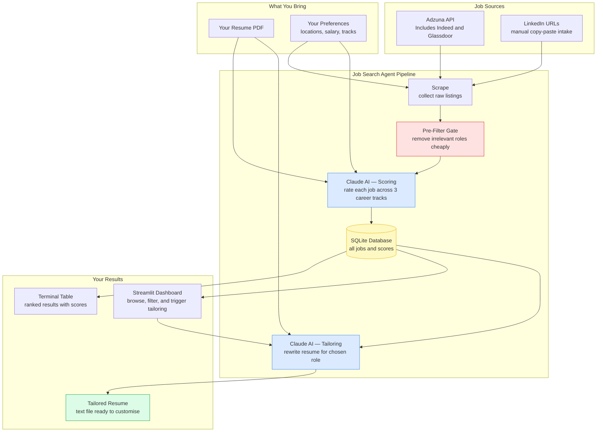

# Job Search Agent

An agentic AI application that scrapes job postings, scores them against your resume across three career tracks, and tailors your resume for jobs you want to apply to — all powered by Claude (Anthropic).

Built as a real-world exploration of **agentic AI application patterns**: structured output, prompt-as-template, cache-aside, batched fan-out, and pipeline state machines.

## What It Does

1. **Scrapes** jobs from Adzuna API (aggregates Indeed, Glassdoor, etc.) and LinkedIn (manual URL intake)
2. **Filters** noise with keyword gates before spending any API tokens
3. **Scores** each job against your resume across three career tracks simultaneously using Claude
4. **Ranks** results in a terminal table and a Streamlit dashboard
5. **Tailors** your resume for any job you decide to apply to

## Solution Architecture



---

## Career Tracks

| Track | Target Roles |
|---|---|
| `ic` | Senior / Staff / Principal Engineer |
| `architect` | Solutions / Principal / Enterprise Architect |
| `management` | Senior Manager / Director / Head of Engineering / VP |

Each job gets a score (0–100) per track with a one-sentence Claude summary and a `recommended` flag.

## Quick Start

### 1. Prerequisites

- Python 3.11+
- Anthropic API key — [console.anthropic.com](https://console.anthropic.com)
- Adzuna API credentials (free) — [developer.adzuna.com](https://developer.adzuna.com)

### 2. Install

```bash
git clone https://github.com/<your-username>/jobsearchagent.git
cd jobsearchagent
python -m venv .venv
.venv\Scripts\activate       # Windows
# source .venv/bin/activate  # macOS/Linux
pip install -r requirements.txt
```

### 3. Configure

```bash
cp config/config.example.yaml config/config.yaml
```

Edit `config/config.yaml` with your preferences (location, salary target, search keywords).

Create a `.env` file in the project root:

```
ANTHROPIC_API_KEY=sk-ant-...
ADZUNA_APP_ID=your_app_id
ADZUNA_APP_KEY=your_api_key
```

Place your resume PDF at `resume.pdf` in the project root.

### 4. Run

```bash
# Scrape new jobs, score them, and print ranked results
python main.py

# Browse results in a Streamlit dashboard
streamlit run dashboard.py

# Show all scored jobs in the terminal
python main.py --list

# Tailor your resume for a specific job (by ID from the results table)
python main.py --tailor 42
```

## Project Structure

```
jobsearchagent/
├── main.py               # CLI entry point
├── dashboard.py          # Streamlit results dashboard
├── resume.pdf            # Your resume (not committed)
├── config/
│   └── config.yaml       # Your settings (not committed)
├── agents/
│   ├── profile_agent.py  # PDF resume → structured Profile (cached)
│   ├── scoring_agent.py  # Batch-scores jobs via Claude
│   └── tailoring_agent.py# Rewrites resume sections for a job
├── claude/
│   ├── client.py         # Anthropic SDK wrapper (all API calls here)
│   ├── prompt_loader.py  # Loads prompts/*.md templates
│   └── response_parser.py# Extracts + validates JSON from Claude responses
├── models/
│   ├── job.py            # Job data model and lifecycle enums
│   ├── profile.py        # Candidate profile model
│   └── config_schema.py  # Pydantic schema for config.yaml
├── scrapers/
│   ├── base.py           # Abstract base scraper
│   ├── adzuna.py         # Adzuna REST API scraper
│   ├── linkedin.py       # LinkedIn manual URL intake
│   └── ladders.py        # Ladders.com HTML scraper
├── storage/
│   └── db.py             # SQLite persistence layer
├── prompts/
│   ├── parse_resume.md   # Resume extraction prompt
│   ├── score_job.md      # Batch job scoring prompt
│   └── tailor_resume.md  # Resume tailoring prompt
├── inbox/
│   └── linkedin.txt      # Paste LinkedIn URLs here
└── docs/                 # Per-file documentation
    └── README.md         # Documentation index
```

## LinkedIn Jobs

LinkedIn doesn't allow automated scraping. Add jobs manually:

1. Browse LinkedIn and copy job URLs you're interested in
2. Paste them into `inbox/linkedin.txt`, one per line
3. Run `python main.py` — the scraper fetches and clears the inbox automatically

## Configuration Reference

Key settings in `config/config.yaml`:

```yaml
search:
  titles: [Software Engineer, Engineering Manager, Solutions Architect]
  locations: [Atlanta, GA]
  work_mode: [remote, hybrid]

salary:
  min_desired: 150000
  currency: USD

tracks:
  ic: true
  architect: true
  management: true

scrapers:
  adzuna:
    keywords: [software engineer, engineering manager]
    location: Atlanta, GA
    radius_km: 80
    remote_keywords: [staff engineer, principal engineer]
```

Full reference: [docs/models/config_schema.md](docs/models/config_schema.md)

## API Cost Estimate

Before scoring, the app prints an estimate and asks for confirmation:

```
Scoring plan: 45 jobs in 9 batches of up to 5
Estimated API cost: ~$0.02 (Sonnet 4.6)
Continue? [y/N]:
```

Typical cost: **$0.01–0.05 per run** using Claude Sonnet 4.6.

## Dashboard

```bash
streamlit run dashboard.py
```

Five views: Top Matches, IC Track, Architect Track, Management Track, Companies (with bar chart). Refreshes from the database every 30 seconds automatically.

## Agentic AI Patterns Used

This project was built as a learning exercise in agentic AI patterns. Patterns demonstrated:

| Pattern | Where |
|---|---|
| **Structured Output** | Every Claude response is JSON validated by Pydantic |
| **Prompt-as-Template** | Prompts in `prompts/*.md`, loaded by `PromptLoader` |
| **Cache-Aside** | Resume parsed once, cached in `data/profile.json` |
| **Batched Fan-Out** | 5 jobs per Claude call with index-based result mapping |
| **Pre-Filter Gate** | Cheap keyword filters before expensive API calls |
| **Pipeline State Machine** | `Job.status`: NEW → SCORED → APPLIED → REJECTED/OFFER |
| **Retry with Backoff** | `tenacity` on all Claude and HTTP calls |
| **Multi-Track Scoring** | One Claude call scores IC, Architect, and Management simultaneously |

## Documentation

- [User Guide](docs/user_guide.md) — full walkthrough: setup, daily workflow, reading results, tailoring, troubleshooting
- [Architecture Diagrams](docs/architecture.md) — block diagrams, sequence diagrams, state machines, agentic pattern maps
- [Per-file Documentation](docs/README.md) — detailed docs for every module

## Tech Stack

- **AI**: Anthropic Claude (`claude-sonnet-4-6`) via official Python SDK
- **Data validation**: Pydantic v2
- **Job data**: Adzuna REST API
- **HTTP**: httpx with tenacity retry
- **Storage**: SQLite (standard library `sqlite3`)
- **Dashboard**: Streamlit + Plotly
- **PDF parsing**: pdfplumber

## License

MIT
