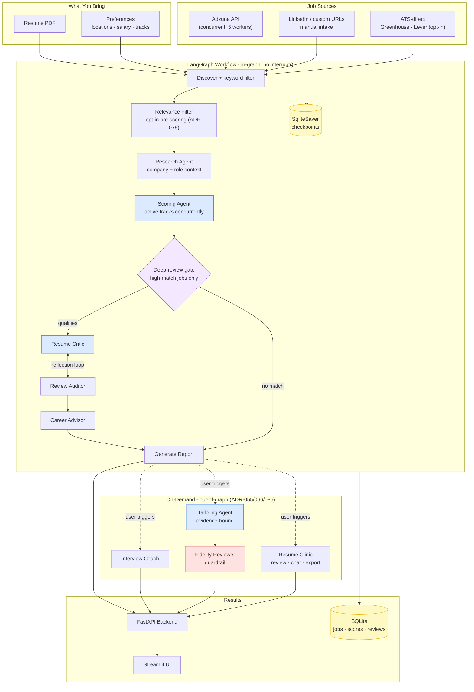

# Job Search Agent v2

A multi-agent career intelligence system that discovers jobs, scores fit across the career tracks each profile pursues (ADR-071), identifies resume gaps, prepares you for interviews, and tailors your resume — all orchestrated with LangGraph.

Built as a real-world exploration of **production agentic AI patterns**: stateful workflow graphs, structured output, bounded ReAct loops, critique-reflection cycles, evidence-bound generation, and out-of-graph human review (ADR-059).

## Article series

This project is documented in a 13-part LinkedIn series on building and operating a real agentic system, from the first overnight script to the finale:

1. [Built an AI Agent to Assist My Job Search: 8 patterns that actually work](https://www.linkedin.com/pulse/built-ai-agent-assist-my-job-search-8-patterns-actually-suthram-xjhye/)
2. [What Building an AI Agent from Scratch Actually Teaches You](https://www.linkedin.com/pulse/what-building-ai-agent-from-scratch-actually-teaches-you-suthram-s8zqe/)
3. [Design Before Code: How a Week Without Coding Changed My AI Agent](https://www.linkedin.com/pulse/design-before-code-how-week-without-coding-changed-my-suthram-7dihe/)
4. [Going multi-agent unlocks 6 new agentic AI patterns](https://www.linkedin.com/pulse/going-multi-agent-unlocks-6-new-agentic-ai-patterns-sivakumar-suthram-ounxe/)
5. [Per-agent model selection: a seam, not a refactor](https://www.linkedin.com/pulse/per-agent-model-selection-seam-refactor-sivakumar-suthram-le2ue/)
6. [Cost is a design decision, not a dashboard](https://www.linkedin.com/pulse/cost-design-decision-dashboard-sivakumar-suthram-xe4oe/)
7. [The agent I trust the least](https://www.linkedin.com/pulse/agent-i-trust-least-sivakumar-suthram-caaje/)
8. [Gate the irreversible, not everything](https://www.linkedin.com/pulse/gate-irreversible-everything-sivakumar-suthram-zjide/)
9. [The model is the only part I cannot pin down](https://www.linkedin.com/pulse/model-only-part-i-cannot-pin-down-sivakumar-suthram-cup8e/)
10. [The strongest security control is the feature you don't build](https://www.linkedin.com/pulse/strongest-security-control-feature-you-dont-build-sivakumar-suthram-8zyue/)
11. [Never trust the green dashboard](https://www.linkedin.com/pulse/never-trust-green-dashboard-sivakumar-suthram-vqh2e/)
12. [Your AI system has more APIs than you think](https://www.linkedin.com/pulse/your-ai-system-has-more-apis-than-you-think-sivakumar-suthram-elnbe/)
13. [AI didn't take me out of the loop. It moved me to the top of it](https://www.linkedin.com/pulse/ai-didnt-take-me-out-loop-moved-top-sivakumar-suthram-zfvfe/) (series finale)

## What It Does

1. **Discovers** jobs from Adzuna (aggregates Indeed, Glassdoor, etc.) and LinkedIn (manual URL intake) — concurrently
2. **Filters** noise with keyword gates before spending any API tokens
3. **Researches** each company with a bounded ReAct agent — culture, tech signals, risk flags
4. **Scores** each job against your resume across the profile's active career tracks concurrently
5. **Reviews** high-match jobs with a critic → auditor reflection loop
6. **Advises** on career positioning after the scoring pass
7. **Coaches** interview prep on demand (ADR-085)
8. **Tailors** your resume with evidence-bound generation + fidelity guardrail
9. **Tracks** every decision, reasoning step, and cost in SQLite

Serves **multiple profiles** from one install (ADR-062) — each with its own resume, search defaults, config, memory, cost view, and history. Pick a profile in the sidebar; no login (cooperative isolation, sequential use).

## Architecture


> Rendered deterministically from
> [`tools/figure_renderer/specs/architecture_overview.json`](tools/figure_renderer/specs/architecture_overview.json)
> (the same HTML/CSS engine as the article figures) — the JSON spec is the
> render source of truth. Re-render after any flow change with
> `python tools/render_figures.py architecture_overview`. The Mermaid block
> below is a textual mirror kept in sync for diff-friendly review.

<details>
<summary>Text mirror (Mermaid)</summary>


```mermaid
flowchart TD
    subgraph YOU["What You Bring"]
        R["Resume PDF"]
        PREFS["Preferences<br>locations · salary · tracks"]
    end

    subgraph SOURCES["Job Sources"]
        AZ["Adzuna API<br>(concurrent, 5 workers)"]
        LI["LinkedIn / custom URLs<br>manual intake"]
        ATS["ATS-direct<br>Greenhouse · Lever (opt-in)"]
    end

    subgraph WORKFLOW["LangGraph Workflow - in-graph, no interrupt()"]
        DISC["Discover + keyword filter"]
        REL["Relevance Filter<br>opt-in pre-scoring (ADR-079)"]
        RES["Research Agent<br>company + role context"]
        SCORE["Scoring Agent<br>active tracks concurrently"]
        GATE{"Deep-review gate<br>high-match jobs only"}
        CRITIC["Resume Critic"]
        AUDIT["Review Auditor"]
        ADVISOR["Career Advisor"]
        REPORT["Generate Report"]
        CP[("SqliteSaver<br>checkpoints")]
    end

    subgraph ONDEMAND["On-Demand - out-of-graph (ADR-055/066/085)"]
        COACH["Interview Coach"]
        TAILOR["Tailoring Agent<br>evidence-bound"]
        FIDELITY["Fidelity Reviewer<br>guardrail"]
        CLINIC["Resume Clinic<br>review · chat · export"]
    end

    subgraph OUTPUTS["Results"]
        API["FastAPI Backend"]
        UI["Streamlit UI"]
        DB[("SQLite<br>jobs · scores · reviews")]
    end

    R --> DISC
    PREFS --> DISC
    AZ --> DISC
    LI --> DISC
    ATS --> DISC
    DISC --> REL --> RES --> SCORE --> GATE
    GATE -->|qualifies| CRITIC
    CRITIC <-->|reflection loop| AUDIT
    AUDIT --> ADVISOR --> REPORT
    GATE -->|no match| REPORT
    WORKFLOW <--> CP
    REPORT --> API --> UI
    WORKFLOW --> DB

    REPORT -.user triggers.-> COACH
    REPORT -.user triggers.-> TAILOR
    REPORT -.user triggers.-> CLINIC
    TAILOR --> FIDELITY
    COACH --> API
    FIDELITY --> API
    CLINIC --> API

    style SCORE fill:#dbeafe,stroke:#3b82f6
    style TAILOR fill:#dbeafe,stroke:#3b82f6
    style CRITIC fill:#dbeafe,stroke:#3b82f6
    style FIDELITY fill:#fee2e2,stroke:#dc2626
    style GATE fill:#f3e8ff,stroke:#9333ea
    style CP fill:#fef9c3,stroke:#eab308
    style DB fill:#fef9c3,stroke:#eab308
```

</details>

The in-graph flow runs discover -> research -> score -> deep review (critic <-> auditor) -> advisor -> report with no `interrupt()` (ADR-059). Interview prep, resume tailoring + fidelity review, and the Resume Clinic are **out-of-graph** operations the user triggers on demand after a run (ADR-055/061/066). An optional relevance pre-filter (ADR-079) and ATS-direct sources (Greenhouse/Lever, ADR-081) are opt-in.

---

## Career Tracks

| Track | Score field | Target Roles |
|---|---|---|
| `ic` | `technical_score` | Senior / Staff / Principal Engineer |
| `architect` | `architecture_score` | Solutions / Principal / Enterprise Architect |
| `management` | `leadership_score` | Senior Manager / Director / Head of Engineering / VP |

Each profile picks the subset of tracks it pursues (`scoring.tracks`, default all three — ADR-071). Each job receives a score (0–100) per **active** track, a match summary, identified strengths and gaps, and a recommended next action. Inactive tracks are not scored and do not trigger deep review.

---

## Quick Start

### 1. Prerequisites

- Python 3.11+
- Anthropic API key — [console.anthropic.com](https://console.anthropic.com)
- Adzuna API credentials (free) — [developer.adzuna.com](https://developer.adzuna.com)

### 2. Install

```bash
git clone https://github.com/<your-username>/jobsearchagent-v2.git
cd jobsearchagent-v2
python -m venv .venv
.venv\Scripts\activate       # Windows
# source .venv/bin/activate  # macOS/Linux
pip install -r requirements.txt
```

### 3. Configure

```bash
cp config/config.example.yaml config/config.yaml
```

Edit `config/config.yaml` — set your search titles, locations, salary target, and career tracks.

Create a `.env` file in the project root:

```
ANTHROPIC_API_KEY=sk-ant-...
ADZUNA_APP_ID=your_app_id
ADZUNA_APP_KEY=your_api_key
```

Place your resume PDF at `resume.pdf` in the project root, or upload one per profile via the UI's **Profiles → Add profile** wizard (ADR-062).

### 4. Run

```bash
# Start the FastAPI backend (live-agent mode when ANTHROPIC_API_KEY is set)
uvicorn app.api.main:app --reload

# Start the Streamlit UI (separate terminal)
streamlit run app/ui/streamlit_app.py
```

Open `http://localhost:8501` to use the UI.

**Mock mode** — if `ANTHROPIC_API_KEY` is not set, the backend starts with all agents mocked (no API calls, useful for UI development and testing).

### 5. Tests

```bash
python -m pytest tests/                   # full suite — mock mode, no real API calls
python -m pytest tests/ -m integration   # live-API smoke tests (requires .env)
```

---

## Project Structure

```
app/
├── api/              FastAPI endpoints and dependency wiring
│   └── routers/      workflows, jobs, reports, config, tailoring, users,
│                     resume_clinic, dashboard, reads, admin
├── workflows/        LangGraph workflow graph and node implementations
├── agents/           specialized agents (all inherit BaseAgent — see Agents table)
├── services/         Deterministic services (no LLM)
│   └── concurrent_adzuna_scraper.py
├── providers/        Claude + OpenAI providers via ModelRegistry (ADR-053)
├── state/            WorkflowState schema
├── schemas/          Pydantic output schemas for all agents
├── repositories/     SQLite data access (raw sqlite3; incl. memory_repository.py)
├── prompts/
│   ├── shared/       guardrails.txt — injected into every agent
│   └── agents/       one prompt file per agent
└── ui/               Streamlit frontend: thin entrypoint + views package;
                      all reads + writes go through api_client -> API (ADR-075)

config/
├── config.example.yaml
└── config.yaml       Your settings (gitignored)

data/                 SQLite databases (gitignored)
└── v2.db             Workflow runs, jobs, scores, reviews, advice, tailorings

docs/architecture/
├── adr/              Architecture Decision Records (see ADR-000-index.md)
├── implementation_plan.md
└── *.md              Agent, workflow, state, data, and security models

.claude/skills/       Claude Code agent-skills (discovered here only):
                      smoke-test-ui + write-series-article (project-own) + the
                      addyosmani/agent-skills pack — 21 curated skills. Pinned via
                      skills-lock.json (repo root). See .claude/skills/README.md.

tests/                pytest suite (mock mode — no real API calls in CI)
notebooks/            Phase validation notebooks
```

---

## Agents

| Agent | Model | Pattern | When |
|---|---|---|---|
| Relevance Filter | Haiku | Structured output (batch) | Opt-in (`search.relevance_filter`) — one cheap call before scoring (ADR-079) |
| Research Agent | Haiku | Bounded ReAct | Every job |
| Scoring Agent | Haiku | Structured output | Every job (concurrent) |
| Resume Critic | Sonnet | Critique | High-match jobs only |
| Review Auditor | Haiku | Evaluator / Reflection | High-match jobs only |
| Career Advisor | Sonnet | Advisory | After reflection loop |
| Interview Coach | Sonnet | On-demand | on-demand by default (ADR-085); auto only if `scoring.auto_interview_prep` |
| Tailoring Agent | Sonnet | Evidence-bound generation | On user request |
| Fidelity Reviewer | Haiku | Validation / Guardrail | After every tailoring call AND every Resume Clinic rewrite |
| Resume Reviewer | Sonnet | Structured output (job-agnostic) | Resume Clinic, on user request (ADR-066) |

Haiku handles all high-volume and validation tasks. Sonnet handles generative and advisory tasks where quality matters most. Per-agent provider+model assignment is configurable via the ModelRegistry (ADR-053) and pinned in `tests/model_pins.json`.

---

## API Cost

Typical cost per run (10 jobs, mix of tracks):

| Scenario | Estimate |
|---|---|
| Discovery + research + scoring only | ~$0.02–0.05 |
| Full run with deep review (3 high-match jobs) | ~$0.05–0.15 |
| Full run with deep review (10 high-match jobs) | ~$0.15–0.40 |
| With tailoring for one job | ~$0.10–0.25 |

Cost is tracked per run in the `llm_calls` observability table and surfaced in the UI.

**Execution limits** (hard-coded in `app/workflows/limits.py`):

| Limit | Value |
|---|---|
| MAX_JOBS_PER_RUN | 10 (default scored cap; per-run override up to MAX_SCORED_CEILING = 25, ADR-061) |
| MAX_SELECTED_JOBS | 3 |
| MAX_RESEARCH_STEPS | 2 |
| MAX_REVIEW_ROUNDS | 2 |
| MAX_LLM_CALLS_PER_RUN | 200 |

---

## LinkedIn Jobs

LinkedIn does not allow automated scraping. To include LinkedIn roles:

1. Browse LinkedIn and copy job URLs you want evaluated
2. Paste them into `data/linkedin_inbox.txt`, one per line
3. Start a run — the scraper fetches and clears the inbox automatically

---

## Agentic AI Patterns

| Pattern | Where |
|---|---|
| **Stateful Workflow Graph** | LangGraph orchestrator with SqliteSaver checkpointing |
| **Structured Output** | Every agent response validated against a Pydantic schema |
| **Bounded ReAct** | ResearchAgent — tool loop capped at MAX_RESEARCH_STEPS |
| **Critique-Reflection Loop** | ResumeCritic → ReviewAuditor, up to MAX_REVIEW_ROUNDS |
| **Evidence-Bound Generation** | TailoringAgent — every claim requires supporting_evidence from original resume |
| **Guardrail Agent** | FidelityReviewer — blocks fabricated experience before persistence |
| **Human-in-the-Loop (out-of-graph)** | The graph runs end to end with no `interrupt()` (ADR-059); tailoring, deep review, interview prep, and the Resume Clinic are on-demand operations the user triggers and decides on after the run |
| **Concurrent Fan-Out** | Scoring and Adzuna scraping run across ThreadPoolExecutor workers |
| **Pre-Filter Gate** | Keyword filters applied before any LLM call |
| **Prompt Caching** | System messages marked `cache_control: ephemeral` — 90% cost reduction on repeated agent calls within a session |
| **Cache-Aside** | Resume parsed once per unique PDF; result stored and retrieved by SHA-256 hash |
| **Phase Gate (Mock/Live)** | API key absent → all agents mocked; present → real ClaudeProvider + SqliteSaver |

---

## Tech Stack

| Layer | Technology |
|---|---|
| Orchestration | LangGraph + SqliteSaver |
| Agent framework | LangChain + LangChain-Anthropic |
| LLM | Claude Haiku (high-volume) + Claude Sonnet (generative); OpenAI optional, per-agent via ModelRegistry (ADR-053) |
| Backend API | FastAPI + Uvicorn |
| UI | Streamlit |
| Persistence | SQLite (raw `sqlite3`) |
| Validation | Pydantic v2 |
| PDF parsing | pdfminer.six |
| Testing | pytest + pytest-asyncio + pytest-mock |

---

## License

Apache 2.0 — see [LICENSE](LICENSE) for the full text.

Free to use, modify, and distribute including commercially, provided you retain attribution and the licence notice.

## Disclaimer

Personal learning project. See [docs/disclaimer.md](docs/disclaimer.md) for full terms including data source policies, no-warranty statement, and API cost responsibility.
