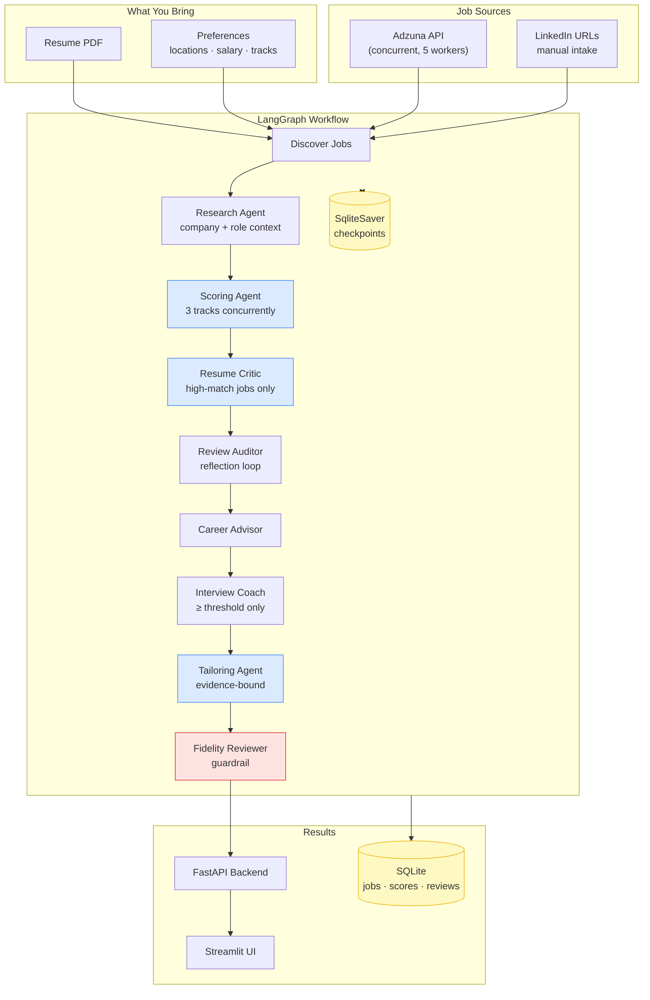

# Job Search Agent v2

A multi-agent career intelligence system that discovers jobs, scores fit across three career tracks, identifies resume gaps, prepares you for interviews, and tailors your resume — all powered by Claude (Anthropic) and orchestrated with LangGraph.

Built as a real-world exploration of **production agentic AI patterns**: stateful workflow graphs, structured output, bounded ReAct loops, critique-reflection cycles, evidence-bound generation, and human-in-the-loop checkpointing.

## What It Does

1. **Discovers** jobs from Adzuna (aggregates Indeed, Glassdoor, etc.) and LinkedIn (manual URL intake) — concurrently
2. **Filters** noise with keyword gates before spending any API tokens
3. **Researches** each company with a bounded ReAct agent — culture, tech signals, risk flags
4. **Scores** each job against your resume across three career tracks concurrently
5. **Reviews** high-match jobs with a critic → auditor reflection loop
6. **Advises** on career positioning after the scoring pass
7. **Coaches** interview prep for roles above the match threshold
8. **Tailors** your resume with evidence-bound generation + fidelity guardrail
9. **Tracks** every decision, reasoning step, and cost in SQLite

## Architecture


```mermaid
flowchart TD
    subgraph YOU["What You Bring"]
        R["Resume PDF"]
        PREFS["Preferences\nlocations · salary · tracks"]
    end

    subgraph SOURCES["Job Sources"]
        AZ["Adzuna API\n(concurrent, 5 workers)"]
        LI["LinkedIn URLs\nmanual intake"]
    end

    subgraph WORKFLOW["LangGraph Workflow"]
        DISC["Discover Jobs"]
        RES["Research Agent\ncompany + role context"]
        SCORE["Scoring Agent\n3 tracks concurrently"]
        CRITIC["Resume Critic\nhigh-match jobs only"]
        AUDIT["Review Auditor\nreflection loop"]
        ADVISOR["Career Advisor"]
        COACH["Interview Coach\n≥ threshold only"]
        TAILOR["Tailoring Agent\nevidence-bound"]
        FIDELITY["Fidelity Reviewer\nguardrail"]
        CP[("SqliteSaver\ncheckpoints")]
    end

    subgraph OUTPUTS["Results"]
        API["FastAPI Backend"]
        UI["Streamlit UI"]
        DB[("SQLite\njobs · scores · reviews")]
    end

    R --> DISC
    PREFS --> DISC
    AZ --> DISC
    LI --> DISC
    DISC --> RES --> SCORE --> CRITIC --> AUDIT --> ADVISOR --> COACH
    COACH --> TAILOR --> FIDELITY
    WORKFLOW <--> CP
    FIDELITY --> API --> UI
    WORKFLOW --> DB

    style SCORE fill:#dbeafe,stroke:#3b82f6
    style TAILOR fill:#dbeafe,stroke:#3b82f6
    style CRITIC fill:#dbeafe,stroke:#3b82f6
    style FIDELITY fill:#fee2e2,stroke:#dc2626
    style CP fill:#fef9c3,stroke:#eab308
    style DB fill:#fef9c3,stroke:#eab308
```

---

## Career Tracks

| Track | Target Roles |
|---|---|
| `ic` | Senior / Staff / Principal Engineer |
| `architect` | Solutions / Principal / Enterprise Architect |
| `management` | Senior Manager / Director / Head of Engineering / VP |

Each job receives a score (0–100) per active track, a match summary, identified strengths and gaps, and a recommended next action.

---

## Quick Start

### 1. Prerequisites

- Python 3.11+
- Anthropic API key — [console.anthropic.com](https://console.anthropic.com)
- Adzuna API credentials (free) — [developer.adzuna.com](https://developer.adzuna.com)

### 2. Install

```bash
git clone https://github.com/<your-username>/jobsearchagent-v2.git
cd jobsearchagent-v2
python -m venv .venv
.venv\Scripts\activate       # Windows
# source .venv/bin/activate  # macOS/Linux
pip install -r requirements.txt
```

### 3. Configure

```bash
cp config/config.example.yaml config/config.yaml
```

Edit `config/config.yaml` — set your search titles, locations, salary target, and career tracks.

Create a `.env` file in the project root:

```
ANTHROPIC_API_KEY=sk-ant-...
ADZUNA_APP_ID=your_app_id
ADZUNA_APP_KEY=your_api_key
```

Place your resume PDF at `resume.pdf` in the project root.

### 4. Run

```bash
# Start the FastAPI backend (live-agent mode when ANTHROPIC_API_KEY is set)
uvicorn app.api.main:app --reload

# Start the Streamlit UI (separate terminal)
streamlit run app/ui/streamlit_app.py
```

Open `http://localhost:8501` to use the UI.

**Mock mode** — if `ANTHROPIC_API_KEY` is not set, the backend starts with all agents mocked (no API calls, useful for UI development and testing).

### 5. Tests

```bash
python -m pytest tests/                   # full suite — mock mode, no real API calls
python -m pytest tests/ -m integration   # live-API smoke tests (requires .env)
```

---

## Project Structure

```
app/
├── api/              FastAPI endpoints and dependency wiring
│   └── routers/      workflows, jobs, reports, config, tailoring
├── workflows/        LangGraph workflow graph and node implementations
├── agents/           8 specialized agents
├── services/         Deterministic services (no LLM)
│   └── concurrent_adzuna_scraper.py
├── providers/        Claude + OpenAI providers via ModelRegistry (ADR-053)
├── state/            WorkflowState schema
├── schemas/          Pydantic output schemas for all agents
├── repositories/     SQLite data access (raw sqlite3)
├── memory/           MemoryService (long-term learning)
├── prompts/
│   ├── shared/       guardrails.txt — injected into every agent
│   └── agents/       one prompt file per agent
└── ui/               Streamlit frontend (streamlit_app.py + db_reader + api_client)

config/
├── config.example.yaml
└── config.yaml       Your settings (gitignored)

data/                 SQLite databases (gitignored)
└── v2.db             Workflow runs, jobs, scores, reviews, advice, tailorings

docs/architecture/
├── adr/              56 Architecture Decision Records
├── implementation_plan.md
└── *.md              Agent, workflow, state, data, and security models

skills/               addyosmani/agent-skills pack — 21 curated skills
└── README.md         Index mapping each skill to a workflow stage
                      Pinned via skills-lock.json at the repo root

tests/                pytest suite (448 passed, 1 skipped — mock mode)
notebooks/            Phase validation notebooks
```

---

## Agents

| Agent | Model | Pattern | When |
|---|---|---|---|
| Research Agent | Haiku | Bounded ReAct | Every job |
| Scoring Agent | Haiku | Structured output | Every job (concurrent) |
| Resume Critic | Sonnet | Critique | High-match jobs only |
| Review Auditor | Haiku | Evaluator / Reflection | High-match jobs only |
| Career Advisor | Sonnet | Advisory | After reflection loop |
| Interview Coach | Sonnet | Conditional | match_score ≥ threshold |
| Tailoring Agent | Sonnet | Evidence-bound generation | On user request |
| Fidelity Reviewer | Haiku | Validation / Guardrail | After every tailoring call |

Haiku handles all high-volume and validation tasks. Sonnet handles generative and advisory tasks where quality matters most.

---

## API Cost

Typical cost per run (10 jobs, mix of tracks):

| Scenario | Estimate |
|---|---|
| Discovery + research + scoring only | ~$0.02–0.05 |
| Full run with deep review (3 high-match jobs) | ~$0.05–0.15 |
| Full run with deep review (10 high-match jobs) | ~$0.15–0.40 |
| With tailoring for one job | ~$0.10–0.25 |

Cost is tracked per run in the `llm_calls` observability table and surfaced in the UI.

**Execution limits** (hard-coded in `app/workflows/limits.py`):

| Limit | Value |
|---|---|
| MAX_JOBS_PER_RUN | 10 |
| MAX_SELECTED_JOBS | 10 |
| MAX_RESEARCH_STEPS | 2 |
| MAX_REVIEW_ROUNDS | 3 |
| MAX_LLM_CALLS_PER_RUN | 200 |

---

## LinkedIn Jobs

LinkedIn does not allow automated scraping. To include LinkedIn roles:

1. Browse LinkedIn and copy job URLs you want evaluated
2. Paste them into `data/linkedin_inbox.txt`, one per line
3. Start a run — the scraper fetches and clears the inbox automatically

---

## Agentic AI Patterns

| Pattern | Where |
|---|---|
| **Stateful Workflow Graph** | LangGraph orchestrator with SqliteSaver checkpointing |
| **Structured Output** | Every agent response validated against a Pydantic schema |
| **Bounded ReAct** | ResearchAgent — tool loop capped at MAX_RESEARCH_STEPS |
| **Critique-Reflection Loop** | ResumeCritic → ReviewAuditor, up to MAX_REVIEW_ROUNDS |
| **Evidence-Bound Generation** | TailoringAgent — every claim requires supporting_evidence from original resume |
| **Guardrail Agent** | FidelityReviewer — blocks fabricated experience before persistence |
| **Human-in-the-Loop** | Workflow pauses at `waiting_for_user` with a `pending_decision` before resuming |
| **Concurrent Fan-Out** | Scoring and Adzuna scraping run across ThreadPoolExecutor workers |
| **Pre-Filter Gate** | Keyword filters applied before any LLM call |
| **Prompt Caching** | System messages marked `cache_control: ephemeral` — 90% cost reduction on repeated agent calls within a session |
| **Cache-Aside** | Resume parsed once per unique PDF; result stored and retrieved by SHA-256 hash |
| **Phase Gate (Mock/Live)** | API key absent → all agents mocked; present → real ClaudeProvider + SqliteSaver |

---

## Tech Stack

| Layer | Technology |
|---|---|
| Orchestration | LangGraph + SqliteSaver |
| Agent framework | LangChain + LangChain-Anthropic |
| LLM | Claude Haiku (high-volume) + Claude Sonnet (generative) |
| Backend API | FastAPI + Uvicorn |
| UI | Streamlit |
| Persistence | SQLite (raw `sqlite3`) |
| Validation | Pydantic v2 |
| PDF parsing | pdfplumber |
| Testing | pytest + pytest-asyncio + pytest-mock |

---

## License

Apache 2.0 — see [LICENSE](LICENSE) for the full text.

Free to use, modify, and distribute including commercially, provided you retain attribution and the licence notice.

## Disclaimer

Personal learning project. See [docs/disclaimer.md](docs/disclaimer.md) for full terms including data source policies, no-warranty statement, and API cost responsibility.
