# Architecture Diagrams

All diagrams are written in [Mermaid](https://mermaid.js.org/) and render automatically on GitHub.

---

## 0. Solution Architecture — High-Level Overview

The simplest picture of the system: what goes in, what the agent does, and what comes out.

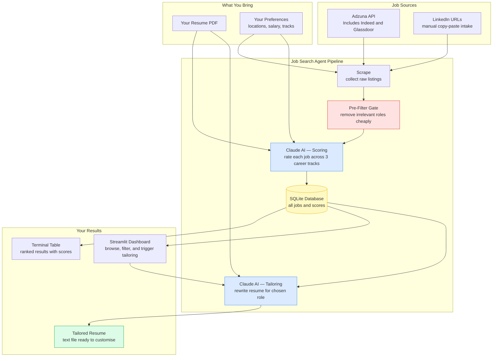

---

## 1. System Architecture — Component Overview

High-level block diagram showing all five layers including the Streamlit dashboard UI.

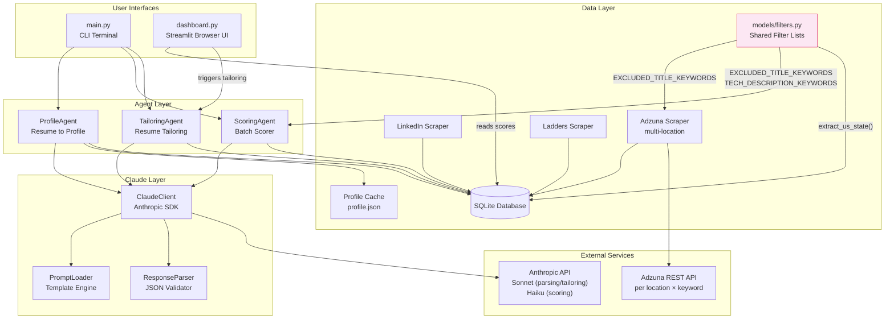

---

## 11. Streamlit Dashboard — UI Data Flow

How the browser dashboard reads and displays scored job data.

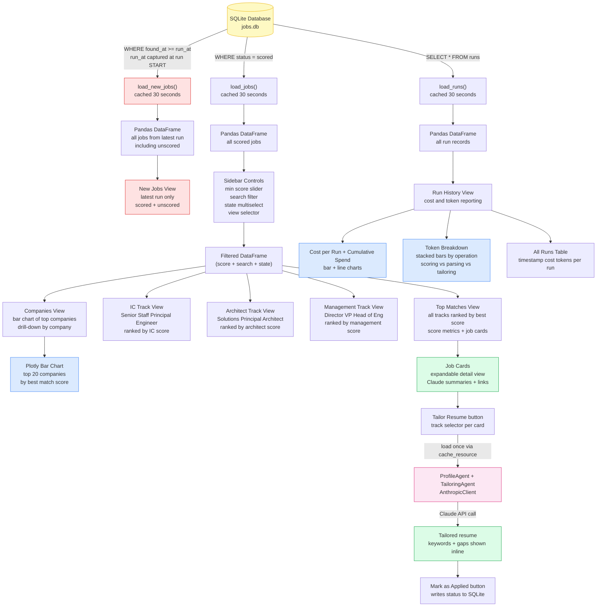

---

## 2. Main Run — Control Flow

End-to-end flow for `python main.py` (the default scrape + score command).

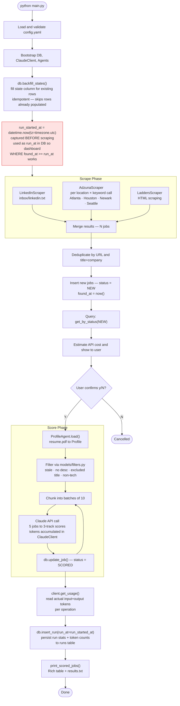

---

## 3. Agentic Pattern: Cache-Aside (ProfileAgent)

Shows how ProfileAgent avoids redundant Claude calls using a file-based cache.

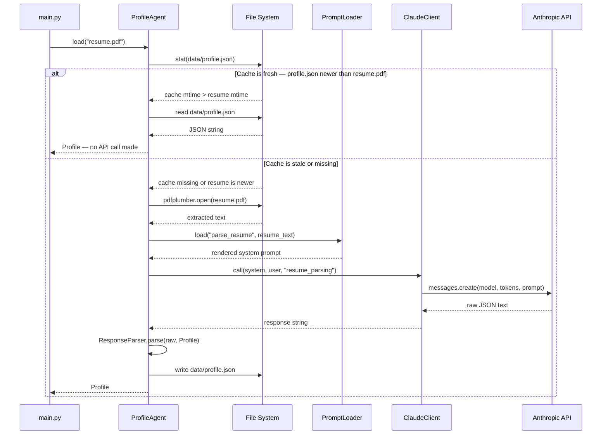

---

## 4. Agentic Pattern: Parallel Batched Fan-Out (ScoringAgent)

Shows how jobs are chunked into batches of 10, submitted concurrently via `ThreadPoolExecutor`, and merged back with thread-safe DB writes.

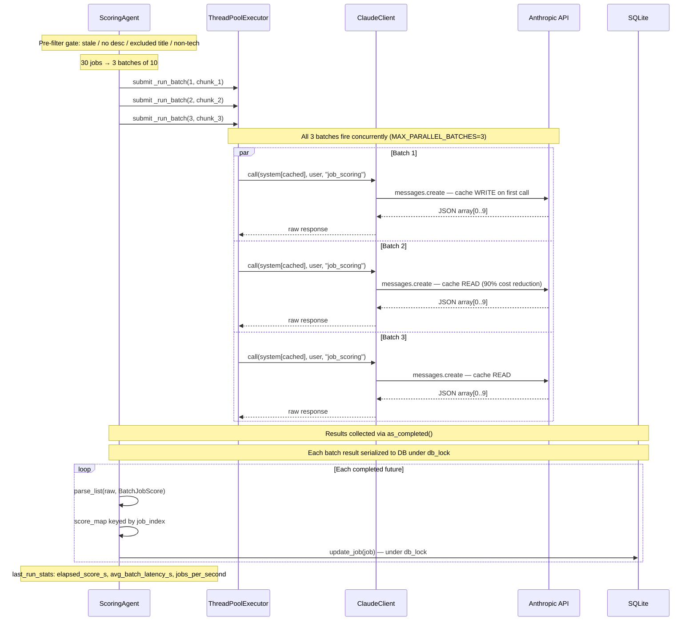

**Thread safety notes:**
- `ClaudeClient._usage` increments are wrapped in `_usage_lock` — prevents lost updates from concurrent `+=`
- `db.update_job()` calls are serialized with `db_lock` — SQLite WAL mode allows concurrent reads but still serializes commits
- System prompt is byte-identical across all batches (`num_jobs` is in the user message only), so all concurrent calls share the same Anthropic prompt cache key

---

## 5. Agentic Pattern: Structured Output Pipeline

How raw Claude text becomes a validated, typed Python object at every agent boundary.

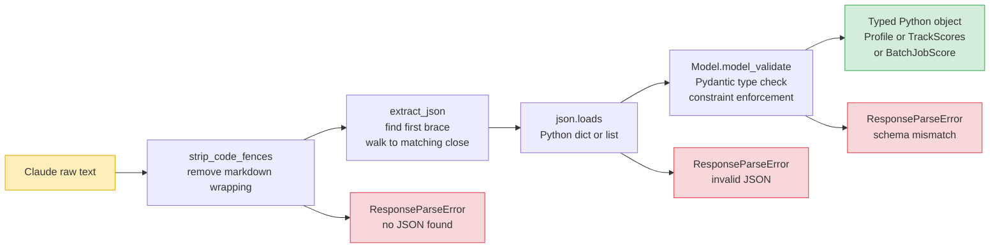

---

## 6. Job Lifecycle — Pipeline State Machine

Every job moves through a defined set of states stored in the database.

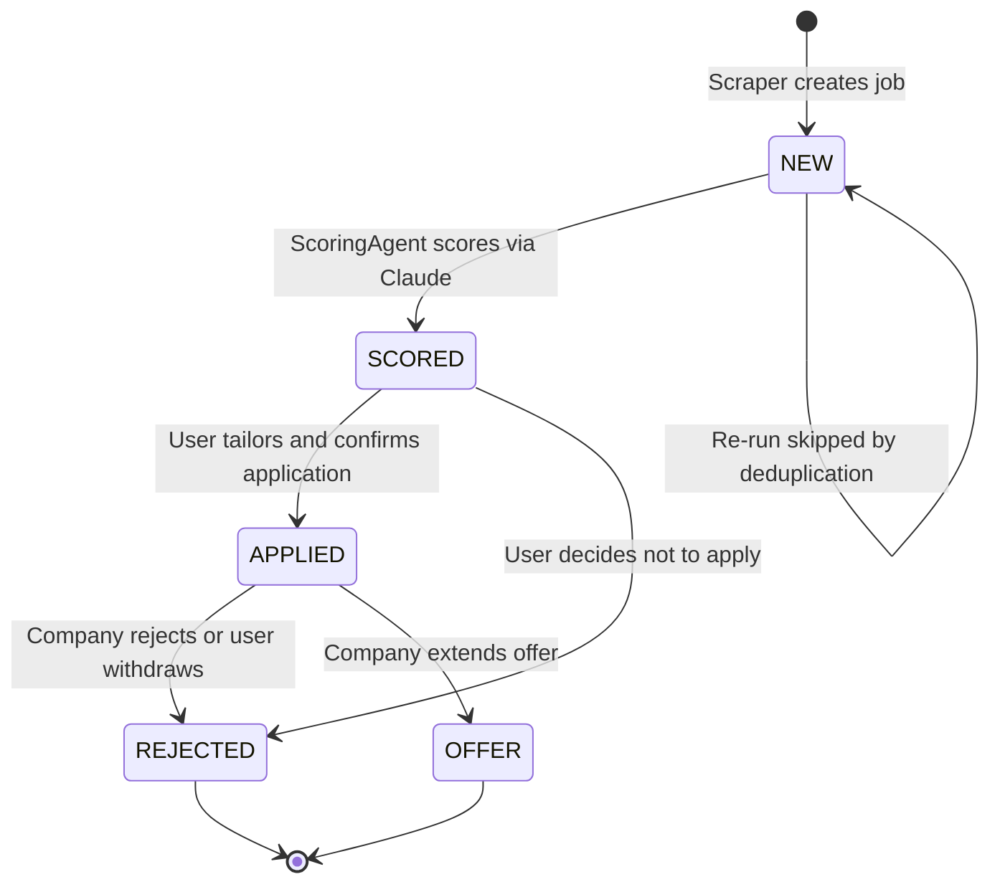

---

## 7. Resume Tailoring — Sequence Diagram

Flow for `python main.py --tailor 42`.

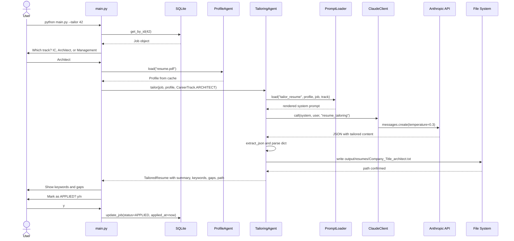

---

## 8. Prompt-as-Template Pattern

How a prompt file flows from disk to the Claude API.

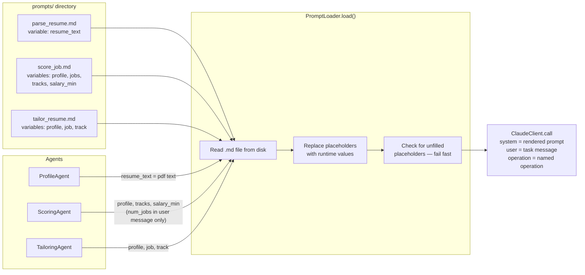

---

## 9. Pre-Filter Gate Pattern

Four filter stages eliminate irrelevant jobs before any Claude API call is made.
Filter lists (stages 3 & 4) are defined in `models/filters.py` and imported by both
`AdzunaScraper` (scrape-time gate) and `ScoringAgent` (score-time gate).

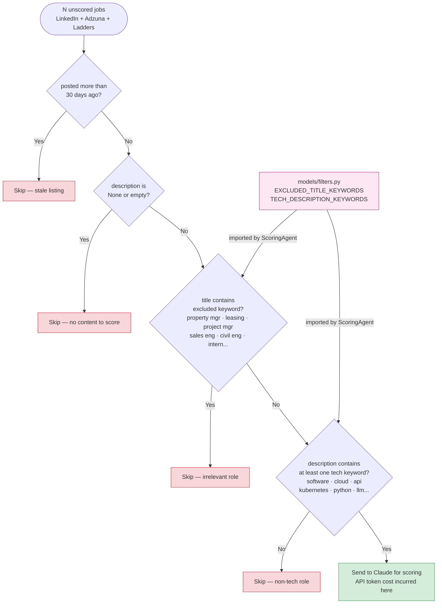

---

## 10. Agentic Patterns Summary

Where each pattern appears in the codebase.

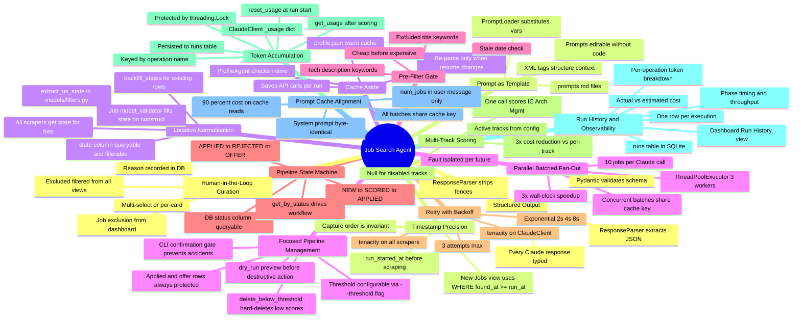
