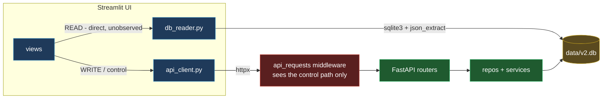
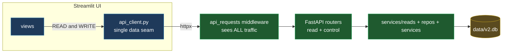

# ADR-075: Funnel UI Reads Through the API (Retire the Direct-SQLite Read Path)

## Status

Accepted (2026-06-02). **Fully implemented** — all phases (0-9) landed
2026-06-02; `db_reader.py` is deleted and the forcing-function guard
(`tests/v2/test_ui_no_direct_db.py`) has an empty allowlist, so no UI code opens
`data/v2.db`. The Phase-1 latency gate passed (`GET /workflows` ~26 ms p95), so the
read-gateway fallback was not needed.

Supersedes the read-path bypass established in `ui_architecture.md` (and the
spirit of ADR-003 "separate frontend and backend"): the UI's read path opened
`data/v2.db` directly for performance; this routes it through FastAPI instead.
Builds on ADR-074 Gap 5 (the `api_requests` middleware that will now observe every
read) and ADR-062 (the `?user_id=` identity seam every endpoint already honors).

## Context

The UI has two data paths (`ui_architecture.md`):

- **Control path** — `app/ui/api_client.py` → FastAPI, for every write/action.
- **Read path** — `app/ui/db_reader.py` (716 lines, **16 `load_*` functions**,
  bespoke `sqlite3` + `json_extract`, returns pandas DataFrames) **plus** the
  aggregator services (`cost_breakdown`, `system_health`, `constraint_analyzer`),
  all opening `data/v2.db` directly. Consumers: ~6 views + `streamlit_app` + the
  `data.py` cache wrappers.

The direct read was a deliberate performance choice (browse screens are
high-frequency and read-only; skip the HTTP + FastAPI hop). But it is the system's
one architectural inconsistency, and it has three concrete costs:

1. **Observability blind spot.** The `api_requests` middleware (ADR-074 Gap 5)
   observes only the control path. Every browse read is invisible, so the API
   request log is an incomplete map of system usage.
2. **Dual-write hazard.** A schema change must update both the repository layer
   **and** `db_reader` (already flagged in CLAUDE.md / `db_reader.py`'s header).
3. **Blocks the future.** Auth enforcement, remote / multi-host deployment (UI and
   DB on separate boxes), connection pooling, and a single caching / rate-limit
   layer all assume one access path.

### Before / after

**Before** — two paths; the direct read bypasses the API and its
`api_requests` middleware (the blind spot):

**After** — one path; `api_client` is the single seam, the middleware sees
every request, and `db_reader` is gone:

## Decision

All UI reads go through FastAPI. No code outside the backend opens `data/v2.db`.

### A. Shared read-service layer (no duplicated SQL)

Extract `db_reader`'s queries into deterministic read-services (mirroring
`cost_breakdown` / `system_health`: pure SQL, `user_id`-scoped, return plain
dicts). The new endpoints call these services; nothing re-implements a query.
`cost_breakdown` / `system_health` / `constraint_analyzer` already fit this shape
and stay where they are — the endpoints wrap them.

### B. Read endpoints — resource-oriented, NOT a UI/BFF router

There is **no separate UI-reserved API**. A UI-named router would couple the API
to Streamlit and undercut the reusability (remote/multi-client/auth) that
motivates the funnel. The reads are genuine resource reads, so they extend the
existing resource-oriented routers. Each honors the `?user_id=` seam, returns the
documented error envelope, and serializes to JSON (the UI rebuilds DataFrames).

Placement (the existing routers already cluster run-scoped things under
`/workflows/{id}/…` and user-scoped under `/users/{id}/…`):

- **Run-scoped reads -> existing routers as sub-resources:**
  `GET /workflows` (list — new), `GET /workflows/{id}` (extend),
  `/workflows/{id}/jobs` (exists), `/reviews`, `/interview-prep`, `/steps`,
  `/agent-events`, `/llm-calls`, `/jobs/{job}/pipeline` (composite).
- **User-scoped reads -> `users` / `resume_clinic` routers:**
  `GET /users/{id}/resumes`, `GET /users/{id}/resume-clinic` (exists), chat
  sessions.
- **ONE new grouping — a `/dashboard` (analytics) router** for the cross-run /
  system-wide aggregations that have no home today and are not tied to a single
  resource: `system_health.*` (security / performance / reliability / scalability
  / api / decisions / profiles_overview), the `cost_breakdown` dashboard rollups,
  and `load_scored_jobs` analytics (Top Matches / tracks / companies). This is a
  *system-metrics* resource family, not UI plumbing.

**Composite endpoints where a screen makes several reads today** (e.g. Workflow
Detail pulls run + jobs + reviews + prep + steps + agent events + llm calls):
model them as an **expansion of the primary entity**
(`GET /workflows/{id}/detail`, or `?expand=jobs,reviews,steps`), never a
UI-named `GET /ui/workflow-detail`. One round-trip per screen, not N — the key
lever against Streamlit's rerun amplification — with zero UI coupling.

### B.1 Read conventions — paging, filtering, sorting

Today these are ad-hoc (`db_reader` has one-off `limit`/filter params, SQL-baked
`ORDER BY`, and the Streamlit UI sorts/filters client-side in `st.dataframe`). The
funnel makes a consistent contract necessary — once reads cross HTTP, shipping
thousands of rows per Streamlit rerun is the latency killer. One convention for
every **list** endpoint:

- **Paging:** `limit` (default 50, hard max 200) + `offset`. List responses use a
  uniform envelope so the UI can page: `{"items": [...], "total": N, "limit": L,
  "offset": O}`. (Offset paging is fine at this app's scale + SQLite; a cursor can
  replace it later without changing the envelope.)
- **Sorting:** `sort=<field>&order=asc|desc`, where `<field>` is validated against
  a **per-endpoint allowlist** (never interpolate a client string into `ORDER BY`
  — injection guard). Each endpoint documents its default sort.
- **Filtering:** **explicit, typed query params per resource** — no generic filter
  DSL. Reuses the params that already exist: `user_id` (the ADR-062 seam, every
  endpoint), `days` (time window; standardized from the dashboard/cost reads),
  plus resource-specific ones (`status`, `track`, `min_score`, `include_excluded`,
  `job_id`). Unknown params are ignored, not errors.

**Where it applies:** the unbounded cross-run lists (Phase 1 `/workflows`; Phase 3
`/dashboard/scored-jobs`; the observability lists `llm_calls` / `agent_events` /
`api_requests` / `security_events`). **Run-scoped child reads stay unpaged** —
they are bounded by the execution limits (`MAX_JOBS_PER_RUN` etc.), so they return
the full set (still inside the list envelope, with `total == len(items)`) to keep
the response shape uniform. Aggregation endpoints (`/dashboard/*` summaries) take
`days` + `user_id` only — they return a fixed rollup object, not a paged list.

The read-services (§A) own the `LIMIT/OFFSET/ORDER BY` so the SQL lives in one
place; the routers validate the params (allowlist + clamp `limit`) and shape the
envelope.

### B.2 Shapes & contracts (REST conventions)

Reuse the codebase's existing conventions — do not invent parallel ones.

- **Typed `response_model` on every endpoint.** The Pydantic model *is* the
  contract; FastAPI publishes it to OpenAPI (`/docs`), so a breaking change shows
  up as a schema diff. New read models live beside the existing ones in
  `app/api/schemas/responses.py`: a generic list envelope, single-resource models,
  and named rollup models for the `/dashboard/*` aggregations.
- **Three body shapes, always:** list -> the §B.1 envelope `{items, total, limit,
  offset}`; single resource -> the bare object; aggregation -> a fixed named
  rollup object. An empty result is `items: []` with **200**, never 404.
- **Error envelope — reuse the existing one** (`{"detail": {"error", "message",
  "details"?}}`, from `main.py` + every router); no new error shape. Status codes:
  **200** read OK · **404** unknown id (same `{error,message,id}` body) · **422**
  invalid query params (the existing `RequestValidationError` handler already
  normalizes these) · **503** when the read cannot reach the DB. GETs are safe +
  idempotent and never mutate.
- **Field & value rules:** snake_case keys (matches the code); timestamps as
  ISO-8601 UTC strings (`utcnow_iso()` form, already system-wide); money as USD
  numbers; enums as their string values; `null` for absent (don't omit — keeps the
  UI shape stable); never leak internal columns or PII beyond what the screen
  already shows (the route-template / redaction discipline from ADR-073/069).
- **Versioning:** no `/v1` path prefix (single first-party client). The OpenAPI
  doc at `/docs` is the living contract and `api_reference.md` the prose one; any
  breaking change to a read shape needs an ADR + a synchronized `api_client`
  change (they ship in the same repo). HATEOAS / hypermedia links: out of scope
  (single UI — over-engineering).
- **JSON <-> DataFrame contract:** the read-services return JSON-native
  `list[dict]` / `dict`; endpoints serialize as-is; the UI rebuilds
  `pd.DataFrame(resp["items"])`. No DataFrame-specific encoding crosses the wire.

### B.3 Caching

Reads are cheap SQLite; the real cost is HTTP + serialization under Streamlit's
rerun loop. Layered, cheapest-first:

- **Client cache (the must-have): `st.cache_data` with per-read TTLs**, keyed by
  call args — already the `data.py` pattern. Most reruns never touch the network.
  Tune TTLs per read (history/analytics tolerate seconds; live monitor shorter).
- **Conditional GET (measured add-on): `ETag` + `If-None-Match` -> 304** on the
  heavy list/aggregation endpoints. ETag = a hash of the response (or a cheap
  `MAX(updated_at)+COUNT` per scope); a 304 skips serialization + transfer.
  `api_client` sends `If-None-Match` and reuses its cached body on 304. Apply only
  where measured payloads justify the added client complexity — not a Phase-0
  requirement.
- **`Cache-Control: private, max-age=<small>`** on read responses to document
  freshness intent (reads are already profile-scoped, so `private`).
- **Invalidation = write-through:** the control path already mutates via the API;
  on a successful write the UI clears the relevant `st.cache_data` entry (today's
  pattern) and the ETag changes naturally because the rows changed — no separate
  invalidation bus at this scale.
- **gzip** (Starlette `GZipMiddleware`) for the large JSON lists.

### C. UI swap

`api_client` gains `get_*` methods; views replace `db_reader.load_*` calls with
them; the `st.cache_data` wrappers (in `data.py`) are retained — now caching HTTP
responses instead of direct reads. `db_reader` is deleted once the last consumer
is migrated (its SQL having moved into the read-services in A).

### D. Performance mitigations (the main risk)

Streamlit reruns the whole script on every interaction, so reads fire constantly;
each becomes an HTTP round-trip + JSON (de)serialization. Mitigations:

- **Composite endpoints** (B) collapse multi-read screens to one call.
- **`st.cache_data` TTLs** tuned per read (history/analytics tolerate seconds of
  staleness).
- **gzip** on responses; pagination on the large lists.
- **Measure with the now-complete `api_requests` data** (ADR-074 Gap 5): after
  each screen is cut over, its endpoint latency/error rate is visible on the
  System Dashboard's API section — we tune against real numbers, not guesses.

### E. Offline behavior

The API is already required for every write; reads now require it too. The UI
shows a clear "backend unavailable" state instead of silently degrading. The UI
smoke harness (`smoke-test-ui`) must run with the backend up (or with `api_client`
mocked) — today it works because `db_reader` reads the DB directly.

## Migration (phased, both paths coexist; one screen per slice, each measured)

> The buildable approach — module layout, a fully worked end-to-end example
> (Workflow History), per-phase Definition of Done, the latency go/no-go gate, and
> the test + guard strategy — is in the companion
> [`ui_read_funnel_implementation_plan.md`](../ui_read_funnel_implementation_plan.md).

Derived from the actual `db_reader` usage per view (2026-06-02). Each phase
extracts the relevant queries into read-services (§A), adds the endpoint(s),
swaps that view to `api_client`, and is measured on the dashboard's API section
before the next. `db_reader` keeps serving un-migrated screens until Phase 9.

| Phase | Screen(s) | `db_reader` / service reads migrated | Endpoint(s) added |
|---|---|---|---|
| **0. Foundation** | (none) | — | Read-service package skeleton; `/dashboard` router skeleton; `api_client` read scaffolding + JSON↔DataFrame contract; "backend unavailable" UI state |
| **1. Workflow History** (de-risk gate) | History | `load_workflow_runs`, `load_persisted_workflow_runs`, `load_recent_workflows` | `GET /workflows` (list, with window/limit/user params) |
| **2. Profiles** | Profiles | `load_user_resumes` (+ `load_user_clinic_reviews` if used) | `GET /users/{id}/resumes` |
| **3. Analytics** | Top Matches, IC / Architect / Management Track, Companies (one module) | `load_scored_jobs` | `GET /dashboard/scored-jobs` (filters: track, min_score, include_excluded) |
| **4. Job Detail** | Job Detail | `load_job_pipeline`, `load_workflow_jobs`, `load_recent_workflows` | `GET /workflows/{id}/jobs` (shared), `GET /workflows/{id}/jobs/{job}/pipeline` (composite) |
| **5. Live Run Monitor** | Live Monitor | `load_agent_events`, `load_llm_calls`, `load_step_executions`, `load_recent_workflows` | `GET /workflows/{id}/agent-events` · `/llm-calls` · `/steps` (or one `/observability` composite) |
| **6. Workflow Detail** (heaviest) | Workflow Detail | `load_workflow_run`, `load_workflow_jobs`, `load_deep_review_results`, `load_interview_prep`, `compute_breakdown`, `constraint_analyzer`, `run_metrics_rollup` | `GET /workflows/{id}/detail` (composite / `?expand=`) reusing the Phase 4 jobs endpoint |
| **7. System Dashboard reads** | System Dashboard | `cost_breakdown.*`, `system_health.*` (security/performance/reliability/scalability/api/decisions/profiles_overview) | `GET /dashboard/{security,performance,reliability,scalability,api,decisions,cost,profiles}` |
| **8. Sidebar + stragglers** | `streamlit_app` shell, `resume_chat_panel` | `load_recent_workflows` (sidebar), `load_job_chat_sessions` | (reuse Phase 1 / resume_clinic endpoints) |
| **9. Final cutover** | — | delete `db_reader` | none — remove code + docs |

**Phase 1 is the gate.** If its measured latency (on the API dashboard) is
unacceptable under Streamlit's rerun model even with caching + the composite
lever, we stop with one screen converted and fall back to the rejected
read-gateway seam rather than convert the rest.

**Phase 9 (final):** delete `db_reader`; flip the `ui_architecture.md` two-path
section to one path; update the `smoke-test-ui` harness to require the backend (or
mock `api_client`); and remove the "reads bypass the API by design" language from
the System Dashboard captions, `observability.md`, and the ADR-073/074 notes;
update `api_reference.md` + `api_surface_overview.md` with the new read endpoints.

## Options considered

- **Full funnel (chosen).** One access path; complete observability; unblocks
  auth/remote. Cost: latency + a large endpoint surface. Phased migration + the
  composite-endpoint lever manage the risk.
- **Read-gateway seam (ADR-074-discussion Option B).** One `ReadGateway` with
  switchable direct-SQLite / HTTP backends. Rejected as the end state (keeps two
  code paths forever) but is the **fallback** if Phase 1 shows the latency is
  unacceptable.
- **Shared query layer only, keep direct reads.** Rejected — fixes the dual-write
  hazard but leaves the observability blind spot and the auth/remote blocker.
- **Status quo.** Rejected — the blind spot undercuts the ADR-073/074
  observability investment.

## Consequences

### Positive

- **One access path.** Validation, scoping, observability, and (future) auth live
  in exactly one place.
- **Complete observability** — every UI read flows through the `api_requests`
  middleware, so the API log becomes a full usage/latency/error map. This closes
  the asterisk ADR-074 Gap 5 left and completes the "single pane of glass."
- **Dual-write hazard gone** — one query definition per read (in the services).
- **Enables remote/multi-host deployment, connection pooling, response caching,
  and auth** without re-plumbing.
- **Testability improves.** Data access collapses to one mockable seam
  (`api_client`): a view test needs no DB and no backend — just fixture dicts,
  which makes edge states (empty, error envelope, huge page, backend-down) trivial
  to inject rather than awkward to stage in SQLite. The extracted `services/reads/`
  functions are pure and unit-testable in isolation, and the typed `response_model`
  schemas give a single contract both the TestClient endpoint tests and the UI
  tests pin to. (Caveat under Tradeoffs: the smoke harness must gain a backend/mock
  mode; mock-vs-real drift is bounded by the shared schemas + a few real-backend
  integration tests.)

### Tradeoffs

- **Latency** under Streamlit's rerun model — the exact cost the bypass avoided.
  Mitigated (D) and measured per screen (Phase 1 gate).
- **Large endpoint surface** (~16-25 + composites) and the serialization contract
  to maintain.
- **UI smoke harness** now needs the backend (or a mocked `api_client`).

### Impact on Article 11 (observability)

Net positive, and it adds an original lesson:

- Completes the observability arc — one middleware sees the whole surface; the
  dashboard's API section becomes a true map of system usage.
- Removes the narrative caveat of writing an observability piece while a data path
  is uninstrumented.
- **The funnel is itself an observability lesson:** we deliberately bypassed our
  own instrumented API for read performance, creating a blind spot, and closing it
  has a real latency price. "The most-instrumented architecture is not
  automatically the right one; full visibility is a cost/benefit decision, not a
  default" — a build-grounded, non-obvious point. (Article 11 prose remains gated
  on its framing Q&A; this only adds material.)

### Neutral / docs

No schema change. Docs to update at completion: `ui_architecture.md` (two-path →
one path), `api_reference.md` + `api_surface_overview.md` (new read endpoints),
`CLAUDE.md` (read-path rule), `observability.md` + the System Dashboard captions
(drop "reads bypass the API"), and ADR-073/074 notes that reference the bypass.

## References

- ADR-074 Gap 5 — `api_requests` middleware (the instrumentation that now covers
  reads) and the documented blind spot this closes.
- ADR-062 — the `?user_id=` identity seam every read endpoint honors.
- ADR-003 — separate frontend/backend (this tightens it: the frontend no longer
  touches the DB at all).
- `ui_architecture.md` — the two-path model being retired.
