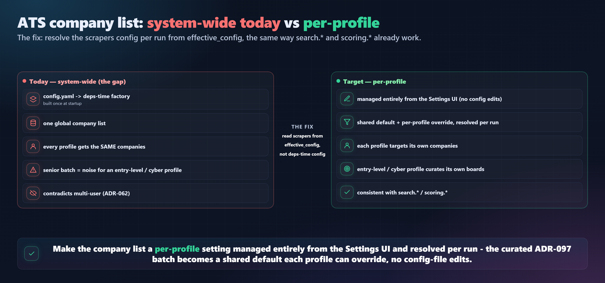
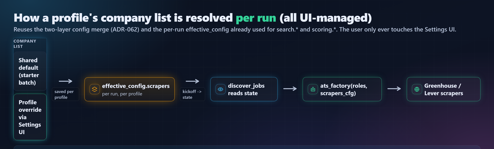

# ADR-098: Per-Profile ATS Targeting, Managed in the Settings UI

## Status

**Proposed** (2026-06-10) — awaiting approval before implementation. Refines the
posture of ADR-097 (which shipped the curated ATS batch as a **system-wide**
default). This ADR makes the company list **per-profile** and **entirely
UI-managed**.

## Context — the gap ADR-097 left

ADR-081 built the ATS-direct scrapers; ADR-097 curated a live-verified batch and
turned it on. But the company list is resolved at the **wrong layer**:

`_ats_factory` (`app/api/dependencies.py`) closes over
`config_dict.get("scrapers")`, where `config_dict` is the **system `config.yaml`
loaded once at deps-build time**. So every profile gets the **same** companies —
even though the rest of per-run configuration (`search.*`, `scoring.*`) is resolved
**per run, per profile** from `state["effective_config"]` (computed at kickoff via
`ConfigService.get_effective_config(user_id)`, ADR-062). The ATS list is the
odd-one-out: deps-time and global instead of per-run and per-profile.

Consequences observed:
- A senior-tuned batch is noise for an entry-level / cyber profile (multi-user).
- It contradicts the ADR-062 multi-user design.
- Changing it today means editing `config.yaml` — not acceptable per the constraint
  below.

*Figure 1: system-wide today vs per-profile target. The fix is to resolve the
scrapers config per run from `effective_config`, the way `search.*` / `scoring.*`
already work.*

## Constraints (from the user, non-negotiable)

1. **Permanent per-profile fix** — each profile targets its own companies; not a
   global hardcode.
2. **Everything managed from the Settings UI** — no `config.yaml` edits and no raw
   dotted-key config updates required of the user. Adding a board must not require
   hand-finding a slug, so **verify-on-add** is in scope.

Given these, two things are **fixed** (not up for debate) and one decision remains:

- **Fixed:** resolve per run from `effective_config`; manage entirely in Settings
  with verify-on-add.
- **Open decision:** *how the per-profile list is stored.*

## Decision

### Runtime resolution (fixed) — align ATS with the per-run pattern

Stop resolving the company list at deps-build time. `discover_jobs` already holds
`state["effective_config"]`; it passes `effective_config.get("scrapers")` to the
factory, and `build_ats_scrapers(roles, scrapers_cfg)` (which already takes a
`scrapers_cfg` argument) builds the run's scrapers. The factory signature changes
from `ats_scraper_factory(roles)` to `ats_scraper_factory(roles, scrapers_cfg)`.

A real benefit falls out: because the list is read **per run** from the run's
effective config, a Settings edit takes effect on the **next run with no
`/config/reload`** (unlike agent-model bindings, which are deps-time, ADR-053).

*Figure 2: the resolution path. No new mechanism — the override rides the same
two-layer merge as every other per-profile setting; only the factory's input moves
from deps-time to per-run.*

### Settings UI (fixed) — first-class, verify-on-add

A "Target companies" section in `app/ui/views/settings.py`, per profile:
- lists the profile's current boards (read from `GET /config` effective config),
- **add**: pick ATS (Greenhouse / Lever) + enter a board token/slug, **verified
  live before save** (a small `POST /config/ats/verify {ats, slug}` endpoint that
  reuses the `tools/verify_ats_boards.py` check and returns the job count; a slug
  that returns 0/404 is rejected with a clear message),
- **remove** a board; **enable/disable** each ATS source.
- The widget persists via the existing config-override path under the hood; the user
  never sees a YAML file or a dotted key.

### Storage — the one open decision (RECOMMENDED: Option 1)

*Figure 3: storage options. Per-profile + UI-managed + per-run are fixed; this is
purely how the list is stored.*

## Decision review (so this is not a rubber-stamp)

- **Recommendation:** Option 1 (user_config-backed list, per-run resolution, Settings
  widget with verify-on-add). **Confidence: high** on the runtime fix; **medium** on
  storage (Option 2 is defensible if you want persisted verify-status + per-company
  metadata).
- **The one decision that matters:** storage model — **Option 1 (config-backed)** vs
  **Option 2 (dedicated `target_companies` table)**. Everything else is fixed by your
  constraints.
- **Pros (Option 1):** least new machinery; reuses the config merge + per-run
  `effective_config`; consistent with `search.*`/`scoring.*`; edits apply next run
  with no reload; fully reversible.
- **Cons / traded away:** the override **replaces** the default list rather than
  extending it (deep-merge replaces non-dict values) — a profile that overrides
  starts from its own list, not "default + mine"; per-company metadata (display name,
  last-verified date) is not persisted unless we enrich the stored shape.
- **Risks & unknowns:** verify-on-add adds a live network call in the Settings flow
  (bounded, one GET); **I have not measured** the Settings round-trip latency. The
  shared default still lives in `config.yaml` (operator-set) — a brand-new profile
  with no override inherits it, which may or may not be desired (see "reasons to say
  no").
- **Reversibility & cost:** runtime fix is ~small (factory signature + one node line);
  the Settings widget + verify endpoint is the bulk of the work (moderate). Reverting
  is easy (drop the widget; factory falls back to the default).
- **Where I'd push back on myself:** Option 1 stores only slugs, so the UI can show
  "verified just now" at add-time but cannot show "still healthy" later without
  re-calling the API; if you want a persistent health view, Option 2's table is the
  honest choice. I am recommending the lighter option deliberately, but flagging it.
- **Reasons to say NO / choose differently:** (a) pick **Option 2** if persisted
  per-company verify-status and richer metadata matter to you; (b) ask for
  **extend-not-replace** semantics (profile list = shared default + my additions) —
  that's a small extra design, not free; (c) decide a new profile should start
  **empty** (no inherited default) rather than inheriting `config.yaml` — a one-line
  policy choice worth making explicitly.

## How it integrates with the job-search workflow

Unchanged downstream. The per-run scrapers flow into `discover_jobs` exactly as
today: `JobDiscoveryService.discover_with_stats` normalizes + per-user dedups ->
posting-age (ADR-080) -> dead-link (ADR-095) -> node cap (<=50) -> the standard
funnel (relevance filter ADR-079 -> score -> auto-select -> deep review -> report).
The only change is *which* companies a given run queries. Senior tuning stays via
`scoring.min_match_score`.

## Out of scope — explicitly de-bundled (separate ADRs)

So you approve one thing at a time, these are NOT part of this decision:
- **Expand the default batch + add an ATS type.** A larger verified Greenhouse/Lever
  set, and likely **Ashby** (clean public JSON; many startups/security firms). NOTE:
  **Workday is a per-tenant rabbit hole** — not a quick add; its own ADR if ever.
- **Company name -> slug resolver.** A friendly "search by company name" that
  resolves to the ATS slug, so users never type a raw token. (Verify-on-add in this
  ADR is the floor; the resolver is the nicer ceiling.)
- **Source visibility in lists.** A Source column/badge in the discovered + Matches
  tables (today the employer-direct vs aggregator badge shows only on job detail,
  ADR-093).

## PSSR

- **Performance:** one extra live GET per board on add (Settings flow only, not the
  run path); the run path is unchanged. Estimated small; not yet measured.
- **Scalability:** per-profile lists scale with profiles; each run still bounded by
  `_MAX_JOBS_PER_BOARD` + node cap.
- **Security:** verify endpoint hits the same public, unauthenticated ATS APIs; no
  secrets; slug is validated server-side. No new trust boundary.
- **Reliability:** verify-on-add prevents dead slugs entering a profile; per-board
  runtime failures already non-fatal (ADR-081).

## Tests (at implementation)

Factory reads per-run `scrapers_cfg` (two profiles -> two different board sets);
`effective_config` override replaces the default; verify endpoint accepts a live
slug and rejects an empty/404 one (mocked httpx); Settings widget add/remove writes
the override; UI smoke. Docs sweep: ADR-098 + index, `config_model.md`,
`settings_reference.md`, `ui_architecture.md`/`ui_model.md`, CLAUDE.md scraper rules
(per-profile note), `wiki.md`, CHANGELOG.

## References

- ADR-097 — the curated batch (this refines its system-wide posture to a default).
- ADR-081 — ATS-direct scrapers (`build_ats_scrapers` already takes `scrapers_cfg`).
- ADR-062 — multi-user profiles + the two-layer per-user config this reuses.
- ADR-053 — agent bindings are deps-time (the per-run path here avoids that for the
  company list).
