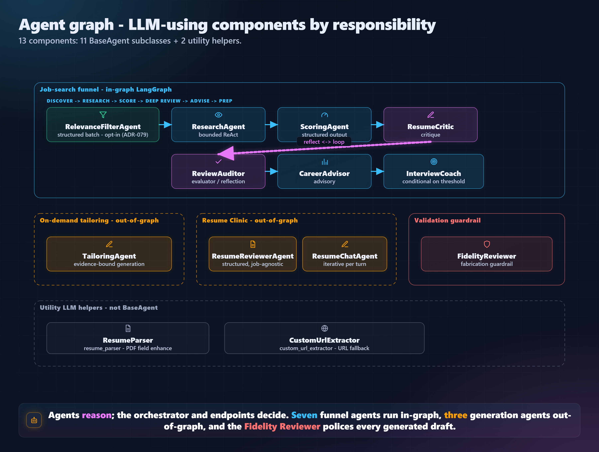
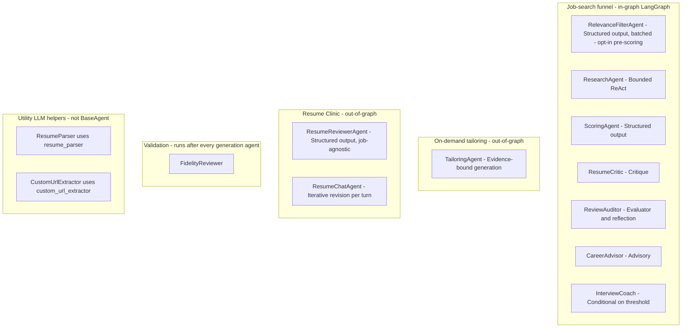

# Agent graph — top-level overview

A bird's-eye view of every agent v2 calls into, grouped by responsibility,
plus the in-graph workflow flow that wires the funnel agents together and
the out-of-graph operations that drive everything else.

For the per-agent input / output contract, constraints, and observability
events, see [`agent_model.md`](agent_model.md). For the workflow node graph
in detail, see [`workflow_model.md`](workflow_model.md).

## All agents at a glance

Thirteen LLM-using components (eleven `BaseAgent` subclasses + two utility helpers),
grouped by responsibility. Same style as the
[API surface diagram](api_surface_overview.md).



> The rendered PNG above is the canonical reference. The Mermaid source
> below renders the same diagram inline on platforms that support Mermaid.



## Reference table

All values from `config/config.example.yaml` (per-agent provider + model
assignment) and `tests/model_pins.json` (build-time pin).

### Funnel agents — run inside the LangGraph workflow

| Agent | `AGENT_NAME` | Pattern | When it runs |
|---|---|---|---|
| `RelevanceFilterAgent` | `relevance_filter` | Structured output (batch) | Opt-in (`search.relevance_filter`, ADR-079). One cheap call before scoring; hard-drops seniority/relevance mismatches. |
| `ResearchAgent` | `research_agent` | Bounded ReAct | Always — once per discovered job, before scoring. |
| `ScoringAgent` | `scoring_agent` | Structured output (batch) | Always — scores every researched job. |
| `ResumeCritic` | `resume_critic` | Critique | Only for jobs that pass the deep-review gate. |
| `ReviewAuditor` | `review_auditor` | Evaluator / reflection | Always paired with `ResumeCritic` in a bounded loop (`MAX_REVIEW_ROUNDS=2`). |
| `CareerAdvisor` | `career_advisor` | Advisory | After the reflection loop stops. |
| `InterviewCoach` | `interview_coach` | Conditional | When `match_score ≥ interview_prep_threshold` OR on user request via `POST /workflows/{wf}/jobs/{job}/interview-prep`. |

### Out-of-graph operations — driven by REST endpoints

| Agent | `AGENT_NAME` | Pattern | Triggered by |
|---|---|---|---|
| `TailoringAgent` | `tailoring_agent` | Evidence-bound generation | `POST /workflows/{wf}/jobs/{job}/tailorings` (ADR-055). Always followed by `FidelityReviewer`. |
| `ResumeReviewerAgent` | `resume_reviewer` | Structured output (job-agnostic) | `POST /users/{id}/resume-clinic` (ADR-066). Always followed by `FidelityReviewer` on the `rewrites`. |
| `ResumeChatAgent` | `resume_chat` | Iterative revision | `POST /resume-clinic/{id}/chat` (ADR-068), one call per chat turn. Always followed by `FidelityReviewer`. |

### Guardrail

| Agent | `AGENT_NAME` | Pattern | When it runs |
|---|---|---|---|
| `FidelityReviewer` | `fidelity_reviewer` | Validation | After every generation agent's output — `TailoringAgent`, `ResumeReviewerAgent.rewrites`, `ResumeChatAgent.overhaul.rewrites`. **A human `edit` decision is owner-authored and NOT re-reviewed (ADR-059).** |

### Utility helpers — not `BaseAgent` subclasses

| Component | `AGENT_NAME` (for cost/pin) | Purpose | Where it runs |
|---|---|---|---|
| `ResumeParser` | `resume_parser` | Enhance the heuristic PDF parse with an LLM pass to fill structured fields (`gpa`, `honors[]`, `skill_groups[]`, …) | `app/services/resume_parser.py`. Invoked on every resume upload that's not in the SHA-256 cache. |
| `CustomUrlScraper` | `custom_url_extractor` | LLM-fallback extraction when heuristics (JSON-LD, OpenGraph, article tag) fail to pull the job-posting fields out of a URL | `app/services/custom_url_scraper.py`. Per workflow run, only for URLs in `state["custom_urls"]`. |

## The in-graph workflow flow

The funnel agents are wired into a single LangGraph state machine defined in
`app/workflows/workflow_graph.py`. Conditional entry routes a fresh run to
`register_run`; ADR-060 phase-2 (manual scoring continuation) re-enters at
`score_jobs` on the same thread.

```text
START
  │
  ├── new run ──> register_run ── discover_jobs ── load_resume ──┐
  │                                                              │
  └── phase 2  ─────────────────────────────────────────┐        │
                                                       │        │
                                                       ▼        ▼
                                                  score_jobs ◀── scoring_mode_gate
                                                       ▲        │
                                          relevance_filter ◀────┤  (ADR-079, opt-in)
                                                       │        │
                                                       │        └── manual ──> await_scoring_selection ──> END (phase 1)
                                                       │
                                                       ▼
                                                  await_job_selection (auto-select top 3)
                                                       │
                                                       ▼
                                                  deep_review_gate
                                                  ├── no qualifying jobs ──> generate_report
                                                  └── ≥1 qualifying ──> deep_review
                                                                          │
                                                                          ▼
                                                                    [ResumeCritic ⇄ ReviewAuditor
                                                                       reflection loop,
                                                                       MAX_REVIEW_ROUNDS=2]
                                                                          │
                                                                          ▼
                                                                    career_advice
                                                                          │
                                                                          ▼
                                                                    interview_router
                                                                    ├── score ≥ threshold ──> interview_prep ──> generate_report
                                                                    └── below threshold ────────────────────────> generate_report
                                                                                                                       │
                                                                                                                       ▼
                                                                                                                      END
```

Per-node agent calls:

| Node | Agents invoked | Notes |
|---|---|---|
| `register_run` | (none) | Writes the initial state to `workflow_runs` so the UI sees it. |
| `discover_jobs` | (none) | Uses `JobDiscoveryService` + the v1 scrapers (Adzuna, LinkedIn, CustomUrl). `CustomUrlScraper` may call the `custom_url_extractor` LLM as a fallback per URL. |
| `load_resume` | (none) | Reads the active resume from `ResumeRepository`. |
| `await_scoring_selection` | (none) | ADR-060: parks until `POST /workflows/{wf}/scoring` continues. |
| `relevance_filter` | `RelevanceFilterAgent` | ADR-079, opt-in: one batched call drops seniority/relevance mismatches before scoring. Keep-all on failure. |
| `score_jobs` | `ResearchAgent` ⇒ `ScoringAgent` | Per-job: research first (bounded ReAct), then structured-output scoring. |
| `await_job_selection` | (none) | Auto-selects up to `MAX_SELECTED_JOBS` qualifying jobs (no interrupt). |
| `deep_review` | `ResumeCritic` ⇄ `ReviewAuditor` | Reflection loop bounded by `MAX_REVIEW_ROUNDS` + the auditor's `stop` signal. |
| `career_advice` | `CareerAdvisor` | One call per selected job. |
| `interview_prep` | `InterviewCoach` | Skipped when no selected job clears `interview_prep_threshold`. |
| `generate_report` | (none) | Aggregates everything written by the earlier nodes; terminal status. |

## The two out-of-graph operations

Tailoring and the Resume Clinic both follow the **ADR-055 pattern**: the
endpoint loads state from the checkpointer (or the resume row), calls agents
directly, and persists via repos. No `interrupt()`, no LangGraph entry, no
HITL graph pauses.

### On-demand tailoring

```text
POST /workflows/{wf}/jobs/{job}/tailorings
  │
  ▼
TailoringAgent  ────►  FidelityReviewer  ────►  tailored_resumes row
                                                       │
                                                       ▼
                                            POST /tailorings/{id}/decisions
                                            (approve / revise / reject / edit)
```

### Resume Clinic + chat-revise

```text
POST /users/{id}/resume-clinic
  │
  ▼
ResumeReviewerAgent  ────►  FidelityReviewer  ────►  resume_clinic_reviews row
                                                            │
                                                            ▼
                                            POST /resume-clinic/{id}/chat (each turn)
                                            ─────►  ResumeChatAgent  ────►  FidelityReviewer
                                                                                  │
                                                                                  ▼
                                                                            edited_json updated
                                            POST /resume-clinic/{id}/decisions  OR  /discard-edits
                                            ─────►  decision recorded / edits cleared
                                                            │
                                                            ▼
                                            GET /resume-clinic/{id}/export?format=...
                                            (deterministic renderer; no agent call)
```

## Cross-cutting invariants

These apply to every agent and are enforced in code, not just docs:

- **One interface** — every agent calls the model through `LLMClient`. No
  agent imports `ClaudeProvider` or `OpenAIProvider` directly.
- **Structured output is the contract** — every call returns a validated
  Pydantic schema (`min_length`, `Literal` enums, etc.) before anything
  downstream trusts it.
- **Guardrails baked in every prompt** — `app/prompts/shared/guardrails.txt`
  is auto-injected by `PromptLoader` for every agent.
- **Pinned per-agent assignment** — `tests/model_pins.json` records the
  `(provider, model)` each agent was last validated against. A
  configuration swap fails the build invariant test until the pin is
  updated alongside.
- **Bounded execution** — every agent has explicit step / round / call
  limits (`MAX_RESEARCH_STEPS`, `MAX_REVIEW_ROUNDS`,
  `MAX_LLM_CALLS_PER_JOB`, `MAX_LLM_CALLS_PER_RUN`).
- **Observability invariant** — every call writes an `llm_calls` row tagged
  with the run's `workflow_run_id`, so the per-profile Cost Dashboard
  attributes spend correctly (clinic + chat turns flow under the
  lightweight `workflow_type="resume_clinic"` row).
- **Fidelity always runs on agent-authored rewrites** — never on a human
  `edit` decision; the reviewer polices the agent, not the accountable
  human (ADR-059).

## References

- [`agent_model.md`](agent_model.md) — full per-agent contract.
- [`workflow_model.md`](workflow_model.md) — the LangGraph workflow in
  detail (nodes, edges, routers, conditional logic).
- [`api_surface_overview.md`](api_surface_overview.md) — companion diagram
  for the REST surface.
- [ADR-055](adr/ADR-055-on-demand-tailoring-as-out-of-graph-operation.md) —
  the out-of-graph pattern Tailoring and the Resume Clinic both follow.
- [ADR-059](adr/ADR-059-retire-in-graph-hitl-and-add-human-edit-decision.md) —
  human-as-final-author; Fidelity polices the agent, not the human.
- [ADR-066](adr/ADR-066-standalone-resume-clinic.md) — the standalone Resume
  Clinic.
- [ADR-068](adr/ADR-068-chat-revise-loop-for-the-resume-clinic.md) — the
  chat-revise loop on top of the Clinic.
