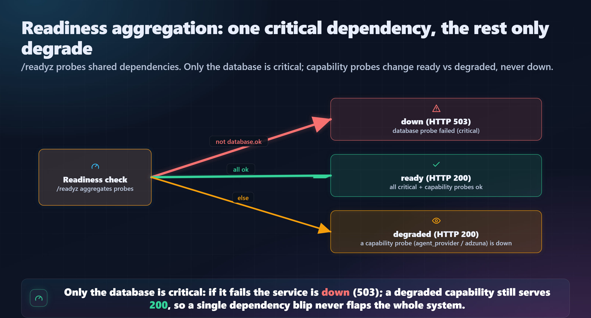

# Health and Readiness - Implementation Design

Companion to [ADR-084](adr/ADR-084-health-and-readiness-endpoints.md). The ADR
records the decision; this document is the implementation plan: contracts, the
check registry, code changes, PSSR, tests, and the docs to update. Status: design
for review (no code written yet).

---

## 1. Goal

Add active **liveness** (`GET /health`) and **readiness** (`GET /readyz`) endpoints
that probe the system's **shared dependencies** (not the 30 individual routes), and
surface readiness on the System Dashboard. Complements ADR-074's passive,
traffic-driven per-endpoint observability; does not replace it.

---

## 2. Endpoint contracts

### `GET /health` (liveness)

- No dependency I/O. Returns `200` whenever the process can serve a request.
- Unauthenticated; no `?user_id=`.
- Response `200`:

```json
{ "status": "ok", "service": "jobsearchagent-v2", "version": "2.0.0" }
```

(`version` is optional; sourced from a module constant, omitted if not defined.)

### `GET /readyz` (readiness)

- Runs the check registry (Section 3), aggregates (Section 4).
- Unauthenticated; no `?user_id=`.
- Secret-safe: presence/mode only, never key values, never PII.
- Response `200` (ready or degraded) / `503` (down):

```json
{
  "status": "ready",
  "checks": {
    "database":       { "ok": true,  "detail": "SELECT 1 ok",            "latency_ms": 2 },
    "agent_provider": { "ok": true,  "detail": "live", "mode": "live" },
    "adzuna":         { "ok": true,  "detail": "configured" },
    "openai":         { "ok": true,  "detail": "configured", "optional": true }
  },
  "checked_at": "2026-06-06T12:00:00Z"
}
```

A `degraded` example (mock mode, no Adzuna) still returns `200`:

```json
{
  "status": "degraded",
  "checks": {
    "database":       { "ok": true,  "detail": "SELECT 1 ok", "latency_ms": 2 },
    "agent_provider": { "ok": false, "detail": "mock", "mode": "mock" },
    "adzuna":         { "ok": false, "detail": "not configured" },
    "openai":         { "ok": false, "detail": "not configured", "optional": true }
  },
  "checked_at": "..."
}
```

A `down` example returns `503` (DB unreachable):

```json
{ "status": "down", "checks": { "database": { "ok": false, "detail": "OperationalError: unable to open database file" }, ... }, "checked_at": "..." }
```

Note: `checked_at` is computed at request time (not a stored timestamp), so it does
not run afoul of the deterministic-render rules; it is a live endpoint.

---

## 3. Check registry

Each check is a small pure-ish function `() -> CheckResult` where
`CheckResult = {ok: bool, detail: str, optional?: bool, mode?: str, latency_ms?: int}`.
Lives in a new deterministic service so it is unit-testable in isolation.

| Check | How | Critical | Notes |
|---|---|---|---|
| `database` | open `DEFAULT_DB_PATH` (`data/v2.db`) via `get_connection`, run `SELECT 1`, close; time it | **yes** | the one check that can produce `down`/`503` |
| `agent_provider` | `bool(os.getenv("ANTHROPIC_API_KEY"))` -> `mode = "live"|"mock"` | no | absent = mock mode (valid run mode) -> degraded, not down |
| `adzuna` | `bool(os.getenv("ADZUNA_APP_ID") and os.getenv("ADZUNA_APP_KEY"))` | no | absent -> discovery degraded |
| `openai` | `bool(os.getenv("OPENAI_API_KEY"))` | no, `optional: true` | informational; never affects status |

The env getter and `db_path` are injectable (default to the real ones) so tests can
drive each branch without touching the environment or a real DB.

---

## 4. Aggregation



*Figure: only the database is critical (its failure means down/503); a degraded capability probe still serves 200. Re-render with `python tools/render_figures.py health_aggregation`.*

- **Critical** = `database`.
- **Capability** (affect `ready` vs `degraded`, never `down`) = `agent_provider`,
  `adzuna`.
- **Optional** (`openai`) is reported but never affects `status`.

The FastAPI handler sets the response status code from the aggregate (`503` for
`down`, else `200`).

---

## 5. Middleware exclusion (ADR-074 interaction)

`app/api/main.py::_observe_requests` records every request into `api_requests`. Add
an early skip:

```python
EXCLUDED_FROM_OBSERVABILITY = {"/health", "/readyz"}
...
template = getattr(route, "path", None) or "<unmatched>"
if template in EXCLUDED_FROM_OBSERVABILITY:
    return response          # still serve; just don't record
```

(Implemented so the skip happens in the `finally` path without recording, while
still returning the handler's response and never masking exceptions.) Rationale:
frequent probes would flood the table and a `503` from `/readyz` would wrongly
inflate the dashboard's API error rate. This is a deliberate, documented exclusion.

---

## 6. Dashboard surface

A **"System health"** tile at the top of `app/ui/views/system_dashboard.py`:

- `api_client.get_readiness()` -> `GET /readyz` (new client method; no `_user_params`).
- Render the overall status (green `ready` / amber `degraded` / red `down`) and a
  small per-check list (database, agent_provider mode, adzuna, openai).
- Sits beside / above the existing "API requests" error-rate metric, so the live
  readiness and the recent-traffic error rate read together.
- Degrade gracefully: if the API call fails (backend down), show "backend
  unreachable" rather than raising - the dashboard must still render.

This is the "bubbled up to the dashboard" half of the user's request.

---

## 7. File changes

| File | Change |
|---|---|
| `app/services/readiness.py` (new) | the check registry + `readiness_snapshot(db_path, getenv)` returning the aggregate dict; pure + testable |
| `app/api/routers/health.py` (new) | `GET /health` + `GET /readyz`; thin - calls `readiness_snapshot`, sets status code |
| `app/api/main.py` | `app.include_router(health_router)`; add the `EXCLUDED_FROM_OBSERVABILITY` skip in `_observe_requests` |
| `app/ui/api_client.py` | `get_readiness()` (no user params; short timeout; returns dict or an `{"status": "down", "detail": "backend unreachable"}` fallback on connection error) |
| `app/ui/views/system_dashboard.py` | the "System health" tile |
| `tests/v2/test_readiness.py` (new) | check + aggregation + endpoint tests (Section 8) |

No DB schema change, no repository change, no new config keys.

---

## 8. Testing

- **Unit (readiness service):** each check's ok/not-ok branch via injected `getenv`
  and a temp/real `db_path`; the aggregation truth table (down / degraded / ready);
  secret-safety (assert no env *value* ever appears in the output, only presence/mode).
- **Endpoint:** `GET /health` -> 200 + body; `GET /readyz` -> 200 when ready/degraded,
  503 when the DB check is forced to fail (monkeypatch `db_path` to a bad path).
- **Middleware exclusion:** hit `/health` and assert no `api_requests` row was written
  (and that a normal endpoint still writes one) - guards the ADR-074 interaction.
- **Dashboard:** extend the `smoke-test-ui` AppTest pass so the System Dashboard still
  renders with the new tile (and renders when `get_readiness` returns the unreachable
  fallback).

Target: all existing tests still pass (1031) + the new ones.

---

## 9. PSSR

- **Performance:** liveness does no I/O; readiness is one `SELECT 1` + a few env
  reads (sub-millisecond). Excluding probes from `api_requests` avoids write
  amplification and keeps the dashboard's latency/error rollups clean.
- **Scalability:** stateless, no persistence; fine on the single-node SQLite app.
- **Security:** unauthenticated by design (standard for health probes); reports
  presence/mode only - never key values, never PII (enforced by a test). Recorded as
  an explicit, intentional unauthenticated surface in `security.model.md`.
- **Reliability:** checks are wrapped so a failing check yields `{ok: false, detail}`
  rather than a 500; `/readyz` returning `503` is a *correct* signal, not a crash. The
  dashboard tile degrades gracefully if the backend is unreachable.

---

## 10. Docs to update (with the implementation)

Per the architecture-docs sweep mandate, the implementation PR updates:

- `api_reference.md` - new `/health` + `/readyz` contracts, response shapes, the
  `ready`/`degraded`/`down` status values, and the note that they are unauthenticated
  + excluded from `api_requests`.
- `api_surface_overview.md` - add an "Ops / health" group to the endpoint map (Mermaid
  mirror + the deterministic-renderer `api_surface` spec; render via `outDir`).
- `observability.md` - a short "Health and readiness" subsection distinguishing active
  probes from the passive `api_requests` layer.
- `security.model.md` - note the two intentionally-unauthenticated, secret-safe
  endpoints under Trust Boundaries / Observability Security.
- `architecture_overview.md` - one line under the Observability overview.
- `CLAUDE.md` - a brief invariant: `/health` + `/readyz` are unauthenticated, excluded
  from `api_requests`, and `/readyz` reports presence/mode only (never secret values).
- `ADR-000-index.md` - add the ADR-084 row.
- `wiki.md` - index this design doc + bump the `docs/architecture/` count.

---

## 11. Future (deferred, not in v1)

- Scheduled background probing + a `health_checks` table for history/trend.
- Alerting (flag sustained `degraded`/`down` or a per-endpoint error-rate threshold
  from `api_requests`).
- Per-dependency deeper checks (e.g. a cheap provider reachability ping, rate-limited).
- Wiring `/health` + `/readyz` into a real external monitor / container probe.
