```mermaid
erDiagram

    %% ─────────────────────────────────────────
    %% CORE ENTITIES
    %% ─────────────────────────────────────────

    workflow_runs {
        TEXT id PK
        TEXT workflow_type
        TEXT status
        TEXT current_step
        TEXT state_json
        TEXT user_id
        TEXT resume_id FK
        TEXT selected_job_id FK
        TEXT started_at
        TEXT updated_at
        TEXT completed_at
        TEXT error_message
    }

    jobs {
        TEXT id PK
        TEXT source
        TEXT source_job_id
        TEXT title
        TEXT company
        TEXT location
        TEXT job_description
        TEXT normalized_job_json
        TEXT url
        TEXT created_at
    }

    resumes {
        TEXT id PK
        TEXT file_name
        TEXT raw_text
        TEXT parsed_profile_json
        INTEGER version
        INTEGER is_active
        TEXT created_at
    }

    %% ─────────────────────────────────────────
    %% AGENT OUTPUT TABLES
    %% ─────────────────────────────────────────

    job_scores {
        TEXT id PK
        TEXT workflow_run_id FK
        TEXT job_id FK
        TEXT resume_id FK
        TEXT score_json
        INTEGER overall_score
        TEXT created_at
    }

    review_rounds {
        TEXT id PK
        TEXT workflow_run_id FK
        TEXT job_id FK
        INTEGER round_number
        TEXT critic_output_json
        TEXT audit_output_json
        INTEGER audit_score
        INTEGER auditor_confidence
        TEXT stop_reason
        TEXT created_at
    }

    resume_reviews {
        TEXT id PK
        TEXT workflow_run_id FK
        TEXT job_id FK
        TEXT resume_id FK
        TEXT review_json
        TEXT created_at
    }

    career_advice {
        TEXT id PK
        TEXT workflow_run_id FK
        TEXT job_id FK
        TEXT advice_json
        TEXT created_at
    }

    interview_prep {
        TEXT id PK
        TEXT workflow_run_id FK
        TEXT job_id FK
        TEXT prep_json
        TEXT created_at
    }

    tailored_resumes {
        TEXT id PK
        TEXT workflow_run_id FK
        TEXT job_id FK
        TEXT resume_id FK
        TEXT tailored_json
        INTEGER approved
        TEXT created_at
    }

    reports {
        TEXT id PK
        TEXT workflow_run_id FK
        TEXT report_json
        TEXT report_markdown
        TEXT report_file_path
        TEXT created_at
    }

    %% ─────────────────────────────────────────
    %% HITL + CONFIG
    %% ─────────────────────────────────────────

    human_decisions {
        TEXT id PK
        TEXT workflow_run_id FK
        TEXT decision_type
        TEXT decision_value
        TEXT payload_json
        TEXT presented_at
        TEXT decided_at
    }

    user_config {
        TEXT id PK
        TEXT user_id
        TEXT config_key
        TEXT config_value_json
        TEXT created_at
        TEXT updated_at
    }

    %% ─────────────────────────────────────────
    %% OBSERVABILITY TABLES
    %% ─────────────────────────────────────────

    step_executions {
        TEXT id PK
        TEXT workflow_run_id FK
        TEXT step
        TEXT status
        TEXT started_at
        TEXT completed_at
        INTEGER duration_ms
        TEXT notes
    }

    agent_events {
        TEXT id PK
        TEXT workflow_run_id FK
        TEXT agent_name
        TEXT event_type
        TEXT input_summary
        TEXT output_summary
        TEXT status
        INTEGER duration_ms
        TEXT created_at
    }

    llm_calls {
        TEXT id PK
        TEXT workflow_run_id FK
        TEXT agent_name
        TEXT provider
        TEXT model
        INTEGER tokens_input
        INTEGER tokens_output
        REAL estimated_cost
        INTEGER latency_ms
        TEXT created_at
    }

    run_metrics {
        TEXT id PK
        TEXT workflow_run_id FK
        INTEGER total_llm_calls
        INTEGER total_tokens_input
        INTEGER total_tokens_output
        REAL total_cost
        INTEGER total_duration_ms
        TEXT started_at
        TEXT completed_at
        TEXT created_at
    }

    %% ─────────────────────────────────────────
    %% SECURITY + MEMORY
    %% ─────────────────────────────────────────

    security_events {
        TEXT id PK
        TEXT workflow_run_id FK
        TEXT event_type
        TEXT severity
        TEXT description
        TEXT created_at
    }

    memory_items {
        TEXT id PK
        TEXT memory_type
        TEXT memory_key
        TEXT memory_value_json
        INTEGER confidence
        TEXT source_workflow_run_id FK
        TEXT created_at
        TEXT updated_at
    }

    %% ─────────────────────────────────────────
    %% RELATIONSHIPS — workflow_runs (central)
    %% ─────────────────────────────────────────

    workflow_runs ||--o{ job_scores        : "produces"
    workflow_runs ||--o{ review_rounds     : "produces"
    workflow_runs ||--o{ resume_reviews    : "produces"
    workflow_runs ||--o{ career_advice     : "produces"
    workflow_runs ||--o{ interview_prep    : "produces"
    workflow_runs ||--o{ tailored_resumes  : "produces"
    workflow_runs ||--o{ reports           : "produces"
    workflow_runs ||--o{ human_decisions   : "records"
    workflow_runs ||--o{ step_executions   : "traces"
    workflow_runs ||--o{ agent_events      : "traces"
    workflow_runs ||--o{ llm_calls         : "traces"
    workflow_runs ||--|| run_metrics       : "summarised by"
    workflow_runs ||--o{ security_events   : "logs"
    workflow_runs o|--o{ memory_items      : "contributes to"

    %% ─────────────────────────────────────────
    %% RELATIONSHIPS — jobs
    %% ─────────────────────────────────────────

    jobs ||--o{ job_scores       : "scored in"
    jobs ||--o{ review_rounds    : "reviewed in"
    jobs ||--o{ resume_reviews   : "reviewed in"
    jobs ||--o{ career_advice    : "advises on"
    jobs ||--o{ interview_prep   : "prepares for"
    jobs ||--o{ tailored_resumes : "tailored for"

    %% ─────────────────────────────────────────
    %% RELATIONSHIPS — resumes
    %% ─────────────────────────────────────────

    resumes ||--o{ job_scores       : "scored as"
    resumes ||--o{ resume_reviews   : "reviewed as"
    resumes ||--o{ tailored_resumes : "tailored as"
    resumes o|--o{ workflow_runs    : "used in"
```

# Phase 1 — Entity Relationship Diagram

All 18 tables. Relationships flow from `workflow_runs` (central) outward.

---

---

## Relationship summary

| Relationship | Cardinality | Notes |
|---|---|---|
| `workflow_runs` → `job_scores` | one to many | one run scores many jobs |
| `workflow_runs` → `review_rounds` | one to many | one run may have multiple reflection loop rounds per job |
| `workflow_runs` → `resume_reviews` | one to many | final critic output per job |
| `workflow_runs` → `career_advice` | one to many | one per selected job |
| `workflow_runs` → `interview_prep` | one to many | one per qualifying job |
| `workflow_runs` → `tailored_resumes` | one to many | one draft per job (requires user approval) |
| `workflow_runs` → `reports` | one to many | typically one final report per run |
| `workflow_runs` → `human_decisions` | one to many | every HITL checkpoint is recorded |
| `workflow_runs` → `step_executions` | one to many | one row per step per run (ordered timeline) |
| `workflow_runs` → `agent_events` | one to many | one row per agent start/complete/fail |
| `workflow_runs` → `llm_calls` | one to many | one row per LLM call |
| `workflow_runs` → `run_metrics` | one to one | single rolled-up summary per run |
| `workflow_runs` → `security_events` | one to many | append-only audit log |
| `workflow_runs` → `memory_items` | optional one to many | a run may contribute new memory entries |
| `jobs` → `job_scores` | one to many | same job scored across different runs |
| `jobs` → `review_rounds` | one to many | reflection loop is per-job |
| `jobs` → `resume_reviews` | one to many | final critique is per-job |
| `jobs` → `career_advice` | one to many | advice is per-job |
| `jobs` → `interview_prep` | one to many | prep is per-job |
| `jobs` → `tailored_resumes` | one to many | tailoring is per-job |
| `resumes` → `job_scores` | one to many | resume scored against many jobs |
| `resumes` → `resume_reviews` | one to many | resume critiqued against many jobs |
| `resumes` → `tailored_resumes` | one to many | resume tailored for many jobs |
| `resumes` → `workflow_runs` | optional one to many | resume used in one or more runs |
| `user_config` | standalone | keyed by `user_id`, no FK to other tables |
