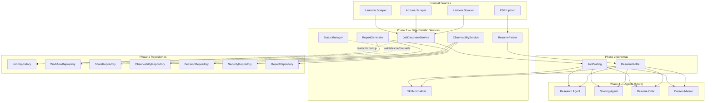
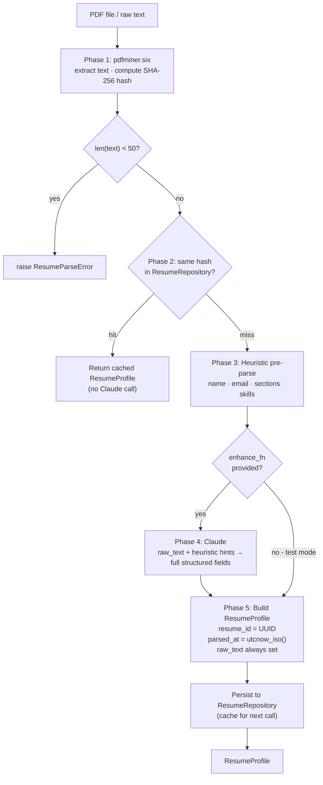
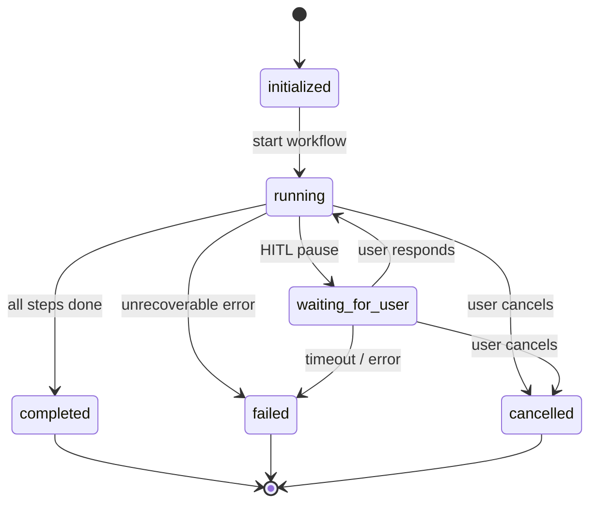
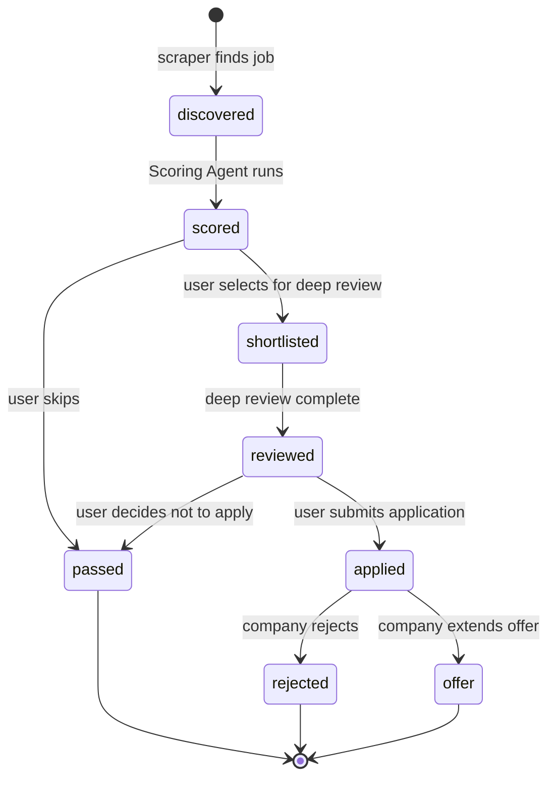
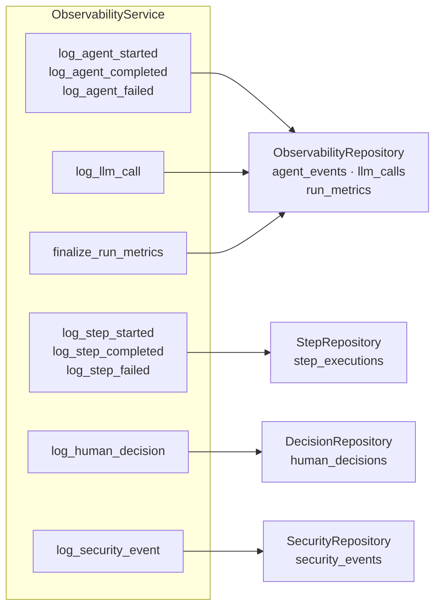
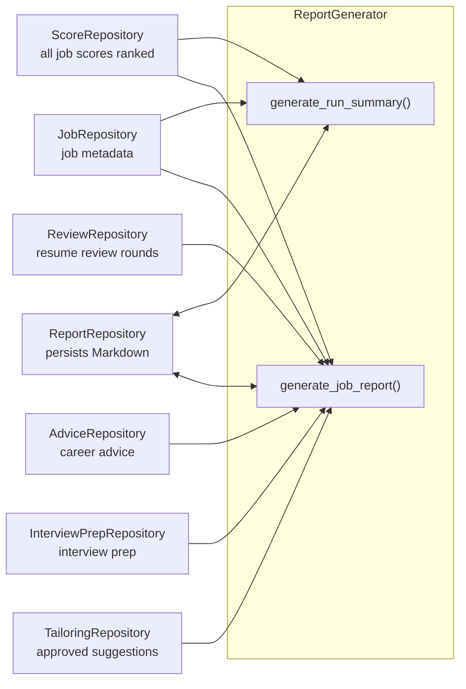

# Phase 2 — Services

> **Status:** Draft — awaiting review
>
> **Review gate:** Approve this document before any code is written.

---

## What is Phase 2?

Phase 2 builds the **deterministic services** that sit between the raw data sources and the agents.

No LLM calls in this phase. Every service is pure logic: normalize, validate, route, log, or format. Agents (Phase 4) consume the clean, structured outputs these services produce. If the services are wrong, every agent that depends on them is wrong.

---

## Why this order?

```
Phase 1: Foundation   ← complete (schemas, state, DB, config)
Phase 2: Services     ← you are here
Phase 3: LLM Provider
Phase 4: Agents
Phase 5: Orchestrator
Phase 6: UI
```

Services come before agents because agents need:
- normalized `JobPosting` objects (from `JobDiscoveryService`)
- structured `ResumeProfile` objects (from `ResumeParser`)
- canonical skill names (from `SkillNormalizer`)
- observable execution events (from `ObservabilityService`)
- valid status transitions enforced before state is updated (from `StatusManager`)
- formatted reports ready at run end (from `ReportGenerator`)

None of this requires intelligence. All of it must be correct.

---

## Phase 2 Architecture Overview



---

## Deliverables

Phase 2 has three groups:

| Group | What | Location |
|---|---|---|
| A | Two new data schemas (`JobPosting`, `ResumeProfile`) | `app/schemas/` |
| B | Skills data file | `data/skills.yaml` |
| C | Six deterministic services | `app/services/` |

> **Note on new schemas:** `JobPosting` and `ResumeProfile` are data schemas — not agent output schemas. They describe data that flows into agents, not data that agents return. They live in `app/schemas/` alongside the Phase 1 agent output schemas.

---

## Group A — New Data Schemas

### 1. `JobPosting` — `app/schemas/job_posting.py`

`JobPosting` is the **v2 canonical job representation**. Every job in the system — regardless of source — is normalized to this schema before any agent sees it.

v1 had `models/job.py::Job`. v2 replaces it with `JobPosting`, which is cleaner:
- string UUIDs instead of auto-incremented integer IDs
- no `TrackScores` or `ApplicationStatus` embedded in the schema (those are tracked externally by `JobRepository` and `StatusManager`)
- explicit `workflow_id` to tie the job to the run that found it
- ISO 8601 string timestamps (consistent with all other v2 types)

```python
class JobSource(str, Enum):
    LINKEDIN = "linkedin"
    ADZUNA = "adzuna"
    LADDERS = "ladders"
    MANUAL = "manual"       # for manually submitted job descriptions

class WorkMode(str, Enum):
    REMOTE = "remote"
    HYBRID = "hybrid"
    ONSITE = "onsite"
    UNKNOWN = "unknown"     # when the posting does not specify

class SalaryInfo(BaseModel):
    min_amount: int | None = None
    max_amount: int | None = None
    currency: str = "USD"

class JobPosting(BaseModel):
    job_id: str             # UUID — assigned by JobDiscoveryService at normalization
    workflow_id: str        # which run discovered this job
    url: str                # canonical URL of the posting
    source: JobSource
    title: str
    company: str
    location: str | None = None
    work_mode: WorkMode = WorkMode.UNKNOWN
    description: str | None = None      # full job description text, HTML-stripped
    salary: SalaryInfo | None = None
    found_at: str           # ISO 8601 — when the scraper found it
    posted_at: str | None = None        # ISO 8601 — when the company posted it, if parseable
```

**Key design rules:**

- `job_id` is a UUID assigned by `JobDiscoveryService.normalize()` at normalization time — not derived from the source URL or scraper ID, which are unstable.
- `description` is the raw text of the job description, HTML-stripped. The Research Agent reads this. It is treated as untrusted input at all times.
- `work_mode` defaults to `UNKNOWN` when the posting does not explicitly state it. Agents must not infer `REMOTE` from absence of an office location.
- `SalaryInfo` is `None` when the posting provides no salary information. Missing salary is not the same as `min_amount = 0`.

---

### 2. `ResumeProfile` — `app/schemas/resume_profile.py`

`ResumeProfile` is the **v2 parsed resume representation**. It is what `ResumeParser` produces from a PDF upload, and what agents receive as their view of the candidate.

v1 had `models/profile.py::Profile`, populated by a Claude call. v2 `ResumeProfile` is populated by the deterministic `ResumeParser` (this phase), extended with:
- `resume_id` (UUID)
- `raw_text` — the full extracted PDF text, always populated, used as source of truth for fidelity checks
- `parsed_at` timestamp
- All v1 Profile fields preserved

```python
class ExperienceEntry(BaseModel):
    company: str
    title: str
    start_year: int
    end_year: int | None = None         # None means current role
    description: str | None = None
    technologies: list[str] = []

class EducationEntry(BaseModel):
    institution: str
    degree: str
    year: int | None = None

class CertificationEntry(BaseModel):
    name: str
    issuer: str | None = None
    year: int | None = None

class ResumeProfile(BaseModel):
    resume_id: str              # UUID — assigned at parse time
    file_name: str | None = None
    raw_text: str               # full extracted PDF text — always set, never empty
    name: str | None = None
    headline: str | None = None
    email: str | None = None
    location: str | None = None
    summary: str | None = None
    experience: list[ExperienceEntry] = []
    skills: list[str] = []
    education: list[EducationEntry] = []
    certifications: list[CertificationEntry] = []
    parsed_at: str              # ISO 8601 — when the parser ran
```

**Key design rules:**

- `raw_text` is mandatory and must always be set. It is the source the Fidelity Reviewer uses to check whether tailored claims are supported by the actual resume. If `raw_text` is empty, the parse failed.
- Structured fields (`name`, `experience`, etc.) are best-effort from the deterministic parser. Agents receive them as context but must not assume they are complete or perfectly structured.
- The Tailoring Agent and Fidelity Reviewer must use `raw_text` — not just the structured fields — when assessing whether a claim has evidence.
- `resume_id` is a UUID assigned at parse time, stored in the `resumes` table, and referenced by all downstream agent outputs (`JobScore.resume_id`, `ResumeReview.resume_id`, etc.).

---

## Group B — Skills Data

### `data/skills.yaml`

The `SkillNormalizer` maps raw skill strings (from resumes or job descriptions) to canonical names. The canonical list lives in `data/skills.yaml` so it can be updated without changing code.

**File format:**

```yaml
# data/skills.yaml
# Format: canonical_name → list of known aliases (case-insensitive match at runtime)

Python:
  aliases: ["python", "python3", "python 3", "py", "Python3"]

JavaScript:
  aliases: ["javascript", "js", "java script", "Javascript"]

TypeScript:
  aliases: ["typescript", "ts", "Typescript"]

Java:
  aliases: ["java", "Java SE", "Java EE", "JVM"]

Go:
  aliases: ["go", "golang", "Go language"]

Rust:
  aliases: ["rust", "rust-lang"]

C++:
  aliases: ["c++", "cpp", "c plus plus"]

SQL:
  aliases: ["sql", "SQL language"]

PostgreSQL:
  aliases: ["postgresql", "postgres", "Postgres", "pg"]

MySQL:
  aliases: ["mysql", "MySQL Database"]

SQLite:
  aliases: ["sqlite", "SQLite3"]

MongoDB:
  aliases: ["mongodb", "mongo", "Mongo DB"]

Redis:
  aliases: ["redis", "Redis Cache"]

Elasticsearch:
  aliases: ["elasticsearch", "elastic search", "elastic", "ES"]

Kubernetes:
  aliases: ["kubernetes", "k8s", "K8s", "Kube"]

Docker:
  aliases: ["docker", "Docker container", "containerization"]

Terraform:
  aliases: ["terraform", "tf", "TF"]

AWS:
  aliases: ["aws", "amazon web services", "Amazon AWS"]

GCP:
  aliases: ["gcp", "google cloud", "google cloud platform", "Google GCP"]

Azure:
  aliases: ["azure", "microsoft azure", "Azure Cloud"]

React:
  aliases: ["react", "reactjs", "react.js", "React JS"]

FastAPI:
  aliases: ["fastapi", "fast api", "FastAPI framework"]

Django:
  aliases: ["django", "Django framework"]

Flask:
  aliases: ["flask", "Flask framework"]

LangChain:
  aliases: ["langchain", "lang chain", "LangChain AI"]

LangGraph:
  aliases: ["langgraph", "lang graph"]

GraphQL:
  aliases: ["graphql", "graph ql", "GraphQL API"]

REST:
  aliases: ["rest", "restful", "rest api", "REST API", "RESTful API"]

gRPC:
  aliases: ["grpc", "gRPC framework", "protobuf", "protocol buffers"]

Kafka:
  aliases: ["kafka", "apache kafka", "Apache Kafka"]

Spark:
  aliases: ["spark", "apache spark", "Apache Spark", "PySpark"]

Airflow:
  aliases: ["airflow", "apache airflow", "Apache Airflow"]

CI/CD:
  aliases: ["ci/cd", "cicd", "CI CD", "continuous integration", "continuous delivery", "continuous deployment"]

GitHub Actions:
  aliases: ["github actions", "gh actions", "GitHub CI"]

Ansible:
  aliases: ["ansible", "Ansible automation"]

Linux:
  aliases: ["linux", "ubuntu", "debian", "centos", "rhel", "Red Hat Linux", "unix"]

Git:
  aliases: ["git", "Git SCM", "version control"]

Machine Learning:
  aliases: ["ml", "machine learning", "Machine Learning (ML)"]

Deep Learning:
  aliases: ["dl", "deep learning", "Deep Learning (DL)"]

PyTorch:
  aliases: ["pytorch", "torch", "PyTorch framework"]

TensorFlow:
  aliases: ["tensorflow", "tf", "TensorFlow ML"]

Agile:
  aliases: ["agile", "agile methodology", "scrum", "Scrum", "Kanban", "kanban"]

Microservices:
  aliases: ["microservices", "micro services", "microservice architecture"]

Event-Driven Architecture:
  aliases: ["event-driven", "event driven architecture", "EDA", "event-driven architecture"]

Domain-Driven Design:
  aliases: ["ddd", "domain driven design", "domain-driven design"]
```

**Runtime behavior:**
- Matching is case-insensitive: `"python3"` and `"Python3"` and `"PYTHON3"` all resolve to `"Python"`.
- If a skill is not found in any alias list, it is returned unchanged. No silent data loss.
- The file is loaded once at startup and cached. Updates require a service restart.

---

## Group C — Services

### Service 1: `JobDiscoveryService` — `app/services/job_discovery_service.py`

#### Purpose

Coordinate v1 scrapers, normalize their output to `JobPosting`, deduplicate, and enforce `MAX_JOBS_PER_RUN`.

#### Interface

```python
class JobDiscoveryService:
    def __init__(
        self,
        job_repository: JobRepository,
        config: dict,
    ) -> None: ...

    def discover(self, workflow_id: str, search_criteria: dict) -> list[JobPosting]:
        """
        Run all configured scrapers, normalize results, deduplicate, and return
        up to MAX_JOBS_PER_RUN new JobPosting objects.

        Does NOT persist jobs — the orchestrator does that via JobRepository.
        """
        ...

    def normalize(self, v1_job: Job, workflow_id: str) -> JobPosting:
        """
        Convert a v1 models.job.Job into a v2 JobPosting.
        Assigns a fresh UUID as job_id.
        """
        ...

    def deduplicate(self, jobs: list[JobPosting]) -> list[JobPosting]:
        """
        Remove duplicates by URL — both within the current batch and against
        already-persisted jobs in the DB (checked via JobRepository).
        """
        ...
```

#### Key design rules

- `discover()` instantiates each scraper internally (LinkedIn, Adzuna, Ladders). Scraper selection is controlled by `config["scrapers"]` — only enabled scrapers run.
- v1 scraper outputs (`models.job.Job`) are immediately converted to `JobPosting` via `normalize()`. v1 types do not leak beyond this service.
- Deduplication is URL-based. The service calls `job_repository.url_exists(url)` before adding a job to the result list. Within-batch duplicates (same URL from two scrapers) are also removed.
- Title filtering uses v1 `models/filters.py::EXCLUDED_TITLE_KEYWORDS` — these filters are not rewritten, just called from here.
- The return list is capped at `config["limits"]["max_jobs_per_run"]` (default 20). Jobs over the cap are logged and dropped.
- `discover()` never raises on individual scraper failure — it logs the error and continues with the remaining scrapers.
- `JobDiscoveryService` does not write to the DB. It only reads (for deduplication). The orchestrator persists via `JobRepository`.

#### v1 scraper mapping

| v1 Scraper | Class | Condition |
|---|---|---|
| LinkedIn | `scrapers.linkedin.LinkedInScraper` | `config["scrapers"]["linkedin"]["enabled"]` |
| Adzuna | `scrapers.adzuna.AdzunaScraper` | `config["scrapers"]["adzuna"]["enabled"]` |
| Ladders | `scrapers.ladders.LaddersScraper` | `config["scrapers"]["ladders"]["enabled"]` |

v1 scraper files (`scrapers/`) are unchanged. `JobDiscoveryService` imports and wraps them.

#### Data flow

```mermaid
flowchart LR
    subgraph v1["v1 Scrapers (unchanged)"]
        LI[LinkedInScraper]
        AZ[AdzunaScraper]
        LA[LaddersScraper]
    end

    JDS["discover()"]
    NORM["normalize()\nv1 Job → JobPosting\nassign UUID"]
    FILT["Title filter\nEXCLUDED_TITLE_KEYWORDS"]
    DEDUP["deduplicate()\nURL-based\ncross-batch + DB check"]
    CAP["Cap at MAX_JOBS_PER_RUN\n(default 20)"]
    OUT["list[JobPosting]\nreturned to orchestrator"]

    LI & AZ & LA -->|list[Job]| JDS
    JDS --> NORM --> FILT --> DEDUP --> CAP --> OUT
```

---

### Service 2: `ResumeParser` — `app/services/resume_parser.py`

#### Purpose

Parse an uploaded PDF resume into a structured `ResumeProfile` with high accuracy.

Parsing is a two-phase process: deterministic text extraction first, then Claude for structured field extraction. This mirrors v1's `ProfileAgent` approach, which used Claude to parse resumes because accuracy of structured fields (experience, skills, education) directly affects every downstream agent. Heuristic parsing alone is not accurate enough for this.

**Caching:** Claude is only called when the resume changes. The `raw_text` hash is stored in the `resumes` table. If the same hash already exists, the cached `ResumeProfile` is returned immediately — no Claude call.

#### PDF library

`pdfminer.six` — text extraction from PDF. Handles multi-column layouts better than `pypdf` for resume content.

> **New dependencies:** add `pdfminer.six` to `requirements.txt`. (`pyyaml` is already present.)

#### Interface

```python
class ResumeParser:
    def __init__(
        self,
        resume_repository: ResumeRepository,
        enhance_fn: Callable[[str, dict], dict] | None = None,
    ) -> None:
        """
        Args:
            resume_repository : for cache lookup and saving parsed profiles
            enhance_fn        : optional Claude call — receives (raw_text, heuristic_fields)
                                and returns an enhanced fields dict matching ResumeProfile structure.
                                If None, heuristic fields are used as-is (test mode).
        """
        ...

    def parse_pdf(self, file_path: str, file_name: str) -> ResumeProfile:
        """
        Full pipeline: extract text from PDF → check cache → heuristic parse
        → Claude enhancement (if enhance_fn provided) → return ResumeProfile.

        raw_text is always populated from the PDF regardless of enhancement.
        Raises ResumeParseError if the PDF cannot be read at all.
        """
        ...

    def parse_text(self, raw_text: str, file_name: str) -> ResumeProfile:
        """
        Same pipeline but accepts pre-extracted text.
        Used for testing — no real PDF required.
        """
        ...
```

#### Parsing strategy

```
Phase 1 — Text extraction (always runs, deterministic)
  1. Extract text from all PDF pages using pdfminer.six
  2. If extraction produces < 50 characters → raise ResumeParseError("empty PDF")
  3. Compute SHA-256 hash of raw_text

Phase 2 — Cache check
  4. Query ResumeRepository for an existing profile with the same raw_text hash
  5. If found and cache is fresh → return cached ResumeProfile (no Claude call)

Phase 3 — Heuristic pre-parse (provides structured hints to Claude)
  6. Detect section headers: EXPERIENCE · EDUCATION · SKILLS · CERTIFICATIONS · SUMMARY
  7. Extract name from first non-empty line before the first section header
  8. Extract email using regex (RFC 5322 simplified)
  9. Build heuristic_fields dict with whatever was found

Phase 4 — Claude enhancement (runs when enhance_fn is provided)
  10. Send raw_text + heuristic_fields to Claude via enhance_fn
  11. Claude returns a complete structured fields dict matching ResumeProfile
  12. Merge: Claude fields take precedence over heuristic fields

Phase 5 — Build and cache
  13. Assign resume_id (UUID), set parsed_at = utcnow_iso(), set raw_text
  14. Build and validate ResumeProfile
  15. Persist to ResumeRepository (cache for next run)
  16. Return ResumeProfile
```

#### Parsing flow



#### Key design rules

- `raw_text` is always set from the PDF extraction, regardless of whether Claude enhancement runs. It is the Fidelity Reviewer's source of truth.
- `enhance_fn` is a plain callable injected by the orchestrator. `ResumeParser` has no direct dependency on the LLM provider — it receives an already-bound function. This keeps the service testable in Phase 2 without any LLM infrastructure.
- Caching is keyed on SHA-256 of `raw_text`. A resume that has not changed will never trigger a Claude call, regardless of how many workflow runs reference it.
- `resume_id` is a UUID assigned at parse time. It is stable for the lifetime of a cached profile — the same resume file always gets the same `resume_id` from cache.
- `parsed_at` is set using `utcnow_iso()`.
- The parser never modifies the PDF file or writes to disk outside of the repository.
- The orchestrator wires up `enhance_fn` in Phase 5. In Phase 2 tests, `enhance_fn=None` is used throughout.

---

### Service 3: `SkillNormalizer` — `app/services/skill_normalizer.py`

#### Purpose

Map raw skill strings (from resumes or job descriptions) to canonical names using `data/skills.yaml`.

#### Interface

```python
class SkillNormalizer:
    def __init__(self, skills_yaml_path: str = "data/skills.yaml") -> None:
        """Load and cache the alias map at startup."""
        ...

    def normalize(self, skill: str) -> str:
        """
        Return the canonical name for a skill string.
        Case-insensitive. Returns the input unchanged if no alias matches.
        """
        ...

    def normalize_list(self, skills: list[str]) -> list[str]:
        """Normalize a list of skills. Preserves order. No deduplication."""
        ...

    def normalize_and_deduplicate(self, skills: list[str]) -> list[str]:
        """
        Normalize a list of skills and remove duplicates that map to the same
        canonical name. Returns a sorted list of unique canonical names.
        """
        ...
```

#### Key design rules

- The alias map is built once at `__init__` time: `{alias_lowercase: canonical_name}` for all aliases in the YAML.
- Lookup is case-insensitive: `skill.strip().lower()` before lookup.
- Unknown skills pass through unchanged. No warning. No data loss.
- `SkillNormalizer` has no dependencies on any repository or state. It is a pure function object after initialization.
- Used by the orchestrator before passing `ResumeProfile.skills` or job description skill lists to agents.

---

### Service 4: `StatusManager` — `app/services/status_manager.py`

#### Purpose

Enforce valid status transitions for workflow runs and jobs. Raise `InvalidTransitionError` on illegal transitions.

#### Status definitions

**Workflow status transitions** (from `WorkflowStatus` in Phase 1):

| From | To (allowed) |
|---|---|
| `initialized` | `running` |
| `running` | `waiting_for_user`, `completed`, `failed`, `cancelled` |
| `waiting_for_user` | `running`, `failed`, `cancelled` |
| `completed` | — (terminal) |
| `failed` | — (terminal) |
| `cancelled` | — (terminal) |



**Job status** — new enum, defined in `app/services/status_manager.py`:

```python
class JobStatus(str, Enum):
    DISCOVERED = "discovered"       # found by scraper, not yet scored
    SCORED = "scored"               # Scoring Agent has run
    SHORTLISTED = "shortlisted"     # user selected for deep review
    REVIEWED = "reviewed"           # deep review complete
    APPLIED = "applied"             # user submitted application
    PASSED = "passed"               # user explicitly chose not to apply
    REJECTED = "rejected"           # company rejection received
    OFFER = "offer"                 # offer extended
```

**Job status transitions:**

| From | To (allowed) |
|---|---|
| `discovered` | `scored` |
| `scored` | `shortlisted`, `passed` |
| `shortlisted` | `reviewed` |
| `reviewed` | `applied`, `passed` |
| `applied` | `rejected`, `offer` |
| `passed` | — (terminal) |
| `rejected` | — (terminal) |
| `offer` | — (terminal) |



#### Interface

```python
class InvalidTransitionError(Exception):
    """Raised when a status transition is not permitted."""
    ...

class StatusManager:
    def transition_workflow(
        self,
        workflow_id: str,
        current_status: WorkflowStatus,
        new_status: WorkflowStatus,
    ) -> WorkflowStatus:
        """
        Validate and return the new status.
        Raises InvalidTransitionError if the transition is not allowed.
        Does not write to the DB — the orchestrator updates WorkflowState.
        """
        ...

    def transition_job(
        self,
        job_id: str,
        current_status: JobStatus,
        new_status: JobStatus,
    ) -> JobStatus:
        """
        Validate and return the new status.
        Raises InvalidTransitionError if the transition is not allowed.
        """
        ...

    def is_terminal_workflow(self, status: WorkflowStatus) -> bool:
        """Return True if the workflow status is terminal (no further transitions)."""
        ...

    def is_terminal_job(self, status: JobStatus) -> bool:
        """Return True if the job status is terminal."""
        ...
```

#### Key design rules

- `StatusManager` is stateless — it has no internal state and no DB dependency.
- It does not write. It validates and returns. The orchestrator writes the result to the DB via the appropriate repository.
- `InvalidTransitionError` is always raised with a message that includes `job_id`/`workflow_id`, `current_status`, and `attempted_status` — so the orchestrator can log it before handling it.
- Terminal states are hardcoded, not configurable.

---

### Service 5: `ObservabilityService` — `app/services/observability_service.py`

#### Purpose

Provide a clean, typed API over the observability repositories (`ObservabilityRepository`, `StepRepository`, `DecisionRepository`, `SecurityRepository`). All agent events, LLM calls, step transitions, HITL decisions, and security events pass through this service.

#### Interface

```python
class ObservabilityService:
    def __init__(
        self,
        observability_repo: ObservabilityRepository,
        step_repo: StepRepository,
        decision_repo: DecisionRepository,
        security_repo: SecurityRepository,
    ) -> None: ...

    # Agent events
    def log_agent_started(
        self, workflow_id: str, agent_name: str, input_summary: str
    ) -> str:
        """Log agent start. Returns event_id for correlation with completion."""
        ...

    def log_agent_completed(
        self,
        workflow_id: str,
        agent_name: str,
        event_id: str,
        output_summary: str,
        duration_ms: int,
    ) -> None: ...

    def log_agent_failed(
        self,
        workflow_id: str,
        agent_name: str,
        event_id: str,
        error_message: str,
        duration_ms: int,
    ) -> None: ...

    # LLM calls
    def log_llm_call(
        self,
        workflow_id: str,
        agent_name: str,
        provider: str,
        model: str,
        tokens_input: int,
        tokens_output: int,
        cost_usd: float,
        latency_ms: int,
    ) -> None: ...

    # Step transitions
    def log_step_started(
        self, workflow_id: str, step: WorkflowStep
    ) -> str:
        """Returns step_execution_id for later completion logging."""
        ...

    def log_step_completed(
        self,
        workflow_id: str,
        step_execution_id: str,
        duration_ms: int,
        notes: str | None = None,
    ) -> None: ...

    def log_step_failed(
        self,
        workflow_id: str,
        step_execution_id: str,
        notes: str | None = None,
    ) -> None: ...

    # HITL decisions
    def log_human_decision(
        self,
        workflow_id: str,
        decision_type: str,
        decision_value: str,
        payload: dict,
        presented_at: str,
        decided_at: str,
    ) -> None: ...

    # Security events
    def log_security_event(
        self,
        workflow_id: str,
        event_type: str,
        severity: str,
        description: str,
    ) -> None: ...

    # Run metrics
    def finalize_run_metrics(
        self,
        workflow_id: str,
        total_llm_calls: int,
        total_tokens_input: int,
        total_tokens_output: int,
        total_cost_usd: float,
        total_duration_ms: int,
        completed_at: str,
    ) -> None: ...
```

#### Repository wiring



#### Key design rules

- `log_agent_started()` returns an `event_id` string (UUID). The caller passes it back to `log_agent_completed()` or `log_agent_failed()` so the two events can be correlated in the DB.
- `log_step_started()` returns a `step_execution_id`. Same pattern — used to update the same row when the step ends.
- All timestamps are generated internally using `utcnow_iso()`. The caller never passes raw datetime objects.
- `ObservabilityService` never raises on logging failure — it logs the error to the Python logger and continues. Observability failures must not crash workflows.
- `input_summary` and `output_summary` in agent events are short strings (≤ 500 characters), not raw payloads. The service does not enforce this, but callers are expected to truncate.

---

### Service 6: `ReportGenerator` — `app/services/report_generator.py`

#### Purpose

Assemble final Markdown reports from workflow state and repository data. Write reports to the `reports` table via `ReportRepository`.

#### Interface

```python
class ReportGenerator:
    def __init__(
        self,
        score_repo: ScoreRepository,
        review_repo: ReviewRepository,
        advice_repo: AdviceRepository,
        tailoring_repo: TailoringRepository,
        report_repo: ReportRepository,
        job_repo: JobRepository,
    ) -> None: ...

    def generate_run_summary(self, workflow_id: str) -> str:
        """
        Assemble and persist a full Markdown run report.
        Pulls from all relevant repos. Returns the Markdown string.
        Persists to reports table via ReportRepository.
        """
        ...

    def generate_job_report(self, workflow_id: str, job_id: str) -> str:
        """
        Assemble a per-job Markdown report covering scoring, review,
        career advice, interview prep, and tailoring (if done).
        Persists as a section of the run report in the reports table.
        """
        ...
```

#### Run summary report structure (Markdown)

```
# Job Search Run Summary
**Run ID:** {workflow_id}
**Date:** {started_at}
**Duration:** {total_duration_ms / 1000:.1f}s
**Estimated Cost:** ${total_cost_usd:.4f}

---

## Jobs Discovered
{table: title | company | source | overall_score | recommended_action}

---

## Selected for Deep Review
{count} jobs selected

---

## Deep Review — {job_title} at {company}

### Fit Scores
| Dimension | Score |
|---|---|
| Overall | {overall_score} |
| Technical | {technical_score} |
| Architecture | {architecture_score} |
| Leadership | {leadership_score} |
| Domain | {domain_score} |

### Match Summary
{match_summary}

### Strengths
{strengths as bullet list}

### Gaps
{gaps as bullet list}

### Resume Analysis
{overall_fit_summary}

#### Key Observations
{critical_gaps, resume_only_gaps, career_gaps_observed as sections}

### Career Advice
{positioning_summary}
{resume_gaps vs career_gaps — labeled clearly}

### Interview Preparation (if done)
{seven_day_prep_plan as numbered list}

### Tailoring Suggestions (if done, if approved)
{summary of approved suggestions}

---

## Next Steps
{recommended_next_action per job}
```

#### Data sources



#### Key design rules

- `generate_run_summary()` must work even if some steps did not run (e.g., tailoring was not requested). Missing sections are omitted gracefully.
- Reports are saved as Markdown text in `reports.report_markdown`. DOCX/PDF export is out of scope for Phase 2.
- The generator reads from repositories — it does not receive a `WorkflowState` directly, because state is an in-memory runtime object and reports may be regenerated after a run has completed.
- `ReportGenerator` does not call any agent or LLM. It only reads from the DB and writes Markdown strings.

---

## Tests for Phase 2

All tests live in `tests/`. No real LLM calls. No real PDF files (inject raw text for parser tests).

### Schema tests (`tests/test_phase2_schemas.py`)

- `JobPosting` validates with all required fields
- `JobPosting` rejects missing `job_id`
- `JobPosting` defaults `work_mode` to `UNKNOWN`
- `SalaryInfo` allows all fields to be `None`
- `ResumeProfile` validates with only `resume_id`, `raw_text`, and `parsed_at`
- `ResumeProfile` rejects empty `raw_text`
- `ExperienceEntry` allows `end_year = None` for current roles
- `JobSource` rejects unknown source values

### JobDiscoveryService tests (`tests/test_job_discovery_service.py`)

- `normalize()` converts v1 `Job` to `JobPosting` with all fields mapped
- `normalize()` assigns a non-empty UUID as `job_id`
- `normalize()` sets `work_mode = UNKNOWN` when v1 job has no work mode
- `deduplicate()` removes jobs with duplicate URLs within the same batch
- `deduplicate()` removes jobs whose URL is already in the DB (via mock `job_repository.url_exists`)
- `discover()` caps results at `MAX_JOBS_PER_RUN` even if scrapers return more
- `discover()` continues and returns partial results when one scraper raises
- Title filter (`EXCLUDED_TITLE_KEYWORDS`) removes excluded titles
- Disabled scraper (via config) is not instantiated

### ResumeParser tests (`tests/test_resume_parser.py`)

**Heuristic-only mode (`enhance_fn=None` — used in all Phase 2 tests)**
- `parse_text()` with a full resume string returns a valid `ResumeProfile`
- `parse_text()` always sets `raw_text` to the input string
- `parse_text()` extracts email correctly from a fixture string
- `parse_text()` assigns a non-empty UUID as `resume_id`
- `parse_text()` with an empty string raises `ResumeParseError`
- `parse_text()` with no recognizable sections returns a `ResumeProfile` with empty structured fields and `raw_text` set
- `parse_text()` sets `parsed_at` using `utcnow_iso()` format

**Caching**
- Second call with the same `raw_text` returns the cached profile without calling `enhance_fn`
- Cache is keyed on SHA-256 of `raw_text` — different text produces a new profile
- Cached `resume_id` is stable across calls with the same input

**Claude enhancement (`enhance_fn` provided — tested with a mock callable)**
- `parse_text()` calls `enhance_fn(raw_text, heuristic_fields)` when provided
- Claude-returned fields populate the final `ResumeProfile`
- `raw_text` is always the original extracted text, never replaced by Claude output
- If `enhance_fn` raises, `ResumeParseError` is raised with a clear message

### SkillNormalizer tests (`tests/test_skill_normalizer.py`)

- `normalize("python")` returns `"Python"`
- `normalize("k8s")` returns `"Kubernetes"`
- `normalize("AWS")` returns `"AWS"` (already canonical)
- `normalize("xyz_unknown_skill")` returns `"xyz_unknown_skill"` unchanged
- `normalize_list(["k8s", "Python", "tf"])` returns `["Kubernetes", "Python", "Terraform"]`
- `normalize_and_deduplicate(["python", "Python", "Python 3"])` returns `["Python"]`
- Lookup is case-insensitive: `normalize("PYTHON")` returns `"Python"`

### StatusManager tests (`tests/test_status_manager.py`)

- `transition_workflow(initialized → running)` succeeds
- `transition_workflow(running → completed)` succeeds
- `transition_workflow(running → waiting_for_user)` succeeds
- `transition_workflow(waiting_for_user → running)` succeeds
- `transition_workflow(completed → running)` raises `InvalidTransitionError`
- `transition_workflow(failed → running)` raises `InvalidTransitionError`
- `is_terminal_workflow(completed)` returns `True`
- `is_terminal_workflow(running)` returns `False`
- `transition_job(discovered → scored)` succeeds
- `transition_job(scored → shortlisted)` succeeds
- `transition_job(scored → passed)` succeeds
- `transition_job(shortlisted → discovered)` raises `InvalidTransitionError`
- `transition_job(offer → applied)` raises `InvalidTransitionError`
- `is_terminal_job(offer)` returns `True`
- `is_terminal_job(reviewed)` returns `False`
- `InvalidTransitionError` message includes job_id/workflow_id, current status, attempted status

### ObservabilityService tests (`tests/test_observability_service.py`)

- `log_agent_started()` calls `observability_repo.log_event()` with `event_type = "started"`
- `log_agent_started()` returns a non-empty event_id string
- `log_agent_completed()` calls `observability_repo.log_event()` with `event_type = "completed"` and `duration_ms`
- `log_agent_failed()` calls `observability_repo.log_event()` with `event_type = "failed"` and `error_message`
- `log_llm_call()` calls `observability_repo.log_llm_call()` with all fields
- `log_step_started()` calls `step_repo.log_step()` and returns a non-empty step_execution_id
- `log_step_completed()` calls `step_repo.complete_step()` with `duration_ms`
- `log_step_failed()` calls `step_repo.fail_step()` with notes
- `log_human_decision()` calls `decision_repo.save_decision()` with `presented_at` and `decided_at`
- `log_security_event()` calls `security_repo.log_event()` with severity and description
- Observability failure (repo raises) does not propagate — service logs and continues

### ReportGenerator tests (`tests/test_report_generator.py`)

- `generate_run_summary()` returns a string containing the workflow_id
- `generate_run_summary()` includes a job scores table when scored jobs exist
- `generate_run_summary()` omits tailoring section when no tailoring data exists
- `generate_run_summary()` calls `report_repo.save()` to persist the report
- `generate_job_report()` includes all five dimensions of the job score table
- `generate_job_report()` includes `raw_text` evidence note when tailoring section is present
- `generate_job_report()` does not raise when interview prep or tailoring data is absent

---

## New dependency

Add to `requirements.txt`:

```
pdfminer.six>=20221105   # PDF text extraction for ResumeParser
```

(`pyyaml` is already required — `SkillNormalizer` uses it to load `data/skills.yaml`.)

---

## File structure after Phase 2

```
app/
  schemas/
    job_posting.py          ← NEW: JobPosting, JobSource, WorkMode, SalaryInfo
    resume_profile.py       ← NEW: ResumeProfile, ExperienceEntry, EducationEntry, CertificationEntry
    (Phase 1 schemas unchanged)
  services/
    config_service.py       ← Phase 1 (unchanged)
    job_discovery_service.py ← NEW
    resume_parser.py         ← NEW
    skill_normalizer.py      ← NEW
    status_manager.py        ← NEW (includes JobStatus enum)
    observability_service.py ← NEW
    report_generator.py      ← NEW

data/
  skills.yaml               ← NEW

tests/
  test_phase2_schemas.py    ← NEW
  test_job_discovery_service.py ← NEW
  test_resume_parser.py     ← NEW
  test_skill_normalizer.py  ← NEW
  test_status_manager.py    ← NEW
  test_observability_service.py ← NEW
  test_report_generator.py  ← NEW

scrapers/                   ← v1 (unchanged, wrapped by JobDiscoveryService)
  base.py
  linkedin.py
  adzuna.py
  ladders.py
```

---

## Review Gate 2

Before any Phase 2 code is written, confirm:

**New Schemas**
- [ ] `JobPosting` fields are complete for what the Scoring Agent and Research Agent will need
- [ ] `JobPosting` has no embedded status or scores (those are tracked externally)
- [ ] `ResumeProfile.raw_text` is required (not Optional) — this is the fidelity anchor
- [ ] `ExperienceEntry.end_year = None` correctly represents current roles
- [ ] `SalaryInfo` allows all fields to be None (missing salary is common)

**Skills Data**
- [ ] `data/skills.yaml` format is clear and maintainable
- [ ] The starter list covers the most common skills in the target job market
- [ ] Alias lookup is case-insensitive and safe for unknown skills

**JobDiscoveryService**
- [ ] Returns `JobPosting` list, not v1 `Job` objects — v1 types stay in `scrapers/`
- [ ] Deduplication uses URL as the key — not scraper-assigned IDs
- [ ] `discover()` does not persist — persistence is the orchestrator's job
- [ ] Title filter reuses v1 `models/filters.py` — not reimplemented

**ResumeParser**
- [ ] Two-phase: heuristic text extraction always runs; Claude enhancement runs when `enhance_fn` is provided
- [ ] `raw_text` is always set from the PDF — never from Claude output
- [ ] Caching is keyed on SHA-256 of `raw_text` — Claude not called if resume unchanged
- [ ] `enhance_fn` is a plain callable injected by the orchestrator — no direct LLM dependency in this service
- [ ] `resume_id` is a UUID, stable in cache across workflow runs
- [ ] `ResumeParser` does not write to DB directly — persists via `ResumeRepository`

**SkillNormalizer**
- [ ] Unknown skills pass through unchanged (no silent data loss)
- [ ] Normalization is case-insensitive
- [ ] The alias map is built once at init and cached

**StatusManager**
- [ ] All workflow status transitions are defined and complete
- [ ] All job status transitions are defined and complete
- [ ] Terminal states are clearly listed
- [ ] `InvalidTransitionError` includes enough context to log and debug

**ObservabilityService**
- [ ] `log_agent_started()` returns an `event_id` for correlation
- [ ] `log_step_started()` returns a `step_execution_id` for correlation
- [ ] All timestamps are generated internally via `utcnow_iso()` — callers don't pass datetimes
- [ ] Observability failures are swallowed — they must not crash workflows

**ReportGenerator**
- [ ] Reads from repositories, not from in-memory `WorkflowState`
- [ ] Missing sections (no tailoring, no interview prep) are omitted gracefully
- [ ] Saves to `reports` table — does not return a file path
- [ ] No LLM calls

**Approval to proceed to code:** _pending_
