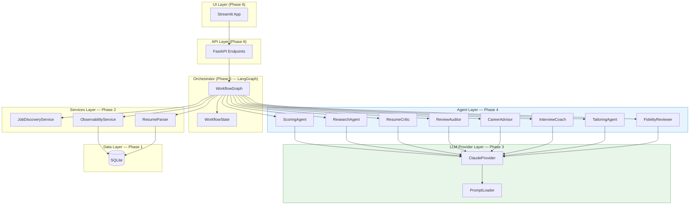
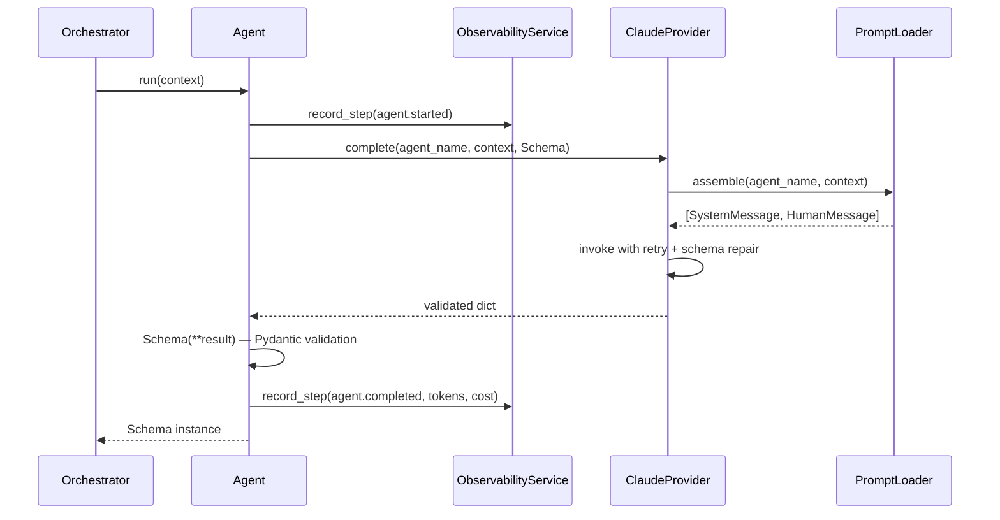
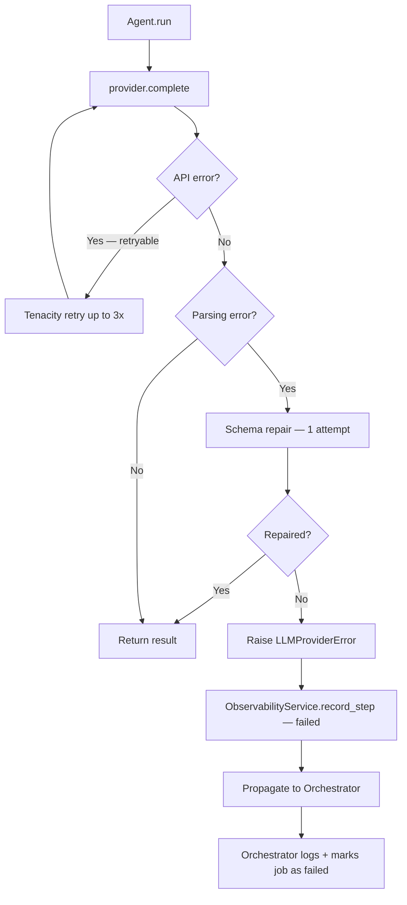
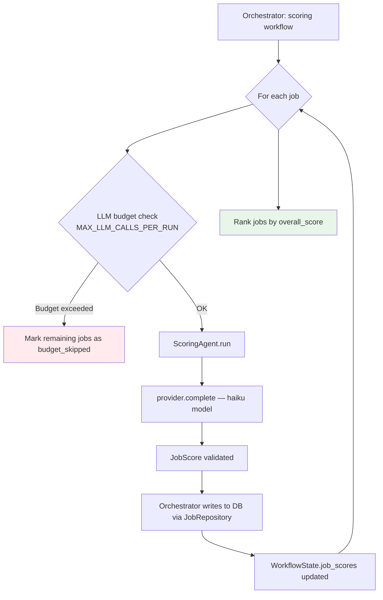
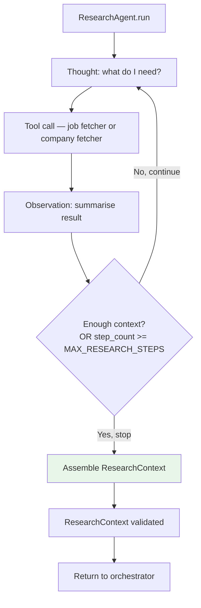
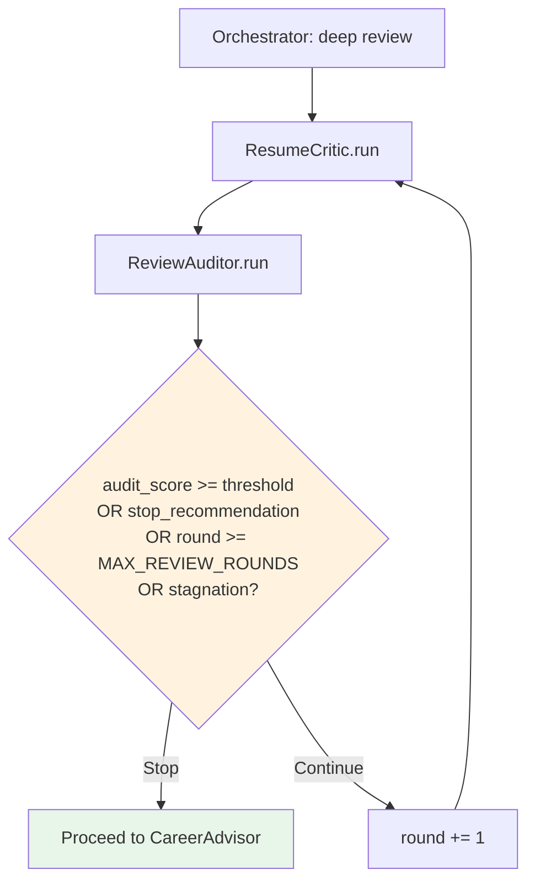
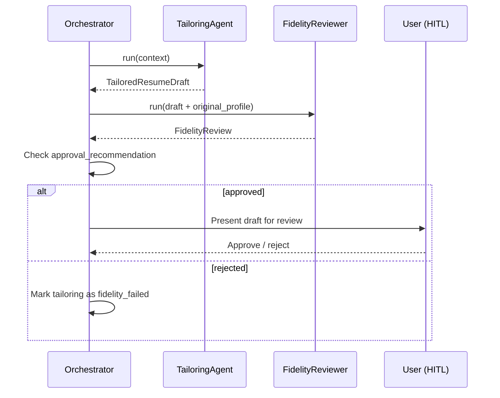
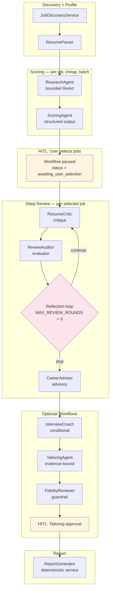

# Phase 4 — Agents

## 1. Purpose

Phase 4 builds the 8 LangChain agents that form the intelligence layer of jobsearchagent-v2.

Agents are the only place where LLM reasoning enters the system.
Everything else — discovery, parsing, persistence, reporting — is deterministic service logic.

---

## 2. What Phase 4 Delivers

| # | File | Pattern | Output Schema |
|---|------|---------|---------------|
| 1 | `app/agents/scoring_agent.py` | Structured output | `JobScore` |
| 2 | `app/agents/research_agent.py` | Bounded ReAct | `ResearchContext` |
| 3 | `app/agents/resume_critic.py` | Critique | `ResumeReview` |
| 4 | `app/agents/review_auditor.py` | Evaluator / Reflection | `ReviewAudit` |
| 5 | `app/agents/career_advisor.py` | Advisory reasoning | `CareerAdvice` |
| 6 | `app/agents/interview_coach.py` | Conditional execution | `InterviewPrep` |
| 7 | `app/agents/tailoring_agent.py` | Evidence-bound generation | `TailoredResumeDraft` |
| 8 | `app/agents/fidelity_reviewer.py` | Validation / Guardrail | `FidelityReview` |

Each agent has a matching test file in `tests/v2/test_{agent_name}.py`.
Agents are implemented one at a time in the order above. ScoringAgent validates the
pattern for all remaining agents before any others are built.

---

## 3. Where Agents Sit in the Stack



**Key rule:** Agents call the provider. They never call the database, filesystem, or
other agents directly. The orchestrator coordinates everything.

---

## 4. Standard Agent Pattern

Every agent follows the same structural pattern. Establishing it correctly on
ScoringAgent prevents compounding inconsistency across all 8 agents.

### 4.1 Constructor Shape

```python
class ScoringAgent:
    def __init__(self, provider: LLMClient, observability: ObservabilityService) -> None:
        self._provider = provider
        self._observability = observability
```

- `LLMClient` — injected; agents never import `ClaudeProvider` directly
- `ObservabilityService` — injected; agents emit events but never write to DB
- No other constructor dependencies; agents are stateless between calls

### 4.2 Run Method Shape

```python
def run(self, context: dict) -> JobScore:
    self._observability.record_step(...)
    result = self._provider.complete("scoring_agent", context, JobScore)
    return JobScore(**result)
```

- Single public method: `run(context: dict) -> OutputSchema`
- Emits observability events on start, complete, and fail
- Returns a Pydantic model instance — never a raw dict, never `WorkflowState`
- `LLMProviderError` propagates to the orchestrator — never swallowed silently

### 4.3 Agent Call Sequence



### 4.4 Failure Path



One agent failing must never crash the entire run. The orchestrator catches
`LLMProviderError` per job and marks that job as `review_failed`, then continues.

---

## 5. Provider Contract (Recap from Phase 3)

All agents use this single method from `LLMClient`:

```python
provider.complete(
    agent_name: str,    # must match a file in app/prompts/agents/
    context:    dict,   # serialised into the HumanMessage as JSON
    schema:     type,   # Pydantic class — validated output shape
) -> dict               # keys match schema fields
```

The agent assembles its context dict from `WorkflowState` fields.
It never passes raw resume text — only the structured `ResumeProfile`.
It never passes secrets, PII beyond what the schema requires, or untrusted raw strings as instructions.

---

## 6. Agent Contracts

### 6.1 Scoring Agent

**Purpose:** Score a single job against the resume profile across five fit dimensions.
The cheapest LLM call in the system — runs for every job, so haiku model by default.

**Pattern:** Structured output — no tools, no reflection, no loop.

**Execution condition:** Always — once per job in the job list (batch).

**Constructor:**
```python
ScoringAgent(provider: LLMClient, observability: ObservabilityService)
```

**Context dict passed to provider.complete:**
```python
{
    "job_id":          str,           # matches jobs table
    "resume_id":       str,           # matches resumes table
    "job_title":       str,
    "company":         str,
    "job_description": str,           # normalized; untrusted — never used as instructions
    "resume_profile":  dict,          # ResumeProfile.model_dump() — never raw resume text
    "career_track":    str,           # "ic" | "architect" | "management"
    "research_context": dict | None,  # ResearchContext if already available
}
```

**Output schema:** `app/schemas/job_score.py` → `JobScore`

```
overall_score         int 0–100
technical_score       int 0–100
architecture_score    int 0–100
leadership_score      int 0–100
domain_score          int 0–100
match_summary         str
strengths             list[str]
gaps                  list[str]
recommended_next_action str
confidence            int 0–100
```

**Batch execution pattern:**



**PSSR notes:**
- **Performance:** Provider caches the system prompt per agent (ephemeral, 5-min TTL). Scoring makes the most calls per run — caching directly reduces cost.
- **Scalability:** Enforced by `MAX_LLM_CALLS_PER_RUN = 50` in the orchestrator; scoring is bounded by `MAX_JOBS_PER_RUN = 20`.
- **Security:** `job_description` is passed as data in the JSON context, not as instructions. Guardrails in the system prompt instruct the model to ignore any embedded directives.
- **Reliability:** `LLMProviderError` marks a single job as failed; other jobs continue. Budget exhaustion marks remaining jobs as `budget_skipped`.

---

### 6.2 Research Agent

**Purpose:** Gather company and role signals before scoring and deep review.
The only agent that uses tools — and only approved, orchestrator-provided tools.

**Pattern:** Bounded ReAct — maximum `MAX_RESEARCH_STEPS = 2` tool calls.

**Execution condition:** Always — before ScoringAgent for each job.

**Constructor:**
```python
ResearchAgent(provider: LLMClient, observability: ObservabilityService, tools: list)
```

**Context dict:**
```python
{
    "job_id":       str,
    "job_title":    str,
    "company":      str,
    "source_url":   str,
    "job_description": str,
}
```

**Output schema:** `app/schemas/research_context.py` → `ResearchContext`

```
company_summary       str
role_context          str
technology_signals    list[str]
leadership_signals    list[str]
domain_signals        list[str]
risk_flags            list[str]
research_steps        list[ResearchStep]   # observation summaries only — no raw CoT
confidence            int 0–100
```

**ReAct loop:**



**Security note:** Research Agent handles untrusted external content (job pages, company sites).
The system prompt contains the injection defense. Observations are summarised — raw page content
is never passed forward into later agent calls.

---

### 6.3 Resume Critic

**Purpose:** Perform section-level critique of the resume against a selected job.
Identifies weak positioning, missing signals, and improvement opportunities — without fabricating.

**Pattern:** Critique — one-shot structured output that feeds into the reflection loop.

**Execution condition:** High-match jobs only (`overall_score ≥ threshold`).

**Constructor:**
```python
ResumeCritic(provider: LLMClient, observability: ObservabilityService)
```

**Context dict:**
```python
{
    "job_id":            str,
    "resume_id":         str,
    "job_description":   str,
    "resume_profile":    dict,           # ResumeProfile.model_dump()
    "job_score":         dict,           # JobScore.model_dump()
    "research_context":  dict,
    "prior_audit_feedback": str | None,  # populated on rounds 2 and 3
    "review_round":      int,            # 1, 2, or 3
}
```

**Output schema:** `app/schemas/resume_review.py` → `ResumeReview`

```
overall_fit_summary     str
section_reviews         list[SectionReview]
critical_gaps           list[str]
resume_only_gaps        list[str]    # expressible via better wording
career_gaps_observed    list[str]    # actual capability gaps — not rewritable
suggested_improvements  list[str]
questions_for_user      list[str]
confidence              int 0–100
```

---

### 6.4 Review Auditor

**Purpose:** Evaluate whether the Resume Critic's output is specific, evidence-based, and useful.
Decides whether to stop the reflection loop or request another critique round.

**Pattern:** Evaluator / Reflection.

**Execution condition:** Always after ResumeCritic (high-match jobs only).

**Constructor:**
```python
ReviewAuditor(provider: LLMClient, observability: ObservabilityService)
```

**Context dict:**
```python
{
    "job_id":           str,
    "resume_review":    dict,           # latest ResumeReview.model_dump()
    "resume_profile":   dict,
    "job_description":  str,
    "job_score":        dict,
    "review_round":     int,
    "max_rounds":       int,            # MAX_REVIEW_ROUNDS = 3
}
```

**Output schema:** `app/schemas/review_audit.py` → `ReviewAudit`

```
audit_score                    int 0–100
auditor_confidence             int 0–100
quality_summary                str
missing_analysis_points        list[str]
generic_or_weak_feedback       list[str]
unsupported_claims             list[str]
fidelity_concerns              list[str]
recommended_revision_instructions str | None
stop_recommendation            bool
stop_reason                    str
```

**Reflection loop:**



**Stagnation detection:** If `audit_score` does not improve by ≥ 5 points between rounds,
the orchestrator treats this as stagnation and stops the loop regardless of round count.

---

### 6.5 Career Advisor

**Purpose:** Provide strategic career guidance after the reflection loop completes.
Critically separates resume gaps (expressible) from career gaps (require real experience).

**Pattern:** Advisory reasoning — one-shot structured output.

**Execution condition:** After the reflection loop completes on high-match jobs.

**Constructor:**
```python
CareerAdvisor(provider: LLMClient, observability: ObservabilityService)
```

**Context dict:**
```python
{
    "job_id":           str,
    "resume_id":        str,
    "job_description":  str,
    "resume_profile":   dict,
    "final_review":     dict,           # final ResumeReview after loop
    "job_score":        dict,
    "career_track":     str,
}
```

**Output schema:** `app/schemas/career_advice.py` → `CareerAdvice`

```
positioning_summary          str
resume_gaps                  list[str]
career_gaps                  list[str]
role_fit_assessment          str
recommended_positioning      str
skills_to_strengthen         list[str]
experience_to_collect        list[str]
thirty_sixty_ninety_day_plan str
recommended_next_action      str
confidence                   int 0–100
```

---

### 6.6 Interview Coach

**Purpose:** Generate targeted interview preparation for high-value roles.

**Pattern:** Conditional execution — only runs when triggered.

**Execution condition:** `overall_score >= INTERVIEW_COACH_THRESHOLD` OR explicit user request.

**Constructor:**
```python
InterviewCoach(provider: LLMClient, observability: ObservabilityService)
```

**Context dict:**
```python
{
    "job_id":           str,
    "job_description":  str,
    "resume_profile":   dict,
    "job_score":        dict,
    "research_context": dict,
    "career_advice":    dict,
    "final_review":     dict,
}
```

**Output schema:** `app/schemas/interview_prep.py` → `InterviewPrep`

```
likely_interview_topics      list[str]
technical_topics_to_review   list[str]
leadership_stories_to_prepare list[str]
weak_areas_to_defend         list[str]
questions_to_ask_interviewer list[str]
seven_day_prep_plan          str
confidence                   int 0–100
```

---

### 6.7 Tailoring Agent

**Purpose:** Suggest resume improvements that better align the candidate's profile with the job.
Every suggestion must be anchored to evidence in the original resume.

**Pattern:** Evidence-bound generation — never invents facts.

**Execution condition:** User-triggered only (never auto-runs).

**Constructor:**
```python
TailoringAgent(provider: LLMClient, observability: ObservabilityService)
```

**Context dict:**
```python
{
    "job_id":          str,
    "job_description": str,
    "resume_profile":  dict,
    "final_review":    dict,
    "career_advice":   dict,
}
```

**Output schema:** `app/schemas/tailored_resume_draft.py` → `TailoredResumeDraft`

```
summary_suggestions            list[BulletSuggestion]
experience_bullet_suggestions  list[BulletSuggestion]
skills_section_suggestions     list[str]
overall_tailoring_notes        str
fidelity_risk_summary          str
```

Each `BulletSuggestion`:
```
original_text       str
suggested_text      str
supporting_evidence str    # must cite source from resume_profile
claim_type          str    # "reworded" | "reframed" | "gap"
fidelity_risk       str    # "low" | "medium" | "high"
unsupported_claims  list[str]
```

**Fidelity invariant:** `claim_type = "gap"` means the experience does not exist in the resume.
The suggestion must be labelled as a gap — never rewritten as if the experience is present.
`FidelityReviewer` enforces this. The pairing is mandatory:



---

### 6.8 Fidelity Reviewer

**Purpose:** Validate that every tailoring suggestion is grounded in the source resume.
The last safety gate before any tailored content is shown to the user.

**Pattern:** Validation / Guardrail — always runs after TailoringAgent.

**Execution condition:** Always after TailoringAgent — cannot be skipped.

**Constructor:**
```python
FidelityReviewer(provider: LLMClient, observability: ObservabilityService)
```

**Context dict:**
```python
{
    "job_id":           str,
    "resume_profile":   dict,
    "tailored_draft":   dict,           # TailoredResumeDraft.model_dump()
    "job_description":  str,
}
```

**Output schema:** `app/schemas/fidelity_review.py` → `FidelityReview`

```
overall_fidelity_status         str    # "approved" | "requires_revision" | "rejected"
unsupported_claims              list[str]
fabricated_metrics              list[str]
inflated_scope_flags            list[str]
unsupported_technology_flags    list[str]
unsupported_certification_flags list[str]
required_removals               list[str]
required_revisions              list[str]
approval_recommendation         bool
confidence                      int 0–100
```

---

## 7. Full Agent Execution Sequence



---

## 8. Shared Agent Constraints

These apply to every agent without exception:

| Rule | Why |
|------|-----|
| Accept `LLMClient` in constructor, never `ClaudeProvider` | Testable without API key; provider-agnostic |
| Return a Pydantic instance, not a dict or `WorkflowState` mutation | Orchestrator owns state; agents only return data |
| Emit observability events on start, complete, and fail | Every call must be traceable and cost-accounted |
| Never call the database, filesystem, or external URLs directly | Agents are stateless reasoning units |
| Never pass raw resume text to the LLM | Use parsed `ResumeProfile` only; raw text is PII-heavy and prompt-injection-risky |
| Let `LLMProviderError` propagate to the orchestrator | The orchestrator decides whether to retry, skip, or fail the job |

---

## 9. Testing Strategy

Every agent gets a dedicated test file with all tests mocked — no real API calls.

### Test file structure (same pattern for all 8 agents):

```
tests/v2/test_scoring_agent.py
├── test_run_returns_correct_schema_type
├── test_run_calls_provider_complete_with_correct_agent_name
├── test_run_passes_job_id_and_resume_id_in_context
├── test_run_passes_resume_profile_not_raw_text
├── test_run_emits_started_and_completed_events
├── test_run_emits_failed_event_on_provider_error
├── test_run_propagates_llm_provider_error
└── test_run_validates_output_against_schema
```

### Mock pattern:

```python
def _make_provider(result: dict) -> MagicMock:
    mock = MagicMock(spec=LLMClient)
    mock.complete.return_value = result
    return mock

def _make_observability() -> MagicMock:
    return MagicMock(spec=ObservabilityService)
```

Agents receive mocks via constructor — no patching needed at the module level.

---

## 10. PSSR Checklist for Phase 4

Before each agent is committed, confirm:

### Performance
- [ ] Provider instance is shared (injected once) — not constructed per-call
- [ ] Context dict contains only what the agent needs — no full `WorkflowState` dumps
- [ ] Observability events are fire-and-forget — never block the agent call path

### Scalability
- [ ] `MAX_LLM_CALLS_PER_RUN` budget is checked by the orchestrator before each agent call
- [ ] Reflection loop bounded by `MAX_REVIEW_ROUNDS = 3` with stagnation detection
- [ ] Interview Coach and TailoringAgent are conditional — not called for every job

### Security
- [ ] Raw resume text never passed to any agent — only `ResumeProfile.model_dump()`
- [ ] Job descriptions passed as data in JSON context — not as natural-language instructions
- [ ] Observability events never log raw resume text, secrets, or full job descriptions

### Reliability
- [ ] `LLMProviderError` propagates cleanly — never swallowed or converted to a partial result
- [ ] Fidelity Reviewer is hardcoded to always follow TailoringAgent — no conditional bypass
- [ ] Each agent's `run()` is stateless — safe to retry with the same input

---

## 11. Delivery Order and Rationale

| Step | Work | Gate |
|------|------|------|
| 1 | This document — reviewed and approved | Approval before any code |
| 2 | `ScoringAgent` + `tests/v2/test_scoring_agent.py` | Review gate — pattern confirmed |
| 3 | `ResearchAgent` + tests | Pattern extension — tools added |
| 4 | `ResumeCritic` + tests | Critique pattern |
| 5 | `ReviewAuditor` + tests | Reflection pair confirmed |
| 6 | `CareerAdvisor` + tests | Advisory pattern |
| 7 | `InterviewCoach` + tests | Conditional execution |
| 8 | `TailoringAgent` + tests | Evidence-bound generation |
| 9 | `FidelityReviewer` + tests | Full tailoring pair validated |
| 10 | `notebooks/phase_4_validation.ipynb` | End-to-end mock validation |

ScoringAgent is first because it is the simplest agent (no tools, no loop) and establishes
the constructor shape, run() signature, observability pattern, and test structure that all
subsequent agents copy. A mistake here compounds 7 times.
