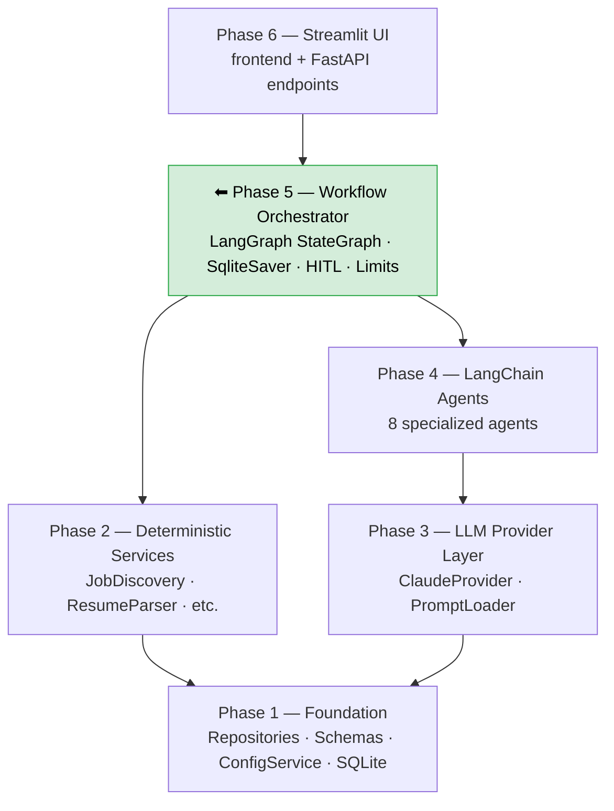
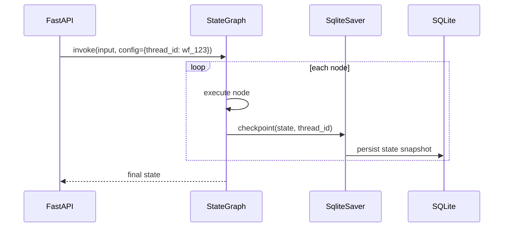
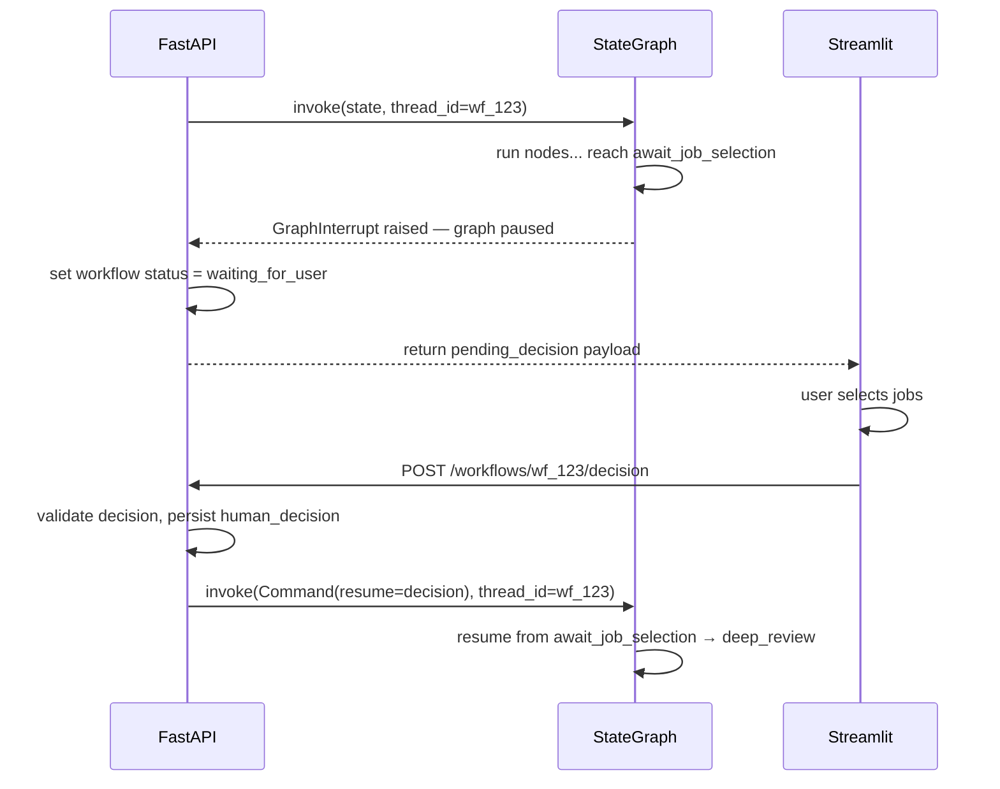
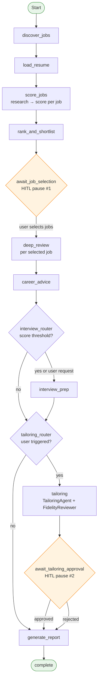
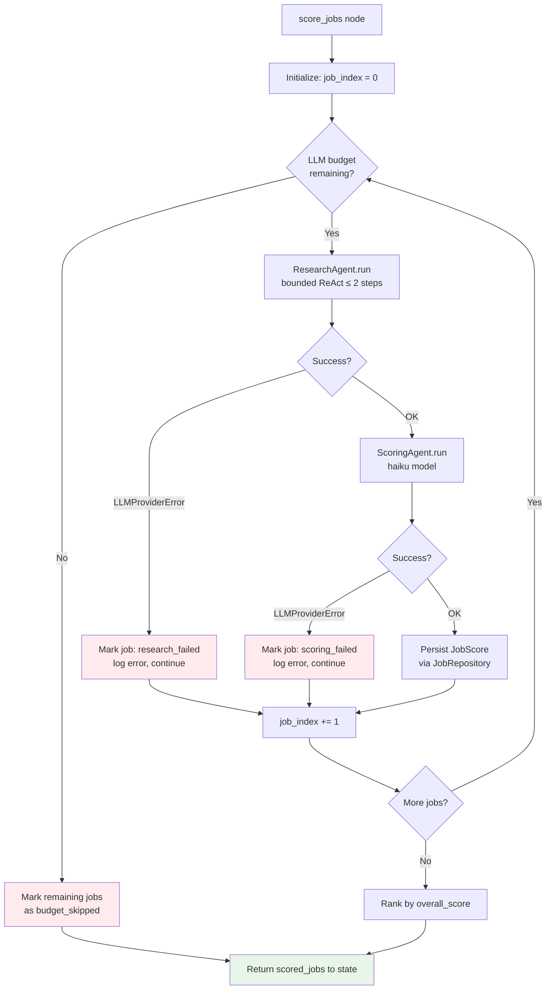
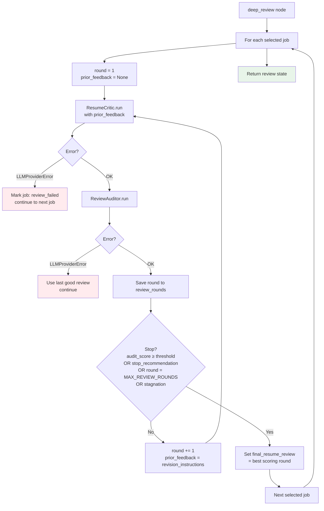
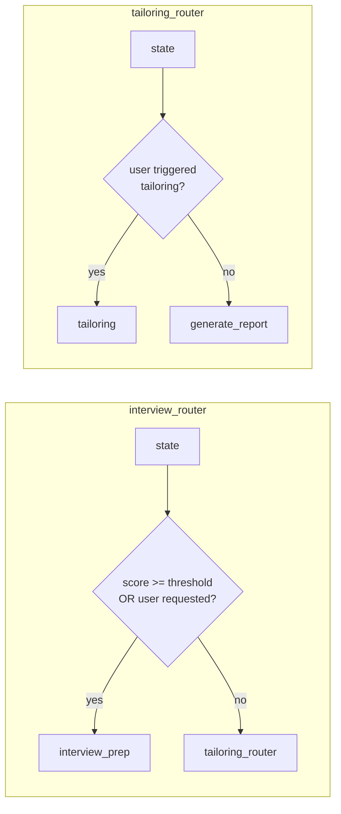
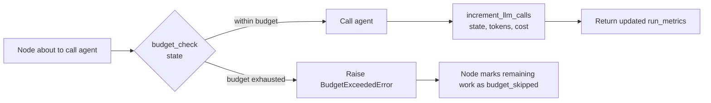
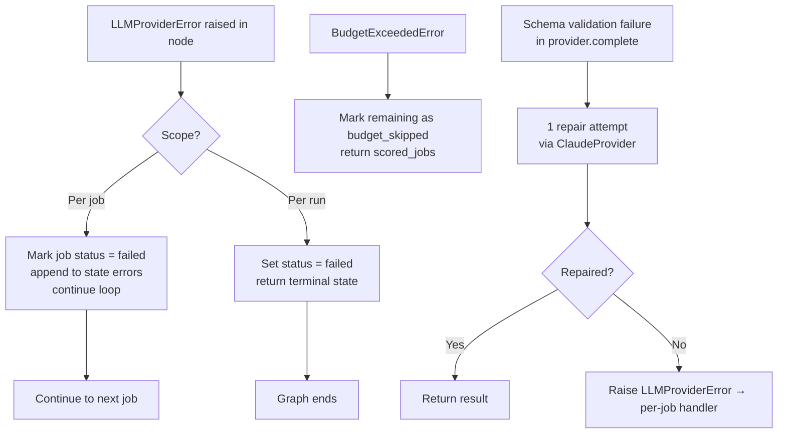
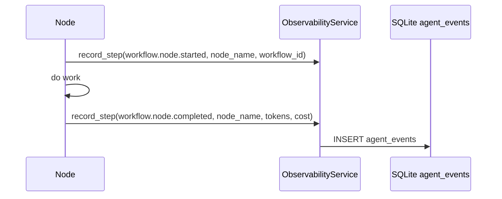

# Phase 5 — Workflow Orchestrator

**Status:** draft — awaiting review  
**Depends on:** Phase 4 (Agents), Phase 3 (LLM Provider), Phase 2 (Services), Phase 1 (Repositories)  
**Unlocks:** Phase 6 (FastAPI + Streamlit UI)

---

## 1. Goal

Wire all 8 Phase 4 agents into a LangGraph `StateGraph` that implements the complete
execution blueprint from `docs/architecture/workflow_model.md`.

After Phase 5:
- A single call to the orchestrator runs the full job search workflow end-to-end
- State is checkpointed after every node — the workflow can be paused and resumed
- HITL pause points let the user make decisions without interrupting execution context
- Execution limits are enforced in the graph — no agent can exceed budget
- The reflection loop runs, detects stagnation, and exits cleanly
- Errors in one job never crash the run for other jobs

---

## 2. Where Phase 5 Fits in the Stack



**Key rule:** The orchestrator is the only component that reads and writes `WorkflowState`.
Agents return typed Pydantic outputs. The orchestrator merges those outputs into state and
decides what runs next.

---

## 3. Understanding LangGraph

LangGraph is the **orchestration framework** for this project. It builds stateful, cyclical
graphs over a shared state object. Understanding its core model prevents surprises during
implementation.

### 3.1 What LangGraph Provides

| Concept | What it does | Used in Phase 5 |
|---|---|---|
| **`StateGraph`** | Defines nodes, edges, and routing over a typed state | The top-level workflow definition |
| **Node** | A Python function `(state) → state_update_dict` | One per workflow step |
| **Edge** | Unconditional transition from node A to node B | Sequential steps |
| **Conditional edge** | Routes to different nodes based on a router function | Reflection loop, scoring loop, interview trigger |
| **`SqliteSaver`** | Persists graph state after every node to SQLite | HITL pause/resume, crash recovery |
| **Thread ID** | Identifies one workflow run across checkpoints | Maps to `workflow_id` |
| **`interrupt_before`** | Pauses the graph before a named node; resumes on next `invoke` | HITL checkpoints |
| **`CompiledGraph`** | The runnable graph produced by `graph.compile(checkpointer=...)` | Invoked by the API layer |

### 3.2 LangGraph Node Contract

Every node is a plain Python function:

```python
def score_jobs(state: WorkflowState) -> dict:
    # read from state
    # call agent or service
    # return ONLY the fields being updated
    return {"scored_jobs": [...], "run_metrics": {...}}
```

Nodes return a **partial state update** — a dict containing only the fields they modify.
LangGraph merges this into the existing state. Nodes never return the full state object.

### 3.3 How Checkpointing Works



If the graph is interrupted (HITL pause or crash), the last checkpoint is loaded and
execution resumes from the exact node that was next. The thread ID is the resume key.

### 3.4 How HITL Interrupts Work



The graph is compiled with `interrupt_before=["await_job_selection", "await_tailoring_approval"]`.
When LangGraph reaches one of those nodes it raises `GraphInterrupt`. The API catches it,
stores the pending decision in state, and waits. On resume, the decision is injected via
`Command(resume=...)` and the graph continues from where it stopped.

---

## 4. Phase 5 Deliverables

| # | File | Purpose |
|---|------|---------|
| 1 | `app/workflows/workflow_graph.py` | StateGraph definition + `compile()` |
| 2 | `app/workflows/nodes/discover_jobs.py` | Discovery + normalization node |
| 3 | `app/workflows/nodes/load_resume.py` | Resume parsing + profile load node |
| 4 | `app/workflows/nodes/score_jobs.py` | Scoring loop node (research → score per job) |
| 5 | `app/workflows/nodes/await_job_selection.py` | HITL pause node #1 |
| 6 | `app/workflows/nodes/deep_review.py` | Reflection loop node (critic → auditor → repeat) |
| 7 | `app/workflows/nodes/career_advice.py` | CareerAdvisor node |
| 8 | `app/workflows/nodes/interview_prep.py` | InterviewCoach node (conditional) |
| 9 | `app/workflows/nodes/tailoring.py` | TailoringAgent + FidelityReviewer node |
| 10 | `app/workflows/nodes/await_tailoring_approval.py` | HITL pause node #2 |
| 11 | `app/workflows/nodes/generate_report.py` | ReportGenerator node |
| 12 | `app/workflows/routers.py` | All conditional edge functions |
| 13 | `app/workflows/checkpointer.py` | SqliteSaver factory |
| 14 | `app/workflows/limits.py` | Execution limit enforcement helpers |
| 15 | `tests/v2/test_workflow_nodes.py` | Node-level tests (mocked agents) |
| 16 | `tests/v2/test_workflow_graph.py` | End-to-end graph tests (mocked agents) |
| 17 | `notebooks/phase_5_validation.ipynb` | End-to-end mock run validation |

---

## 5. Complete Workflow Graph

### 5.1 Full Execution Flow



### 5.2 Scoring Loop (inside `score_jobs` node)

The scoring node processes all jobs in a sequential loop. The loop is internal to the node
— it does not use separate LangGraph nodes per job (which would require dynamic graph
construction). Budget enforcement happens before each agent call.



### 5.3 Reflection Loop (inside `deep_review` node)

The reflection loop is also internal to the `deep_review` node. Each selected job runs its
own loop. Stagnation is detected by comparing consecutive `audit_score` values.



**Stagnation rule:** If `audit_score[round N] - audit_score[round N-1] < 5`, the loop exits
regardless of round count. This prevents wasted LLM calls on a loop that has plateaued.

---

## 6. Node Contracts

Each node is a function `(state: WorkflowState) -> dict`. The contract specifies what it
reads from state and what partial update it returns.

### 6.1 `discover_jobs`

| | |
|---|---|
| **Reads** | `search_criteria`, `effective_config` |
| **Calls** | `JobDiscoveryService.discover()` |
| **Returns** | `{"raw_jobs": [...], "normalized_jobs": [...], "current_step": "job_discovery"}` |
| **On error** | Appends to `errors`, continues (empty job list is recoverable) |

---

### 6.2 `load_resume`

| | |
|---|---|
| **Reads** | `resume_id` (if existing), or uploaded resume bytes |
| **Calls** | `ResumeParser.parse()` |
| **Returns** | `{"resume_id": str, "resume_profile": dict, "resume_version": int, "current_step": "resume_profile_loading"}` |
| **On error** | Raises — workflow cannot proceed without a resume profile |

---

### 6.3 `score_jobs`

| | |
|---|---|
| **Reads** | `normalized_jobs`, `resume_profile`, `effective_config`, `run_metrics` |
| **Calls** | `ResearchAgent.run()` then `ScoringAgent.run()` per job |
| **Returns** | `{"scored_jobs": [...], "run_metrics": {...}, "current_step": "scoring"}` |
| **On error** | Per-job: marks job as failed, continues. Budget exceeded: marks remaining as `budget_skipped`. |

---

### 6.4 `rank_and_shortlist`

| | |
|---|---|
| **Reads** | `scored_jobs` |
| **Calls** | Deterministic sort — no agents |
| **Returns** | `{"scored_jobs": [ranked], "current_step": "awaiting_job_selection"}` |
| **On error** | Cannot fail (pure sort) |

---

### 6.5 `await_job_selection` *(HITL pause #1)*

| | |
|---|---|
| **Reads** | `scored_jobs` |
| **Action** | Sets `pending_decision`, raises `GraphInterrupt` — graph pauses here |
| **Resumes when** | API injects `Command(resume={"selected_job_ids": [...]})` |
| **Returns** | `{"selected_jobs": [...], "pending_decision": None, "current_step": "deep_review_in_progress"}` |

```python
# Pause pattern
def await_job_selection(state: WorkflowState) -> dict:
    decision = interrupt({
        "decision_type": "select_jobs_for_deep_review",
        "message": "Select jobs to move into deep review.",
        "options": state["scored_jobs"],
    })
    selected = [j for j in state["scored_jobs"] if j["job_id"] in decision["selected_job_ids"]]
    return {"selected_jobs": selected, "pending_decision": None}
```

---

### 6.6 `deep_review`

| | |
|---|---|
| **Reads** | `selected_jobs`, `resume_profile`, `run_metrics`, `effective_config` |
| **Calls** | `ResumeCritic.run()`, `ReviewAuditor.run()` per round per job |
| **Returns** | `{"review_rounds": [...], "final_resume_review": dict, "run_metrics": {...}, "current_step": "review_completed"}` |
| **On error** | Per-job: marks job as `review_failed`, uses last good review, continues |

---

### 6.7 `career_advice`

| | |
|---|---|
| **Reads** | `selected_jobs`, `resume_profile`, `final_resume_review`, `run_metrics` |
| **Calls** | `CareerAdvisor.run()` per selected job |
| **Returns** | `{"career_advice": dict, "run_metrics": {...}, "current_step": "career_advice"}` |
| **On error** | Marks job as `advice_failed`, continues |

---

### 6.8 `interview_prep` *(conditional)*

| | |
|---|---|
| **Reads** | `selected_jobs`, `resume_profile`, `career_advice`, `final_resume_review` |
| **Calls** | `InterviewCoach.run()` per job that meets threshold |
| **Returns** | `{"interview_prep": dict, "run_metrics": {...}, "current_step": "interview_prep"}` |
| **On error** | Marks job as `interview_prep_failed`, continues |

---

### 6.9 `tailoring`

| | |
|---|---|
| **Reads** | `selected_jobs`, `resume_profile`, `career_advice`, `final_resume_review` |
| **Calls** | `TailoringAgent.run()` then `FidelityReviewer.run()` — always paired |
| **Returns** | `{"tailored_resume": dict, "fidelity_review": dict, "current_step": "awaiting_user_approval"}` |
| **On error** | `fidelity_review.overall_fidelity_status = "rejected"` — surfaces to HITL |

---

### 6.10 `await_tailoring_approval` *(HITL pause #2)*

| | |
|---|---|
| **Reads** | `tailored_resume`, `fidelity_review` |
| **Action** | Sets `pending_decision`, raises `GraphInterrupt` |
| **Resumes when** | API injects `Command(resume={"decision_value": "approved" | "rejected"})` |
| **Returns** | `{"pending_decision": None, "current_step": "report_generation"}` |

---

### 6.11 `generate_report`

| | |
|---|---|
| **Reads** | All agent outputs from state |
| **Calls** | `ReportGenerator.generate()` (deterministic service) |
| **Returns** | `{"report": dict, "status": "completed", "current_step": "completed"}` |
| **On error** | Appends to `errors`, marks status as `completed_with_errors` |

---

## 7. Conditional Routers

Routers are plain functions called by LangGraph conditional edges. Each returns the name
of the next node.



```python
# app/workflows/routers.py

def interview_router(state: WorkflowState) -> str:
    threshold = state["effective_config"]["scoring"]["interview_coach_threshold"]
    top_score = max(j["overall_score"] for j in state["selected_jobs"])
    if top_score >= threshold or state.get("user_requested_interview_prep"):
        return "interview_prep"
    return "tailoring_check"

def tailoring_router(state: WorkflowState) -> str:
    if state.get("user_requested_tailoring"):
        return "tailoring"
    return "generate_report"
```

---

## 8. StateGraph Definition

```python
# app/workflows/workflow_graph.py

from langgraph.graph import StateGraph, END
from langgraph.checkpoint.sqlite import SqliteSaver
from app.state.workflow_state import WorkflowState
from app.workflows.nodes import (
    discover_jobs, load_resume, score_jobs, rank_and_shortlist,
    await_job_selection, deep_review, career_advice,
    interview_prep, tailoring, await_tailoring_approval, generate_report
)
from app.workflows.routers import interview_router, tailoring_router

def build_graph(checkpointer: SqliteSaver) -> CompiledGraph:
    graph = StateGraph(WorkflowState)

    graph.add_node("discover_jobs",             discover_jobs)
    graph.add_node("load_resume",               load_resume)
    graph.add_node("score_jobs",                score_jobs)
    graph.add_node("rank_and_shortlist",        rank_and_shortlist)
    graph.add_node("await_job_selection",       await_job_selection)
    graph.add_node("deep_review",               deep_review)
    graph.add_node("career_advice",             career_advice)
    graph.add_node("interview_prep",            interview_prep)
    graph.add_node("tailoring",                 tailoring)
    graph.add_node("await_tailoring_approval",  await_tailoring_approval)
    graph.add_node("generate_report",           generate_report)

    graph.set_entry_point("discover_jobs")

    graph.add_edge("discover_jobs",            "load_resume")
    graph.add_edge("load_resume",              "score_jobs")
    graph.add_edge("score_jobs",               "rank_and_shortlist")
    graph.add_edge("rank_and_shortlist",       "await_job_selection")
    graph.add_edge("await_job_selection",      "deep_review")
    graph.add_edge("deep_review",              "career_advice")
    graph.add_edge("interview_prep",           "tailoring_check")
    graph.add_edge("tailoring",                "await_tailoring_approval")
    graph.add_edge("await_tailoring_approval", "generate_report")
    graph.add_edge("generate_report",          END)

    graph.add_conditional_edges("career_advice",    interview_router,
        {"interview_prep": "interview_prep", "tailoring_check": "tailoring_check"})
    graph.add_conditional_edges("tailoring_check",  tailoring_router,
        {"tailoring": "tailoring", "generate_report": "generate_report"})

    return graph.compile(
        checkpointer=checkpointer,
        interrupt_before=["await_job_selection", "await_tailoring_approval"],
    )
```

---

## 9. Checkpointer

```python
# app/workflows/checkpointer.py

from langgraph.checkpoint.sqlite import SqliteSaver
from app.services.config_service import ConfigService

def make_checkpointer(config: ConfigService) -> SqliteSaver:
    db_path = config.get("database.path", "data/jobsearch.db")
    return SqliteSaver.from_conn_string(db_path)
```

The checkpointer uses the same SQLite database as the rest of the application.
LangGraph creates its own `checkpoints` table automatically — it does not collide with
the application's 18 tables.

---

## 10. Execution Limits

Limits are enforced inside nodes before each agent call. The `limits.py` module provides
two helpers used by `score_jobs` and `deep_review`.



```python
# app/workflows/limits.py

MAX_JOBS_PER_RUN       = 20
MAX_SELECTED_JOBS      = 3
MAX_RESEARCH_STEPS     = 2
MAX_REVIEW_ROUNDS      = 3
MAX_LLM_CALLS_PER_JOB = 10
MAX_LLM_CALLS_PER_RUN = 50

def budget_check(state: WorkflowState) -> None:
    if state["run_metrics"]["llm_calls"] >= MAX_LLM_CALLS_PER_RUN:
        raise BudgetExceededError("LLM call budget exhausted for this run")

def increment_llm_calls(metrics: dict, tokens_in: int, tokens_out: int, cost: float) -> dict:
    return {
        "llm_calls":      metrics["llm_calls"] + 1,
        "tokens_input":   metrics["tokens_input"] + tokens_in,
        "tokens_output":  metrics["tokens_output"] + tokens_out,
        "estimated_cost": metrics["estimated_cost"] + cost,
    }
```

---

## 11. Error Handling Strategy



**Rule:** One bad job never kills the run. One bad run never corrupts other runs.
The `thread_id` (= `workflow_id`) isolates all checkpointed state per run.

---

## 12. Observability Integration

Every node emits observability events via `ObservabilityService`. The service is injected
into nodes the same way it is injected into agents — via constructor of a `NodeContext`
object built once and shared across all nodes in a run.



State transitions are also logged:

```python
OB.record_step("workflow.state.transition",
    from_step=state["current_step"],
    to_step="scoring",
    workflow_id=state["workflow_id"])
```

---

## 13. PSSR Checklist for Phase 5

### Performance
- [ ] Agents are constructed once per run and injected — not re-instantiated per node call
- [ ] `SqliteSaver` uses the same open DB connection — not a new connection per checkpoint
- [ ] Observability events are fire-and-forget — never block the node execution path
- [ ] `WorkflowState` updates return only changed fields (partial dict) — not full state dumps

### Scalability
- [ ] `MAX_LLM_CALLS_PER_RUN = 50` checked via `budget_check()` before every agent call
- [ ] `MAX_JOBS_PER_RUN = 20` enforced before job discovery returns results
- [ ] `MAX_SELECTED_JOBS = 3` enforced in `await_job_selection` before resuming
- [ ] `MAX_REVIEW_ROUNDS = 3` + stagnation detection exits the reflection loop cleanly
- [ ] Scoring loop is sequential now; state shape supports parallel execution later without refactor

### Security
- [ ] `resume_profile` passed as `ResumeProfile.model_dump()` — never raw resume text
- [ ] Job descriptions injected into agent context as data keys — never as free-text instructions
- [ ] HITL decision payloads validated (job IDs exist, workflow in correct status) before resuming
- [ ] Checkpointed state never includes secrets, API keys, or raw PII beyond what the schema allows
- [ ] `thread_id` is a `workflow_id` controlled by the backend — never user-supplied directly

### Reliability
- [ ] `LLMProviderError` caught per job — never allowed to abort the run
- [ ] `BudgetExceededError` exits the loop cleanly — remaining jobs marked, not silently dropped
- [ ] Reflection loop stagnation detection prevents infinite loops even if `MAX_REVIEW_ROUNDS` is never hit
- [ ] `SqliteSaver` ensures any crash can resume from the last committed checkpoint
- [ ] Fidelity Reviewer is hardcoded after TailoringAgent — no conditional bypass path exists in the graph

---

## 14. Testing Strategy

All node tests mock agents and services — no real LLM calls.

### Node tests (`tests/v2/test_workflow_nodes.py`)

Each node is tested in isolation by constructing the minimal state it needs and asserting on the returned partial dict.

```python
def test_score_jobs_marks_failed_job_on_provider_error():
    state = _make_state(normalized_jobs=[_make_job("j1")])
    scoring_agent = _mock_agent_raises(LLMProviderError("API error"))
    result = score_jobs(state, agents=NodeAgents(scoring=scoring_agent, ...))
    assert result["scored_jobs"][0]["status"] == "scoring_failed"
    assert len(result["scored_jobs"]) == 1  # run continues
```

### Graph tests (`tests/v2/test_workflow_graph.py`)

End-to-end graph tests run the full `CompiledGraph` with all agents mocked. Two key cases:

| Test | What it validates |
|------|-------------------|
| `test_full_run_happy_path` | All nodes execute in order; state fields populated; final status = completed |
| `test_hitl_pause_and_resume` | Graph pauses at `await_job_selection`; resumes correctly with injected decision |
| `test_budget_exhaustion_stops_scoring` | Remaining jobs marked `budget_skipped` when limit hit |
| `test_stagnation_exits_reflection_loop` | Loop stops at round 2 when audit_score improvement < 5 |
| `test_per_job_failure_does_not_abort_run` | One job raises `LLMProviderError`; other jobs complete |
| `test_fidelity_rejection_surfaces_to_hitl` | Rejected fidelity review reaches HITL with correct payload |

---

## 15. Delivery Order

| Step | Work | Gate |
|------|------|------|
| 1 | This document — reviewed and approved | Approval before any code |
| 2 | `app/workflows/limits.py` + `checkpointer.py` | Foundational helpers first |
| 3 | `app/workflows/routers.py` | Conditional edge functions |
| 4 | All node files in `app/workflows/nodes/` | One node at a time, simplest first |
| 5 | `app/workflows/workflow_graph.py` | Wire everything together |
| 6 | `tests/v2/test_workflow_nodes.py` | Node-level coverage |
| 7 | `tests/v2/test_workflow_graph.py` | Graph-level coverage including HITL |
| 8 | `notebooks/phase_5_validation.ipynb` | End-to-end mock run |

Node implementation order: `discover_jobs` → `load_resume` → `score_jobs` → `rank_and_shortlist` → `await_job_selection` → `deep_review` → `career_advice` → `interview_prep` → `tailoring` → `await_tailoring_approval` → `generate_report`.

Start with `discover_jobs` — it has no agent calls, establishes the node function
signature, partial state update pattern, and error appending convention that all other
nodes copy.
