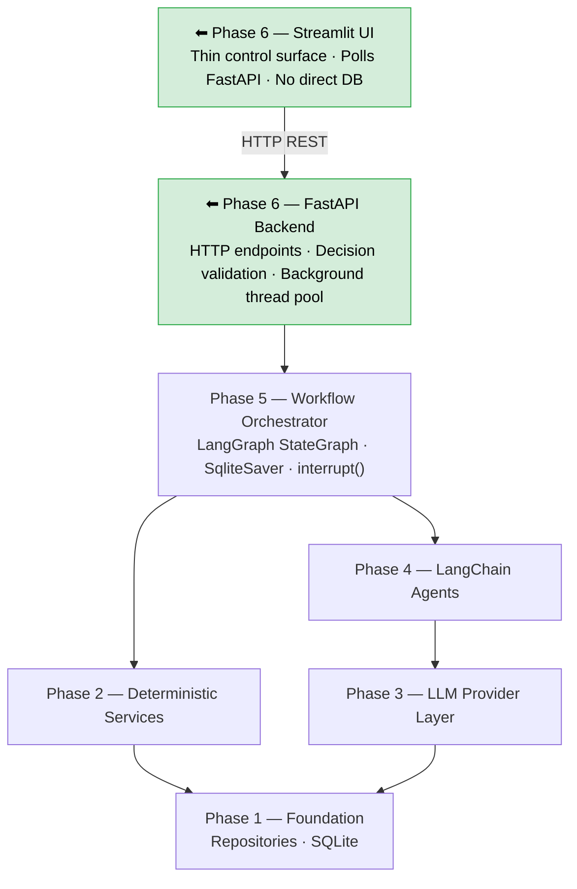
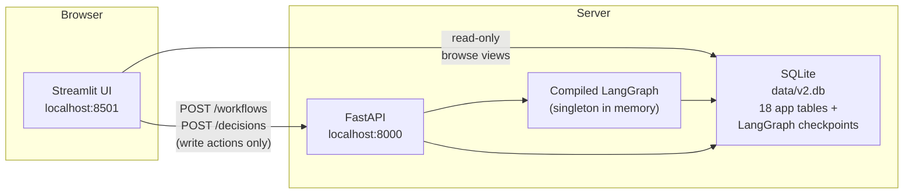
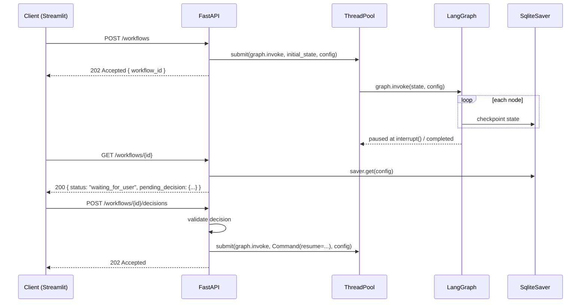
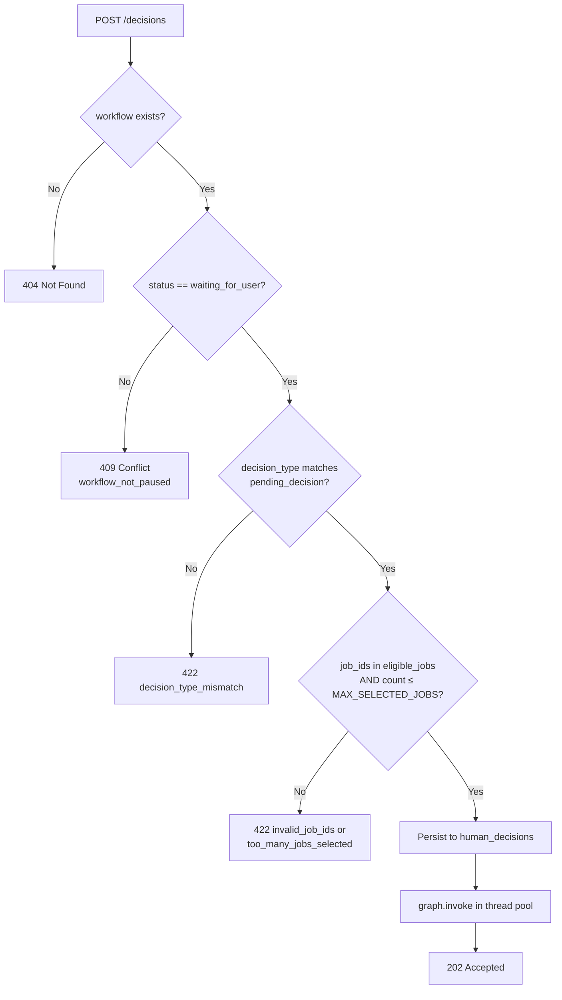
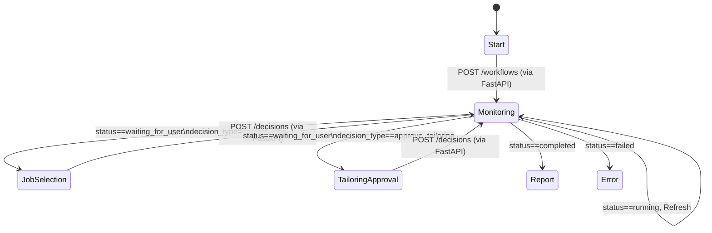
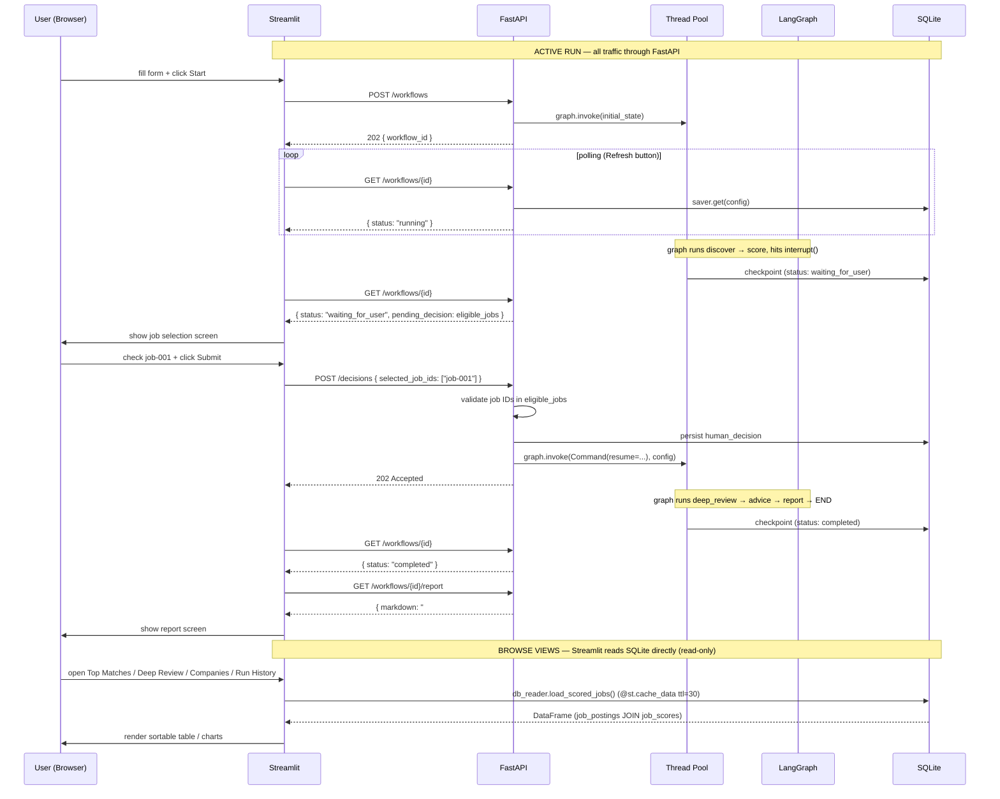

# Phase 6 — FastAPI Backend + Streamlit UI

**Status:** draft — awaiting review  
**Depends on:** Phase 5 (Workflow Orchestrator), all prior phases  
**Unlocks:** Phase 7 (Live integrations — real scraping, real LLM calls)

---

## 1. Goal

Expose the Phase 5 compiled LangGraph workflow via HTTP and provide a thin
Streamlit control surface so a user can start a run, make HITL decisions, and
read the final report — without touching Python.

After Phase 6:
- `POST /workflows` starts a workflow run in the background and returns a `workflow_id`
- The Streamlit UI polls status, displays scored jobs, and submits HITL decisions
- The backend validates every decision before resuming the graph
- A user can complete the full `discover → score → select → review → advise → tailor → report` flow through the UI
- No LLM or scraper calls yet — discovery and agents remain mocked (Phase 7 wires in real providers)

---

## 2. Where Phase 6 Fits in the Stack



**Data access split (Option A):**
- **Write actions** (start workflow, submit HITL decisions) → FastAPI only
- **Browse views** (scored jobs table, companies chart, run history, deep review results) → read `data/v2.db` directly, same pattern as the v1 `dashboard.py`

This avoids adding read endpoints for every view while keeping the HITL control
path clean and validated through the backend.

---

## 3. Two-Component Architecture

| Component | Framework | Role |
|---|---|---|
| **FastAPI backend** | FastAPI + Uvicorn | Builds and owns the compiled graph; runs nodes in a background thread pool; validates HITL decisions; exposes REST endpoints |
| **Streamlit UI** | Streamlit | Extended from v1 `dashboard.py`; browse views read `data/v2.db` directly; HITL control actions call FastAPI |



---

## 4. FastAPI — File Structure

```
app/
  api/
    main.py              ← FastAPI app, CORS, lifespan startup/shutdown
    dependencies.py      ← build_graph_deps(), get_graph(), get_db()
    routers/
      workflows.py       ← POST /workflows, GET /workflows/{id}, POST /workflows/{id}/decisions
      jobs.py            ← GET /workflows/{id}/jobs, GET /workflows/{id}/jobs/{job_id}
      reports.py         ← GET /workflows/{id}/report
    schemas/
      requests.py        ← StartWorkflowRequest, DecisionRequest Pydantic models
      responses.py       ← WorkflowStatusResponse, JobSummaryResponse, ReportResponse
```

---

## 5. FastAPI — App Lifespan and Dependency Injection

The compiled graph is **built once at startup** and shared across all requests.
Building it on every request would be expensive and would create multiple
checkpointer connections to the same SQLite file.

```python
# app/api/main.py
from contextlib import asynccontextmanager
from fastapi import FastAPI
from app.api.dependencies import build_and_cache_graph

@asynccontextmanager
async def lifespan(app: FastAPI):
    build_and_cache_graph()   # compile graph + open SqliteSaver connection
    yield
    # cleanup on shutdown (close DB connection)

app = FastAPI(title="Job Search Agent v2", lifespan=lifespan)
```

```python
# app/api/dependencies.py
_graph = None   # module-level singleton

def build_and_cache_graph():
    global _graph
    from app.workflows.workflow_graph import build_graph, WorkflowDependencies
    from app.workflows.checkpointer import make_checkpointer
    # ... assemble WorkflowDependencies with mocked agents (Phase 6)
    #     or real agents (Phase 7) depending on config
    _graph = build_graph(deps)

def get_graph():
    """FastAPI dependency — inject into route handlers."""
    return _graph
```

**Why singleton:** LangGraph's `SqliteSaver` holds an open SQLite connection.
Rebuilding it per request would exhaust connections and lose the `PRAGMA` state
needed for thread-safe writes.

---

## 6. FastAPI — Background Execution Model

`graph.invoke()` is synchronous and potentially long-running (multiple LLM calls).
Running it directly in a FastAPI route would block the event loop. Instead, each
graph invocation runs in a **thread pool executor**.



**Key behaviour:** Each `graph.invoke()` call runs until it either hits an
`interrupt()` or reaches `END`. The thread pool task is fire-and-forget —
the client polls `GET /workflows/{id}` to detect state changes.

---

## 7. FastAPI — API Endpoint Contracts

### 7.1 POST /workflows — Start a new workflow run

**Request body** (`StartWorkflowRequest`):
```json
{
  "resume_id": "res-001",
  "search_criteria": {
    "roles": ["Staff Engineer"],
    "locations": ["Remote"],
    "keywords": ["Python", "distributed systems"]
  },
  "workflow_type": "full_career_review",
  "effective_config": {
    "scoring": { "career_track": "ic" }
  }
}
```

**Response** `202 Accepted`:
```json
{
  "workflow_id": "wf-2026-001",
  "status": "running",
  "created_at": "2026-04-30T10:00:00Z"
}
```

**Backend behaviour:**
1. Generate `workflow_id` (UUID)
2. Build `initial_state` dict from request body
3. Submit `graph.invoke(initial_state, config)` to thread pool
4. Return immediately — graph runs in background

---

### 7.2 GET /workflows/{workflow_id} — Poll workflow status

**Response** `200 OK`:
```json
{
  "workflow_id": "wf-2026-001",
  "status": "waiting_for_user",
  "current_step": "await_job_selection",
  "pending_decision": {
    "decision_type": "select_jobs_for_deep_review",
    "message": "Select up to 3 jobs to move into deep review.",
    "eligible_jobs": [
      {
        "job_id": "job-001",
        "title": "Staff Engineer",
        "company": "FinTech Corp",
        "overall_score": 82,
        "match_summary": "Strong technical fit.",
        "recommended_next_action": "Apply."
      }
    ]
  },
  "run_metrics": {
    "llm_calls": 2,
    "estimated_cost_usd": 0.004
  },
  "errors": [],
  "updated_at": "2026-04-30T10:00:05Z"
}
```

**Backend behaviour:**
- Reads latest checkpoint from `SqliteSaver.get(config)`
- Derives `status` from `WorkflowGraphState.status`
- Includes `pending_decision` when `status == "waiting_for_user"`
- Returns `404` if `workflow_id` not found in checkpointer

---

### 7.3 POST /workflows/{workflow_id}/decisions — Submit HITL decision

**Request body** (`DecisionRequest`):
```json
{
  "decision_type": "select_jobs_for_deep_review",
  "selected_job_ids": ["job-001"]
}
```

or for tailoring approval:
```json
{
  "decision_type": "approve_tailoring",
  "approval": "approve"
}
```

**Response** `202 Accepted`:
```json
{
  "workflow_id": "wf-2026-001",
  "status": "running"
}
```

**Validation (before resuming):**

| Check | Error | HTTP status |
|---|---|---|
| Workflow exists | `workflow_not_found` | 404 |
| `status == "waiting_for_user"` | `workflow_not_paused` | 409 |
| `decision_type` matches `pending_decision.decision_type` | `decision_type_mismatch` | 422 |
| All `selected_job_ids` exist in `eligible_jobs` | `invalid_job_ids` | 422 |
| `len(selected_job_ids) <= MAX_SELECTED_JOBS` | `too_many_jobs_selected` | 422 |

On validation pass:
1. Persist decision to `human_decisions` table
2. Submit `graph.invoke(Command(resume=decision_payload), config)` to thread pool
3. Return 202 immediately

---

### 7.4 GET /workflows/{workflow_id}/jobs — List scored jobs

**Response** `200 OK`:
```json
{
  "workflow_id": "wf-2026-001",
  "jobs": [
    {
      "job_id": "job-001",
      "title": "Staff Engineer",
      "company": "FinTech Corp",
      "status": "scored",
      "overall_score": 82,
      "technical_score": 88,
      "architecture_score": 75,
      "leadership_score": 60,
      "domain_score": 70,
      "strengths": ["Python"],
      "gaps": ["Leadership scope"],
      "recommended_next_action": "Apply."
    }
  ]
}
```

---

### 7.5 GET /workflows/{workflow_id}/report — Fetch final report

**Response** `200 OK` (only when `status == "completed"`):
```json
{
  "workflow_id": "wf-2026-001",
  "report": {
    "markdown": "# Run Report\n\n...",
    "generated_at": "2026-04-30T10:01:30Z"
  }
}
```

Returns `409 Conflict` if `status != "completed"`.

---

## 8. FastAPI — Decision Validation Detail

Decision validation happens **synchronously in the request handler**, before the
graph is resumed. The graph never sees an invalid decision.



---

## 9. FastAPI — Error Response Shape

All errors return a consistent shape:

```json
{
  "error": "invalid_job_ids",
  "message": "Job IDs not found in eligible jobs: ['job-999']",
  "workflow_id": "wf-2026-001"
}
```

| Error code | Meaning |
|---|---|
| `workflow_not_found` | workflow_id not in checkpointer |
| `workflow_not_paused` | decision submitted when not waiting_for_user |
| `decision_type_mismatch` | submitted decision_type doesn't match pending |
| `invalid_job_ids` | one or more job_ids not in eligible set |
| `too_many_jobs_selected` | more than MAX_SELECTED_JOBS selected |
| `workflow_failed` | graph reached error terminal state |
| `internal_error` | unexpected exception — logged, not surfaced |

---

## 10. Streamlit UI — Architecture

The v2 Streamlit UI is built on top of the v1 `dashboard.py` — it is **not** a
new file written from scratch. The v1 dashboard already has working tables,
score progress bars, company charts, run history charts, and job card expanders.
Phase 6 extends it with a new **Active Run** sidebar section and new views for
deep review results, career advice, and interview prep.

### v1 Component Reuse Map

| v1 Component | v2 Action | Notes |
|---|---|---|
| `score_badge()` | **Reuse as-is** | Same 0–100 scoring model |
| `render_track_table()` | **Adapt** | Rename columns: `score_ic/arch/mgmt` → `technical_score/architecture_score/leadership_score`; add `domain_score` |
| `_render_exclude_panel()` | **Adapt** | Write to v2 `job_postings` table via `job_repo.update_status()` instead of direct SQL |
| Companies view (aggregation + Plotly bar) | **Reuse as-is** | Query v2 `job_scores` table with same aggregation logic |
| Run History charts (cost, tokens, latency) | **Adapt** | Map v2 `workflow_runs` columns to same chart shape |
| `render_job_card()` expander | **Adapt** | Show v2 score fields; replace inline v1 agent call with `POST /decisions` for tailoring |
| Sidebar filters (min score, search, state, date) | **Reuse as-is** | Column names update only |
| `load_jobs()` / `load_runs()` | **Replace** | New `@st.cache_data` loaders reading v2 `job_scores` / `workflow_runs` tables |
| `init_agents()` | **Delete** | v2 agents are not called from the UI; replaced by `api_client.py` |
| `mark_job_applied()` / `exclude_jobs_db()` | **Adapt** | Same pattern; update to v2 table/column names |
| Tailoring in `render_job_card()` | **Replace** | `POST /workflows/{id}/decisions` instead of direct agent call |

### File Structure

```
app/
  ui/
    streamlit_app.py   ← extended from dashboard.py; new Active Run + results views
    api_client.py      ← thin httpx wrapper for write actions (start, decisions)
    db_reader.py       ← @st.cache_data helpers reading data/v2.db directly (browse views)
```

**Rule:** The UI never imports from `app/workflows/` or `app/agents/`. All write
actions go through `api_client.py → FastAPI`. All read views go through
`db_reader.py → data/v2.db`.

---

## 11. Streamlit UI — Navigation and Views

### Sidebar Navigation

The v2 sidebar extends the v1 radio list with new sections. Views marked **NEW** are built from
scratch; views marked **ADAPTED** reuse v1 code with column-name changes only.

```
Sidebar
  ─── Active Run ───────────────  ← NEW section at top
  │  Start New Run               ← NEW
  │  Monitor / HITL Controls     ← NEW
  │  Run Report                  ← NEW
  ─── Browse Results ───────────  ← adapted from v1
  │  Top Matches                 ← ADAPTED (column rename)
  │  IC Track                    ← ADAPTED
  │  Architect Track             ← ADAPTED
  │  Management Track            ← ADAPTED
  │  Deep Review Results         ← NEW (ResumeReview + CareerAdvice)
  │  Interview Prep              ← NEW (InterviewPrep)
  ─── Analytics ────────────────
  │  Companies                   ← ADAPTED (query v2 job_scores)
  │  Run History                 ← ADAPTED (query v2 workflow_runs)
```

### Active Run — Screen Flow

The HITL control screens share a single "Active Run" section that transitions based on workflow status.



---

### Screen A — Start New Run

```
┌─────────────────────────────────────────────────────┐
│  Start New Run                                      │
│                                                     │
│  Resume ID:   [res-001            ]                 │
│  Roles:       [Staff Engineer, Principal Engineer ] │
│  Locations:   [Remote                             ] │
│  Career track: (•) IC  ( ) Architect  ( ) Manager  │
│                                                     │
│  [ Start Workflow ]                                 │
└─────────────────────────────────────────────────────┘
```

On submit: `POST /workflows` via `api_client.py` → store `workflow_id` in `st.session_state`.

---

### Screen B — Monitoring

Shows live `run_metrics` and `current_step` from `GET /workflows/{id}`.
**Refresh** button re-fetches. Auto-transitions when `status` changes.

```
┌─────────────────────────────────────────────────────┐
│  Workflow: wf-2026-001    Status: ● running         │
│  Step: score_jobs                                   │
│                                                     │
│  LLM calls  ██████░░░░░░░░░░  2 / 50               │
│  Est. cost  $0.004                                  │
│  Errors     none                                    │
│                                                     │
│  [ Refresh ]                                        │
└─────────────────────────────────────────────────────┘
```

---

### Screen C — HITL #1: Job Selection

Shown when `status == "waiting_for_user"` and
`decision_type == "select_jobs_for_deep_review"`.
Data comes from `pending_decision.eligible_jobs` in the `GET /workflows/{id}` response.

```
┌─────────────────────────────────────────────────────┐
│  Select jobs for deep review  (up to 3)            │
│                                                     │
│  [✓] Staff Engineer @ FinTech Corp   Overall: 82   │
│      Technical ████████████░░ 88                   │
│      Architecture ██████████░ 75                   │
│      Leadership ███████░░░░░░ 60                   │
│      Domain ████████░░░░░░░░ 70                    │
│      "Strong technical fit. Apply."                 │
│                                                     │
│  [ ] Senior Engineer @ StartupX      Overall: 55  │
│      ...                                           │
│                                                     │
│  [ Submit selection ]                               │
└─────────────────────────────────────────────────────┘
```

On submit: `POST /decisions { decision_type: select_jobs_for_deep_review, selected_job_ids: [...] }`.

---

### Screen D — HITL #2: Tailoring Approval

Shown when `decision_type == "approve_tailoring"`. Data read from `job_scores`
and `tailored_resume_drafts` / `fidelity_reviews` tables directly (read-only view).

```
┌─────────────────────────────────────────────────────┐
│  Tailoring Review — Staff Engineer @ FinTech Corp   │
│                                                     │
│  Fidelity: PASS   Unsupported claims: 0            │
│                                                     │
│  Suggestions:                                       │
│  + Skills: Add "Distributed Systems"                │
│  ~ Bullet 3: reword to quantify K8s migration      │
│                                                     │
│  [ Approve ]  [ Request Revision ]  [ Reject ]      │
└─────────────────────────────────────────────────────┘
```

---

### Screen E — Run Report

Fetches `GET /workflows/{id}/report` when `status == "completed"`.

```
┌─────────────────────────────────────────────────────┐
│  Run Report — wf-2026-001                           │
│  Generated: 2026-04-30T10:01:30Z                   │
│  ─────────────────────────────────────────────     │
│  # Staff Engineer @ FinTech Corp   Score: 82       │
│  ...                                               │
│  [ Download Markdown ]                              │
└─────────────────────────────────────────────────────┘
```

---

### Browse Views — Data Source

All browse views read `data/v2.db` directly via `db_reader.py` with `@st.cache_data(ttl=30)`.

| View | v2 Tables read | v1 equivalent |
|---|---|---|
| Top Matches | `job_scores JOIN job_postings` | `jobs WHERE status='scored'` |
| IC / Architect / Management Track | `job_scores JOIN job_postings` | same, filtered by track score |
| Deep Review Results | `resume_reviews JOIN career_advice JOIN interview_prep` | NEW — no v1 equivalent |
| Companies | `job_scores JOIN job_postings GROUP BY company` | `jobs GROUP BY company` |
| Run History | `workflow_runs` | `runs` |

---

## 12. Streamlit — Session State

`st.session_state` carries only what's needed for the Active Run section.
Browse views are stateless — they re-read `data/v2.db` on every Refresh.

```python
# Keys stored in st.session_state
{
    "workflow_id":    str | None,   # set after POST /workflows; persists across reruns
    "last_status":    str | None,   # last-known status from GET /workflows/{id}
    "last_response":  dict | None,  # full response payload (pending_decision, metrics)
}
```

Polling is **manual** — the user clicks **Refresh**. This avoids `st_autorefresh`
dependencies. Phase 7 can add auto-refresh without changing the API contract.

---

## 13. Data Layer — api_client.py and db_reader.py

Two modules handle all data access; `streamlit_app.py` imports from both but
never does its own HTTP or SQL.

```python
# app/ui/api_client.py  — write actions via FastAPI only
import httpx

BASE_URL = "http://localhost:8000"

def start_workflow(resume_id: str, search_criteria: dict, config: dict) -> dict:
    r = httpx.post(f"{BASE_URL}/workflows", json={
        "resume_id": resume_id, "search_criteria": search_criteria,
        "effective_config": config,
    }, timeout=10)
    r.raise_for_status()
    return r.json()

def get_workflow_status(workflow_id: str) -> dict:
    r = httpx.get(f"{BASE_URL}/workflows/{workflow_id}", timeout=5)
    r.raise_for_status()
    return r.json()

def submit_decision(workflow_id: str, decision: dict) -> dict:
    r = httpx.post(f"{BASE_URL}/workflows/{workflow_id}/decisions",
                   json=decision, timeout=10)
    r.raise_for_status()
    return r.json()

def get_report(workflow_id: str) -> dict:
    r = httpx.get(f"{BASE_URL}/workflows/{workflow_id}/report", timeout=5)
    r.raise_for_status()
    return r.json()
```

```python
# app/ui/db_reader.py  — read-only browse queries against data/v2.db
import sqlite3, pandas as pd
from pathlib import Path
import streamlit as st

DB_PATH = Path("data/v2.db")

@st.cache_data(ttl=30)
def load_scored_jobs() -> pd.DataFrame:
    """All scored jobs joined with posting metadata — replaces v1 load_jobs()."""
    conn = sqlite3.connect(DB_PATH)
    df = pd.read_sql_query("""
        SELECT jp.job_id, jp.title, jp.company, jp.location, jp.work_mode,
               jp.url, jp.source, jp.found_at,
               js.overall_score, js.technical_score, js.architecture_score,
               js.leadership_score, js.domain_score,
               js.match_summary, js.strengths_json, js.gaps_json,
               js.recommended_next_action, js.workflow_id
        FROM job_postings jp
        JOIN job_scores js USING (job_id)
        WHERE jp.status = 'scored'
        ORDER BY js.overall_score DESC
    """, conn)
    conn.close()
    return df

@st.cache_data(ttl=30)
def load_workflow_runs() -> pd.DataFrame:
    """Run history — replaces v1 load_runs()."""
    conn = sqlite3.connect(DB_PATH)
    df = pd.read_sql_query(
        "SELECT * FROM workflow_runs ORDER BY created_at ASC", conn)
    conn.close()
    return df

@st.cache_data(ttl=30)
def load_deep_review_results(workflow_id: str) -> pd.DataFrame:
    """Resume reviews + career advice for a completed workflow — NEW in v2."""
    conn = sqlite3.connect(DB_PATH)
    df = pd.read_sql_query("""
        SELECT rr.job_id, rr.overall_fit_summary, rr.critical_gaps_json,
               rr.suggested_improvements_json, rr.confidence AS review_confidence,
               ca.positioning_summary, ca.resume_gaps_json, ca.career_gaps_json,
               ca.recommended_next_action, ca.confidence AS advice_confidence
        FROM resume_reviews rr
        LEFT JOIN career_advice ca USING (job_id)
        WHERE rr.workflow_id = ?
    """, conn, params=(workflow_id,))
    conn.close()
    return df
```

---

## 14. Full Request/Response Flow — Happy Path

The diagram below shows both paths:
- **Write / control actions** (start, poll status, HITL decisions, report) → FastAPI → LangGraph
- **Browse views** (scored jobs table, deep review results, companies chart, run history) → `db_reader.py` → SQLite directly



---

## 15. Pydantic Request/Response Schemas

```python
# app/api/schemas/requests.py

class StartWorkflowRequest(BaseModel):
    resume_id: str
    search_criteria: dict
    workflow_type: str = "full_career_review"
    effective_config: dict = Field(default_factory=dict)

class JobSelectionDecision(BaseModel):
    decision_type: Literal["select_jobs_for_deep_review"]
    selected_job_ids: list[str] = Field(min_length=1, max_length=3)

class TailoringDecision(BaseModel):
    decision_type: Literal["approve_tailoring"]
    approval: Literal["approve", "revise", "reject"]

DecisionRequest = Annotated[
    JobSelectionDecision | TailoringDecision,
    Field(discriminator="decision_type"),
]
```

```python
# app/api/schemas/responses.py

class WorkflowStatusResponse(BaseModel):
    workflow_id: str
    status: str                        # running | waiting_for_user | completed | failed
    current_step: str | None = None
    pending_decision: dict | None = None
    run_metrics: dict | None = None
    errors: list[dict] = []
    updated_at: str | None = None

class JobSummaryResponse(BaseModel):
    job_id: str
    title: str
    company: str
    status: str
    overall_score: int | None = None
    technical_score: int | None = None
    architecture_score: int | None = None
    leadership_score: int | None = None
    domain_score: int | None = None
    strengths: list[str] = []
    gaps: list[str] = []
    recommended_next_action: str | None = None

class ReportResponse(BaseModel):
    workflow_id: str
    report: dict   # { markdown: str, generated_at: str }
```

---

## 16. PSSR Checklist

| Category | Item | How it's addressed |
|---|---|---|
| **Performance** | Graph built once at startup, not per request | Singleton in `dependencies.py` via lifespan |
| **Performance** | `graph.invoke()` off the event loop | Thread pool executor — never blocks FastAPI |
| **Performance** | Streamlit API client sets timeouts | `httpx` timeout=5s on GETs, 10s on POSTs |
| **Scalability** | One workflow per thread — no shared mutable state between runs | LangGraph uses `thread_id` to isolate state in SqliteSaver |
| **Scalability** | `MAX_SELECTED_JOBS` enforced at API layer (before graph resumes) | Pydantic `max_length=3` + explicit validation |
| **Security** | All submitted job IDs validated against `eligible_jobs` from checkpoint | Prevents user injecting arbitrary job IDs |
| **Security** | Decision type must match pending decision — no skipping HITL steps | `decision_type_mismatch` check before resume |
| **Security** | Streamlit never reads DB directly — only via FastAPI | Architectural constraint documented in UI section |
| **Security** | CORS restricted to localhost in dev | `CORSMiddleware` with explicit origins |
| **Reliability** | Workflow survives server restart — SqliteSaver persists all checkpoints | Sessions recoverable via `GET /workflows/{id}` after restart |
| **Reliability** | Background thread exceptions don't crash the API | Executor futures wrapped in try/except; status set to `failed` |
| **Reliability** | Invalid decisions rejected before graph resumes | 5-check validation flow in Section 8 |
| **Reliability** | `waiting_for_user` state only cleared after successful decision persist | Persist-then-resume, not resume-then-persist |

---

## 17. Delivery Order

Build and test in this order. Each step is independently testable.

| Step | Deliverable | Tests |
|---|---|---|
| 1 | `app/api/schemas/requests.py` + `responses.py` | Pydantic validation unit tests |
| 2 | `app/api/dependencies.py` — `build_and_cache_graph()` + `get_graph()` | Test graph is same instance across calls |
| 3 | `app/api/routers/workflows.py` — `POST /workflows` + `GET /workflows/{id}` | Integration tests with `TestClient` + `MemorySaver` |
| 4 | `app/api/routers/workflows.py` — `POST /workflows/{id}/decisions` with full validation | Decision validation tests — each error code |
| 5 | `app/api/routers/jobs.py` + `reports.py` | Read-only endpoint tests |
| 6 | `app/api/main.py` — lifespan + CORS wiring | End-to-end `TestClient` smoke test |
| 7 | `app/ui/api_client.py` | Unit tests with `httpx.MockTransport` |
| 8 | `app/ui/streamlit_app.py` — all 5 screens | Manual smoke test via browser |
| 9 | `notebooks/phase_6_validation.ipynb` | Interactive E2E: start server, run full flow via notebook |

**Running both services:**
```bash
uvicorn app.api.main:app --reload --port 8000
streamlit run app/ui/streamlit_app.py --server.port 8501
```
