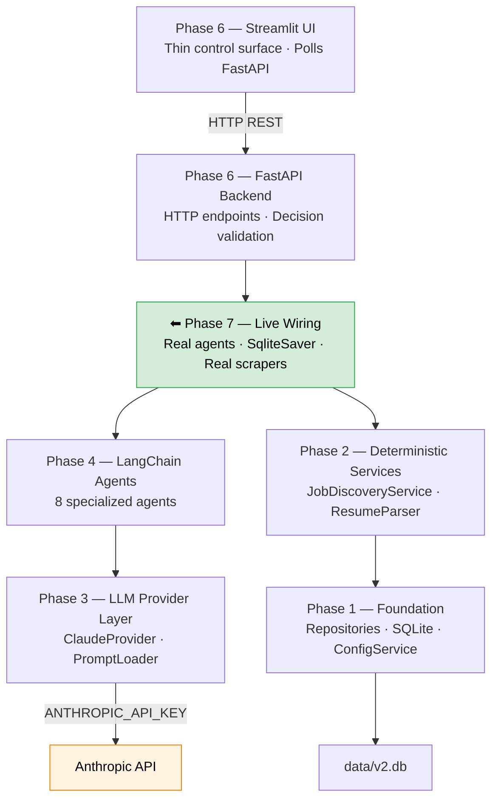
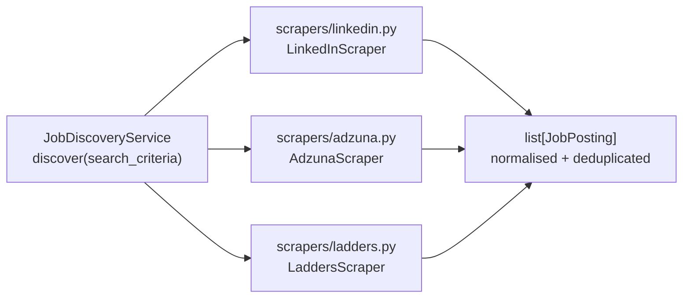
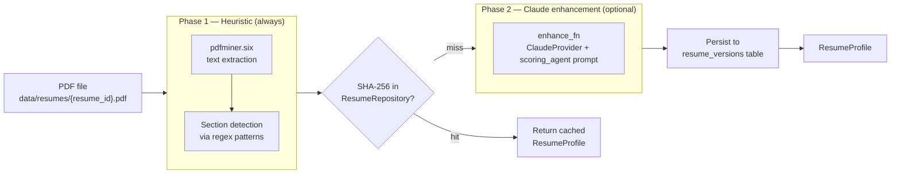
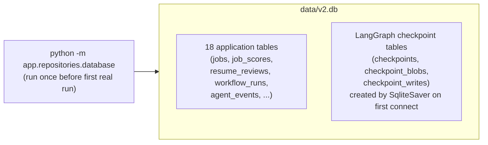

# Phase 7 — Live Agents and Real Integrations

**Status:** draft — awaiting review  
**Depends on:** Phase 6 (FastAPI + Streamlit UI), all prior phases  
**Unlocks:** Phase 8 (Production hardening — auth, rate limits, multi-user)

---

## 1. Goal

Replace every Phase 6 mock with a real implementation. After Phase 7:

- All 8 agents make live Anthropic API calls through `ClaudeProvider`
- The workflow graph persists checkpoints to `data/v2.db` via `SqliteSaver`
- `JobDiscoveryService` runs the three v1 scrapers (LinkedIn, Adzuna, Ladders)
- `ResumeParser` parses real PDF files with Claude-enhanced field extraction
- All repositories write scored jobs, reviews, advice, and prep to the SQLite tables
- A user can upload a resume PDF, start a run, make HITL decisions, and receive a real report

No new endpoints, no schema changes, no new graph nodes. Phase 7 is entirely a
**wiring change** inside `app/api/dependencies.py` and `app/api/main.py`.

---

## 2. Where Phase 7 Fits in the Stack



**The only files that change in Phase 7:**
- `app/api/dependencies.py` — swap `_build_mocked_deps()` for `_build_real_deps()`
- `app/api/main.py` — handle `SqliteSaver` context manager in lifespan
- `app/workflows/checkpointer.py` — fix context manager entry pattern

Everything else — routers, HITL validation, Streamlit UI, graph nodes, agents,
providers, repositories — is used as-is.

---

## 3. What Changes vs Phase 6

| Component | Phase 6 | Phase 7 |
|-----------|---------|---------|
| All 8 agents | `MagicMock(spec=AgentClass)` with `side_effect` | Real agent instances backed by `ClaudeProvider` |
| Checkpointer | `MemorySaver()` — in-process, no persistence | `SqliteSaver` — persists to `data/v2.db` |
| `JobDiscoveryService` | Mock returning one hardcoded `JobPosting` | Real service with LinkedIn, Adzuna, Ladders scrapers |
| `ResumeParser` | `MagicMock(spec=ResumeParser)` | Real parser — PDF extraction + Claude enhancement |
| All repositories | `MagicMock(spec=Repository)` | Real SQLite repositories writing to `data/v2.db` |
| `ObservabilityService` | Mock — events discarded | Real service — writes to `agent_events` table |
| Database | Not used | `data/v2.db` initialised with all 18 tables + LangGraph checkpoint tables |

---

## 4. Prerequisites

### 4.1 Environment Variables

API keys are loaded from a `.env` file in the project root — the same pattern
used by the v1 `main.py` and `dashboard.py`. `python-dotenv` is already in
`requirements.txt`.

Create `.env` (never commit this file):

```bash
# .env
ANTHROPIC_API_KEY=sk-ant-...    # required — all agent calls fail without this
ADZUNA_APP_ID=...               # optional — Adzuna scraper disabled if absent
ADZUNA_API_KEY=...              # optional
```

`load_dotenv()` is called at the top of `app/api/main.py` so the keys are in
`os.environ` before the lifespan runs. The `ConfigService` loads `config.yaml`
defaults and allows DB-level overrides but does not store API keys — those live
only in `.env` / the process environment.

### 4.2 Database Initialisation

Before the first real run, the 18 application tables must exist in `data/v2.db`.

```bash
python -m app.repositories.database   # creates data/v2.db and all tables
```

LangGraph creates its own checkpoint tables (`checkpoints`, `checkpoint_blobs`,
`checkpoint_writes`) automatically when `SqliteSaver` first connects.

### 4.3 Resume File

The real `ResumeParser` expects a PDF file path. For Phase 7 the UI accepts a
resume ID string (`res-001`) and the backend looks up the file at
`data/resumes/{resume_id}.pdf`. Drop the PDF there before starting a run.

---

## 5. The Three Swap Points

All Phase 7 changes are isolated to two files.

### 5.1 `app/api/dependencies.py` — real deps builder

Phase 6 has `_build_mocked_deps(checkpointer)`. Phase 7 replaces it with
`_build_real_deps(checkpointer)`.

```python
# app/api/dependencies.py  (Phase 7)

from app.providers.claude_provider import ClaudeProvider
from app.providers.prompt_loader import PromptLoader
from app.repositories.database import get_connection
from app.repositories.job_repository import JobRepository
from app.repositories.score_repository import ScoreRepository
from app.repositories.advice_repository import AdviceRepository
from app.repositories.review_repository import ReviewRepository
from app.repositories.tailoring_repository import TailoringRepository
from app.repositories.workflow_repository import WorkflowRepository
from app.repositories.resume_repository import ResumeRepository
from app.services.config_service import ConfigService
from app.services.job_discovery_service import JobDiscoveryService
from app.services.observability_service import ObservabilityService
from app.services.report_generator import ReportGenerator
from app.services.resume_parser import ResumeParser
from app.providers.prompt_loader import make_resume_enhance_fn


def _build_real_deps(checkpointer) -> WorkflowDependencies:
    loader = PromptLoader()
    config = ConfigService()
    conn = get_connection("data/v2.db")

    # One Sonnet provider for reasoning-heavy agents
    sonnet = ClaudeProvider(loader, model_name="claude-sonnet-4-6")
    # One Haiku provider for scoring — cheapest model, called up to 20 times per run
    haiku = ClaudeProvider(loader, model_name="claude-haiku-4-5-20251001")

    obs = ObservabilityService(conn)
    job_repo = JobRepository(conn)

    # v1 scraper wrappers — see Section 6
    from scrapers.linkedin import LinkedInScraper
    from scrapers.adzuna import AdzunaScraper
    from scrapers.ladders import LaddersScraper
    scrapers = _build_scrapers(config)

    discovery_svc = JobDiscoveryService(
        job_repository=job_repo,
        config=config.as_dict(),
        scrapers=scrapers,
    )

    resume_parser = ResumeParser(
        resume_repository=ResumeRepository(conn),
        enhance_fn=make_resume_enhance_fn(sonnet),
    )

    return WorkflowDependencies(
        research_agent=ResearchAgent(sonnet, obs),
        scoring_agent=ScoringAgent(haiku, obs),
        resume_critic=ResumeCritic(sonnet, obs),
        review_auditor=ReviewAuditor(sonnet, obs),
        career_advisor=CareerAdvisor(sonnet, obs),
        interview_coach=InterviewCoach(sonnet, obs),
        tailoring_agent=TailoringAgent(sonnet, obs),
        fidelity_reviewer=FidelityReviewer(sonnet, obs),
        discovery_service=discovery_svc,
        resume_parser=resume_parser,
        report_generator=ReportGenerator(),
        job_repo=job_repo,
        score_repo=ScoreRepository(conn),
        advice_repo=AdviceRepository(conn),
        review_repo=ReviewRepository(conn),
        tailoring_repo=TailoringRepository(conn),
        workflow_repo=WorkflowRepository(conn),
        observability=obs,
        checkpointer=checkpointer,
    )
```

### 5.2 `app/api/main.py` — lifespan owns the SqliteSaver context manager

`SqliteSaver.from_conn_string()` in newer LangGraph returns a
`_GeneratorContextManager` that must be entered with `with`. The lifespan
function is the right place to own this lifecycle.

```python
# app/api/main.py  (Phase 7)

from contextlib import asynccontextmanager
from dotenv import load_dotenv
from langgraph.checkpoint.sqlite import SqliteSaver
from app.api.dependencies import build_and_cache_graph

load_dotenv()   # load .env before any os.getenv() calls

@asynccontextmanager
async def lifespan(app: FastAPI):
    with SqliteSaver.from_conn_string("data/v2.db") as checkpointer:
        build_and_cache_graph(checkpointer)
        yield
    # checkpointer connection closed here on shutdown
```

```python
# app/api/dependencies.py  (Phase 7 — updated signature)

def build_and_cache_graph(checkpointer) -> None:
    global _graph
    deps = _build_real_deps(checkpointer)
    _graph = build_graph(deps)
    logger.info("Workflow graph built with live agents and SqliteSaver.")
```

### 5.3 `app/workflows/checkpointer.py` — context manager entry

The existing `make_checkpointer()` helper needs updating so callers outside the
lifespan (e.g. CLI tools) also get a correctly-entered saver.

```python
# app/workflows/checkpointer.py  (Phase 7)

from contextlib import contextmanager
from langgraph.checkpoint.sqlite import SqliteSaver

@contextmanager
def make_checkpointer(db_path: str = "data/v2.db"):
    """Context manager that yields a properly-entered SqliteSaver."""
    with SqliteSaver.from_conn_string(db_path) as checkpointer:
        yield checkpointer
```

---

## 6. JobDiscoveryService — v1 Scraper Wrappers

Phase 7 wires the three v1 scrapers that already exist under `scrapers/`.



The `JobDiscoveryService` already handles normalisation, deduplication by URL,
and capping at `MAX_JOBS_PER_RUN = 20`. Phase 7 just passes real scraper
instances instead of an empty list.

```python
def _build_scrapers(config: ConfigService) -> list:
    import os
    scrapers = []

    # LinkedIn — always available (no API key required)
    from scrapers.linkedin import LinkedInScraper
    scrapers.append(LinkedInScraper(config=config.as_dict()))

    # Adzuna — only if credentials present
    adzuna_id = os.getenv("ADZUNA_APP_ID")
    adzuna_key = os.getenv("ADZUNA_API_KEY")
    if adzuna_id and adzuna_key:
        from scrapers.adzuna import AdzunaScraper
        scrapers.append(AdzunaScraper(app_id=adzuna_id, api_key=adzuna_key))

    # Ladders — always available
    from scrapers.ladders import LaddersScraper
    scrapers.append(LaddersScraper(config=config.as_dict()))

    return scrapers
```

**Resilience rule:** If one scraper raises an exception, `JobDiscoveryService`
logs the error, skips that scraper, and continues with results from the others.
A run with zero jobs from discovery produces an empty job list and proceeds to
`await_job_selection` with no eligible jobs — the user sees an empty selection
screen. This is preferable to aborting the run.

---

## 7. ResumeParser — PDF + Claude Enhancement

The real `ResumeParser` has two phases:



In Phase 7 the `enhance_fn` is bound to `ClaudeProvider` via `make_resume_enhance_fn()`:

```python
from app.providers.prompt_loader import make_resume_enhance_fn

enhance_fn = make_resume_enhance_fn(sonnet_provider)
resume_parser = ResumeParser(
    resume_repository=ResumeRepository(conn),
    enhance_fn=enhance_fn,
)
```

`enhance_fn=None` disables Phase 2 (heuristic fields only). This is the test mode
and is unchanged in unit tests.

---

## 8. Agent Construction Reference

All 8 agents share the same constructor signature: `(provider: LLMClient, observability: ObservabilityService)`.

| Agent | Provider | Reason |
|-------|----------|--------|
| `ResearchAgent` | Sonnet | ReAct reasoning — needs strong instruction following |
| `ScoringAgent` | Haiku | Structured output only — cheapest model, called up to 20× per run |
| `ResumeCritic` | Sonnet | Deep resume analysis — needs nuance |
| `ReviewAuditor` | Sonnet | Evaluates the Critic's output — needs judgment |
| `CareerAdvisor` | Sonnet | Long-form career strategy |
| `InterviewCoach` | Sonnet | 7-day prep plan generation |
| `TailoringAgent` | Sonnet | Evidence-bound rewriting — must follow guardrails precisely |
| `FidelityReviewer` | Sonnet | Validation gate — must be conservative |

**Total LLM calls per full run (worst case `MAX_LLM_CALLS_PER_RUN = 50`):**

| Segment | Calls | Model | Est. cost |
|---------|-------|-------|-----------|
| Scoring (20 jobs × research + score) | ~40 | Haiku (20) + Sonnet (20) | ~$0.07 |
| Deep review (3 jobs × 2 rounds × critic + auditor) | ~12 | Sonnet | ~$0.10 |
| Career advice + interview coach (3 jobs) | ~6 | Sonnet | ~$0.05 |
| Tailoring + fidelity (1 job) | ~2 | Sonnet | ~$0.02 |
| **Total** | **~60** | — | **~$0.25** |

Costs are estimates based on approximate prompt sizes. Actual cost depends on
job description length and resume length. `run_metrics.estimated_cost_usd` in
the workflow state tracks the real cost as it accumulates.

---

## 9. Database Setup



The application tables and LangGraph tables share one database file but do not
collide — LangGraph uses its own table prefix. No migration tooling is needed:
`database.py` uses `CREATE TABLE IF NOT EXISTS` so re-running it is safe.

---

## 10. Configuration

Phase 7 reads from `config.yaml` with DB-level overrides via `ConfigService`.
The key settings for Phase 7:

```yaml
# config.yaml — Phase 7 relevant sections

llm:
  default_model: "claude-sonnet-4-6"
  haiku_model: "claude-haiku-4-5-20251001"

scoring:
  career_track: "all"              # ic | architect | management | all (default: weight all three equally)
  interview_coach_threshold: 75    # min overall_score to trigger InterviewCoach

search:
  max_jobs: 20                     # MAX_JOBS_PER_RUN

database:
  path: "data/v2.db"

resumes:
  storage_path: "data/resumes"     # directory for PDF files
```

`effective_config` from `POST /workflows` is merged over these defaults at
runtime — the workflow's config dict is the union of `config.yaml` defaults and
any fields the caller passed in `effective_config`.

---

## 11. Testing Strategy

Phase 7 does **not** require changing any existing tests. The 387 passing tests
all use mocked agents and remain valid as Phase 7 unit tests.

Phase 7 adds two new test tiers:

### 11.1 Integration smoke test (one real LLM call)

A single test that calls `ClaudeProvider.complete()` with the `ScoringAgent`
prompt and a minimal job context. Validates that:
- The Anthropic API key is valid
- The prompt renders without error
- The response parses into `JobScore`

This test is marked `@pytest.mark.integration` and excluded from CI by default:

```bash
pytest tests/v2/test_live_provider.py -m integration   # requires ANTHROPIC_API_KEY
```

### 11.2 End-to-end notebook validation

`notebooks/phase_7_validation.ipynb` runs a full workflow against the real API
with a test resume and one hardcoded job. Steps:
1. Ensure `ANTHROPIC_API_KEY` is set
2. Initialise `data/v2.db`
3. `POST /workflows` with `resume_id="test-001"` (uses `data/resumes/test-001.pdf`)
4. Poll until `waiting_for_user`
5. Submit job selection
6. Poll until `waiting_for_user` or `completed`
7. If tailoring HITL fires — approve
8. Poll until `completed`
9. `GET /report` — assert markdown present
10. Assert `data/v2.db` has rows in `job_scores`, `resume_reviews`, `career_advice`
11. PSSR checklist

---

## 12. Error Handling Additions

Phase 7 introduces two new failure modes not present in Phase 6:

### 12.1 Missing API key

If `ANTHROPIC_API_KEY` is not set, `ClaudeProvider._build_chat_model()` raises
`anthropic.AuthenticationError` on the first call. This surfaces as an
`LLMProviderError` in the first scored job, marks it as `scoring_failed`,
and continues — but all subsequent jobs will also fail. The run will complete
with zero scored jobs and an errors array full of `LLMProviderError` entries.

Detection: check `run_metrics.llm_calls == 0` after polling completion with
errors present → surface a clear message in the Streamlit UI.

### 12.2 Scraper failures

v1 scrapers may raise exceptions on network errors or site structure changes.
`JobDiscoveryService` wraps each scraper call in a try/except and logs the
error. A partial result (e.g. LinkedIn succeeds, Adzuna fails) is acceptable —
the run continues with whatever jobs were found.

If all scrapers fail, `discover_jobs` returns an empty list. The workflow
proceeds to `await_job_selection` with no eligible jobs. The UI shows an
empty selection screen with a note that no jobs were found.

---

## 13. PSSR Checklist

### Performance
- [ ] `ClaudeProvider` instances are constructed once in `_build_real_deps()` and shared across all nodes in the run — not re-instantiated per agent call
- [ ] `SqliteSaver` connection is opened once in lifespan and held for the server's lifetime — not opened per request
- [ ] `ResumeParser` SHA-256 cache prevents redundant Claude calls for the same resume content
- [ ] `@st.cache_data(ttl=30)` on all `db_reader` functions — browse views do not re-query on every Streamlit interaction

### Scalability
- [ ] `MAX_LLM_CALLS_PER_RUN = 50` enforced via `check_budget()` before every agent call — real API costs are capped per run
- [ ] `MAX_JOBS_PER_RUN = 20` caps scraper output before scoring begins
- [ ] `MAX_SELECTED_JOBS = 3` enforced at API layer and in `JobSelectionDecision` schema — deep review cost is bounded
- [ ] Haiku model used for all scoring calls — cheapest model for the highest-volume agent
- [ ] `ThreadPoolExecutor(max_workers=4)` — at most 4 concurrent workflow executions; concurrent scraping calls are bounded by scraper implementation

### Security
- [ ] `ANTHROPIC_API_KEY` read from environment — never stored in `config.yaml`, database, or state
- [ ] Scraper API keys (`ADZUNA_APP_ID`, `ADZUNA_API_KEY`) read from environment only
- [ ] Resume PDF files stored at `data/resumes/{resume_id}.pdf` — `resume_id` validated as an alphanumeric string before constructing the path (prevent path traversal)
- [ ] `resume_profile` sent to agents as a structured dict — raw resume text never passed directly to any agent
- [ ] Job descriptions treated as untrusted input per ADR-019 — injected as data, not as instructions
- [ ] `SqliteSaver` thread-safe mode enabled (LangGraph default) — no WAL mode configuration needed for `max_workers=4`

### Reliability
- [ ] `LLMProviderError` is caught per-job — one agent failure never aborts the run
- [ ] Missing `ANTHROPIC_API_KEY` produces `LLMProviderError` (not an unhandled exception) — run degrades gracefully
- [ ] Scraper exceptions are caught per-scraper — partial discovery results are acceptable
- [ ] `SqliteSaver` persists every node's output — the run survives a server restart and can resume from the last checkpoint
- [ ] `ClaudeProvider` has tenacity retry on transient Anthropic errors (`APIConnectionError`, `RateLimitError`, `InternalServerError`) with 3 retries and exponential backoff
- [ ] `FidelityReviewer` always runs after `TailoringAgent` — hardcoded graph edge, no bypass possible

---

## 14. Phase 7 Deliverables

| # | File | Change |
|---|------|--------|
| 1 | `app/api/dependencies.py` | Replace `_build_mocked_deps()` with `_build_real_deps(checkpointer)` |
| 2 | `app/api/main.py` | Lifespan enters `SqliteSaver` context manager |
| 3 | `app/workflows/checkpointer.py` | Convert `make_checkpointer()` to a `@contextmanager` |
| 4 | `tests/v2/test_live_provider.py` | One integration test (`@pytest.mark.integration`) |
| 5 | `notebooks/phase_7_validation.ipynb` | Full end-to-end run with real Claude and real DB |
| 6 | `data/resumes/test-001.pdf` | Test resume PDF for notebook validation |

No new routers, schemas, graph nodes, or agents. No changes to any Phase 6
files other than the three listed above.

---

## 15. Delivery Order

| Step | Work | Gate |
|------|------|------|
| 1 | This document — reviewed and approved | Approval before any code |
| 2 | `app/workflows/checkpointer.py` — convert to `@contextmanager` | Required by step 3 |
| 3 | `app/api/main.py` — lifespan enters `SqliteSaver` context | Fixes persistence |
| 4 | `python -m app.repositories.database` — init `data/v2.db` | Required before first real run |
| 5 | `app/api/dependencies.py` — `_build_real_deps()` | Wire all real components |
| 6 | `tests/v2/test_live_provider.py` — integration smoke test | Validates API key + provider round-trip |
| 7 | Manual smoke test: start both servers, submit one run | Catches scraper/parser issues |
| 8 | `notebooks/phase_7_validation.ipynb` — full E2E notebook | Sign-off gate |

**Start at step 2** — it is a one-function change with no dependencies and
immediately unblocks the SqliteSaver lifecycle needed by all other steps.

---

## 16. Running Phase 7

```bash
# 1. Add keys to .env (create if it doesn't exist)
echo "ANTHROPIC_API_KEY=sk-ant-..." >> .env

# 2. Initialise database (once)
python -m app.repositories.database

# 3. Place a test resume
cp /path/to/your-resume.pdf data/resumes/res-001.pdf

# 4. Start the backend
uvicorn app.api.main:app --reload --port 8000

# 5. Start the UI
streamlit run app/ui/streamlit_app.py --server.port 8501

# 6. Open http://localhost:8501
#    → Start New Run → resume_id: res-001 → Start Workflow
```

To run the integration test only:
```bash
pytest tests/v2/test_live_provider.py -m integration -v
```
