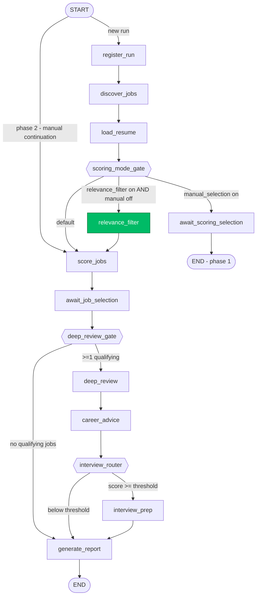
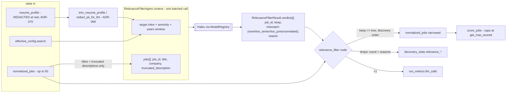
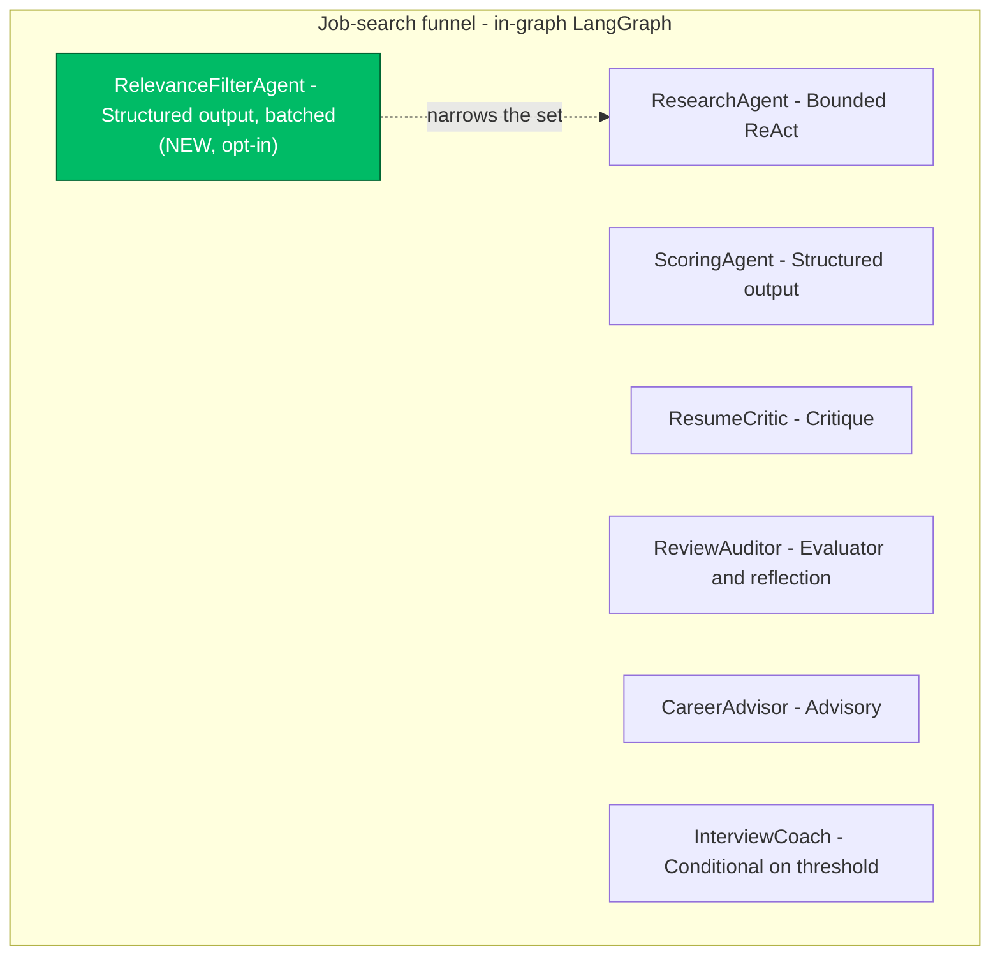

# Relevance pre-filter — design flow (ADR-079)

Companion to [ADR-079](adr/ADR-079-relevance-prefilter-before-scoring.md). Documents
the **control flow**, **data flow**, and **agent graph** for the opt-in reasoning
relevance filter that sits between discovery and scoring. Decision rationale,
options-considered, and consequences live in the ADR; this doc is the visual /
flow reference.

For the surrounding workflow, see [`workflow_model.md`](workflow_model.md); for the
agent catalog, see [`agent_graph_overview.md`](agent_graph_overview.md).

---

## 1. What it is, in one paragraph

A fresh-graduate (or any early-career) profile still receives senior and unrelated
jobs because the existing filters are keyword/regex based (ADR-064/065). The
relevance pre-filter is an **opt-in, per-profile** reasoning pass: one cheap
batched LLM call per run, placed **after `load_resume` and before `score_jobs`**,
that hard-drops jobs which are a **seniority** or **relevance** mismatch for the
profile. It is the automated cousin of ADR-060 manual selection — both cast a wide
net and narrow it; manual mode parks for a human, relevance-filter mode lets a
cheap model triage and continues with no `interrupt()`.

**It is profile-relative and bidirectional.** The seniority axis is judged against
*this* profile's target band, so the same toggle serves both ends: it drops
`too_senior` roles for a fresh-grad profile and `too_junior` roles for a senior
profile. That makes it the LLM counterpart to ADR-065's symmetric deterministic
pair — `exceeds_cap` (max bound) and `below_floor` (min bound) — in one feature,
on one checkbox.

---

## 2. Control flow — where the node sits and how the gate routes

The only structural change is the `load_resume` out-edge: `scoring_mode_gate`
becomes a **three-way** router, and a new `relevance_filter` node is inserted on
the auto-scoring branch ahead of `score_jobs`. Everything downstream of
`score_jobs` is unchanged.



The new node is highlighted; the dashed nodes are routing functions (pure, no LLM,
not instrumented).

### Gate precedence (the three-way decision)

`scoring_mode_gate(state)` resolves in this fixed order:

```text
1. manual_selection == true   -> "await_scoring_selection"   (human triages; filter never runs)
2. relevance_filter == true   -> "relevance_filter"          (cheap LLM triages, then scores)
3. otherwise                   -> "score_jobs"                (unchanged default)
```

Manual selection wins over the relevance filter: if a human is already curating,
there is no reason to also pay the LLM triage. Phase-2 manual continuation
(`entry_router`, `phase=="scoring"`) enters at `score_jobs` directly, so the filter
is never on that path either.

### The widened-net coupling

In auto mode `get_max_discovered_jobs` returns the **scored** cap — there is no
point discovering more than we will score. That assumption breaks once a filter
sits in the middle, so enabling the filter widens discovery to the manual-mode net
(`MAX_DISCOVERED_JOBS`), giving the filter a real pool to triage before
`score_jobs` narrows the survivors back to `get_max_scored`.

```text
                       relevance_filter OFF        relevance_filter ON
 discover cap          = get_max_scored (10)       = MAX_DISCOVERED_JOBS (50)
 filter                (none)                       drops mismatches (1 cheap call)
 score cap             get_max_scored (10)          get_max_scored (10)  <- unchanged
```

So the cost ceiling on scoring is identical; only the candidate pool the filter
chooses from gets wider.

---

## 3. Data flow — what moves through, and the redaction seam



### State keys in / out

| Direction | Key | Notes |
|---|---|---|
| in | `normalized_jobs` | The discovered set (wide net when enabled). |
| in | `resume_profile` | Already redacted at rest (ADR-070); re-trimmed for the LLM (ADR-069) — belt and suspenders. |
| in | `effective_config.search` | `relevance_filter`, plus the existing seniority signals (`exclude_senior`, `min/max_years_experience`) the prompt can reference, plus `exclude_clearance` (ADR-094). |
| out | `normalized_jobs` | **Narrowed** to the kept set, discovery order preserved (so the title-relevance ordering still feeds the scored cap). |
| out | `discovery_stats` | `relevance_dropped` (count), `relevance_kept` (count), `clearance_dropped` (ADR-094 count), and a per-job `{job_id, mismatch, reason}` list — the audit trail for why a job was shed. |

> **ADR-094 — clearance exclusion.** When `search.exclude_clearance` is on (default
> off), the node drops clearance-gated postings **deterministically, before the LLM
> call** (a keyword predicate, `app/services/clearance_filter.py`), so they cost no
> tokens and are dropped reliably regardless of the agent verdict. They appear in
> `relevance_drops` with `mismatch="requires_clearance"`. Opt-in, so a cleared profile
> keeps cleared roles; only active while the relevance filter runs.
| out | `run_metrics.llm_calls` | +1 (the single batched call), counted against `MAX_LLM_CALLS_PER_RUN` via `add_llm_calls_bulk`. |
| out | `errors[]` | On filter failure only (see fallback). |

### The two security seams (unchanged invariants)

1. **PII redaction (ADR-069/070).** The profile enters the agent context **only**
   through `trim_resume_profile()`, exactly as `score_jobs` does. This is a new
   `resume_profile` LLM-context site, so it must pass through the seam or
   `tests/v2/test_pii_redaction_invariant.py` fails the build.
2. **Untrusted job descriptions.** Each posting is passed as **data**, never
   instructions; the prompt injects `prompts/shared/guardrails.txt` and the
   descriptions are truncated. No security event is emitted here — no guardrail is
   blocking a malicious request; the JD-as-data rule is the existing defense.

### What is NOT mutated

Dropped jobs stay in the `jobs` table (discovery already upserted them). Only the
run's in-memory working set (`normalized_jobs`) is narrowed. Nothing is deleted;
the drop is recoverable from `discovery_stats`.

---

## 4. Agent graph — the new component in context

`RelevanceFilterAgent` is an eleventh `BaseAgent` subclass. It is a **funnel**
agent (in-graph), structured-output, batched — closest in shape to the Scoring
Agent, but cheaper and run once per run instead of once per job.



### Agent contract

| Field | Value |
|---|---|
| `AGENT_NAME` | `relevance_filter` |
| Prompt | `app/prompts/agents/relevance_filter.txt` (injects `shared/guardrails.txt`) |
| Model | Haiku (cheapest tier) via `ModelRegistry`; pinned in `tests/model_pins.json` |
| Pattern | Structured output, **one batched call per run** |
| When | In-graph, only when `search.relevance_filter` is on and `manual_selection` is off |
| Input context | redacted profile (target roles, seniority, years window) + `jobs[]` (`job_id`, `title`, `company`, truncated `description`) |
| Output schema | `RelevanceFilterResult { verdicts: list[RelevanceVerdict] }` |
| Verdict | `RelevanceVerdict { job_id: str, keep: bool, mismatch: Literal["none","too_senior","too_junior","unrelated"], reason: str }` |
| Seniority axis | **Bidirectional, profile-relative** — `too_senior` drops roles above an early-career profile's band; `too_junior` drops roles below a senior profile's band. Band inferred from the profile + `search.min/max_years_experience` + `exclude_senior`. |
| Relevance axis | `unrelated` drops roles outside the profile's target roles/domain. |
| Decision bias | Conservative — drop only on a **clear** mismatch; keep when unsure (recall-biased, mirrors ADR-065) |

### Reliability — never lose a run to a filter fault

```text
filter call ok            -> narrow to kept set, record drops in discovery_stats
call fails / unparseable   -> KEEP ALL discovered jobs, log to errors[], continue to score_jobs
empty verdicts             -> treated as "no opinion" -> KEEP ALL
verdict for unknown job_id  -> ignored (cannot drop a job the filter invented)
job with no verdict         -> KEEP (absence is not a drop signal)
```

A filter failure degrades to "score the unfiltered, capped set" — the pre-ADR-079
behavior. It can never cost the user their whole run.

---

## 5. Cost model

| | Without filter | With filter (noisy fresh-grad run) |
|---|---|---|
| discovery | scrape only (no LLM) | scrape only (wider net, no LLM) |
| filter | - | **1 Haiku call** over <=50 titles + truncated descriptions |
| scoring | 2 calls x every job in the scored cap | 2 calls x only the **kept** jobs (<= scored cap) |
| net | pays research+scoring on the noise | 1 cheap call replaces 2 expensive calls **per dropped job** |

For a profile where most discovered roles are senior/unrelated, the filter is **net
cost-negative**: the single Haiku call is cheaper than the research+scoring it
prevents. For a clean profile that drops nothing, it adds exactly one cheap call
and ~1-2s of latency — which is why it is opt-in.

---

## 6. References

- [ADR-079](adr/ADR-079-relevance-prefilter-before-scoring.md) — the decision record.
- [ADR-060](adr/ADR-060-human-triage-before-scoring.md) / [ADR-061](adr/ADR-061-configurable-funnel-width.md) — wide-net-then-narrow shape this automates.
- [ADR-064](adr/ADR-064-per-profile-search-criteria-drive-discovery.md) / [ADR-065](adr/ADR-065-experience-targeted-discovery.md) — the deterministic filters this reasons on top of.
- [ADR-069](adr/ADR-069-redact-direct-identifiers-at-the-llm-seam.md) / [ADR-070](adr/ADR-070-data-retention-and-state-deduplication.md) — the profile-redaction seam reused here.
- [`workflow_model.md`](workflow_model.md) — the full node graph.
- [`agent_graph_overview.md`](agent_graph_overview.md) — the agent catalog this adds to.
