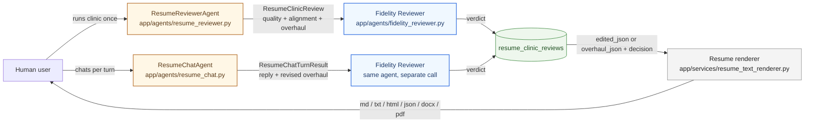

# Resume Clinic — Chat-revise loop, visualised

Companion visualisation for [ADR-068](adr/ADR-068-chat-revise-loop-for-the-resume-clinic.md)
and its [implementation walkthrough](resume_clinic_chat_implementation_walkthrough.md).
Same style as `resume_clinic_strategy.md`, focused only on the agent graph and
data flow the chat-edit feature introduces.

## The two clinic agents at a glance



The reviewer and the chat agent are **separate** — different prompts, different
output schemas, separate model pins, separate cost rows. They **share** the
output overhaul shape (`{reorganization, rewrites[]}`) so the renderer and
the Fidelity Reviewer translation glue are reused unchanged. See the chat
session above for the lifecycle.

## One chat turn, end to end

```mermaid
sequenceDiagram
    autonumber
    participant U as "User (UI)"
    participant API as "POST /resume-clinic/&#123;id&#125;/chat"
    participant CHAT as "ResumeChatAgent"
    participant FID as "FidelityReviewer"
    participant REPO as "ResumeClinicRepository"
    participant RENDER as "Resume renderer"

    U->>API: message + section + history
    API->>API: load clinic row + resume<br>build current_overhaul<br>(edited_json or overhaul_json)
    API->>CHAT: parsed_profile + current_overhaul<br>+ history + section + message
    CHAT-->>API: reply + overhaul + changed_sections
    alt overhaul has rewrites
        API->>FID: translated context<br>(build_fidelity_context_for_overhaul)
        FID-->>API: verdict (or 502 -> null)
    end
    API->>REPO: set_edited(clinic_id, new_overhaul, fidelity)
    Note over REPO: decision UNCHANGED;<br>edited_json + fidelity_review_json updated
    API-->>U: reply + overhaul + fidelity_review + changed_sections
    U->>RENDER: compose_resume(profile, overhaul, edited, decision)
    Note over RENDER: edited wins regardless of decision<br>(except reject)
    RENDER-->>U: live markdown preview
```

## The state machine for `edited_json` × `decision`

The composer's rule from ADR-068: **prefer `edited_json` whenever populated, except on `reject`**.

```mermaid
stateDiagram-v2
    [*] --> NoEditYet: clinic runs (reviewer creates overhaul_json)

    NoEditYet --> ChatEditing: chat turn -> set_edited(new_overhaul)
    NoEditYet --> Approved: Approve button
    NoEditYet --> Revising: Revise button
    NoEditYet --> Rejected: Reject button

    ChatEditing --> ChatEditing: another chat turn
    ChatEditing --> FinalEdit: Save final edit -> decision=edit
    ChatEditing --> NoEditYet: Discard chat edits
    ChatEditing --> Rejected: Reject button

    Approved --> ChatEditing: chat turn (decision stays approve;<br>banner notes edits applied)
    Revising  --> ChatEditing: chat turn (decision stays revise;<br>banner notes edits in progress)
    FinalEdit --> [*]
    Rejected --> [*]: composer renders ORIGINAL resume

    note right of NoEditYet
        edited_json = null
        decision = null
        renderer uses overhaul_json (+ preview banner)
    end note

    note right of ChatEditing
        edited_json = populated
        decision = unchanged from before chat
        renderer uses edited_json (+ "editing in progress" banner)
    end note

    note right of FinalEdit
        edited_json = populated
        decision = "edit"
        renderer uses edited_json (no banner)
    end note

    note right of Rejected
        edited_json = ANY
        decision = "reject"
        renderer falls back to the ORIGINAL resume regardless of edits
    end note
```



## Where each piece lives

```mermaid
flowchart TD
    subgraph SC ["Schemas"]
        S1[app/schemas/resume_clinic.py<br>ResumeOverhaul, RewriteSuggestion,<br>Reorganization, ResumeClinicReview]
        S2[app/schemas/resume_chat.py<br>ResumeChatTurnResult]
    end

    subgraph AG ["Agents (BaseAgent subclasses)"]
        A1[app/agents/resume_reviewer.py<br>AGENT_NAME=resume_reviewer]
        A2[app/agents/resume_chat.py<br>AGENT_NAME=resume_chat]
        A3[app/agents/fidelity_reviewer.py<br>AGENT_NAME=fidelity_reviewer]
    end

    subgraph PR ["Prompts (versioned)"]
        P1[app/prompts/agents/resume_reviewer.txt]
        P2[app/prompts/agents/resume_chat.txt]
        P3[app/prompts/agents/fidelity_reviewer.txt]
    end

    subgraph RT ["Runtime services"]
        RU[app/services/resume_clinic_runner.py<br>run_clinic() + build_fidelity_context_for_overhaul()]
        REN[app/services/resume_text_renderer.py<br>compose_resume() + render_markdown / docx / pdf / ...]
    end

    subgraph EP ["REST endpoints (app/api/routers/resume_clinic.py)"]
        E1[POST /users/&#123;id&#125;/resume-clinic]
        E2[POST /resume-clinic/&#123;id&#125;/decisions]
        E3[POST /resume-clinic/&#123;id&#125;/chat]
        E4[POST /resume-clinic/&#123;id&#125;/discard-edits]
        E5[GET  /resume-clinic/&#123;id&#125;/export?format=...]
        E6[GET  /users/&#123;id&#125;/resume-clinic]
    end

    subgraph DB ["Persistence (app/repositories/resume_clinic_repository.py)"]
        D1[(resume_clinic_reviews)]
    end

    subgraph UI ["UI (app/ui/streamlit_app.py - Resume Clinic view)"]
        U1[Quality scorecard]
        U2[Decision controls]
        U3[Refine with feedback<br>+ Live preview + Conversation]
        U4[Export panel]
    end

    A1 --> P1
    A2 --> P2
    A3 --> P3

    E1 --> RU
    RU --> A1
    RU --> A3
    RU --> D1

    E3 --> A2
    E3 --> A3
    E3 --> D1
    E4 --> D1
    E2 --> D1
    E5 --> REN
    E5 --> D1
    E6 --> D1

    U1 --> E1
    U2 --> E2
    U3 --> E3
    U3 --> E4
    U3 --> REN
    U4 --> E5
```

## What the chat agent CAN and CANNOT do

```mermaid
flowchart LR
    classDef can fill:#eef7ed,stroke:#2f8132,color:#1d4f1f
    classDef cant fill:#fde7e7,stroke:#b22a2a,color:#6a1818

    in[User message + section focus] --> RC[ResumeChatAgent]
    RC --> A1[Revise rewrites in the<br>targeted section]:::can
    RC --> A2[Reorder sections<br>add/remove section_order moves]:::can
    RC --> A3[Decline off-topic asks<br>return overhaul unchanged]:::can
    RC --> A4[Use placeholders &#91;N&#93; / &#91;X&#93;%<br>when a metric is unstated]:::can

    RC --> X1[Touch sections OTHER than<br>the targeted one]:::cant
    RC --> X2[Fabricate experience,<br>metrics, scopes, certs]:::cant
    RC --> X3[Empty supporting_evidence]:::cant
    RC --> X4[Change the decision field<br>(only Save/Reject buttons can)]:::cant
```

The "CAN" rules are enforced by the prompt. The "CANNOT" rules are enforced
by three layers stacked: the prompt, the Pydantic schema (Literal enums +
`min_length=1` on `supporting_evidence`), and the Fidelity Reviewer's
evidence-binding check on every turn.

## The cost shape per session

```mermaid
flowchart LR
    subgraph SETUP ["Initial clinic"]
        C1[ResumeReviewerAgent<br>1 call, ~$0.08]
        C2[FidelityReviewer<br>1 call, ~$0.02]
    end
    subgraph TURNS ["Per chat turn (typically 3-6 per session)"]
        T1[ResumeChatAgent<br>~$0.012 (uncached)]
        T2[FidelityReviewer<br>~$0.005]
    end
    SETUP -. "$0.10 fixed" .-> TURNS
    TURNS -. "$0.05 to $0.15 across the session" .-> TOTAL[~$0.15 to $0.25 total]

    NOTE[Parsed profile is cached in the second<br>prompt block - subsequent turns get 10% pricing<br>on that block, so real costs are lower]:::note
    classDef note fill:#fef8d6,stroke:#b8a325,color:#5d4a15
```

All chat-turn `llm_calls` rows are tagged with the clinic's
`workflow_run_id` (the lightweight `workflow_type="resume_clinic"` row the
original clinic runner wrote), so the per-profile **Cost Dashboard**
attributes the whole session - reviewer + every chat turn + every fidelity
call - to the same profile under one bucket.

## References

- [ADR-068](adr/ADR-068-chat-revise-loop-for-the-resume-clinic.md) - the
  decision and its tradeoffs.
- [Chat-revise implementation walkthrough](resume_clinic_chat_implementation_walkthrough.md) -
  the per-file plan that produced the code these diagrams describe.
- [ADR-066](adr/ADR-066-standalone-resume-clinic.md) - the standalone Resume
  Clinic this loop iterates on.
- [ADR-059](adr/ADR-059-retire-in-graph-hitl-and-add-human-edit-decision.md) -
  human-as-final-author; "Save final edit" submits a human draft that is
  trusted as-is.
- [`resume_clinic_strategy.md`](resume_clinic_strategy.md) - the original
  clinic strategy doc this companion follows in style.
