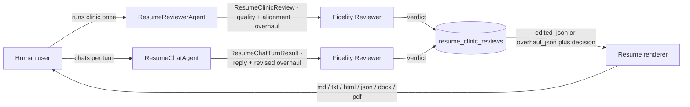
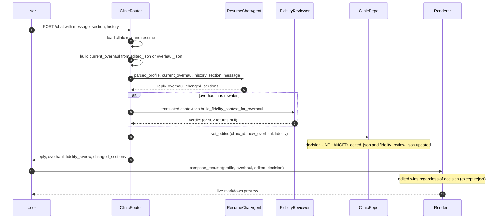
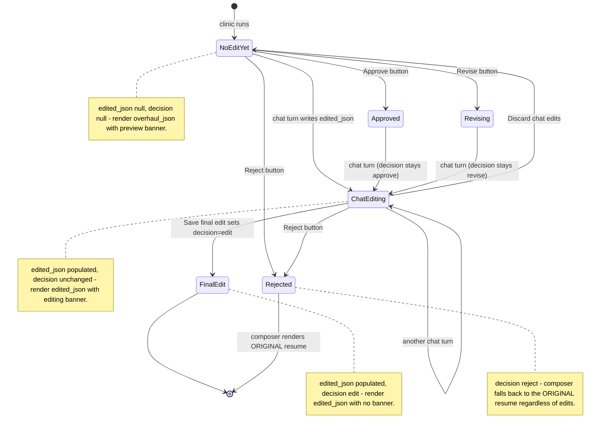
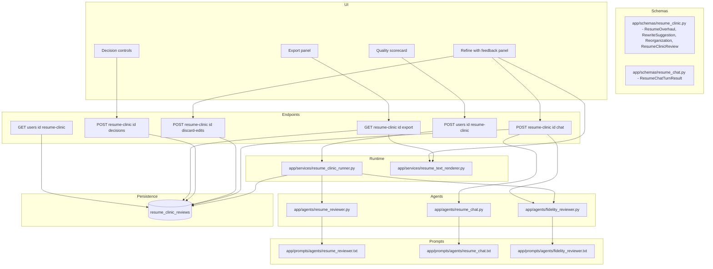
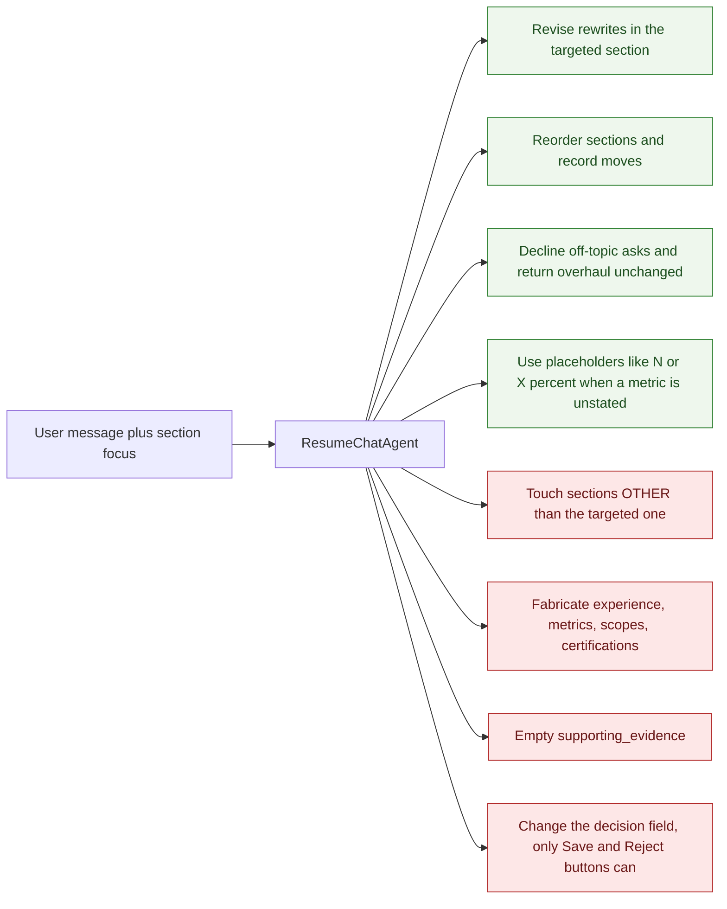

# Resume Clinic — Chat-revise loop, visualised

Companion visualisation for [ADR-068](adr/ADR-068-chat-revise-loop-for-the-resume-clinic.md)
and its [implementation walkthrough](resume_clinic_chat_implementation_walkthrough.md).
Same style as `resume_clinic_strategy.md`, focused only on the agent graph and
data flow the chat-edit feature introduces.

## The two clinic agents at a glance

- `ResumeReviewerAgent` lives at `app/agents/resume_reviewer.py`. One call per
  clinic run.
- `ResumeChatAgent` lives at `app/agents/resume_chat.py`. One call per chat turn.
- `Fidelity Reviewer` (`app/agents/fidelity_reviewer.py`) runs after both, with
  the same evidence-binding prompt.
- The renderer is `app/services/resume_text_renderer.py::compose_resume`.

The reviewer and the chat agent are **separate** — different prompts, different
output schemas, separate model pins, separate cost rows. They **share** the
output overhaul shape so the renderer and the Fidelity Reviewer translation
glue are reused unchanged.

## One chat turn, end to end

## The state machine for `edited_json` × `decision`

The composer's rule from ADR-068: **prefer `edited_json` whenever populated, except on `reject`**.

## Where each piece lives

Endpoint nodes drop the slashes and curly braces so the Mermaid parser doesn't
treat them as syntax. Full URLs are:

- `POST /users/{id}/resume-clinic`
- `POST /resume-clinic/{id}/decisions`
- `POST /resume-clinic/{id}/chat`
- `POST /resume-clinic/{id}/discard-edits`
- `GET  /resume-clinic/{id}/export?format=...`
- `GET  /users/{id}/resume-clinic`

## What the chat agent CAN and CANNOT do

The "CAN" branch above is enforced by the chat agent's prompt. The "CANNOT"
branch is enforced by three layers stacked: the prompt, the Pydantic schema
(Literal enums + `min_length=1` on `supporting_evidence`), and the Fidelity
Reviewer's evidence-binding check on every turn.

## The cost shape per session

Tabular rather than a Mermaid diagram — costs are linear and a table reads
cleaner than a flowchart of subgraphs with dotted arrows.

| Phase | LLM calls | Approx cost | Notes |
|---|---|---|---|
| Initial clinic (once per resume) | 1 × `ResumeReviewerAgent` + 1 × `FidelityReviewer` | **~$0.10 fixed** | Runs when the user first opens the Resume Clinic on a profile. |
| Per chat turn (iterative) | 1 × `ResumeChatAgent` + 1 × `FidelityReviewer` | **~$0.017 per turn** (uncached) | Triggered by the user pressing **Send feedback**. |
| Typical session | 3 to 6 chat turns | **$0.15 – $0.25 total** | Initial clinic + chat refinements added together. |

The parsed profile is **cached in the second prompt block**, so subsequent
chat turns hit the 10% pricing tier on that block — real session cost runs
lower than the headline numbers above. Cost attribution flows through one
correlation id: every chat-turn `llm_calls` row is tagged with the clinic's
`workflow_run_id` (the lightweight `workflow_type="resume_clinic"` row the
original clinic runner wrote), so the per-profile **Cost Dashboard**
attributes the whole session — reviewer + every chat turn + every fidelity
call — to the same profile under one bucket.

## References

- [ADR-068](adr/ADR-068-chat-revise-loop-for-the-resume-clinic.md) — the
  decision and its tradeoffs.
- [Chat-revise implementation walkthrough](resume_clinic_chat_implementation_walkthrough.md) —
  the per-file plan that produced the code these diagrams describe.
- [ADR-066](adr/ADR-066-standalone-resume-clinic.md) — the standalone Resume
  Clinic this loop iterates on.
- [ADR-059](adr/ADR-059-retire-in-graph-hitl-and-add-human-edit-decision.md) —
  human-as-final-author; "Save final edit" submits a human draft that is
  trusted as-is.
- [`resume_clinic_strategy.md`](resume_clinic_strategy.md) — the original
  clinic strategy doc this companion follows in style.
