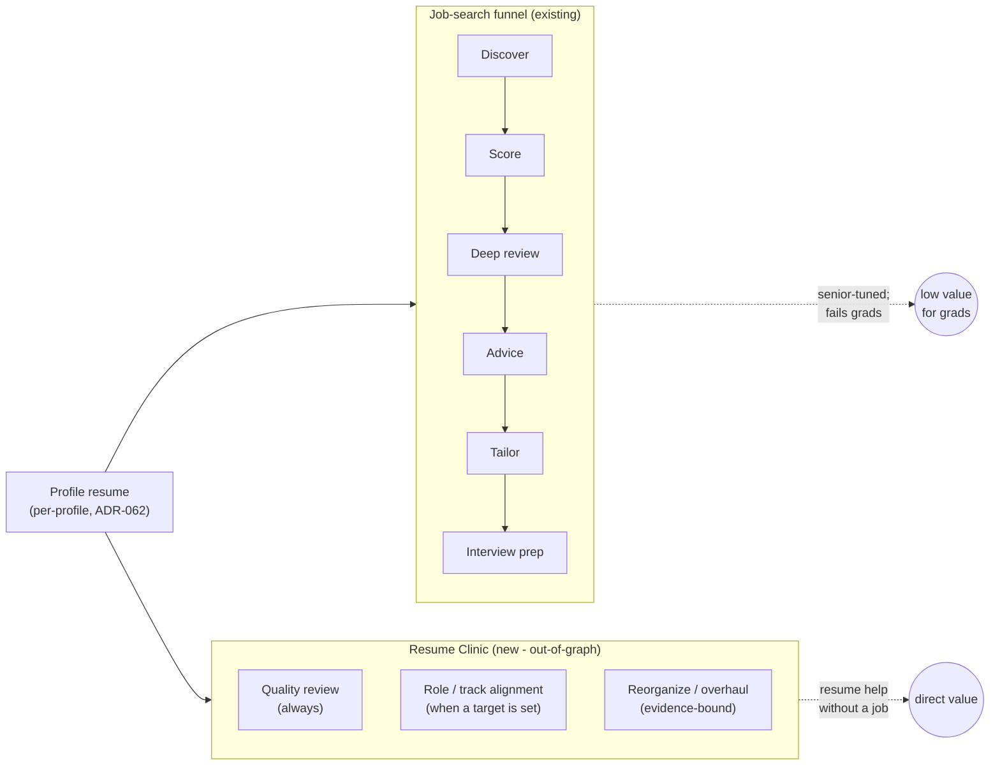
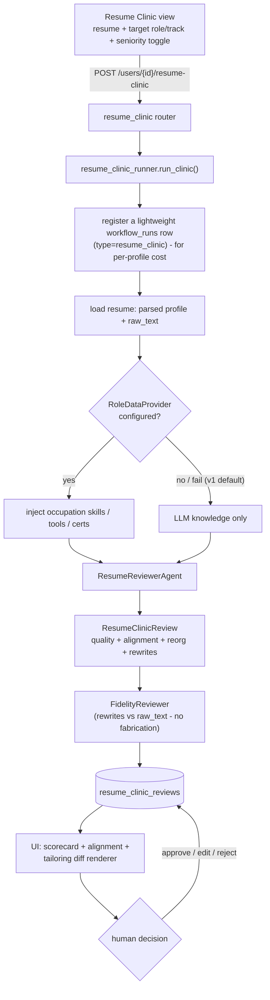
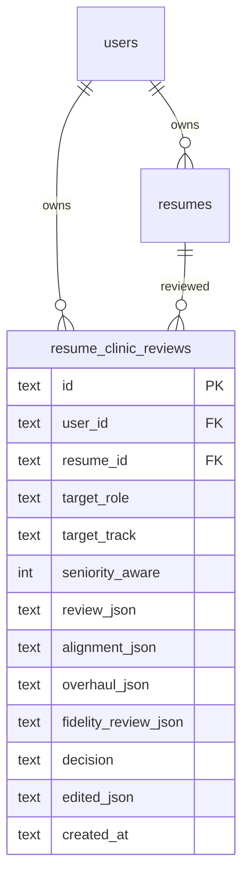
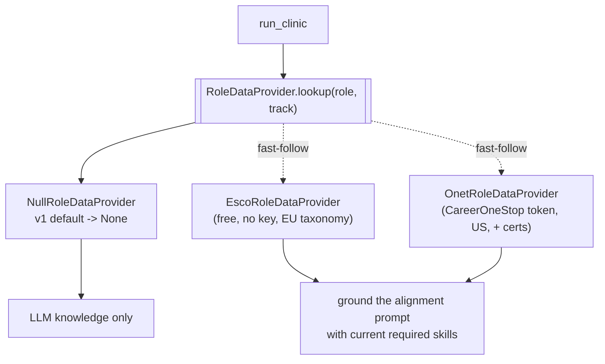
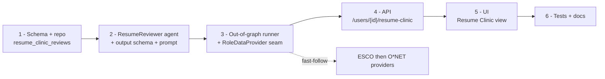
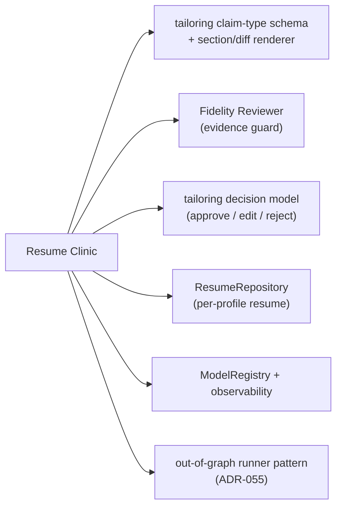

# Resume Clinic — Strategy & Build Plan

> Visual companion to **ADR-066** (the decision record). This is the at-a-glance
> strategy to pick up when the feature comes off the shelf. Status: **Accepted,
> not yet built** — sequenced as option (a) (LLM-only v1, role-data grounding as a
> fast-follow).

## The reframe in one line

The app is a **job-search funnel**; every resume-facing agent is gated behind
discovering and scoring a job. That fails early-career users (the scoring rubric is
senior-tuned). The **Resume Clinic** is a **second surface**: it works on the
resume alone — no discovery, no scoring — to review, align to a target role, and
reorganize/overhaul.

## What a clinic run produces

| Output | When | Shape |
|---|---|---|
| **Quality scorecard** | always | per-dimension rating (strong / adequate / needs-work) + findings + fixes; qualitative, no fake-precise score |
| **Role / track alignment** | when a target role/track is set | fit summary, missing skills/keywords, suggested certs/projects, what to emphasize |
| **Reorganize / overhaul** | always | section-reorder plan + per-bullet rewrites in the **tailoring claim-type shape** (reword / emphasize / gap / remove), each evidence-bound |

Dimensions graded: structure/ordering, impact/quantification, clarity, ATS/formatting,
consistency, length-fit, and seniority framing (the **seniority toggle** tunes this).

## How a run works

The Fidelity Reviewer is **always** in the loop on the rewrites — the
evidence-binding invariant (ADR-015/056/059) holds with no job. A human `edit` is
owner-authored and not re-reviewed.

## Data model addition

Per-profile and repeatable (runs accumulate). A dedicated table — not overloading
the job-keyed `resume_reviews` / `tailored_resumes` with a null `job_id`.

## The role-data seam (counters stale LLM knowledge)

Division of labor: the **API says what the occupation requires** (current,
authoritative); the **LLM does resume craft + early-career/seniority positioning**.
Always degrades gracefully to LLM-only.

## Build sequence (gated; suite green at each phase)

## What we reuse (low net-new surface)

Genuinely new: one `ResumeReviewerAgent` + prompt, the `resume_clinic_reviews`
table + repo, the runner, one router, one UI view, and the `RoleDataProvider`
interface (+ `Null` default).

## Status & when we resume

- **Accepted, build deferred.** Tabled to make room for Article 9; pick up at
  Phase 1 when the feature returns.
- Validate the **Resume Reviewer prompt** against a real entry-level resume early —
  that prompt is where most of the output quality lives.
- See **ADR-066** for the full decision rationale and references.
