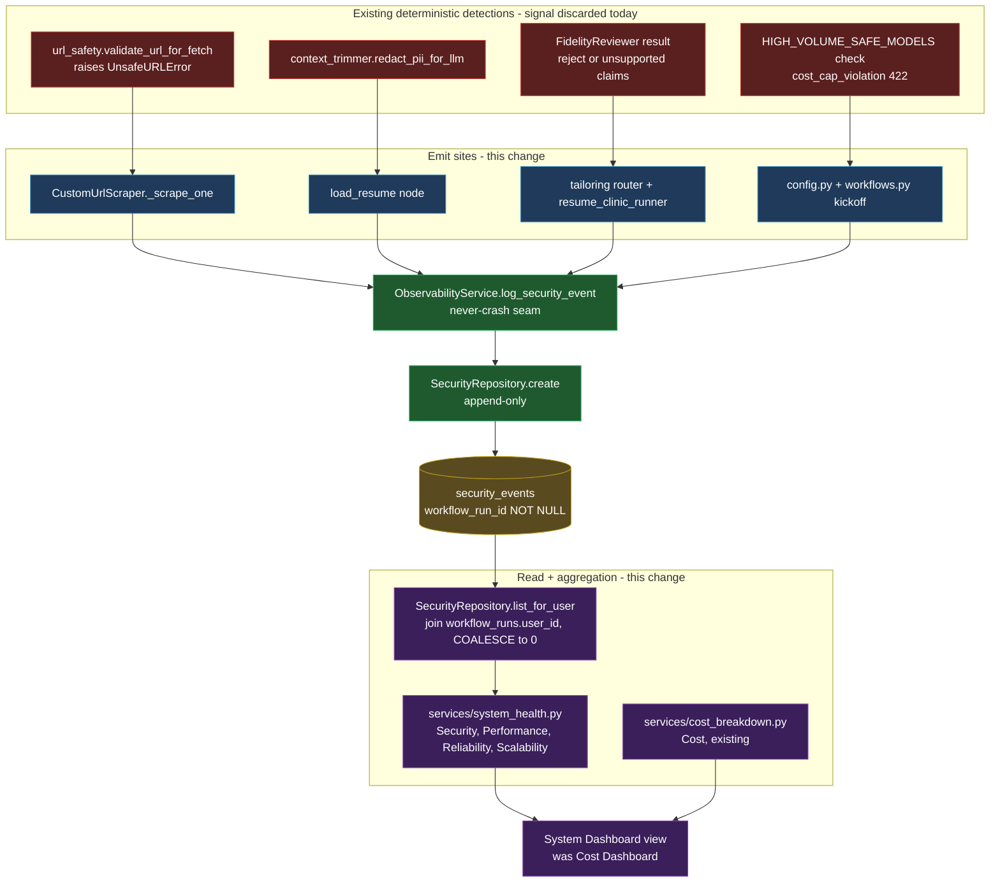
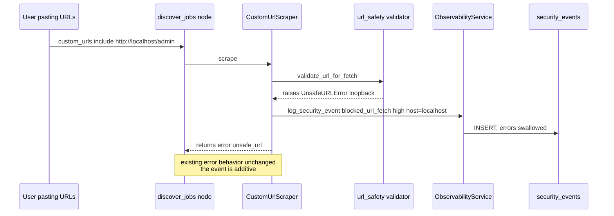
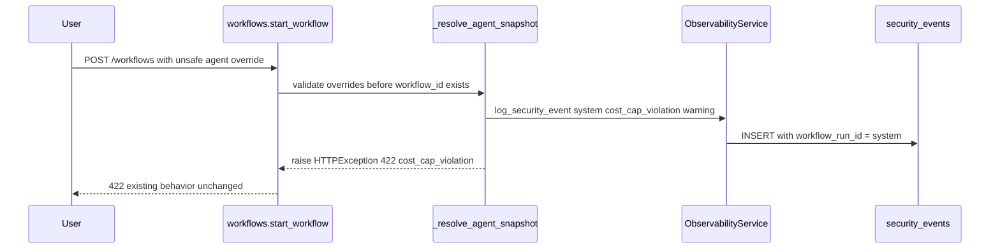

# Security Events + Unified System Dashboard — Solution Architecture & Design

> Companion to [ADR-073](adr/ADR-073-wire-security-events-and-system-dashboard.md)
> (the decision) and [ADR-026](adr/ADR-026-track-security-events.md) (the original
> why). The ADR records *what we decided and why*; this document shows *how it
> comes together* — the components, the data flow, every emit site, the read/
> aggregation layer, the dashboard composition, and the full set of impacted
> areas. Read [`observability.md`](observability.md) for the surrounding
> observability model and [`ui_architecture.md`](ui_architecture.md) for the
> read-path / control-path split this builds on.

---

## 1. The two ideas to hold first

1. **Store per run, view system-level.** Every security event keeps its
   `workflow_run_id` correlation id (storage is per-run, like `llm_calls`), but
   the *primary visualization* is system-wide and profile-scoped (like the Cost
   Dashboard). Per-run is the drill-through, not the front door.

2. **Emit where detection already happens.** We are not adding detectors in this
   change (one exception is deferred — JD prompt-injection). Every emit site sits
   on top of an existing deterministic decision that today throws its signal away
   (an error string, a silent redaction, a JSON flag, an HTTP 422). Wiring =
   "record the event the system already decided," routed through the one
   never-crash seam `ObservabilityService.log_security_event`.

---

## 2. Where this sits — component view



The middle column (`ObservabilityService -> SecurityRepository -> table`) already
exists end to end. This change adds the left column's emit calls and the right
column's read/aggregation + the dashboard composition.

---

## 3. Emit-site catalog

Every description is **PII-safe by construction**: counts, field names, reason
classes, and hostnames only — never resume content, candidate identifiers, claim
text, or fetched page text. This honors ADR-069's "summaries not raw content in
logs" and is enforced by a dedicated test.

| # | event_type | severity | Emit site (file) | Trigger | Description shape (illustrative) |
|---|---|---|---|---|---|
| 1 | `blocked_url_fetch` | `high` | `app/services/custom_url_scraper.py` (`_scrape_one`, `except UnsafeURLError`) | A user-supplied URL fails the SSRF check | `Blocked unsafe URL (loopback address not allowed): host=localhost` |
| 2 | `pii_redacted` | `info` | `app/workflows/nodes/load_resume.py` (after `redact_pii_for_llm`) | Direct identifiers dropped before LLM context | `Redacted 4 direct identifier field(s) before LLM context: name, email, location, raw_text` |
| 3 | `unsupported_claim` | `warning` | `app/api/routers/tailoring.py` (`trigger_tailoring`) + `app/services/resume_clinic_runner.py` | Fidelity `reject` OR any unsupported_claims / fabricated_metrics | `Fidelity flagged 3 unsupported claim(s), 1 fabricated metric(s); recommendation=reject` |
| 4 | `cost_cap_violation` | `warning` | `app/api/routers/config.py` + `app/api/routers/workflows.py` (override validation) | High-volume agent assigned a model outside `HIGH_VOLUME_SAFE_MODELS` | `Rejected cost-cap violation: agent=scoring_agent model=claude-opus-4-8` |
| 5 | `budget_cap_reached` | `warning` | `app/workflows/nodes/score_jobs.py` + `app/workflows/nodes/deep_review.py` (pre-flight budget gate) | A run hits `MAX_LLM_CALLS_PER_RUN` and sheds jobs (ADR-076); surfaced as "runs hit cap" in `reliability_summary` | `deep_review budget cap: skipped 4 job(s), 196/200 calls used` |

Severity scale (recorded in `security.model.md`): `info` = a control worked as
designed, logged for audit; `warning` = a guardrail tripped and blocked/flagged
something; `high` = a defense blocked a potentially malicious request.

### 3.1 Sequence — blocked URL fetch (the load-bearing one)



### 3.2 Sequence — cost-cap violation (the run-less, sentinel case)



The `"system"` sentinel (Section 4) lets a run-less detection still be audited
without inventing a fake run.

---

## 4. Data model — no migration, one sentinel

`security_events` already exists (`app/repositories/database.py`):

```sql
CREATE TABLE IF NOT EXISTS security_events (
    id TEXT PRIMARY KEY,
    workflow_run_id TEXT NOT NULL,   -- correlation id; "system" sentinel when run-less
    event_type TEXT,
    severity TEXT,
    description TEXT,                 -- PII-safe summary only
    created_at TEXT NOT NULL
);
CREATE INDEX IF NOT EXISTS idx_security_created_at ON security_events(created_at);
```

No schema change. Two modeling notes get documented in `data_model.md`:

- **`workflow_run_id = "system"`** is the reserved sentinel for events with no run
  context (cost-cap violations from a settings edit or a kickoff rejected before
  its UUID is minted). Real run ids are UUIDs, so `"system"` never collides.
- **Retention + purge** already cover this table (ADR-070): 180-day window
  (`retention.security_events_days`), and a purged `workflow_runs` row cascades to
  its `security_events`. Sentinel/orphan rows (no matching run) are aged out by
  the standalone 180-day window, not the cascade.

---

## 5. Read + aggregation layer

### 5.1 `SecurityRepository` (additive)

- `get_by_run(workflow_run_id)` — retained, powers the per-run drill-through.
- `list_for_user(user_id, days=None)` — system-level, profile-scoped:

  ```sql
  SELECT se.*, COALESCE(wr.user_id, '0') AS user_id
  FROM security_events se
  LEFT JOIN workflow_runs wr ON wr.id = se.workflow_run_id
  WHERE COALESCE(wr.user_id, '0') = ?
    [AND se.created_at >= ?]            -- when days is set
  ORDER BY se.created_at DESC
  ```

  The `LEFT JOIN` + `COALESCE` is the same idiom every other history/analytics
  read uses (ADR-062): sentinel and legacy/orphan events land in the `"0"`
  bucket. A system-wide variant (all profiles) drops the `WHERE` on `user_id`.

### 5.2 `app/services/system_health.py` (new, deterministic — no LLM)

Mirrors `cost_breakdown.py`: pure SQL reads, all `user_id`-scoped, returning
plain dicts the view renders. One function group per dashboard section:

| Function group | Reads | Returns |
|---|---|---|
| `security_summary(days, user_id)` | `security_events` (via `list_for_user`) | counts by `event_type`, by `severity`, recent N, total |
| `performance_summary(days, user_id)` | `llm_calls.latency_ms`, `agent_events.duration_ms` | p50/p95 latency, slowest agents, slowest steps |
| `reliability_summary(days, user_id)` | `agent_events` (`status`), `workflow_runs` (terminal status) | run success rate, agent failure count, recent failures |
| `scalability_summary(days, user_id)` | `workflow_runs`, `job_scores` | jobs/run, runs/day, peak concurrency proxy (deliberately light) |
| `profiles_overview(days)` | `workflow_runs` + joins, `GROUP BY COALESCE(user_id,'0')`, join `users` for names | per-profile: runs, spend, security counts by severity, run success rate |

The view stays a thin renderer over these — consistent with the
read-path/control-path rule in `ui_architecture.md` (browse/analytics read
directly; the aggregators live in `services/`).

### 5.3 Profile scoping and drilldown

The dashboard supports three view states, forming a profile -> run -> job
drilldown that reuses the existing click-a-row pattern
(`st.dataframe(on_select="rerun", selection_mode="single-row")`):

1. **Active profile (default).** "All profiles" off; every section is scoped to
   `st.session_state.current_user_id`. No per-profile breakdown is shown.
2. **All profiles (aggregate).** "All profiles" on; sections aggregate across
   every profile, and a **By-profile breakdown** panel appears
   (`profiles_overview`) — one clickable row per profile.
3. **Drilled into a profile.** Clicking a breakdown row sets a session-state
   `dashboard_profile_filter = <user_id>`; every section re-scopes to that id and
   a breadcrumb offers "clear". Clicking a run row then drills to Workflow
   Detail, and a job to Job Detail.

`dashboard_profile_filter` is a **read-time view override** — it never mutates
`current_user_id` (the acting identity). An operator in all-profiles mode viewing
another profile's data is the intended system-wide capability and adds **no auth
check**, consistent with ADR-062's cooperative-isolation rule ("do not add
ownership-authorization checks"). The id passed to every aggregator is, in
precedence order: `dashboard_profile_filter` if set, else `None` (all profiles)
when the toggle is on, else `current_user_id`.

**Where profile drilldown applies (and where it does not):**

| Surface | Profile-attributable? | In a specific-profile drilldown |
|---|---|---|
| Security (via run), Cost, Performance, Reliability, Scalability | Yes — via the `workflow_runs.user_id` join | shown, scoped to that profile |
| Sentinel events (`workflow_run_id="system"`: cost-cap from config/kickoff) | No owning run -> COALESCE to `"0"` | excluded; visible only in all-profiles and the `"0"` bucket |
| Legacy/orphan rows (pre-ADR-062) | COALESCE to `"0"` | same — live in the `"0"` bucket |

Profile id 0 is the **Primary** profile (ADR-062: the owner of all pre-existing,
single-user data) AND the bucket that absorbs run-less (sentinel) + pre-multiuser
events. So the breakdown shows one **"Primary"** row whose security counts include
those folded-in events — not a separate "system / legacy" row. The breakdown
caption notes this. System-scoped events are only meaningful at the all-profiles /
system level (or under Primary/id 0), never inside another profile's drilldown —
that is the "where applicable" boundary.

---

## 6. The unified System Dashboard

A rendered, browser-openable mockup of this screen (self-contained HTML, sample
data) lives at
[`mockups/system_dashboard_mockup.html`](mockups/system_dashboard_mockup.html).
The ASCII sketch below is the same layout in text:

```
System Dashboard  (was: Cost Dashboard)
+-----------------------------------------------------------------------+
| [ Last 7d | Last 30d | All time ]        [x] All profiles (system)    |  <- shared controls
+-----------------------------------------------------------------------+
| Headline:  spend | calls | runs | security events | run success %     |
+-----------------------------------------------------------------------+
| BY PROFILE    profile | runs | spend | sec(high/warn/info) | success  |  <- only when All profiles on
|               row click -> drill into that profile (re-scopes below)  |     (profile -> run -> job)
+-----------------------------------------------------------------------+
| > Drilled into: Security Analyst (id 1)  [x clear]                     |  <- breadcrumb when filtered
+-----------------------------------------------------------------------+
| SECURITY      events by type (bar) | by severity | recent table       |  <- new (Part 1 data)
|               row click -> Workflow Detail (per-run drill-through)     |
+-----------------------------------------------------------------------+
| PERFORMANCE   LLM p50/p95 | agent p50/p95 | slowest agents/steps      |  <- new aggregation
+-----------------------------------------------------------------------+
| RELIABILITY   run success rate | agent failures | recent failures     |  <- new aggregation
+-----------------------------------------------------------------------+
| SCALABILITY   jobs/run | runs/day | concurrency proxy   (light)       |  <- new aggregation
+-----------------------------------------------------------------------+
| COST          (existing Cost Dashboard content, refactored verbatim   |  <- unchanged behavior
|               into a section function: cache, trend, per-agent,        |
|               per-model, top runs/calls, reconcile)                    |
+-----------------------------------------------------------------------+
```

All sections share the window (`days`) and the resolved profile id that the
current Cost Dashboard already computes (Section 5.3: `dashboard_profile_filter`
if set, else all-profiles when the toggle is on, else `current_user_id`), so
adding a section is "call one `system_health` function + render," not new
plumbing. The existing drill-through to Workflow Detail is preserved and reused by
the Security recent-events table (the lower run -> job leg of the profile -> run
-> job drilldown).

The pillar mapping is explicit so the dashboard *is* the PSSR review axis made
observable: **P**erformance, **S**calability, **S**ecurity, **R**eliability,
plus Cost.

---

## 7. Impacted areas — full matrix

| Area | File(s) | Change | Risk |
|---|---|---|---|
| Emit: SSRF | `app/services/custom_url_scraper.py` | add emit in `UnsafeURLError` branch | low (additive, never-crash) |
| Emit: PII | `app/workflows/nodes/load_resume.py` | count redacted fields + emit | low |
| Emit: fidelity | `app/api/routers/tailoring.py`, `app/services/resume_clinic_runner.py` | emit on reject/unsupported | low |
| Emit: cost cap | `app/api/routers/config.py`, `app/api/routers/workflows.py` | emit before existing 422; `"system"` id | low |
| Read | `app/repositories/security_repository.py` | add `list_for_user` (+ system-wide) | low |
| Aggregation | `app/services/system_health.py` (new) | Security/Perf/Reliability/Scalability reads | medium (new SQL) |
| UI rename | `app/ui/nav.py`, `app/ui/views/__init__.py`, `app/ui/views/cost_dashboard.py -> system_dashboard.py`, `app/ui/views/workflow_detail.py` | rename + restructure into sections | medium (nav/registry/back-nav) |
| Identity | reuse `st.session_state.current_user_id` + `cost_uid` pattern | none new | none |
| Tests | `tests/v2/` | forcing-function (>0 emit sites) + per-site behavioral + scoping + aggregation + PII-safety + UI smoke/structure | — |
| Docs | ADR-073, this doc, `observability.md`, `security.model.md`, `data_model.md`, `ui_architecture.md`, `CLAUDE.md`, `CHANGELOG.md`, wiki/features/user_guide | update | — |

What is **not** touched: the LangGraph graph shape (no new nodes, no
`interrupt()`), agent prompts, the `ObservabilityService` / `SecurityRepository`
write path (already built), the cost write path, and persistence schema.

---

## 8. Testing strategy

Layered to match `feedback_test_invariants_for_critical_concerns` (a dead
subsystem is exactly the failure an invariant test guards against):

1. **Forcing-function invariant** — source-scan asserts `log_security_event` has
   >0 call sites in `app/` (so the subsystem can never silently go dead again,
   mirroring the cost-observability and `test_ui_undefined_names` guards).
2. **Per-site behavioral** — drive each emit site and assert a `security_events`
   row with the expected `event_type`/`severity`:
   - unsafe URL -> `blocked_url_fetch`
   - resume with PII -> `pii_redacted`
   - fidelity reject -> `unsupported_claim`
   - cost-cap override -> `cost_cap_violation` (sentinel run id)
3. **PII-safety** — assert emitted descriptions contain none of the candidate's
   direct identifiers (feed a known-PII profile, scan the stored description).
4. **Read scoping** — `list_for_user` returns only the active profile's events;
   sentinel/orphan events COALESCE to `"0"`.
5. **Aggregation** — `system_health` functions return correct counts/percentiles
   on a seeded DB.
6. **UI** — `smoke-test-ui` 15/15 with the renamed view; `test_ui_structure`
   updated for `System Dashboard`.

Full suite (`python -m pytest tests/`) must stay green (currently 809 passed).

---

## 9. PSSR analysis (of this change itself)

- **Performance** — emit calls are one indexed INSERT on already-hot paths;
  negligible. Dashboard reads are windowed + indexed (`idx_security_created_at`);
  the new aggregations are bounded by the same window the Cost Dashboard uses.
- **Scalability** — append-only table with a retention window (ADR-070); no
  unbounded growth. Reads are per-profile filtered.
- **Security** — this *is* the security improvement (an audit trail that was
  dark). The one risk it introduces — leaking PII into log descriptions — is
  designed out (PII-safe-by-construction) and tested (#3 above).
- **Reliability** — every emit inherits `log_security_event`'s swallow-and-log
  contract: a failed audit write degrades to a missing row, never a failed run or
  a failed user action. The 422/error-string behaviors are unchanged; events are
  strictly additive.

---

## 10. Rollout & sequencing

1. ADR-073 + this design doc (approved before code).
2. Emit sites (Part 1) + per-site tests.
3. Read layer (`list_for_user` + `system_health`) + tests.
4. System Dashboard rename + sections + UI smoke/structure.
5. Docs + secret audit + PSSR + commit (logical chunks), push on request.

Deferred (explicitly out of scope, noted for the backlog): JD prompt-injection
detector as a 5th emit site; long-term memory wiring; per-run security panel as a
richer drill-through; alerting/thresholds on `high`-severity events.
