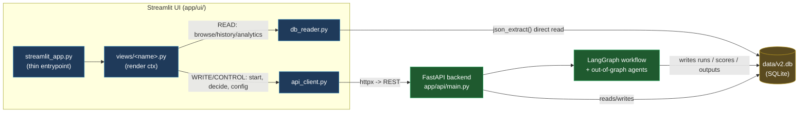
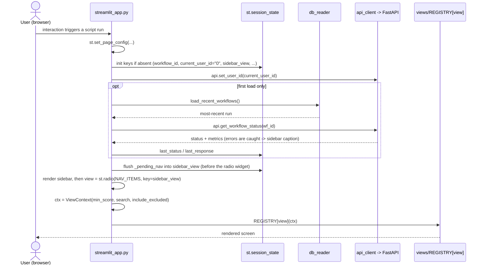
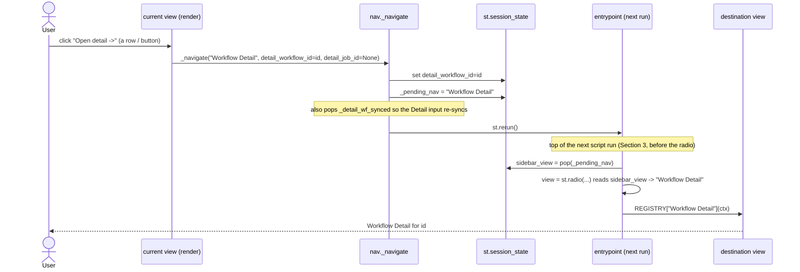
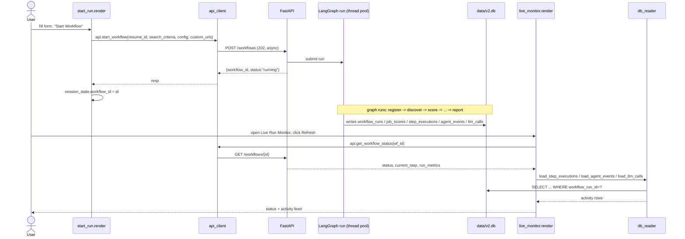
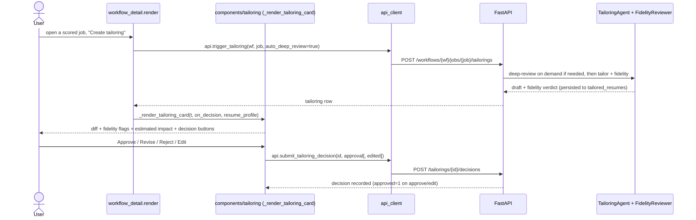
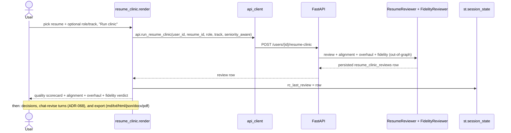
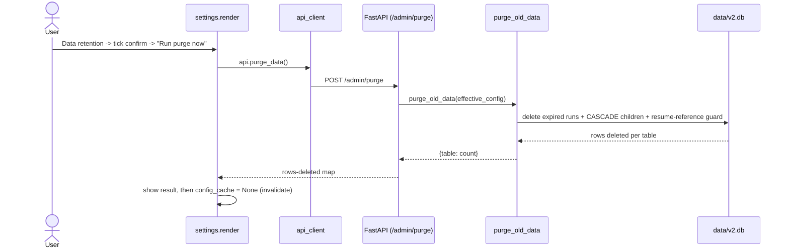
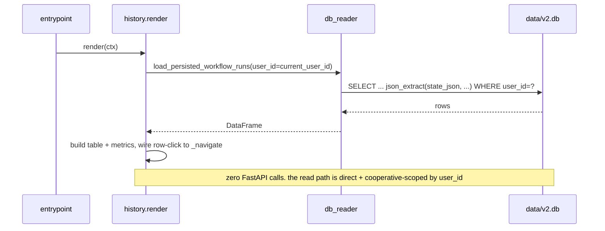

# UI Architecture — screens, navigation, and backend interaction

> Canonical guide to how the Streamlit UI is built and how it talks to the rest of
> the system. For the history of how it got this shape, see
> [`ui_refactor_plan.md`](ui_refactor_plan.md). For the REST contracts the UI
> calls, see [`api_reference.md`](api_reference.md). For the tables it reads, see
> [`data_model.md`](data_model.md).

---

## 1. The one idea to hold first: one data path (ADR-075)

The UI talks to the system through **one channel** — `app/ui/api_client.py` to the
FastAPI backend. **No UI code opens `data/v2.db` directly.** (Before ADR-075 there
was a second, read-only path via `db_reader.py` that opened SQLite directly for
browse performance; ADR-075 retired it — the observability blind spot and
dual-write hazard outweighed the saved round-trip, and it blocked auth/remote.)

| Concern | Module | Notes |
|---|---|---|
| **Reads** (history / analytics / detail / dashboard) | `app/ui/api_client.py` `get_*` + `app/ui/data.py` `_cached_*` | `httpx` GET to the backend; cached with `st.cache_data`; server-side SQL lives in `app/services/reads/` + the `cost_breakdown` / `system_health` aggregators |
| **Writes / actions** (start run, decide, tailor, clinic, upload, purge) | `app/ui/api_client.py` | `httpx` to the backend (`http://localhost:8000`) |

Everything goes through the API so that validation, orchestration, observability
(every read now records an `api_requests` row, ADR-074 Gap 5), and persistence stay
server-owned, and so the UI can run on a different host / behind auth later. A
forcing-function test (`tests/v2/test_ui_no_direct_db.py`) fails the build if any
UI view re-imports `db_reader` / `sqlite3` / a DB-reading aggregator. Pure helpers
that operate on already-fetched data (e.g. `constraint_analyzer` on the run state)
are fine.



A view may use **both** paths (e.g. Workflow Detail reads stored review rows via
`db_reader` *and* triggers an on-demand tailoring via `api_client`). The rule is
per-operation, not per-screen: *displaying* stored data → read path; *causing
something to happen* → control path.

---

## 2. The package at a glance

```
app/ui/
  streamlit_app.py   thin entrypoint: page config + session state + sidebar + dispatch (~217 lines)
  nav.py             NAV_ITEMS / NAV_VIEWS / SEPARATOR, ViewContext, _navigate (no st.* at import)
  views/
    __init__.py      REGISTRY: {view name -> render(ctx)}
    <name>.py        one render(ctx) per screen (15 modules)
  components/         shared st.* render helpers (bullets, tailoring card, tracks)
  formatting.py      pure formatters (no st.*, unit-tested)
  data.py            @st.cache_data wrappers over api_client + local YAML
  db_reader.py       direct data/v2.db reads (the read path)
  api_client.py      httpx calls to FastAPI (the control path)
```

Dependency direction is strictly one-way (no cycles):
`formatting` ← `components` ← `views` ← `nav`/`data`/`db_reader`/`api_client` ←
`streamlit_app`. The registry lives in `views/__init__.py` (not `nav.py`) so view
modules can import `ViewContext` from the leaf `nav` without a cycle.

---

## 3. Anatomy of one script run

Streamlit re-runs `streamlit_app.py` **top to bottom on every interaction** (every
click, keystroke, navigation). There is no long-lived component tree; the only
thing that survives a run is `st.session_state`. The entrypoint does the same five
things every run:

1. **Page config** — `st.set_page_config(...)` (must be the first Streamlit call).
2. **Session-state init** — seed persistent keys with defaults if absent.
3. **Identity** — `api.set_user_id(st.session_state.current_user_id)` so the
   control path is scoped to the active profile (ADR-062).
4. **Auto-reconnect** (first load only) — adopt the most recent run so the sidebar
   "Active Run" panel is populated.
5. **Sidebar + dispatch** — render the sidebar (profile selector, view radio,
   filters), build a `ViewContext`, and call `REGISTRY[view](ctx)`.



The view contract: every module in `views/` exposes exactly one
`render(ctx: ViewContext) -> None`. All `st.*` calls happen **inside** `render()`,
never at import — so importing a view module renders nothing, which is what lets
the structure tests import all 15 without a Streamlit runtime.

`ViewContext` carries the sidebar filter widgets the cross-run views need:

```python
@dataclass(frozen=True)
class ViewContext:
    min_score: int          # sidebar "Minimum match score" slider
    search: str             # sidebar "Search title / company" box
    include_excluded: bool  # sidebar "Include excluded jobs" checkbox
```

Everything else a view needs (the active `workflow_id`, `current_user_id`, the
selected `detail_workflow_id`/`detail_job_id`) it reads from `st.session_state`.

---

## 4. Navigation model

There are two ways the active view changes:

1. **The sidebar radio** — the user clicks a view name. The radio is keyed
   `sidebar_view`; its value *is* the active view for that run.
2. **Programmatic navigation** — a button inside a view jumps to another screen
   (e.g. a Workflow History row → Workflow Detail; a System Dashboard row → the run's
   Detail; Job Detail's "Back" buttons). This goes through `nav._navigate`.

The subtlety `_navigate` exists to solve: **you cannot write a widget's value to
`st.session_state` after the widget has been instantiated** in the same run. So
`_navigate` does not set `sidebar_view` directly — it stages the destination in
`_pending_nav` and reruns. The *next* run flushes `_pending_nav` into `sidebar_view`
**before** the radio is created, so the radio comes up on the new view.



`NAV_ITEMS` (in `nav.py`) is the ordered list the radio renders, including the
non-selectable `"--- Cross-Run Analytics ---"` separator; selecting the separator
shows a hint and `st.stop()`s. `NAV_VIEWS` is `NAV_ITEMS` minus the separator and is
the canonical set the registry must cover (a test asserts
`set(REGISTRY) == set(NAV_VIEWS)`).

---

## 5. Session state — the cross-run contract

`st.session_state` is the only thing that persists between runs. The load-bearing
keys (declared in the entrypoint's init loop):

| Key | Role |
|---|---|
| `current_user_id` | Active profile (ADR-062). Drives `api.set_user_id` + every `db_reader` `user_id` filter. Default `"0"`. |
| `sidebar_view` | The selected view (radio key). |
| `_pending_nav` | Staged programmatic destination; flushed into `sidebar_view` next run. |
| `workflow_id` | The "active run" (sidebar panel, Run Report, Live Monitor). Set by Start New Run / auto-reconnect. |
| `last_status`, `last_response` | Cached status + payload of the active run. |
| `detail_workflow_id`, `detail_job_id` | Drill-in targets for Workflow Detail / Job Detail. |
| `_detail_wf_synced` | Guards the Detail screen's text input from overriding a fresh navigation. |
| `config_cache` | Per-run cache of `GET /config` (cleared after any write that invalidates it). |
| `rc_last_review` | The last Resume Clinic review row (results pane). |
| `onboard_step`, `onboard_new_user_id` | Profiles onboarding-wizard cursor. |
| `purge_confirm` | The ADR-070 purge confirmation checkbox. |

---

## 6. The 15 screens

Grouped by how they touch the system. **R** = read path (`db_reader` / aggregator
service), **C** = control path (`api_client`).

| Screen | Module | Path | Key reads / endpoints |
|---|---|---|---|
| Workflow History | `views/history.py` | R | `load_persisted_workflow_runs`, `load_workflow_runs` |
| Workflow Detail | `views/workflow_detail.py` | R + C | reads `load_workflow_run` / `load_workflow_jobs` / `load_deep_review_results` / `load_interview_prep`; controls `POST .../tailorings`, `.../deep-review`, `.../interview-prep`, `POST /tailorings/{id}/decisions`; `compute_breakdown` + `constraint_analyzer` |
| Job Detail | `views/job_detail.py` | R | `load_job_pipeline`, `load_workflow_jobs`, `load_recent_workflows` |
| Start New Run | `views/start_run.py` | C | `POST /workflows`, `PUT /config`; `load_user_resumes` |
| Live Run Monitor | `views/live_monitor.py` | R + C | `GET /workflows/{id}`, `POST .../retry`; `load_step_executions` / `load_agent_events` / `load_llm_calls` |
| Run Report | `views/run_report.py` | C | `GET /workflows/{id}/report` |
| Resume Clinic | `views/resume_clinic.py` | R + C | `POST/GET /users/{id}/resume-clinic`, `.../decisions`, `.../chat`, `.../export`; `load_user_resumes` / `load_user_clinic_reviews` |
| Settings | `views/settings.py` | C | `GET/PUT /config`, `POST /config/reload`, `GET /config/providers`, **`POST /admin/purge`** (ADR-070) |
| Profiles | `views/profiles.py` | C | `POST/PUT /users`, `POST/DELETE /users/{id}/resume`; `list_resume_clinic_runs`; `load_user_resumes` |
| System Dashboard | `views/system_dashboard.py` | R | `system_health` (security/performance/reliability/scalability/`profiles_overview`) + `cost_breakdown` (Cost section: day-by-day + week-by-week trends, per-agent and per-model spend); `SecurityRepository.list_for_user`. PSSR+Security+Cost in one pane; profile -> run -> job drilldown (ADR-073) |
| Top Matches | `views/analytics.py::render_top_matches` | R | `load_scored_jobs` + `render_track_table` |
| IC / Architect / Management Track | `views/analytics.py::render_*_track` | R | `load_scored_jobs` + `render_track_table` |
| Companies | `views/analytics.py::render_companies` | R | `load_scored_jobs` + plotly |

The five tiny analytics screens share `views/analytics.py` because they all read the
same scored-jobs source and differ only by score column.

**Active-track gating (ADR-071).** A profile is scored only on its active tracks
(`effective_config.scoring.tracks`, default all three). The per-track analytics
screens show a "not active for this profile" notice instead of an empty table when
their track is inactive, and the Companies aggregation drops inactive-track columns.
Workflow Detail renders only the active track columns (read from the run's stored
`effective_config`), and Job Detail shows only the track metrics that were scored
(inactive tracks are `null`). The active set is resolved via
`app/workflows/limits.py::get_active_tracks`.

---

## 7. Backend interaction — the key flows

### 7.1 Start a run, then watch it

`POST /workflows` is **asynchronous** (202): the backend submits the LangGraph run
to a thread pool and returns immediately with a `workflow_id`. The UI then polls
status via the control path and reads the activity feed via the read path (the
running graph writes `step_executions` / `agent_events` / `llm_calls` rows as it
goes).



There is **no in-graph human-in-the-loop** (ADR-059): the graph runs end-to-end,
auto-selecting qualifying jobs. The only `interrupt()`-free "pause" is the
opt-in manual-scoring path (ADR-060), where phase 1 parks at
`awaiting_scoring_selection` and the UI re-enters via `POST /workflows/{id}/scoring`.

### 7.2 On-demand tailoring (out-of-graph HITL, ADR-055/059/061)

Tailoring is the system's one real HITL surface, and it runs **outside the graph**.
Workflow Detail lists a scored job; the user triggers a tailoring; the backend runs
`TailoringAgent` + `FidelityReviewer` synchronously (running a deep-review first if
the job has none) and persists the draft; the `_render_tailoring_card` component
shows it with a decision callback.



The card is **decoupled from the backend**: it takes an
`on_decision(tailoring_id, choice[, edited])` callback supplied by the view, so the
component itself performs no I/O — it only renders and calls back. The same shape
backs the on-demand deep-review and interview-prep buttons (ADR-061).

### 7.3 Resume Clinic (out-of-graph, ADR-066/068)



### 7.4 Data-retention purge (ADR-070)

The Settings screen carries the only destructive admin action. It is gated behind a
confirm checkbox and calls the control path; the backend runs the purge against the
DB and returns a rows-deleted map.



### 7.5 A pure read-path render (the common case)

Most screens never touch the backend at all. Workflow History is representative:



---

## 8. Identity and per-profile scoping (ADR-062)

There is no authentication. The active profile is resolved in exactly one place per
side of the wire:

- **Frontend:** `api_client.set_user_id(...)` attaches `?user_id=` to control-path
  calls; `db_reader` functions take a `user_id` argument and filter on it. The
  entrypoint calls `set_user_id` every run from `st.session_state.current_user_id`,
  and the sidebar profile selector updates it (clearing caches + reruning on change).
- **Backend:** `app/api/identity.py::get_current_user_id` reads the same query param.

Scoping is **cooperative, not enforced** (ADR-062 Decision E): it filters which rows
a view reads/writes, it is not an access boundary. Adding real auth later changes
only `get_current_user_id`'s body and `set_user_id`'s source.

---

## 9. Caching and the rerun model

Because the whole script re-runs constantly, uncached reads would hammer the DB and
API on every keystroke. Two mechanisms absorb that:

- **`@st.cache_data`** wrappers in `data.py` (`_cached_list_users`,
  `_cached_get_providers`, `_cached_list_tailorings`, `_load_yaml_config`) cache
  control-path reads with short TTLs. Call `.clear()` (or `st.cache_data.clear()`)
  after a write that invalidates them.
- **`st.session_state.config_cache`** holds `GET /config` for the run; set it to
  `None` after any config write so the next run refetches.

`db_reader` functions are intentionally **not** `@st.cache_data`-decorated — they are
cheap direct SQLite reads and must always reflect the latest rows the backend wrote
(e.g. the Live Monitor activity feed during a running workflow). The sidebar
"Refresh data" button does `st.cache_data.clear()` + rerun to force everything fresh.

---

## 10. Backend availability and degraded mode

The control path can fail (backend down / restarting). The UI degrades rather than
crashing:

- `data.py`'s cached wrappers wrap their `api_client` calls in `try/except` and
  return a fallback (`_get_config_cached` falls back to the local YAML with an
  `_offline_reason`; `_cached_list_users` / `_cached_get_providers` return empty /
  `None`). Settings and Profiles surface a "backend not reachable" caption.
- The auto-reconnect block swallows errors into a sidebar caption.
- Read-path views keep working without the backend entirely (they read SQLite
  directly) — which is why the headless smoke test (`.claude/skills/smoke-test-ui`)
  passes all 15 screens even with no backend running.

The Phase 7 gate (`app/api/dependencies.py`) decides whether the backend runs with
real agents (`ANTHROPIC_API_KEY` set) or mocked ones; either way it serves the read
endpoints the UI needs, so the UI does not need real API keys to render.

---

## 11. How to add a screen

1. Create `app/ui/views/<name>.py` exposing `def render(ctx: ViewContext) -> None:`
   — all `st.*` inside `render()`. Read stored data via `db_reader` (or a
   `services/` aggregator); cause actions via `api_client`.
2. Register it in `app/ui/views/__init__.py::REGISTRY` under its nav name.
3. Add the nav name to `nav.NAV_ITEMS` (in the position it should appear).
4. `tests/v2/test_ui_structure.py` enforces `set(REGISTRY) == set(NAV_VIEWS)` and
   import-smoke; add the new module to the import-smoke list.
5. Smoke-test: `python .claude/skills/smoke-test-ui/smoke_ui.py` (or `/smoke-test-ui`).

Shared render logic goes in `components/`; pure formatters in `formatting.py`
(unit-tested); cached control-path reads in `data.py`.

---

## 12. See also

- [`ui_refactor_plan.md`](ui_refactor_plan.md) — how the entrypoint went from a
  3,665-line monolith to this thin-dispatcher + views package (the before/after).
- [`api_reference.md`](api_reference.md) / [`api_surface_overview.md`](api_surface_overview.md) — the REST contracts the control path calls.
- [`data_model.md`](data_model.md) — the tables the read path queries.
- [`workflow_model.md`](workflow_model.md) — what the LangGraph run does once
  `POST /workflows` submits it.
- [`hitl.md`](hitl.md) — the human-decision points (tailoring, clinic, manual scoring).
- `.claude/skills/smoke-test-ui/` — the headless render check for all 15 screens.
