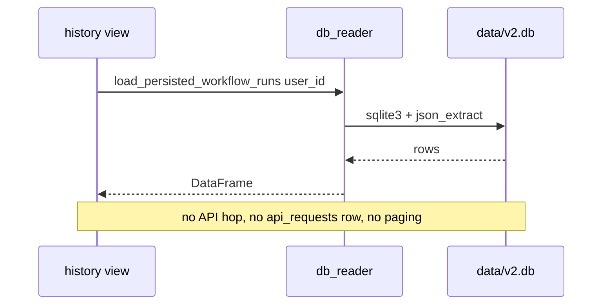
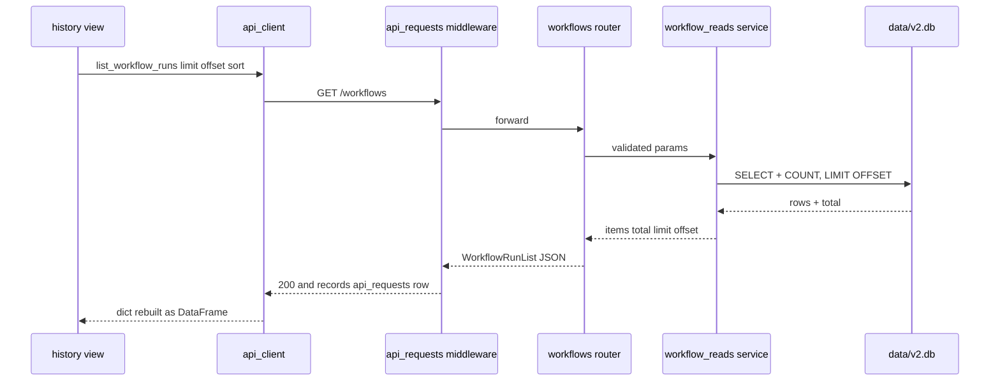

# UI Read Funnel — Implementation Plan

> Companion to [ADR-075](adr/ADR-075-funnel-ui-reads-through-api.md). The ADR
> records the decision + conventions (placement, paging/filtering/sorting, shapes,
> caching, contracts). **This doc is the buildable approach**: the module layout,
> one fully worked end-to-end example every phase copies, per-phase Definition of
> Done, the latency measurement method + go/no-go gate, and the test + guard
> strategy. Read [`ui_architecture.md`](ui_architecture.md) for the two-path model
> being retired.

---

## 1. Target module layout

```
app/
  services/reads/                 ← NEW: the shared read-service layer (§A of ADR-075)
    __init__.py
    workflow_reads.py             ← queries behind /workflows[/{id}/...]
    dashboard_reads.py            ← cross-run aggregations (wraps cost_breakdown + system_health)
    user_reads.py                 ← /users/{id}/... reads
    paging.py                     ← Page envelope + clamp_limit() + sort allowlist helper
  api/
    routers/
      reads.py                    ← NEW: run-scoped read endpoints under /workflows/{id}/...
      dashboard.py                ← NEW: /dashboard/* aggregation endpoints
      (users.py / workflows.py / resume_clinic.py gain read endpoints in place)
    schemas/
      responses.py                ← gains the read response_models + the Page[T] envelope
  ui/
    api_client.py                 ← gains get_* methods (httpx, _user_params, ETag later)
    data.py                       ← st.cache_data wrappers move from db_reader to api_client
    db_reader.py                  ← shrinks each phase; DELETED in Phase 9
    views/<screen>.py             ← swapped one per phase
```

Rule of thumb: **SQL lives only in `services/reads/` (and the existing
`cost_breakdown`/`system_health`/`constraint_analyzer`).** Routers validate +
shape; `api_client` transports; views render. No `sqlite3` import survives in
`app/ui/` after Phase 9 (enforced by a guard test, §6).

---

## 2. The canonical pattern (worked example: Workflow History, Phase 1)

Every read migrates through the same six steps. Workflow History is the worked
example because it is the de-risk gate.

**Today:** `views/history.py` calls `db_reader.load_persisted_workflow_runs(user_id)`
(rich DataFrame: `workflow_id`, status, timestamps, settings, pipeline counts,
`cost_usd`, `llm_calls`) with a legacy fallback to `load_workflow_runs`.

**Before / after for this one read:**





### Step 1 — Read-service (move the SQL, add PFS)

`app/services/reads/workflow_reads.py`:

```python
def list_workflow_runs(*, user_id: str | None, limit: int, offset: int,
                       sort: str, order: str, db_path=DEFAULT_DB_PATH) -> dict:
    """Return {"items": [...], "total": int, "limit": L, "offset": O}.
    SQL = the body of db_reader.load_persisted_workflow_runs, plus COUNT(*) for
    total and ORDER BY <allowlisted sort> <order> LIMIT ? OFFSET ?."""
```

`paging.py` provides `clamp_limit(limit)` (default 50, max 200) and
`safe_sort(sort, allowed: set, default)` (returns a validated column or the
default — never interpolates a raw client string).

### Step 2 — Response model (the contract)

`app/api/schemas/responses.py`:

```python
class WorkflowRunRow(BaseModel):
    workflow_id: str
    status: str
    started_at: str | None = None
    updated_at: str | None = None
    jobs_scored: int | None = None
    cost_usd: float | None = None
    # ... the columns history renders (snake_case; null not omitted)

class WorkflowRunList(BaseModel):       # the reusable Page[T] envelope, concretely typed
    items: list[WorkflowRunRow]
    total: int
    limit: int
    offset: int
```

(One generic `Page` is impractical with Pydantic v2 + OpenAPI clarity, so each
list gets a concrete `XxxList` model with the same four fields.)

### Step 3 — Endpoint (validate + shape)

`workflows.py` (run domain — no new router needed for this one):

```python
@router.get("", response_model=WorkflowRunList)            # GET /workflows
def list_runs(limit: int = 50, offset: int = 0,
              sort: str = "started_at", order: str = "desc",
              user_id: str = Depends(get_current_user_id)) -> WorkflowRunList:
    page = list_workflow_runs(user_id=user_id, limit=clamp_limit(limit),
                              offset=max(0, offset),
                              sort=safe_sort(sort, _SORTABLE, "started_at"),
                              order="asc" if order == "asc" else "desc")
    return WorkflowRunList(**page)
```

Errors reuse the existing envelope; 422 for bad params is already handled by the
global `RequestValidationError` handler. `_SORTABLE` is the per-endpoint sort
allowlist.

### Step 4 — api_client method (transport)

`app/ui/api_client.py`:

```python
def list_workflow_runs(limit=50, offset=0, sort="started_at", order="desc") -> dict:
    r = httpx.get(f"{BASE}/workflows",
                  params=_user_params({"limit": limit, "offset": offset,
                                       "sort": sort, "order": order}),
                  timeout=TIMEOUT)
    r.raise_for_status()
    return r.json()      # {"items": [...], "total", "limit", "offset"}
```

### Step 5 — View swap (+ keep caching)

`data.py` gains an `@st.cache_data(ttl=...)` wrapper over the api_client call;
`views/history.py` swaps `load_persisted_workflow_runs(...)` for
`pd.DataFrame(cached_list_workflow_runs(...)["items"])`. The legacy
`load_workflow_runs` fallback is dropped (the endpoint handles legacy rows). UI
sorting/filtering on small page sizes can stay client-side; large lists use the
endpoint's `sort`/`offset`.

### Step 6 — Tests (contract + behavior + guard)

- Endpoint test (TestClient): shape `{items,total,limit,offset}`, `limit` clamp,
  `sort` allowlist rejects/falls-back, `user_id` scoping, empty -> `items: []`/200.
- Read-service unit test on a seeded temp DB (paging math, total).
- The §6 guard test now allows `history.py` to have **no** `db_reader` import.

---

## 3. Per-phase Definition of Done

A phase is **done** when ALL hold (mirrors the ADR-075 phase table):

1. The phase's SQL lives in `services/reads/` (or the existing aggregators); the
   matching `db_reader` function(s) are unused by any view.
2. Endpoint(s) exist with a typed `response_model`, PFS where it is a list (§B.1),
   and the standard error envelope.
3. `api_client` has the `get_*` method(s); the view renders from them; the
   `st.cache_data` wrapper is in `data.py`.
4. Tests: endpoint contract test + read-service unit test, both green; full suite
   green; ruff clean; **UI smoke 15/15 with the backend running**.
5. The migrated view imports no `db_reader` (the guard test, §6, is tightened to
   include it).
6. Latency for the phase's endpoint(s) is captured from the System Dashboard API
   section and recorded in the phase's commit message (§5).

Per-phase scope is one screen (ADR-075 table). Commit per phase (the established
one-logical-change-per-commit rhythm), secret-audit each.

---

## 4. Coexistence & rollback

- **Both paths run during migration.** `db_reader` keeps serving un-migrated
  screens; only the current phase's view flips. There is never a half-migrated
  screen.
- **Rollback a phase** = revert that phase's view swap (one view file) back to its
  `db_reader` call; the endpoint + service can stay (harmless, unused). So a
  regression in one screen never blocks the others.
- **Phase 1 is the global gate** (§5). If it fails the latency bar, we stop with
  one screen converted and adopt the ADR-075 fallback (read-gateway seam) instead
  of converting the rest — no sunk cost beyond one screen.

---

## 5. Latency measurement + go/no-go gate

The instrumentation already exists (ADR-074 Gap 5: `api_requests`). Method:

1. After a phase ships, exercise the screen normally (a few interactions).
2. On the **System Dashboard -> API** section, read the phase's endpoint p50/p95
   and error rate (filter by route template).
3. Record p50/p95 in the phase commit message.

**Phase-1 go/no-go bar (decide before building):**
- p95 for `GET /workflows` (cached miss) **< ~400 ms** locally, AND
- the History screen feels no slower than today in a manual click-through (the
  `st.cache_data` layer should make repeat renders instant).

If Phase 1 misses the bar even after the composite/cache levers, **stop** and
switch to the read-gateway fallback. This is the single most important checkpoint
in the plan — it converts the "will the funnel be too slow?" risk into a measured
decision after one screen, not after all six.

---

## 6. Test & guard strategy

- **Per-endpoint contract tests** (TestClient) — shape, PFS params, scoping,
  errors. One file per router section.
- **Read-service unit tests** — paging math, sort allowlist, filters, on seeded
  temp DBs (the existing `init_db(tmp_path)` fixture pattern).
- **View tests via the mockable seam** — with data access funnelled to
  `api_client`, a view renders from monkeypatched `api_client.get_*` returning
  fixture dicts: **no DB, no backend**. This makes edge states (empty -> `items:
  []`, error envelope, a 10k-row page, backend-down) one fixture away — states
  that are awkward to stage in real SQLite. Drift between these mocks and the real
  API is bounded by the shared `response_model` schemas (single source of truth)
  plus a few real-backend integration tests per router.
- **Forcing-function guard (grows each phase):** a source-scan test
  (`tests/v2/test_ui_no_direct_db.py`) asserting that migrated `app/ui/` view
  modules do not import `db_reader` / `sqlite3`. Start it allowlisting the
  un-migrated views; remove each from the allowlist as its phase lands; in Phase 9
  the allowlist is empty and `db_reader` is deleted. This is the same forcing-
  function style as `test_ui_undefined_names` / the security-event emit-site guard
  — it makes "the UI never touches the DB" a build invariant, not a hope.
- **UI smoke harness change (Phase 0):** `smoke-test-ui` must run with the backend
  up (or with `api_client` monkeypatched to return fixtures), since views no
  longer read the DB directly. Document both modes in the skill.
- Full suite + ruff + secret audit every phase (unchanged discipline).

---

## 7. Sequencing summary

| Phase | Screen | New endpoints | New/served by |
|---|---|---|---|
| 0 | (foundation) | — | `services/reads/` skeleton, `paging.py`, `Page`-style models, smoke-harness mode, guard test scaffold |
| 1 | Workflow History **(gate)** | `GET /workflows` | `workflow_reads.list_workflow_runs` |
| 2 | Profiles | `GET /users/{id}/resumes` | `user_reads` |
| 3 | Analytics (5 nav views) | `GET /dashboard/scored-jobs` | `dashboard_reads` |
| 4 | Job Detail | `GET /workflows/{id}/jobs`, `.../jobs/{job}/pipeline` | `workflow_reads` |
| 5 | Live Monitor | `GET /workflows/{id}/{agent-events,llm-calls,steps}` | `workflow_reads` |
| 6 | Workflow Detail | `GET /workflows/{id}/detail` (composite) | `workflow_reads` (reuses Phase 4 jobs) |
| 7 | System Dashboard | `GET /dashboard/{security,performance,reliability,scalability,api,decisions,cost,profiles}` | `dashboard_reads` (wraps `system_health`/`cost_breakdown`) |
| 8 | Sidebar + stragglers | (reuse) | — |
| 9 | Final cutover | — | delete `db_reader`; flip docs; empty the guard allowlist |

Estimated shape: Phase 0 is small scaffolding; Phases 1-8 are one screen each
(1 endpoint family + 1 view + tests); Phase 9 is deletion + docs. Each is
independently shippable and measured.
