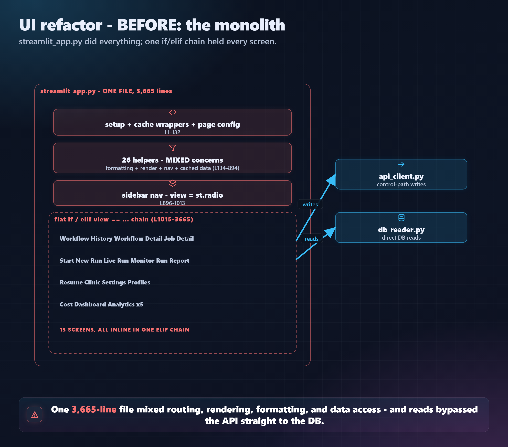
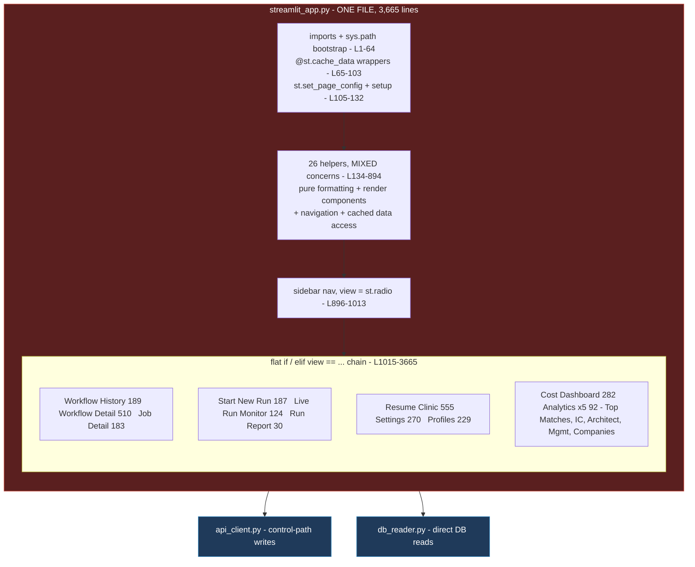
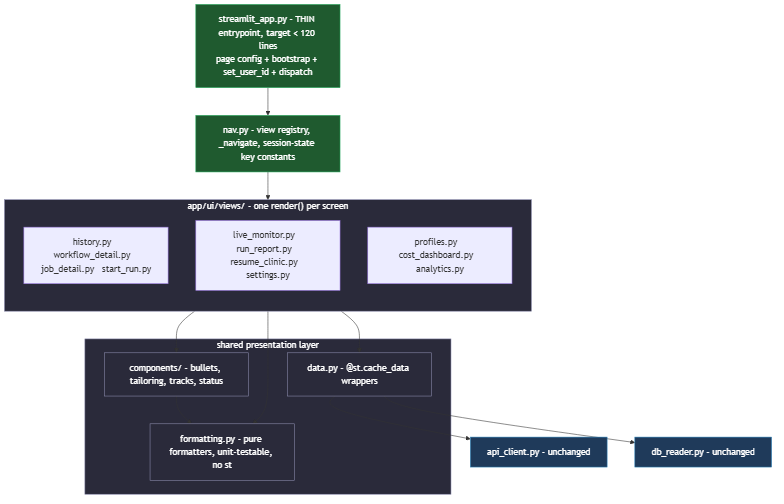
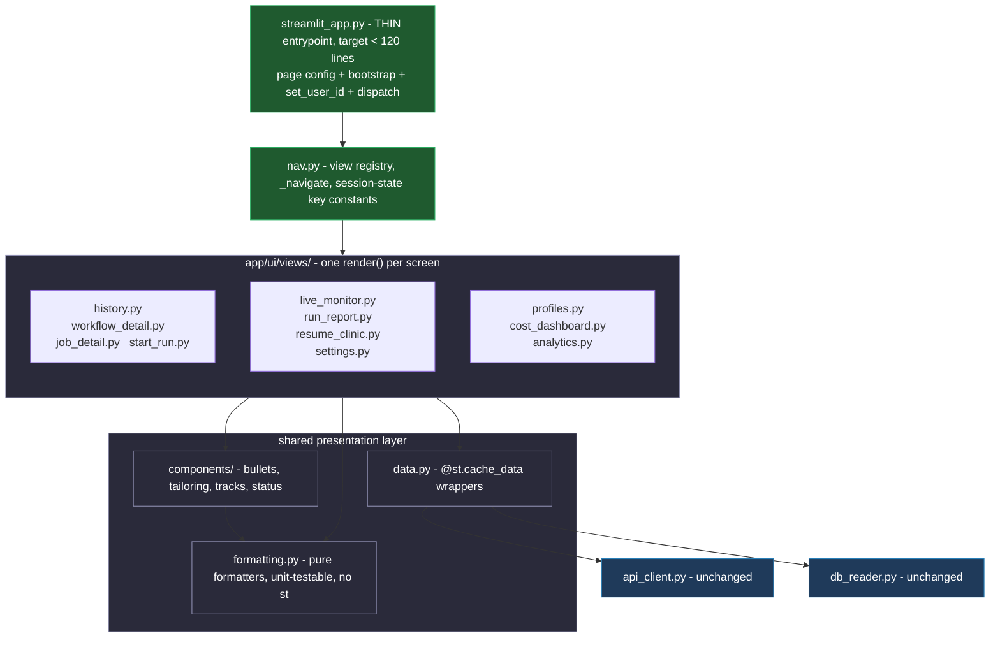

# Streamlit UI Refactor Plan

> **Type:** Refactor design / migration plan (not an ADR — no contract changes).
> **Date:** 2026-05-30 · **Status:** Proposed, phase 0 not started.
> **Scope:** `app/ui/streamlit_app.py` only. No backend, API, schema, or behavior
> changes. The user-visible app must look and behave identically at every step.

---

## 1. Why this exists

`app/ui/streamlit_app.py` is **3,665 lines** — the single largest file in the
codebase by 2.8x (next is `resume_text_renderer.py` at 1,312; everything else is
under 700). It has grown feature-by-feature (ADR-055 tailoring, ADR-060 manual
scoring, ADR-062 profiles, ADR-066 clinic, ADR-068 chat, ADR-070 purge) with no
split pass, drifting from CLAUDE.md's framing of the UI as a "thin control surface
only."

The cost is maintainability, not correctness: it is one file you must scroll to
find anything, a single merge-conflict surface, and a place where a helper for one
screen sits 2,000 lines from where it is used. There is **no business logic** here
— that lives in `services/`, `agents/`, `workflows/`. This is view glue. That is
exactly why it is safe to reorganize, and why the reorganization is overdue.

This document captures the **current state**, the **desired state**, and an
**incremental, low-risk migration plan**.

---

## 2. Current state



> The rendered PNG above is the canonical reference. The Mermaid source below
> ([`images/ui_refactor_before.mmd`](images/ui_refactor_before.mmd)) renders the
> same diagram inline on platforms that support Mermaid. Regenerate the PNG per
> Section 10.



### 2.1 Shape

One module, executed top-to-bottom by Streamlit on every interaction:

```
L1-64      module docstring + imports (api_client, db_reader, cost_breakdown,
           constraint_analyzer, plotly/pandas, sys.path bootstrap)
L65-103    @st.cache_data wrappers (_load_yaml_config, _cached_list_tailorings,
           _cached_get_providers, _cached_list_users)
L105-132   st.set_page_config(...) + page-level setup
L134-894   26 module-level helper functions (mixed concerns — see 2.3)
L896-1013  sidebar navigation: builds st.radio nav, sets `view`, quick links
L1015-3665 15 view blocks dispatched by a flat `if view == ... / elif ...` chain
```

### 2.2 The 15 views (by size — the work-list)

| Lines | View | Notes |
|------:|------|-------|
| 555 | Resume Clinic (L2238) | Largest. Review + overhaul + chat-revise (ADR-068) + export + decisions. |
| 510 | Workflow Detail (L1204) | Per-run unified view: jobs, scores, deep review, advice, prep, settings-used. |
| 282 | Cost Dashboard (L3292) | Aggregates + plotly charts + per-run/per-call tables. |
| 270 | Settings (L2793) | Config view/edit + per-agent model picker + **ADR-070 purge control**. |
| 229 | Profiles (L3063) | ADR-062 onboarding wizard + resume upload/delete. |
| 189 | Workflow History (L1015) | Default landing; runs table, drill-in. |
| 187 | Start New Run (L1897) | Inline settings + custom-URL textarea. |
| 183 | Job Detail (L1714) | Per-job drill-down. |
| 124 | Live Run Monitor (L2084) | Activity feed for the running workflow. |
| 41 | Companies (L3625) | Cross-run analytics. |
| 30 | Run Report (L2208) | Rendered markdown report. |
| 21 | Top Matches (L3574) | Cross-run analytics (uses `render_track_table`). |
| 10 | IC Track (L3595) | Thin wrapper over `render_track_table`. |
| 10 | Architect Track (L3605) | Thin wrapper. |
| 10 | Management Track (L3615) | Thin wrapper. |

### 2.3 The 26 helpers, grouped by real concern

They are currently interleaved in one block; the refactor's first insight is that
they cleanly partition:

- **Pure formatting (no `st.*`, no I/O):** `_fmt_ts`, `score_badge`, `_checked`,
  `_get_nested`, `_word_count`, `_tokenize`, `_safe_int`, `_friendly_stage`,
  `_label_with_cost`, `_section_display`, `_section_order`, `_estimate_track_impact`.
- **Shared render components (`st.*`, reused across views):** `_bullets`, `_para`,
  `_render_one_bullet`, `_render_tailored_sections`, `_render_tailoring_card`,
  `_render_estimated_impact`, `render_track_table`, `_stage_progress`.
- **Navigation / state:** `_navigate` (sets `_pending_nav` + reruns).
- **Cached data access:** `_load_yaml_config`, `_cached_list_tailorings`,
  `_cached_get_providers`, `_cached_list_users`, `_get_config_cached`.

### 2.4 Shared session-state keys (the implicit contract between views)

`current_user_id`, `sidebar_view`, `_pending_nav`, `workflow_id`,
`detail_workflow_id`, `detail_job_id`, `detail_wf_input`, `_detail_wf_synced`,
`wf_history_table`, `rc_last_review`, `config_cache`, `onboard_step`,
`onboard_new_user_id`, `last_status`, `last_response`,
`workflow_reconnect_attempted`, `workflow_reconnect_error`, `purge_confirm`.

These are global (Streamlit's `st.session_state`), so any extracted module can
reach them — but today the key names are string literals scattered across 3,600
lines, which is where typos and drift hide.

### 2.5 Streamlit constraints that shape any refactor

These are not optional; they dictate the target design:

1. **`st.set_page_config` must be the first Streamlit call**, exactly once. It
   stays in the entrypoint, before any view import that might emit `st.*`.
2. **Module-level `st.*` runs at import time.** A view cannot be "just a module
   whose body draws the screen" — importing it would render it. Each view must
   wrap its body in a function (`render()`), called only when that view is active.
3. **One script, re-run every interaction.** There is no long-lived component
   tree. State lives only in `st.session_state`. Extraction must not change when
   code runs, only where it lives.
4. **`@st.cache_data` is keyed by function identity + args.** Moving a cached
   function to another module is fine as long as callers import the one instance.

---

## 3. Desired state

A thin entrypoint that wires page-config, navigation, and a dispatch registry;
everything else in a small, concern-named package.

### 3.1 Target layout

```
app/ui/
  streamlit_app.py        ← thin entrypoint ONLY: set_page_config, load_dotenv,
                            sys.path bootstrap, set_user_id, render sidebar nav,
                            dispatch to the active view's render(). Target < ~120 lines.
  nav.py                  ← navigation + the view registry (name -> render fn),
                            _navigate(), sidebar builder, session-state key constants.
  formatting.py           ← pure formatters (no st, no I/O). Unit-testable.
  data.py                 ← @st.cache_data wrappers over db_reader / api_client.
  components/
    __init__.py
    bullets.py            ← _bullets, _para, _render_one_bullet
    tailoring.py          ← _render_tailoring_card, _render_tailored_sections,
                            _render_estimated_impact, _estimate_track_impact
    tracks.py             ← render_track_table
    status.py             ← score_badge, _stage_progress, _friendly_stage
  views/
    __init__.py           ← registry assembly (imports each view's render)
    history.py            ← render() for Workflow History
    workflow_detail.py    ← render() for Workflow Detail
    job_detail.py
    start_run.py
    live_monitor.py
    run_report.py
    resume_clinic.py      ← largest; may get its own sub-helpers module
    settings.py           ← includes the ADR-070 purge control
    profiles.py
    cost_dashboard.py
    analytics.py          ← Top Matches + IC/Architect/Management Track + Companies
                            (they share render_track_table; keep together)
```

`api_client.py` and `db_reader.py` are **unchanged** — they are already the
correct seams (control-path writes vs. direct DB reads). This refactor only
reorganizes the presentation layer that sits on top of them.



> The rendered PNG above is the canonical reference. Mermaid source:
> [`images/ui_refactor_after.mmd`](images/ui_refactor_after.mmd).



### 3.2 The view contract

Every view module exposes one function:

```python
# app/ui/views/run_report.py
import streamlit as st

def render() -> None:
    """Draw the Run Report screen. Reads inputs from st.session_state; all
    Streamlit calls happen here, never at module import."""
    ...
```

The entrypoint dispatches through a registry instead of an `if/elif` ladder:

```python
# app/ui/nav.py
from app.ui.views import history, workflow_detail, ... , analytics

VIEW_REGISTRY = {
    "Workflow History": history.render,
    "Workflow Detail":  workflow_detail.render,
    ...
    "Companies":        analytics.render_companies,
}

# app/ui/streamlit_app.py (entrypoint)
view = render_sidebar()                 # returns the selected view name
VIEW_REGISTRY[view]()                   # dispatch
```

### 3.3 Session-state keys become named constants

`nav.py` defines the keys once (e.g. `KEY_WORKFLOW_ID = "workflow_id"`), and views
import them. Typos become import errors instead of silent new keys.

---

## 4. Migration plan (incremental, each step ships green)

The ordering principle: **move the lowest-risk, most-shared code first** so later
view extraction has stable imports to lean on; extract **leaf views before hub
views**; never break the running app between commits. Each phase is its own commit.

- **Phase 0 — Skeleton + registry seam + harness, no logic moved. [DONE 2026-05-30]**
  Created the `app/ui/views/` and `app/ui/components/` packages and
  `app/ui/nav.py` (the single source of truth: `NAV_ITEMS`, `NAV_VIEWS`,
  `SEPARATOR`, and an empty `VIEW_REGISTRY`). Wired the entrypoint's sidebar radio
  to `nav.NAV_ITEMS` and its separator guard to `nav.SEPARATOR` (identical
  behavior). Added the verification harness (`tests/v2/test_ui_structure.py`:
  import-smoke, nav-uniqueness, registry-subset-and-callable, render-contract,
  and a source-scan that the entrypoint sources its radio from nav).
  **Refinement vs. the original sketch:** rather than wrap all 15 inline blocks in
  functions up front (a large, risky mass-indent), the registry starts empty and
  the entrypoint keeps its `if/elif` chain. Views cut over to `VIEW_REGISTRY` one
  at a time as they are extracted (Phases 3-4), with the `if/elif` as the fallback
  for not-yet-migrated views. Same end state, lower per-commit risk. 800 tests pass.

- **Phase 1 — Extract pure formatting (`formatting.py`). [DONE 2026-05-30]**
  Moved the 12 pure helpers (`_fmt_ts`, `score_badge`, `_checked`, `_get_nested`,
  `_label_with_cost`, `_friendly_stage`, `_safe_int`, `_word_count`, `_tokenize`,
  `_estimate_track_impact`, `_section_display`, `_section_order`) plus their
  constants (`_STAGE_LABEL`, `_TRACK_KEYWORDS`) to `app/ui/formatting.py`. The
  entrypoint imports them by bare name so call sites are unchanged;
  `score_badge`/`_tokenize` live in formatting for reuse but the entrypoint no
  longer references them. Added `tests/v2/test_ui_formatting.py` (12 tests) — the
  first automated coverage of UI code. Entrypoint 3,665 -> 3,388 lines. 812 pass.

- **Phase 2 — Extract shared components + data access. [DONE 2026-05-30]**
  Split into two commits. **2a:** moved the cached wrappers
  (`_load_yaml_config`, `_cached_*`, `_get_config_cached`) to `app/ui/data.py`.
  **2b:** moved the render components to `app/ui/components/` — `bullets.py`
  (`_bullets`, `_para`), `tailoring.py` (`_render_tailoring_card` + its internal
  helpers `_render_estimated_impact` / `_render_one_bullet` /
  `_render_tailored_sections` + the status-badge constants), `tracks.py`
  (`render_track_table`); the tailoring card is decoupled via an `on_decision`
  callback so it does no I/O. Also relocated the pure `_stage_progress` to
  `formatting.py` (where it belongs) and dropped now-unused entrypoint imports.
  Tests grew (component import-smoke + `_stage_progress` unit test). Entrypoint
  3,388 -> 2,927 lines. 813 pass.

- **Phase 3 — Extract leaf views.** Split into 3a (done) and 3b (pending).
  - **3a [DONE 2026-05-30]:** established the dispatch mechanism — a frozen
    `ViewContext` (the sidebar filters: `min_score` / `search` /
    `include_excluded`) built after the sidebar and passed to every `render(ctx)`;
    a `REGISTRY` in `views/__init__.py` (kept there, not in `nav.py`, so view
    modules import `ViewContext` from the leaf `nav` without a cycle); and a
    registry-dispatch block before the legacy `if/elif` chain. Migrated the
    `ctx`-only views: Run Report (`views/run_report.py`) and the five analytics
    views -> `views/analytics.py` (Top Matches, IC/Architect/Management Track,
    Companies). The structure test now checks `views.REGISTRY` (a subset of
    `NAV_VIEWS`, all callable). Entrypoint 2,927 -> 2,821 lines; 6 views off the
    `if/elif` chain (9 remain). 813 pass.
  - **3b [DONE 2026-05-30]:** moved `_navigate` to `nav.py` (its natural home;
    used by the sidebar and the remaining inline views too), then migrated Live Run
    Monitor (`views/live_monitor.py`), Job Detail (`views/job_detail.py`), and Start
    New Run (`views/start_run.py` - reads `ctx.min_score`). Dropped entrypoint
    imports that left with them (`MAX_LLM_CALLS_PER_RUN`, `load_step_executions` /
    `load_agent_events` / `load_llm_calls` / `load_job_pipeline`, and the now-unused
    `_bullets` / `_para`). Entrypoint 2,821 -> 2,300 lines; 9 views now off the
    `if/elif` chain, 6 hub views remain (Phase 4). 813 pass.

- **Phase 4 — Extract hub views. [IN PROGRESS]** One commit each:
  - [x] Workflow History -> `views/history.py` (was the leading `if`; Workflow
        Detail promoted to the chain's `if`). Entrypoint 2,300 -> 2,107 lines.
  - [x] Cost Dashboard -> `views/cost_dashboard.py`. Entrypoint 2,107 -> 1,809.
  - [x] Profiles -> `views/profiles.py`. Entrypoint 1,809 -> 1,577.
  - [x] Settings (ADR-070 purge control carried intact) -> `views/settings.py`.
        Entrypoint 1,577 -> 1,308.
  - [x] Resume Clinic -> `views/resume_clinic.py` (extracted whole; the body was
        already 4-space indented so it dropped straight into render()). Entrypoint
        1,308 -> 752.
  - [ ] Workflow Detail (the last inline view)

- **Phase 5 — Thin the entrypoint + nav.**
  Move the sidebar builder and `_navigate` into `nav.py`; reduce
  `streamlit_app.py` to page-config + bootstrap + `render_sidebar()` + dispatch.
  Define the session-state key constants and replace literals.

Each phase: app launches, every screen renders, no visual/behaval diff.

---

## 5. Verification (there are no UI tests today)

The UI has **zero automated coverage** — the risk of a silent refactor break is
real. Add a minimal, durable safety net as part of Phase 0:

1. **Import-smoke test.** A test that imports `app.ui.views` and every view module
   and asserts each exposes a callable `render` (or the registry maps every nav
   name to a callable). Catches the #1 refactor hazard — a module that errors on
   import or a missing registry entry — without needing a browser.
2. **Registry-completeness test.** Assert `set(VIEW_REGISTRY) == set(NAV_VIEWS)`
   so a renamed/added view cannot silently lose its screen.
3. **`python -m py_compile`** on every new module in CI-equivalent local run.
4. **Manual launch checklist.** Per phase, run `streamlit run app/ui/streamlit_app.py`
   and click through all 15 views (the `/run` skill or a screenshot pass). This is
   the only way to confirm pixel-level parity; it stays a human step.

Note: import-smoke requires that importing a view module does **not** execute
`st.*` (Section 2.5 #2). The `render()` contract guarantees this, and the test
enforces it — importing a misbehaving view that draws at import time would trip
Streamlit's "called outside a run" and fail the test.

---

## 6. Risks and mitigations

| Risk | Mitigation |
|---|---|
| Module-level `st.*` runs on import (renders/raises) | The `render()` contract; the import-smoke test fails loudly if violated. |
| Circular imports (entrypoint -> views -> components -> ?) | Strict one-directional deps: `formatting` <- `components` <- `views` <- `nav` <- entrypoint. Nothing imports "up". |
| Session-state key drift / typos during the move | Centralize keys as constants in `nav.py` (Phase 5); grep-audit before/after. |
| `@st.cache_data` cache identity changes when moved | Move the function once to `data.py`; all callers import that instance. Verify cache still hits via the manual pass. |
| `set_page_config` called after another `st.*` | Keep it the first call in the entrypoint, before any view import that could emit `st.*` at module scope (none should, per the contract). |
| Hidden cross-view coupling via shared locals | There are none — views only share `st.session_state` and the helper functions, both explicit. Confirmed by the L1015+ blocks being a flat dispatch. |

---

## 7. Non-goals (explicitly out of scope)

- No change to `api_client.py` / `db_reader.py` seams or their contracts.
- No backend, API, schema, agent, or workflow change.
- No new UI features, restyling, or layout changes — parity is the bar.
- No move to a different UI framework. Streamlit stays.
- `resume_text_renderer.py` (1,312 lines) is a cohesive single-responsibility
  renderer; it is **not** part of this refactor.

---

## 8. Definition of done

- `streamlit_app.py` is a thin entrypoint (target < ~120 lines).
- Every view lives in `app/ui/views/<name>.py` behind `render()`, registered in
  `nav.py`; shared code is in `formatting.py` / `components/` / `data.py`.
- Import-smoke + registry-completeness tests pass; the full suite still passes.
- A manual click-through confirms all 15 screens render identically.
- CLAUDE.md's UI file-structure note and `streamlit_app.py`'s docstring are
  updated to point at the new layout.

---

## 9. Tracking

**Commit cadence (decided 2026-05-30):** one commit per phase — 6 commits total
(Phase 0-5), each green and launchable on `main`. If a single phase's diff grows
too large to review (Phase 4's hub views are the likely candidate), it may be
split into smaller commits, but the default is per-phase.

This document is the source of truth for sequencing; update Section 4 as phases
land.

---

## 10. Diagrams

The before/after visuals appear in Sections 2 and 3 as a canonical PNG (the
convention used by `agent_graph.png` / `api_surface.png`) plus the equivalent
Mermaid inline (renders on GitHub / IDE preview). All four artifacts live beside
the other architecture diagrams:

- [`images/ui_refactor_before.mmd`](images/ui_refactor_before.mmd) +
  `ui_refactor_before.png` — the monolith.
- [`images/ui_refactor_after.mmd`](images/ui_refactor_after.mmd) +
  `ui_refactor_after.png` — the target package.

The PNGs were rendered 2026-05-30 with mermaid-cli. To regenerate after editing a
`.mmd` source, run locally:

```
npx -y @mermaid-js/mermaid-cli -i docs/architecture/images/ui_refactor_before.mmd \
    -o docs/architecture/images/ui_refactor_before.png -b transparent
npx -y @mermaid-js/mermaid-cli -i docs/architecture/images/ui_refactor_after.mmd \
    -o docs/architecture/images/ui_refactor_after.png -b transparent
```

(The first run downloads mermaid-cli + a headless Chromium.)
