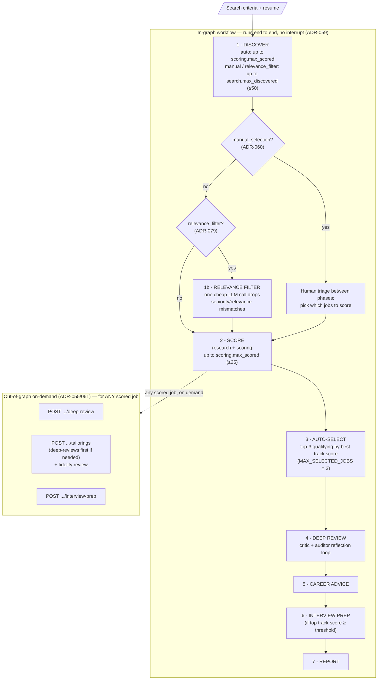

# Workflow Model – jobsearchagent-v2

---

## 1. Purpose

This document defines all workflows in **jobsearchagent-v2**.

It specifies:

* how data flows through the system
* which agents and services are used
* where decisions are made
* where loops occur
* where human input is required
* when workflows stop

This document is the **execution blueprint** for the system.

---

## 2. Workflow Strategy

The system is a **funnel**: it casts wide at discovery and narrows, stage by
stage, to a small set of jobs that receive the most expensive treatment. The
funnel gets narrower — and the per-job accuracy and focus get higher — from left
to right.

```text
Discover many cheaply → score the worthwhile → deeply analyze the few
```

The funnel's width is a **human decision bounded by a cost ceiling** (ADR-061),
not a fixed cap:

* `scoring.max_scored` (default 10, ceiling 25) — how many jobs get scored.
* `search.max_discovered` (default/ceiling 50) — the manual-mode wide net.
* `MAX_SELECTED_JOBS` (3) — how many auto-qualify for in-graph deep review.
* `MAX_LLM_CALLS_PER_RUN` (200) — the absolute per-run cost backstop.

All workflows are:

* orchestrator-driven
* state-based
* bounded (by the caps above)
* observable
* **non-interruptible** — the graph runs end to end with no `interrupt()`
  (ADR-059). Human involvement happens *between phases* (manual scoring triage,
  ADR-060) or *out of the graph* (on-demand tailoring / deep review / interview,
  ADR-055/061), never as an in-graph pause.

---

## 3. Primary Execution Flow

In-graph the workflow runs straight through. Off the graph, the human can pull
**any scored job** through tailoring, deep review, or interview prep on demand —
the funnel's narrow end is owner-driven, not limited to the auto-selected few.



The narrowing, in numbers: discover up to 50, score up to 25, auto-select 3 for
in-graph deep review — while the human can additionally push any scored job
through the out-of-graph operations. Each step to the right costs more per job
and produces higher-fidelity output.

---

## 4. Job Discovery Workflow

### Purpose

Fetch jobs using automated discovery and normalize them into a common schema.

ADR-064: discovery honors the run's `search_criteria`. When `roles` are present,
`discover_jobs` builds a per-run Adzuna scraper from the profile's roles +
locations (via `WorkflowDependencies.adzuna_scraper_factory`) and skips the senior
startup Adzuna (`skip_builtin_adzuna`); title relevance is derived from the role
tokens so non-senior roles survive the gate. No roles -> the built-in startup
scraper runs (backward compatible). Locations are one-per-line so "City, State"
is preserved; "Remote" triggers the remote search.

ADR-065 adds per-profile experience targeting (opt-in, off by default):
`search.max_years_experience` drops postings whose description states a minimum
above the cap (regex, no LLM; silent JDs kept), and `search.exclude_senior` drops
senior roles via Adzuna `what_exclude` + the title gate.

ADR-080 adds an opt-in posting-age cap (`search.max_posting_age_days`): a
deterministic filter in `discover_with_stats` (after the experience filter) drops
postings older than N days using `posted_at`; postings with no parseable date are
kept. Stale postings correlate with dead apply links. This runs upstream of both
the ADR-079 relevance filter and scoring. The funnel `stats` gains
`age_filter_dropped`. `posted_at` is persisted on the `jobs` row and surfaced as
"Posted N days ago" + a stale badge on Job Detail.

---

### Inputs

* user search criteria (role, location, keywords)
* job sources (scraper/API config)

---

### Outputs

* normalized job list
* persisted job records

---

### Steps

```text
1. Receive search criteria
2. Call Job Discovery Service
3. Fetch jobs from supported sources
4. Normalize job data into common schema
5. Deduplicate jobs
6. Persist jobs to SQLite
7. Update workflow state with job list
```

---

### Services Used

* job discovery service
* job normalization service

---

### Stop Conditions

* max jobs reached
* no more results from sources

---

## 5. Resume Profile Workflow

### Purpose

Load or create the resume profile used across workflows.

---

### Inputs

* stored resume profile OR
* uploaded resume

---

### Outputs

* structured resume profile
* persisted resume version (if new)

---

### Steps

```text
1. Check if user selected existing profile
2. If new upload:
   a. Parse resume
   b. Extract structured profile
   c. Apply PII minimization
   d. Save new version
3. Load selected profile into workflow state
```

Per-profile scoping (ADR-062): the resume load and store are scoped to the run's
owner. `load_resume` is DB-first (`get_by_id(resume_id)`); on a parse, it stores
under `state["user_id"]` (defaulting to `"0"`). Each profile keeps its own active
resume — the resume picker lists only the active profile's resumes, and creating
one deactivates only that profile's prior resumes.

---

### Services Used

* resume parser
* profile extractor

---

### Stop Conditions

* valid profile available

---

## 6. Scoring Workflow

### Purpose

Evaluate multiple jobs against the resume profile.

---

### Inputs

* resume profile
* normalized job list

---

### Outputs

* structured job scores
* ranked job list

---

### Steps

```text
1. For each job:
   a. Call Scoring Agent
   b. Receive structured JobScore
2. Aggregate results
3. Rank jobs by score
4. Persist job scores
5. Update workflow state
```

---

### Agents Used

* Scoring Agent

---

### Constraints

* no ReAct
* no reflection
* batch-friendly
* low-cost operation

---

### Stop Conditions

* all jobs processed
* max jobs reached

---

## 7. Auto-Selection (no HITL pause)

### Purpose

Pick which scored jobs receive in-graph deep review — **automatically**, with no
workflow pause. The in-graph `interrupt()`-before-selection model described in
earlier drafts was retired in ADR-059; the graph now runs end to end.

---

### Inputs

* scored job list (with per-track scores)

---

### Outputs

* `selected_jobs` — up to `MAX_SELECTED_JOBS` (3) jobs that qualify

---

### Steps

```text
1. Filter to jobs where ANY *active* track score (the profile's scoring.tracks
   subset; default all of technical/architecture/leadership, ADR-071)
   >= effective_config.scoring.min_match_score (default 75)
   — use qualifies_for_deep_review() / best_track_score() with
   active_track_keys(state), never overall_score; an inactive (null) track
   never qualifies a job
2. Sort qualifying jobs by best track score, descending
3. Keep the top MAX_SELECTED_JOBS (3)
4. If none qualify, deep_review_gate skips straight to generate_report
```

The `await_job_selection` node does NOT call `interrupt()`.

---

### Where the human still chooses

* **Before scoring (ADR-060):** when `scoring.manual_selection` is on, the run
  parks between phases at `awaiting_scoring_selection` and the human picks which
  discovered jobs to score. This is a phase boundary, not an in-graph pause.
* **Before scoring, automated (ADR-079):** when `search.relevance_filter` is on
  (and manual selection is off), the `relevance_filter` node runs one cheap LLM
  pass that drops seniority/relevance mismatches before scoring — the automated
  cousin of the manual triage above. See `relevance_filter_design.md`.
* **After scoring (ADR-055/061):** the human can pull **any scored job** — not
  just the auto-selected 3 — through out-of-graph tailoring, deep review, or
  interview prep (see Section 11 + the on-demand operations).

---

### Stop Conditions

* up to `MAX_SELECTED_JOBS` qualifying jobs selected, or
* no qualifying jobs → deep review (and everything downstream) is skipped

---

## 8. Deep Review Workflow (Core)

### Purpose

Perform high-quality analysis for selected job(s).

---

### Inputs

* selected job
* resume profile
* job score
* workflow state

---

### Outputs

* final review
* career advice
* analysis artifacts

---

### Steps

```text
1. Run Research Agent
2. Run Resume Critic
3. Run Review Auditor
4. Evaluate audit score
5. If needed → repeat Critic + Auditor (reflection loop)
6. Stop when threshold or limits reached
7. Run Career Advisor
8. Persist outputs
```

---

### Agents Used

* Research Agent
* Resume Critic
* Review Auditor
* Career Advisor

---

### Constraints

* bounded ReAct in Research Agent
* bounded reflection loop

---

### Stop Conditions

```text
audit_score ≥ threshold
OR max review rounds reached
OR stagnation detected
```

---

## 9. Reflection Loop (Nested)

### Purpose

Improve critique quality iteratively.

---

### Steps

```text
Resume Critic → Review Auditor → Evaluate → Repeat
```

---

### Inputs

* current review output
* prior feedback

---

### Outputs

* improved review

---

### Limits

```text
MAX_REVIEW_ROUNDS = 3
```

---

### Stop Conditions

* quality threshold reached
* no meaningful improvement
* max rounds reached

---

## 10. Interview Preparation Workflow

### Purpose

Generate targeted interview preparation.

---

### Trigger Conditions

* high match score
* OR user request

---

### Inputs

* job description
* resume profile
* research context
* review outputs

---

### Outputs

* interview preparation plan

---

### Steps

```text
1. Call Interview Coach Agent
2. Generate prep content
3. Persist output
```

---

### Agent Used

* Interview Coach Agent

---

## 11. Tailoring Workflow

### Purpose

Generate improved resume suggestions aligned with a specific job.

---

### Trigger Path

Tailoring runs via a single out-of-graph path (ADR-055; the in-graph path was retired in ADR-059).

| Path | Trigger | When | Approval mechanism |
|------|---------|------|--------------------|
| Out-of-graph router | `POST /workflows/{wf}/jobs/{job}/tailorings` | Post-workflow, per **scored** job, on demand | `POST /tailorings/{id}/decisions` writes the `decision` column |

The out-of-graph path is the only path because tailoring intent is per-job, post-hoc, and repeatable — properties that don't fit a single-shot graph lifecycle. There is no in-graph tailoring node and no `interrupt()` in the workflow.

ADR-061: tailoring is available for **any scored job**, not only the auto-selected 3. If the chosen job has no deep-review row yet, the endpoint runs the critic+auditor loop on demand first (`auto_deep_review=true`, default) so the Tailoring Agent gets real review context.

---

### Inputs

* original resume profile
* job description
* `final_resume_review` (from `resume_reviews`, per job)
* `career_advice` (from `career_advice`, per job)

---

### Outputs

* `TailoredResumeDraft` persisted to `tailored_resumes`
* `FidelityReview` persisted alongside the draft in `tailored_resumes.fidelity_review_json`
* User decision persisted as `tailored_resumes.decision` ∈ {approve, revise, reject}

---

### Steps

```text
1. Call Tailoring Agent
2. Generate suggestions (every claim carries supporting_evidence)
3. Call Fidelity Reviewer (always — never skipped)
4. Persist draft + fidelity review to tailored_resumes
5. Surface to user (out-of-graph REST decision; no graph interrupt)
6. Record decision
```

---

### Agents Used

* Tailoring Agent
* Fidelity Reviewer

---

## 11b. On-Demand Operations (ADR-061)

Three out-of-graph operations let the human carry **any scored job** to the
narrow end of the funnel, regardless of whether it was auto-selected. All three
follow the ADR-055 shape: read state from the checkpointer, run agents directly,
persist via repos, no `interrupt()`.

| Endpoint | Runs | Persists |
|---|---|---|
| `POST /workflows/{wf}/jobs/{job}/deep-review` | ResumeCritic + ReviewAuditor reflection loop (shared `app/services/deep_review_runner.py::review_one_job`) | `resume_reviews` (rounds + final) |
| `POST /workflows/{wf}/jobs/{job}/tailorings` | TailoringAgent + FidelityReviewer (deep-reviews first if needed) | `tailored_resumes` |
| `POST /workflows/{wf}/jobs/{job}/interview-prep` | InterviewCoach | `career_advice` (prep row) |

The single-job reflection loop is shared with the in-graph `deep_review` node so
both run identical logic.

---

### Constraints

* no fabricated content
* must be evidence-bound
* Fidelity Reviewer must run after every Tailoring Agent call on both paths
* missing experience must be labelled as `claim_type="gap"`, never rewritten as if present

---

## 12. Reporting Workflow

### Purpose

Generate final output for the user.

---

### Inputs

* scoring results
* review outputs
* career advice
* interview prep
* tailored resume

---

### Outputs

* structured report
* downloadable formats

---

### Steps

```text
1. Aggregate all outputs
2. Format report
3. Generate Markdown / DOCX / PDF
4. Persist report
5. Return to UI
```

---

### Services Used

* report generator

---

## 13. Human-in-the-Loop Workflow

### Purpose

Allow user control over decisions.

---

### Pattern

```text
Backend pauses → UI displays → User decides → Backend resumes
```

---

### Decision Points

* job selection
* deep review confirmation (optional)
* tailoring approval
* interview prep trigger
* application status

---

### Requirements

* state must persist pause context
* decisions must be logged

---

## 14. Error Handling Workflow

### Purpose

Handle failures safely.

---

### Types

* LLM failure
* tool failure
* schema validation failure

---

### Strategy

```text
Retry once → Attempt recovery → Fail gracefully
```

---

### Outputs

* error state in workflow
* logged error event

---

## 15. Workflow State Transitions

Each workflow step updates state:

```text
initialized
jobs_fetched
profile_loaded
jobs_scored
awaiting_user_selection
deep_review_in_progress
review_completed
awaiting_tailoring_approval
completed
failed
```

---

## 16. Observability Integration

Each workflow step logs:

```text
workflow_id
step_name
start_time
end_time
status
agent_used
tokens_used
cost
errors
```

---

## 17. Parallelization Strategy (Future-Ready)

Initial execution:

```text
Sequential
```

Future optimization:

```text
Parallel scoring
Parallel research
Parallel deep reviews (multi-job)
```

Design ensures parallelization can be added without changing logic.

---

## 18. Final Workflow Principle

All workflows must follow:

* centralized orchestration
* explicit state transitions
* bounded execution
* structured outputs
* observable execution
* human-controlled decisions

The system must never:

* run uncontrolled loops
* allow agents to coordinate independently
* execute without traceability
* bypass user decisions

---

# End of Document
