# LinkedIn Article Draft
# "From Job Seeker to AI Builder: What I Learned Building an Agentic AI Application"

---

> **Publishing note:** This is a draft. Diagrams are in Mermaid format — export them as images before posting to LinkedIn. Suggested tool: paste each diagram at mermaid.live → Download PNG.

---

## HEADLINE OPTIONS (pick one)

1. I'm job hunting. So I built an AI agent to do it for me — and learned more than I expected.
2. From Job Seeker to AI Builder: A Practical Guide to Agentic AI Patterns
3. I built an AI-powered Job Search Agent in 2 days. Here's everything I learned about Agentic AI.

---

## OPENING HOOK

I'm currently in the middle of a job search.

Like most people in that position, I was spending hours every day scanning job boards, copy-pasting descriptions, and trying to figure out which roles were actually worth applying to. The process is exhausting, repetitive, and frankly — perfect for automation.

So instead of just searching for jobs, I decided to *build* something. Specifically: an agentic AI application that scrapes job postings, reads my resume, scores every job against my background across three career tracks, and even tailors my resume for the roles I want to apply to.

In the process, I learned more about how agentic AI applications actually work than any course had taught me. This article is my attempt to share those learnings — in plain language, with real examples from the code I wrote.

Whether you're a software engineer curious about AI, a tech leader exploring what's possible, or someone who just wants to understand what "agentic AI" actually means beyond the buzzword — this is for you.

---

## PART 1: What Is an Agentic AI Application, Really?

Let's start simple. Most people's first experience with AI is a chatbot: you ask a question, you get an answer. That's it. One shot. The AI doesn't *do* anything — it just responds.

An **agentic AI application** is different. The AI doesn't just respond — it **acts**. It can use tools, make decisions, loop back on its own output, and keep going until it reaches a goal.

Here's the core idea:

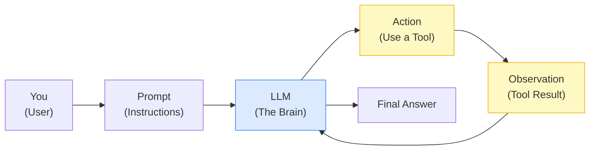

The critical difference is the **loop**. The LLM takes an action, observes the result, then decides what to do next. This loop continues until the task is complete.

In my job search agent:
- The "tools" are job scrapers (fetching listings from the web) and my resume
- The "action" is scoring each job
- The "observation" is the structured score result
- The "loop" runs for every batch of jobs until all are scored

---

## PART 2: Three Things Every Agent Needs

Before writing a single line of code, I had to understand what an agent is actually made of. From my coursework on LangChain and agentic AI systems, I distilled it to three things:

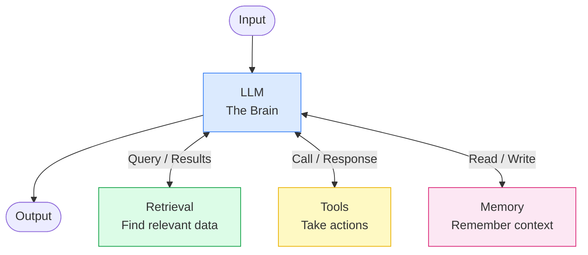

**The Brain (LLM):** This is Claude, GPT, or any large language model. It reads context, reasons about it, and decides what to do.

**Tools:** These are things the LLM can *call* — APIs, databases, functions, web scrapers. In my app, the Adzuna job search API is a tool. So is the PDF parser that reads my resume.

**Memory:** Context the agent can read from and write to across steps. In my app, this is a SQLite database (for job records) and a cached profile file (for resume data). Without memory, every run starts from scratch.

---

## PART 3: Workflows vs. Agents — An Important Distinction

One thing my courses made very clear: **not everything that uses an LLM is an agent**.

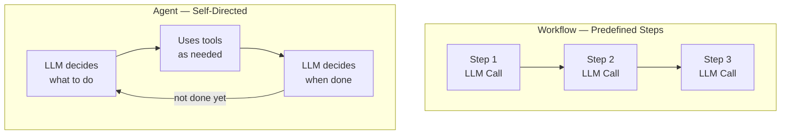

A **workflow** has a predefined sequence of steps. You tell it exactly what to do: first parse the resume, then score the jobs, then show results. The LLM is a participant in a script you wrote.

An **agent** is self-directed. Given a goal, it decides which tools to use, in what order, and when it's done. The LLM is in charge.

My job search application is actually a **workflow** — I orchestrate the steps explicitly. This is intentional. For production systems, workflows are more predictable, cheaper, and easier to debug. Pure agents are powerful but harder to control.

> **Key insight:** For most business applications, a well-designed workflow beats a fully autonomous agent. Save true autonomy for tasks where the steps genuinely can't be predefined.

---

## PART 4: The 8 Patterns I Used (And What They Mean)

This is the heart of the article. Here are the agentic AI patterns I discovered while building — explained simply, with a diagram for each.

---

### Pattern 1: Structured Output

**The problem:** LLMs return free text. Free text is hard to use in code — you can't easily extract fields, validate ranges, or store it in a database.

**The solution:** Tell the LLM to return JSON. Then validate that JSON against a strict schema before your code ever touches it.

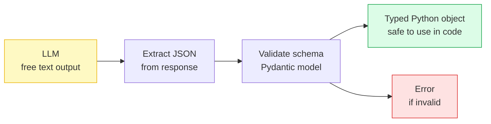

In my app, every Claude response is validated by a Pydantic model before it's used. A job score is never just a string — it's a `TrackScore` object with a guaranteed integer between 0 and 100, a summary string, and a boolean recommendation flag. If Claude returns garbage, the error is caught at the boundary, not somewhere deep in the application.

**Why it matters:** This is the most important pattern in any production agentic system. Without it, your application is only as reliable as the LLM's mood on any given call.

---

### Pattern 2: Prompt-as-Template

**The problem:** Hardcoding prompts inside Python functions is messy, hard to read, and impossible to improve without touching code.

**The solution:** Store prompts as separate files with named placeholders. Load and fill them at runtime.

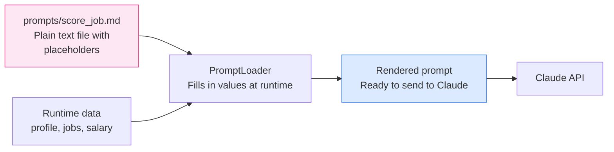

My prompts live in a `prompts/` folder as readable Markdown files. The scoring prompt looks like a real document: it explains the scoring criteria, lists the active tracks, and includes the candidate profile and job listings as XML sections. Anyone can read and improve it — no Python knowledge required.

**Why it matters:** Prompt engineering is ongoing work. If your prompt is buried in code, iteration is slow. Treat prompts like configuration, not constants.

---

### Pattern 3: Cache-Aside (Avoid Redundant LLM Calls)

**The problem:** Parsing my resume with Claude costs tokens and takes a few seconds. My resume doesn't change between runs — why pay for the same extraction every time?

**The solution:** Cache the result. Check if the cache is fresh before calling the LLM.

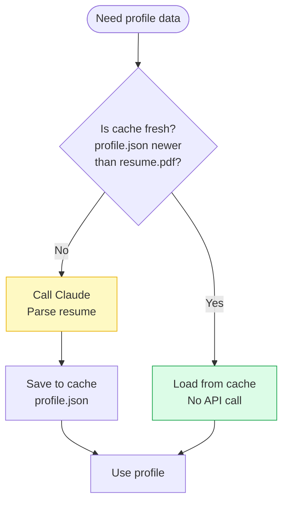

The first run parses the resume and saves the result to `data/profile.json`. Every subsequent run loads from the cache in milliseconds. If I update my resume, the cache is automatically detected as stale and re-parsed.

**Why it matters:** LLM calls cost money and time. Never make the same call twice if the input hasn't changed.

---

### Pattern 4: Pre-Filter Gate (Cheap Before Expensive)

**The problem:** Job scrapers return noise — hotel managers, civil engineers, Java developers, sales reps. Sending all of these to Claude wastes tokens.

**The solution:** Run cheap, fast filters *before* the expensive LLM call. Only jobs that pass all gates reach Claude.

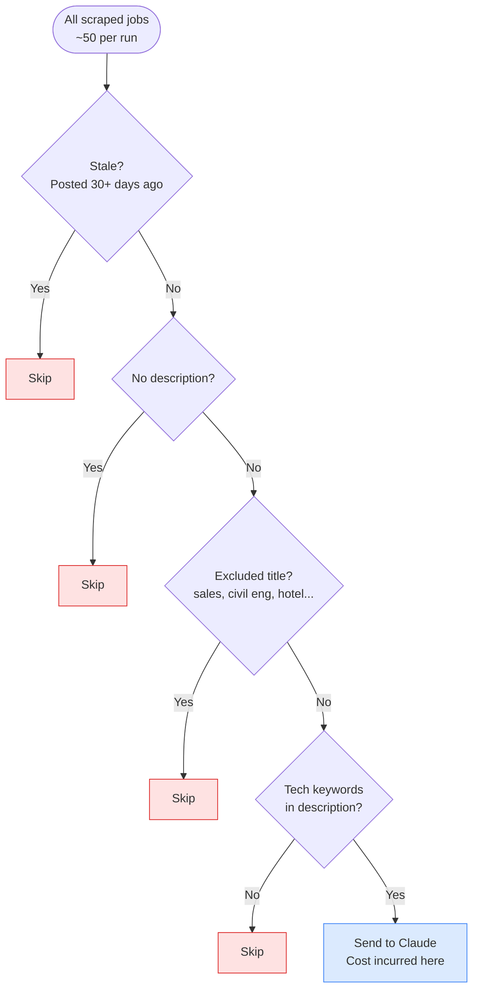

In practice, these four filters eliminate 30–50% of scraped jobs before Claude ever sees them. The total API cost per run stays under $0.05.

**Why it matters:** LLM costs scale with volume. A few simple rules enforced early in the pipeline can dramatically reduce spend without affecting quality.

---

### Pattern 5: Batched Fan-Out

**The problem:** I have 50 jobs to score. Calling Claude once per job = 50 API calls. Slow and expensive.

**The solution:** Group jobs into batches. Send 5 jobs in a single API call and get 5 scores back.

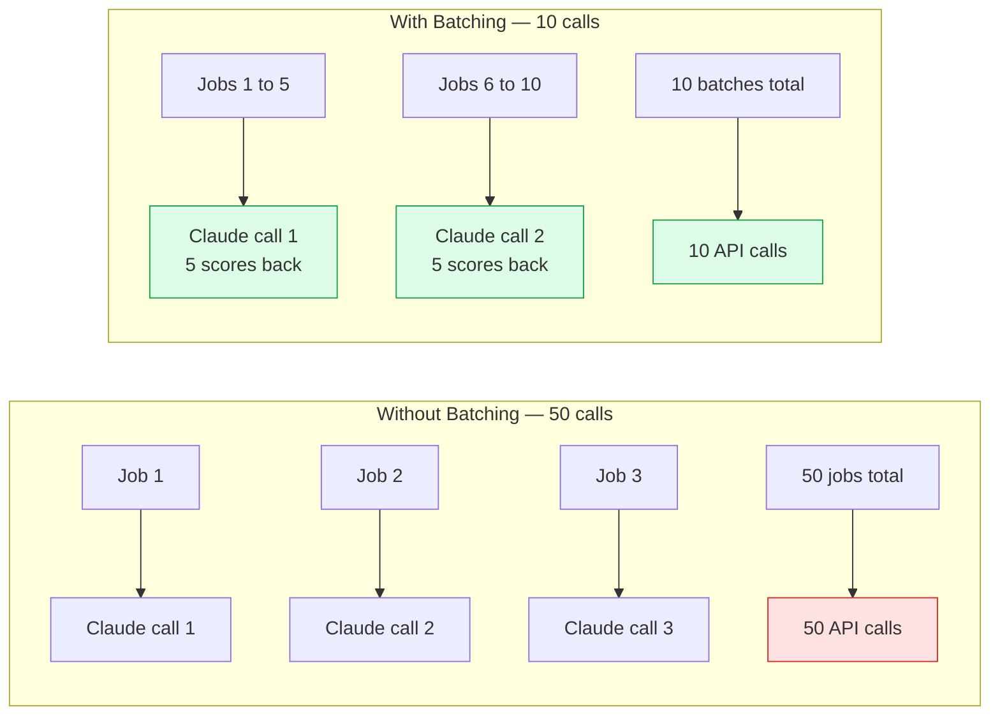

Each job gets an index tag in the prompt. Claude returns a JSON array with one score per index. The code maps scores back to jobs by index — safe even if Claude reorders the output.

**Why it matters:** Batching is one of the highest-leverage optimizations in agentic systems. 10 API calls instead of 50 means 5× faster runs and 5× lower cost.

---

### Pattern 6: Pipeline State Machine

**The problem:** Jobs flow through a lifecycle — from found, to scored, to applied, to rejected or offered. Without explicit state tracking, it's hard to know "which jobs still need scoring?" or "which applications are active?"

**The solution:** Define explicit states and store them in the database. State transitions are intentional, not accidental.

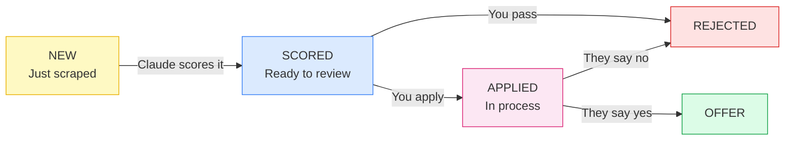

`get_by_status(NEW)` gives me exactly the jobs that need scoring. `get_by_status(APPLIED)` shows my active applications. Every transition is recorded with a timestamp.

**Why it matters:** State machines make complex workflows manageable. They answer "where is this item in the process?" at any moment — critical for observability in production systems.

---

### Pattern 7: Retry with Exponential Backoff

**The problem:** APIs fail. Network hiccups, rate limits, temporary server errors — these are facts of life. A single failure shouldn't crash a 50-job scoring run.

**The solution:** Retry automatically, but wait longer between each attempt.

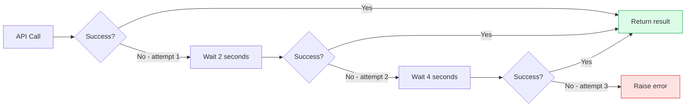

I use a library called `tenacity` which adds this behaviour with a single decorator. Every Claude API call and every HTTP scraper request gets 3 attempts with exponential backoff (2s → 4s → 8s).

**Why it matters:** Without retry logic, a single rate-limit error during a 50-job scoring run wastes the entire run. With it, the error is invisible to the end result.

---

### Pattern 8: Multi-Track Scoring (One Call, Many Dimensions)

**The problem:** I'm open to three different career tracks — IC engineer, solutions architect, and engineering manager. Scoring each job against all three tracks separately would triple my API calls.

**The solution:** Tell Claude all active tracks in a single prompt. Get all three scores back in one response.

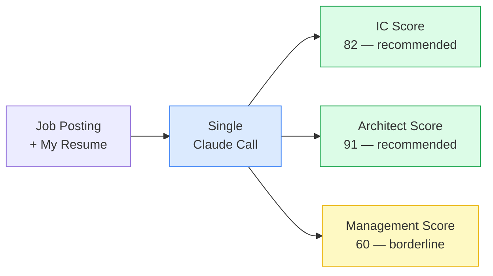

The prompt lists the active tracks. Claude returns a score object for each. If a track is disabled in config, Claude returns null for it — no wasted tokens.

**Why it matters:** When a single LLM call can return multiple useful outputs, take advantage of it. Don't make N calls when one call with N outputs will do.

---

## PART 5: What I Built

Putting these patterns together, here's the application I ended up with:

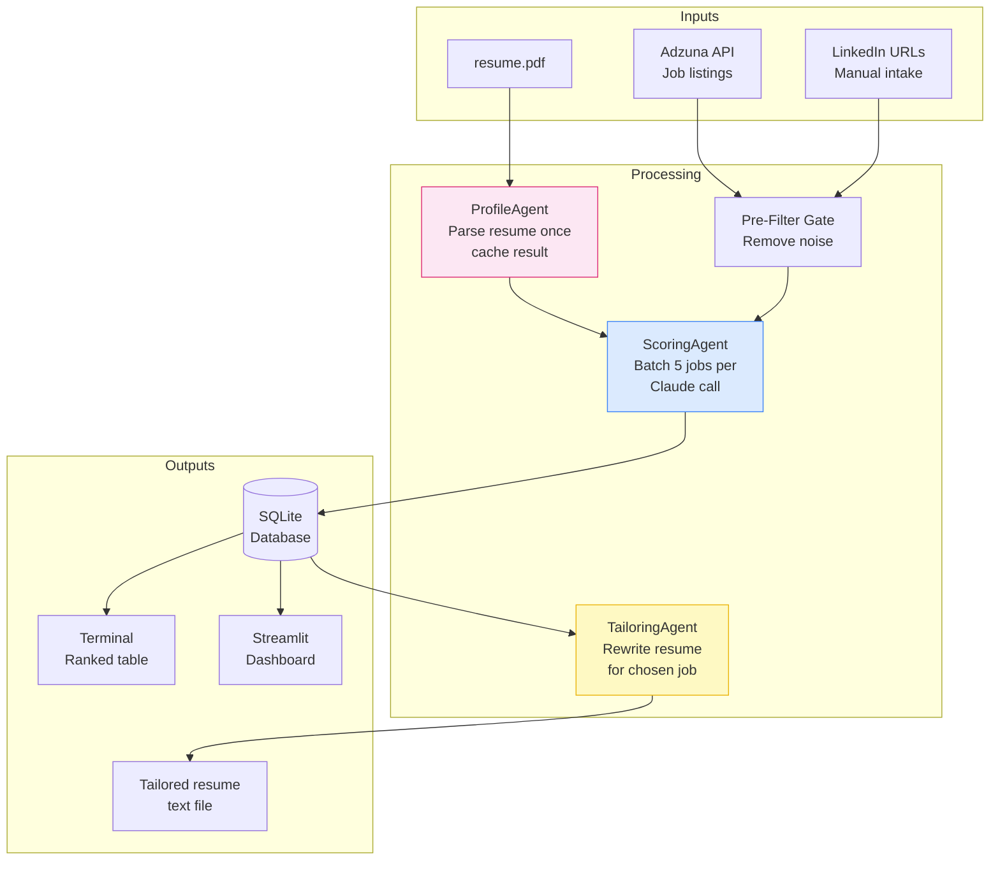

Three commands drive everything:

```bash
python main.py              # scrape → filter → score → show results
python main.py --list       # show everything in the database
python main.py --tailor 42  # tailor resume for job ID 42
streamlit run dashboard.py  # browser dashboard with charts
```

The full source code, documentation, and architecture diagrams are on GitHub: **github.com/suthrams/jobsearchagent**

---

## PART 6: What Surprised Me

**1. Structured output is non-negotiable.**
I tried a version without Pydantic validation early on. Claude returned slightly different JSON shapes on different calls and the application crashed in unpredictable ways. Adding validation at every boundary immediately made the system stable.

**2. Prompt engineering is a skill.**
Writing a prompt that reliably returns the right JSON structure — with correct score ranges, sensible summaries, and consistent recommendations — took more iteration than any of the Python code. Storing prompts as files made this much easier.

**3. The pre-filter was more valuable than I expected.**
I assumed the LLM would easily dismiss irrelevant jobs on its own. It can — but at a cost. Simple keyword filters eliminated almost half the scraped listings before Claude ever saw them, with zero false negatives on roles I actually cared about.

**4. Building with an AI coding assistant changed how I learn.**
I used Claude Code (Anthropic's AI coding tool) throughout. The experience was genuinely different from googling or reading docs. I could say "explain why this pattern is better than X" and get a contextual answer tied to my specific code. The feedback loop was immediate. I learned faster, but I also had to stay engaged — the AI generates plausible-looking code that still requires you to understand and review it.

**5. Simple beats sophisticated.**
I was tempted to use LangChain or LangGraph (which I studied in my courses). I deliberately chose not to. Direct SDK calls, simple Python classes, and Pydantic models gave me complete control and zero framework magic to debug. For a v1, simplicity won.

---

## PART 7: My Advice for Getting Started

If you want to build your first agentic AI application, here's my honest advice:

**Start with a real problem you have.** Don't build a demo. Build something you'll actually use. The constraints of a real use case force better decisions than toy examples.

**Use structured output from day one.** Every Claude/GPT response should be JSON validated against a Pydantic model. This single habit will save you hours of debugging.

**Skip the frameworks initially.** LangChain and LangGraph are powerful. But learn to build without them first. Understand what the framework is doing before it abstracts it away from you.

**Put your prompts in files.** The moment you hardcode a prompt in a Python string, you've made it harder to improve. Separate prompts from code from day one.

**Instrument everything.** Log every API call with token counts. You'll be surprised how quickly costs add up and where your time is actually being spent.

---

## CONCLUSION

I set out to automate my job search. I ended up with a working application, a much deeper understanding of agentic AI, and a codebase I'm genuinely proud of.

The eight patterns in this article — structured output, prompt-as-template, cache-aside, pre-filter gate, batched fan-out, pipeline state machine, retry with backoff, and multi-track scoring — aren't exotic research ideas. They're practical, learnable techniques that show up in almost every production agentic system.

The best way to learn them is to build something real. Pick a problem, start small, and let the constraints of the real world teach you what matters.

I'm still job hunting. But now I have an AI agent doing part of the work for me — and a much clearer picture of how to build the next one.

---

## Resources & References

**GitHub repository:** github.com/suthrams/jobsearchagent
(Full source code, architecture diagrams, per-file documentation, and user guide)

**Courses that helped:**
- Introduction to Generative AI (Google / Coursera)
- Introduction to LangChain (DeepLearning.AI)
- Deploying Agentic AI Systems in Production

**Books worth reading:**
- *Designing Machine Learning Systems* — Chip Huyen (production ML thinking, applies to agentic systems)
- *Building LLM Applications for Production* — Chip Huyen (free online, highly practical)
- *The Pragmatic Programmer* — Hunt & Thomas (timeless software design principles)

**Key tools used:**
- [Anthropic Claude API](https://console.anthropic.com) — the LLM powering all reasoning
- [Claude Code](https://claude.ai/code) — AI coding assistant (used throughout development)
- [Pydantic](https://docs.pydantic.dev) — data validation for structured output
- [Adzuna API](https://developer.adzuna.com) — job listings API (free tier available)
- [Streamlit](https://streamlit.io) — rapid dashboard UI

---

*I write about software engineering, AI applications, and the intersection of technology and career. If this was useful, follow me for more. And if you're building something similar — I'd love to hear about it in the comments.*

---

## EDITOR'S NOTES (before publishing)

- [ ] Export all Mermaid diagrams as PNG images (use mermaid.live)
- [ ] Add 2-3 screenshots of the actual running application (terminal output, dashboard)
- [ ] Add a personal photo or project screenshot as the cover image
- [ ] Trim to ~1800 words for LinkedIn (current draft is ~2400 — cut Part 3 or shorten patterns)
- [ ] Add 5-7 hashtags: #AI #GenerativeAI #SoftwareEngineering #AgenticAI #Python #JobSearch #LLM
- [ ] Post on a Tuesday or Wednesday morning for best LinkedIn reach
