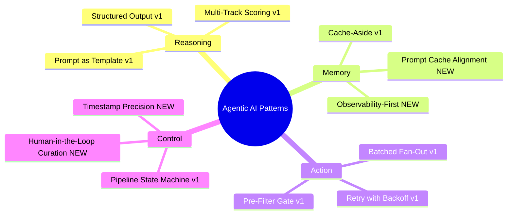
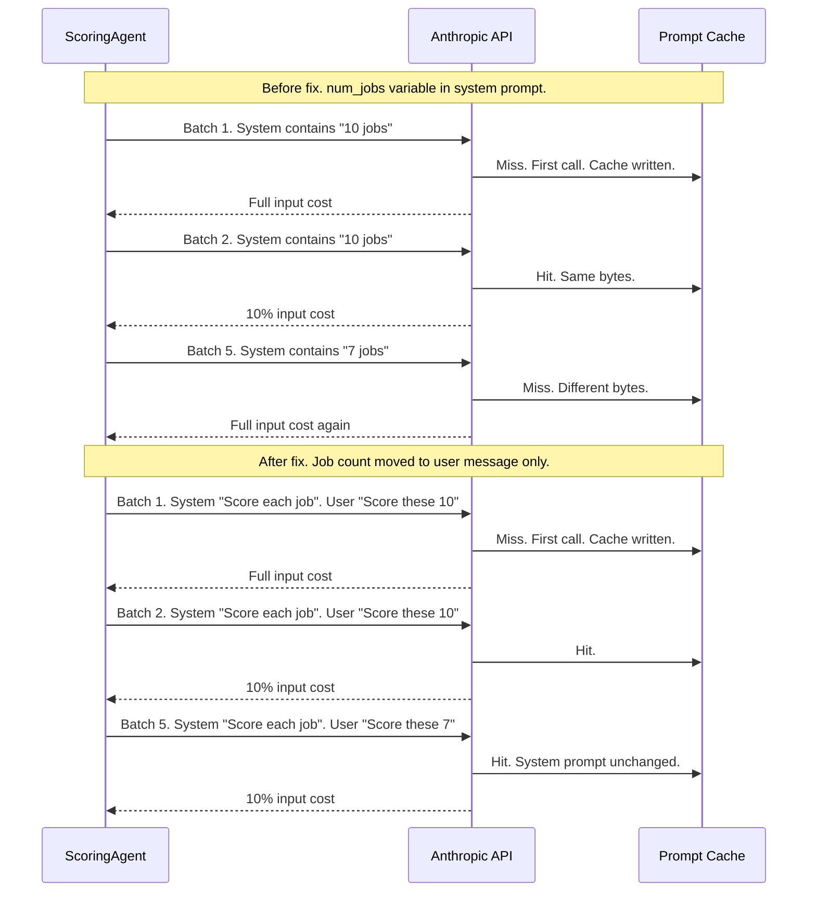
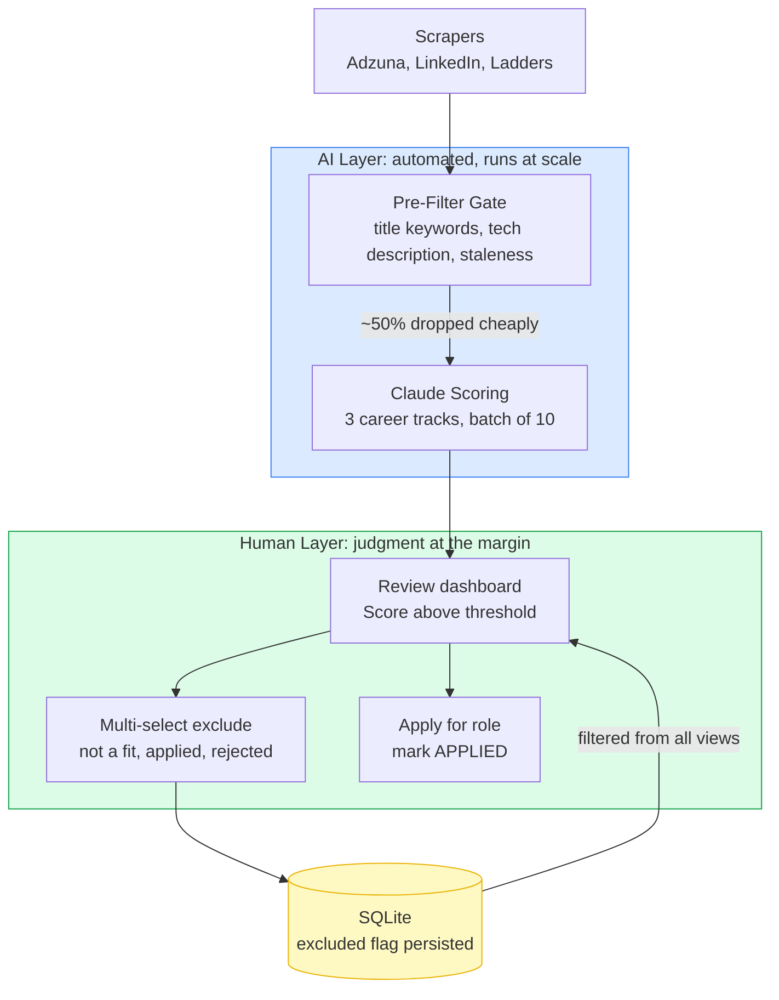
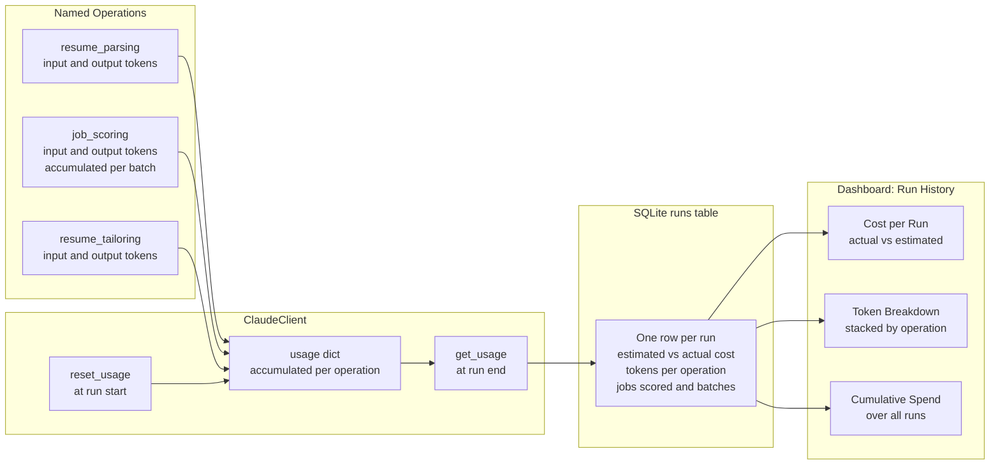
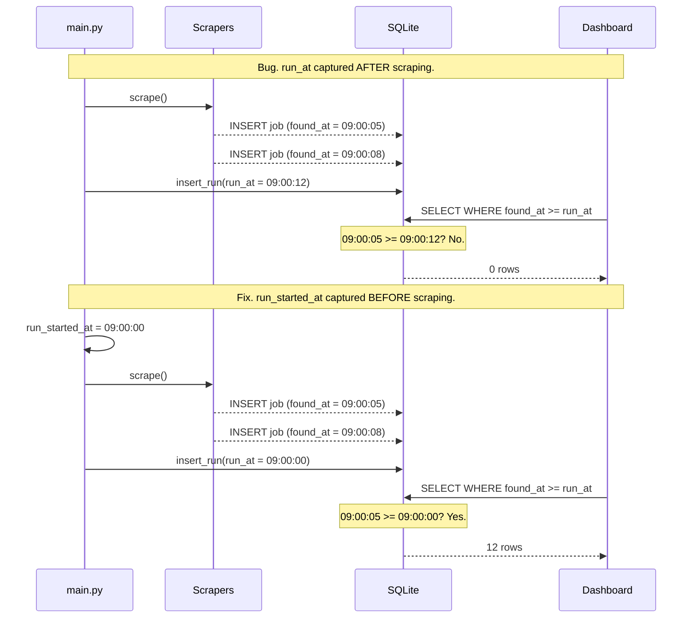
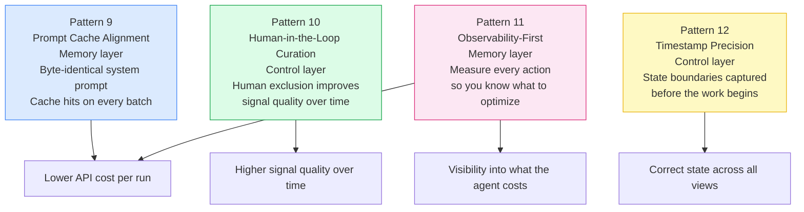

# LinkedIn Article Draft — Part 2

---

> **Publishing note:** Diagrams are in Mermaid format. Export as PNG before posting to LinkedIn. Use mermaid.live and download as PNG. Use the same theme block from the v1 article for visual consistency.

> **Content disclosure:** Portions of this article were drafted and edited with the assistance of Claude (Anthropic). The project, the code, the architecture decisions, and the lessons learned are entirely my own. Claude helped me articulate them clearly. I reviewed and revised every section to make sure it accurately reflects my experience.

---

## HEADLINE OPTIONS

**Option A:** I ran my AI job search agent in production. Here are 4 things that broke and what I actually learned.

**Option B:** 4 production lessons from running an AI agent for real. The patterns your course probably skipped.

**Option C:** Beyond the 8 patterns. What running an AI agent in production actually teaches you.

---

## TL;DR

- My first article covered 8 agentic AI patterns I used to build a job search agent
- This is the follow-up: what happened when I actually ran it, hit real bugs, and had to evolve the design
- 4 new production lessons, each one grounded in a deeper agentic AI pattern
- The underlying theme: the gap between a prototype and a production agent comes down to observability, precision, and knowing exactly where humans should sit in the loop

---

## OPENING HOOK

In my last article I shared 8 agentic AI patterns I used while building a personal job search agent. The response was genuinely encouraging, and several people asked the same question: what happened next?

Here is what happened. I ran it. Real job postings. Real API bills. Real bugs that only showed up when actual data started flowing through.

Three things that looked perfectly fine in testing broke quietly in production. One design decision I thought was straightforward turned out to be subtly wrong. And I ended up adding a capability I had not planned for at all, one that turned out to be the most practically useful thing in the entire system.

This article covers the 4 production lessons that came out of that experience. Each one maps to a concept in agentic AI design that I did not fully appreciate until I saw it fail.

---

## HOW THESE PATTERNS FIT THE AGENTIC AI LANDSCAPE

Before getting into the patterns, here is a quick map of where they sit.

The agentic AI pattern space can be grouped into four layers:

| Layer | What it covers |
|---|---|
| **Reasoning** | How the agent thinks: chain-of-thought, structured output, multi-track scoring |
| **Memory** | What the agent remembers: cache-aside, context window management, prompt caching |
| **Action** | What the agent does: tool use, batched fan-out, retry with backoff |
| **Control** | Who controls the agent: human-in-the-loop, pipeline state machine, approval gates |

The 8 patterns from the first article touched all four layers. The 4 new patterns go deeper into **Memory** and **Control**, which happen to be the two layers that matter most once you move from a working prototype to something you run every day.

---

## PATTERN 9: Prompt Cache Alignment

### The setup

Anthropic's API supports server-side prompt caching. You mark your system prompt with `cache_control: {"type": "ephemeral"}` and the API caches the processed token embeddings for up to 5 minutes. Cached input tokens cost 10% of the normal rate, which is a 90% reduction for repeated calls with the same system prompt.

This is worth distinguishing from the Cache-Aside pattern in the first article. Cache-Aside avoids calling the API at all by storing the output. Prompt caching is about reducing the cost of processing the input each time the API is called.

### What went wrong

My scoring agent sends up to 10 jobs per API call. With 50 unscored jobs that means 5 batches. I expected the prompt cache to miss on batch 1 and hit on batches 2 through 5.

But the last batch, the partial one with 7 jobs instead of 10, was always a cache miss. I was paying full input token price on the final batch of every single run.

The root cause was a single template variable. My system prompt contained `{{num_jobs}}`, so batches 1 through 4 produced identical system prompt bytes ("Score each of the 10 job postings provided") and hit the cache. Batch 5 produced different bytes ("Score each of the 7 job postings provided") and missed every time.

### The fix

Remove `{{num_jobs}}` from the system prompt template entirely. Pass the job count only in the user message, which is not part of the cache key. The system prompt is now byte-identical across every batch in a run.

### The agentic AI principle

Cache keys are exact. Any variable in a cached prompt that changes between calls breaks the cache for that call. The discipline is to put everything stable in the system prompt: instructions, schema, persona, examples. Everything variable goes in the user message: the actual data, counts, run-specific context.

This is a specific instance of the broader **Context Window Management** pattern. Deliberately partition your prompt into stable and variable sections so you can optimize each one independently. Stable context belongs in the system prompt. Dynamic context belongs in the user turn.

---

## PATTERN 10: Human-in-the-Loop Curation

### The problem with filter tuning

After a few runs the dashboard was showing around 120 jobs. The AI had pre-filtered aggressively, but a meaningful portion were still noise: roles I had already looked at and dismissed, companies I had spoken to, postings that looked right on title but wrong after reading the full description.

My first instinct was to tune the filters. Add more exclusion keywords. Tighten the title list. But that instinct is wrong, and it took a few iterations to see why.

Filters operate on patterns. Human judgment operates on context. No keyword list can encode the fact that I had a call with that recruiter last week and the role is not what it looks like on paper.

The right answer was not better filters. It was giving myself a direct way to curate.

### How it works

I added multi-row selection to every table in the dashboard. You select one or more jobs, pick a reason from a dropdown (Not a good fit, Applied elsewhere, Rejected, Not interested), and click Exclude. The jobs get flagged in the database and disappear from every view permanently. They do not reappear on subsequent runs.

### The agentic AI principle

This is the **Human-in-the-Loop** pattern, but the specific variant matters more than the label. There are three common positions for human oversight in an agentic system:

| Position | When the human acts | Trade-off |
|---|---|---|
| **Approval gate** | Before every agent action | Safe but slow, often impractical |
| **Exception handling** | When the agent is uncertain | Efficient but requires reliable confidence scoring |
| **Curation loop** | After results are produced | Scales well, improves signal quality over time |

A job search tool does not need an approval gate. The stakes are low and the volume is high. But curation is genuinely valuable here: each exclusion permanently improves the signal-to-noise ratio for every future run. The AI handles broad relevance filtering at scale. The human handles the contextual judgment calls the AI cannot make. Neither is trying to do the other's job.

---

## PATTERN 11: Observability-First Design

### What was missing

The first version of the agent tracked estimated cost only. Before each scoring run it would print a rough estimate and ask for confirmation. That was useful for budgeting but it told me nothing useful after the run.

I did not know what the run actually cost. I did not know which operations were most expensive. I had no way to see whether changes I made actually reduced costs or whether I was just hoping they did.

Without actual data, optimization is guesswork dressed up as engineering.

### How it works

Every API call in the system goes through a single `ClaudeClient` class. I added a usage dictionary keyed by operation name: `"resume_parsing"`, `"job_scoring"`, `"resume_tailoring"`. The Anthropic SDK returns actual token counts in the response metadata. Those accumulate during the run. At the end of the run the totals are written to a `runs` table in the database, alongside the pre-run estimate for comparison.

### What the data actually revealed

Two things became visible immediately.

Doubling the batch size from 5 to 10 cut scoring cost by roughly 45%, not the 50% I had estimated. Larger batches modestly increase output tokens per call, so the saving is real but not symmetric. Without per-run token data I would have assumed 50% and never known the real number.

The last-batch cache miss from Pattern 9 showed up as a consistent spike in `tokens_input_scoring` on the final batch of any multi-batch run. The data pointed directly at the bug. I would not have found it otherwise.

### The agentic AI principle

Observability is not an optional add-on in production agents. Every agent action that calls an external API should be named (so cost is attributable by operation), counted (tokens in and out), persisted (so you have a history, not just a snapshot), and surfaced (so a human can act on the data).

This is the **Agent Monitoring** pattern. It sits alongside the Evaluator pattern in the agentic AI literature. The difference is that Evaluator judges output quality, while Agent Monitoring tracks resource consumption. In production you need both.

---

## PATTERN 12: Timestamp Precision in Event-Sourced Pipelines

### The bug

The dashboard had a "New Jobs" view that was supposed to show every job found in the most recent run. After every run it showed zero results. The data was definitely there. The query was just wrong.

### The root cause

`insert_run()` was calling `datetime.utcnow()` internally, at the moment it was called, which was after all scraping and scoring had already finished. Every job's `found_at` timestamp was earlier than the run's `run_at` timestamp. So `WHERE found_at >= run_at` returned nothing.

The fix was a single line: capture `run_started_at = datetime.utcnow()` as the very first statement of the run, before any scraping begins, and pass it explicitly into `insert_run()`.

### The agentic AI principle

In event-sourced pipelines, when you record state matters as much as what you record.

This extends the **Pipeline State Machine** pattern from the first article. The pattern tells you to track explicit states with intentional transitions. What it does not spell out is that the anchor timestamp for a run is a boundary, not a summary. It must be captured before any work begins, not after the work completes.

The same class of bug appears in many forms. A cache invalidation timestamp that is set after data is written rather than before. A processing window anchor that is captured at the end of a job rather than the start. A retry window that begins after the first attempt instead of before it. The fix is always the same: record the boundary before you cross it.

---

## HOW THE 4 PATTERNS CONNECT

Each pattern solves a distinct problem. Together they describe a more mature approach to production agent design.

---

## WHAT SURPRISED ME

Three things I did not see coming.

**The prompt cache bug was invisible without cost data.** The cache was hitting on most batches, so the system was producing correct results. It was just slightly more expensive than it needed to be on every run. Without per-batch token tracking I would never have spotted it. Patterns 9 and 11 are not independent. One found the other.

**Human curation is underrated in the agentic AI literature.** Most content about human-in-the-loop focuses on approval gates: should the agent be allowed to take this action? For information-processing agents, curation is often more valuable. Giving the human a way to continuously improve the quality of what the agent operates on compounds over time. The exclusion feature took about an afternoon to build and became the most-used part of the dashboard within a week.

**Timestamp bugs are always ordering bugs.** Every timestamp issue I have run into in production systems comes down to the same assumption: that events are recorded in the same order they occurred. Capturing `run_at` after scraping is the same class of mistake as setting `updated_at` at the ORM layer instead of the application layer, or recording a cache expiry after the data is populated instead of before. The fix is always the same. Record the boundary before you cross it.

---

## THE FULL PATTERN MAP: ALL 12

| # | Pattern | Layer | What it does |
|---|---|---|---|
| 1 | Structured Output | Reasoning | Enforce JSON and Pydantic at every agent boundary |
| 2 | Prompt-as-Template | Reasoning | Prompts as files, editable without touching code |
| 3 | Cache-Aside | Memory | Resume parsed once, cached, reused across runs |
| 4 | Pre-Filter Gate | Action | Cheap filters before expensive LLM calls |
| 5 | Batched Fan-Out | Action | 10 jobs per Claude call, 10x fewer API calls |
| 6 | Pipeline State Machine | Control | Explicit job states with intentional transitions |
| 7 | Retry with Backoff | Action | Exponential backoff on transient API failures |
| 8 | Multi-Track Scoring | Reasoning | One call scores IC, Architect, and Management |
| **9** | **Prompt Cache Alignment** | **Memory** | **Byte-identical system prompt gives cache hits on every batch** |
| **10** | **Human-in-the-Loop Curation** | **Control** | **Human exclusion improves signal quality across runs** |
| **11** | **Observability-First** | **Memory** | **Token and cost tracking per operation, persisted to the database** |
| **12** | **Timestamp Precision** | **Control** | **Run boundary captured before the work begins, not after** |

---

## CLOSING

The first article was about patterns I deliberately chose while building the system. This one is about patterns I discovered by running it.

That distinction matters more than it sounds. Most writing about agentic AI is produced before the author has run the thing against real data with real API costs. The patterns look clean in a diagram. They look different when you are staring at a token bill or trying to figure out why a dashboard view is always empty.

None of these 4 patterns require a new framework or a new model. They require attention to the specific ways agentic systems differ from ordinary software. Cost is a runtime variable, not a constant. Human judgment belongs in the loop at specific points, not everywhere and not nowhere. The order in which you record state is as important as the state itself.

The system is running. More to come.

---

## CALL TO ACTION

Are you building a personal AI agent to solve a real problem you have? What patterns have you found that the courses did not cover? Drop a comment or connect. I would genuinely like to compare notes.

---

## REFERENCES

The following are authoritative sources on agentic AI patterns referenced in this article and the first article in this series.

**Agentic AI Design**

1. Anthropic. *Building effective agents.* December 2024.
   anthropic.com/research/building-effective-agents
   The clearest practical guide to agent design patterns published by the team that builds Claude. Covers orchestrators, subagents, parallelization, and the tradeoffs between autonomous and human-in-the-loop designs.

2. Weng, Lilian. *LLM Powered Autonomous Agents.* June 2023.
   lilianweng.github.io/posts/2023-06-23-agent/
   The foundational technical survey of agentic AI components: planning, memory, tool use, and action. Widely cited in both research and engineering contexts.

3. Yan, Eugene. *Patterns for Building LLM-based Systems and Products.* August 2023.
   eugeneyan.com/writing/llm-patterns/
   A practical engineering-focused catalog of LLM system patterns including evals, guardrails, caching, and structured output. Highly recommended for practitioners.

4. OpenAI. *A Practical Guide to Building Agents.* 2025.
   Available at openai.com/index/practical-guide-to-building-agents
   A practitioner-oriented guide covering agent workflows, tool use, handoffs, and guardrails from the perspective of production deployment.

**Prompt Caching**

5. Anthropic. *Prompt caching.* Anthropic Developer Documentation.
   docs.anthropic.com/en/docs/build-with-claude/prompt-caching
   The technical reference for Anthropic's server-side KV cache. Covers cache control headers, eligible content types, pricing, and cache lifetime.

**Event Sourcing and State Management**

6. Fowler, Martin. *Event Sourcing.* martinfowler.com/eaaDev/EventSourcing.html
   The canonical description of the event sourcing pattern. The timestamp precision issue in Pattern 12 is a direct instance of the event ordering requirements described here.

**Human-in-the-Loop**

7. Amershi, Saleema et al. *Guidelines for Human-AI Interaction.* CHI 2019.
   Microsoft Research. The 18 guidelines cover how and when humans should be involved in AI system decisions, including curation and correction workflows.

**Cost and Observability**

8. Huyen, Chip. *AI Engineering.* O'Reilly Media, 2025.
   The most comprehensive current treatment of building AI applications in production, including model evaluation, cost management, and latency tradeoffs.

---

## HASHTAGS

#AgenticAI #AIEngineering #MachineLearning #SoftwareEngineering #Claude #Anthropic #JobSearch #CareerDevelopment #ProductionAI #LLM #PromptEngineering #HumanInTheLoop
