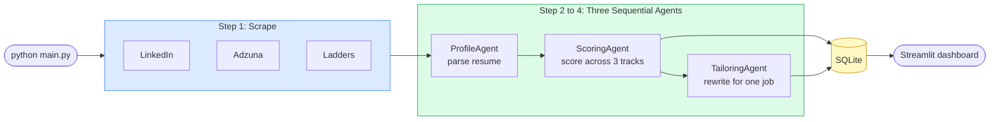
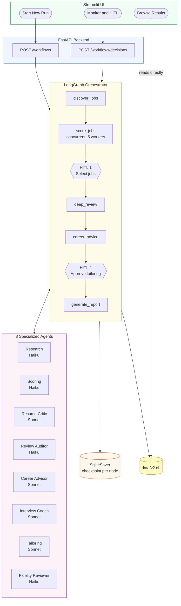
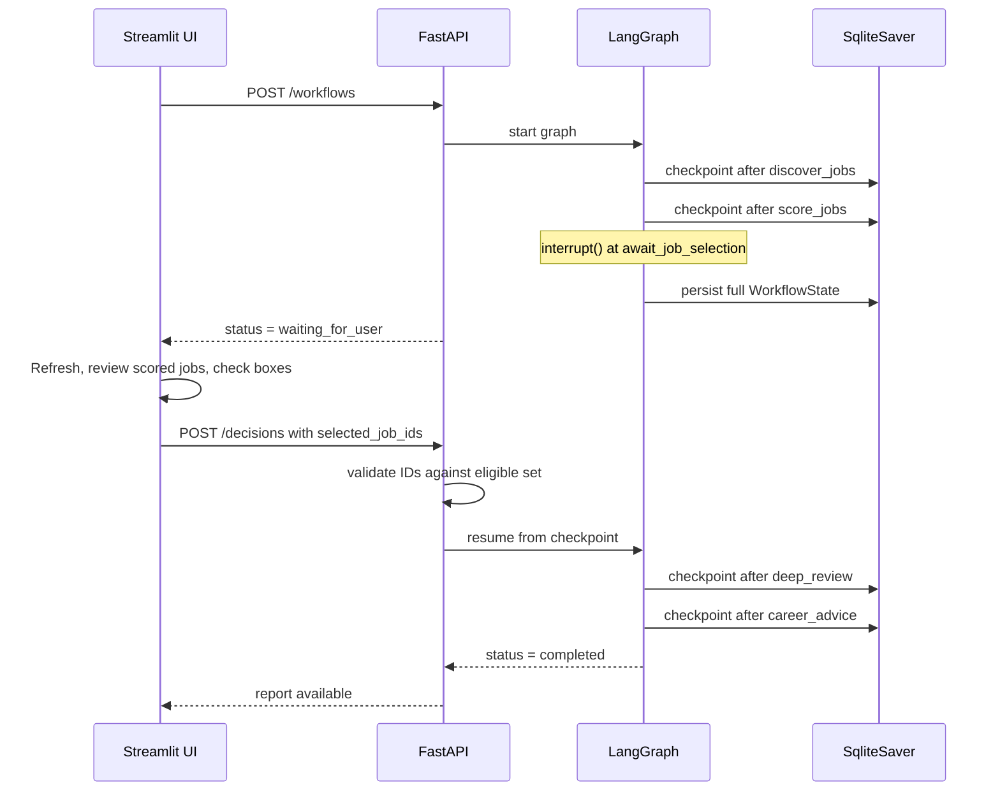

# HEADLINE

I rebuilt my job search agent from scratch. Here is what a production multi-agent system actually looks like.

---

## TL;DR

- My [first article](https://www.linkedin.com/pulse/built-ai-agent-assist-my-job-search-8-patterns-actually-suthram-xjhye/) covered 8 agentic AI patterns I used to build a job search agent from scratch
- My [second article](LINK_TO_ARTICLE_2) covered 7 more patterns I discovered by running it in production, including security, cost, and the gaps that only show up with real data
- After months of running v1, I hit a structural ceiling. Things a well-tuned script simply cannot do.
- So I rebuilt it. Ground up. 8 specialized agents, a stateful workflow orchestrator, a real API, and human decision points wired directly into the workflow.
- This article is the overview: what changed, why, and what the architecture looks like.
- Five more articles follow, one for each layer of the new system.

---

v1 worked.

I want to be clear about that before I explain why I replaced it. It ran every morning on my laptop. It scraped job postings, scored them across three career tracks using Claude, and saved everything to a local database. The Streamlit dashboard let me browse results, track applications, and exclude jobs I had already dismissed. Over several months it taught me [15 agentic AI patterns](https://www.linkedin.com/pulse/built-ai-agent-assist-my-job-search-8-patterns-actually-suthram-xjhye/) across six layers.

Then I hit the ceiling.

Not a performance ceiling. Not a cost ceiling. A structural one. There are things a smart sequential script cannot do regardless of how well you tune it. Once you see them clearly, you understand exactly why multi-agent orchestration frameworks exist.

---

## WHAT V1 COULD NOT DO

Three specific limitations made the rewrite unavoidable.

**It could not pause.** Every run started from scratch. There was no way to stop mid-execution, wait for a decision, and resume from exactly where I left off. The closest thing v1 had to human-in-the-loop was the Streamlit dashboard, but that was curation after the fact, not a decision point inside the workflow. If I wanted to review scored jobs before committing to an expensive deep-review pass, I had to build that gate into a separate run, losing all execution context in between.

**It could not coordinate.** v1 had three agents: a profile parser, a scoring agent, and a tailoring agent. They ran in sequence. The tailoring agent could not act on what the scoring agent had found. The scoring agent could not use research about the company. Each agent knew only what was passed to it in that moment. Adding a fourth agent meant adding another sequential step and manually wiring its output forward. The architecture did not compose.

**It had no memory of the session.** If a run crashed at step 4, it restarted from step 1. If I added a new agent between two existing ones, both had to be re-run to get fresh state. There was no checkpoint. No durable record of where the system had got to. Every execution was stateless from the system perspective.

These are not tuning problems. They are structural constraints built into the sequential script model.

---

## THE ONE RULE THAT SHAPED EVERYTHING

I spent a week reading architecture notes before writing a line of code for v2. The constraint that shaped everything else was this:

> Only the orchestrator updates workflow state. Agents return structured outputs. They never write to the database, the filesystem, or any shared resource directly.

That single rule changes what an agent is. In v1, an "agent" was a class that made an LLM call, parsed the result, and wrote to SQLite. In v2, an agent is a pure function: it takes structured inputs, calls the LLM with a specific reasoning pattern, and returns a validated Pydantic object. The orchestrator receives that object and decides what to do with it.

The downstream effects are significant. Agents become testable in isolation. The orchestrator holds a complete, auditable record of every state transition. The state can be checkpointed and resumed. Agents can be swapped or re-run without side effects reaching adjacent steps.

Everything else in the v2 design follows from that one constraint.

---

## THE ARCHITECTURE: BEFORE AND AFTER

### Diagram 1: v1, the sequential script

Three agents. Sequential. No checkpoints. A run either completes or restarts from the beginning.

---

### Diagram 2: v2, the stateful multi-agent system

---

### Diagram 3: The HITL checkpoint in detail

The most structurally novel part of v2 is how human decisions sit inside the workflow rather than outside it. The graph pauses, persists its full state to SQLite, and waits. When the decision arrives, it resumes from the exact checkpoint with no context lost and no work repeated.

Eight agents. Two HITL checkpoints. A FastAPI backend that validates every decision before the graph continues. The workflow survives a crash and resumes exactly where it left off.

---

## THE FOUR THINGS THAT CHANGED

Looking at those diagrams side by side, four structural differences stand out.

**1. Orchestration replaces sequencing.**

v1 is a for loop with LLM calls. v2 is a stateful graph where each node is a typed function. The difference is not aesthetic. The graph can branch based on scores, skip agents conditionally, pause at checkpoints, loop within bounded reflection rounds, and resume from a persisted checkpoint after a crash. None of that is achievable with a sequential script without rebuilding the orchestration yourself from scratch.

**2. Agents specialize by reasoning mode, not by feature.**

v1 agents were differentiated by what they did: parse, score, tailor. v2 agents are differentiated by how they reason. The Research Agent uses bounded ReAct, making tool calls in a loop up to two steps and stopping when it has enough context. The Scoring Agent uses structured output: no reasoning loop, just a schema-constrained classification pass. The Resume Critic produces a structured weakness analysis. The Fidelity Reviewer checks claims against evidence and passes or fails each one. Each pattern has different prompt structure, different output type, and different stopping conditions.

**3. Human decisions are mid-workflow, not post-hoc.**

In v1, the human's role was curation: after results were produced, you could exclude jobs you did not want to see again. That was genuinely useful. But it had no impact on what the system did during the current run. In v2 there are two checkpoints where your decision determines what the system does next. At checkpoint one, you select which jobs get deep-reviewed, directly controlling the expensive downstream work. At checkpoint two, you approve, revise, or reject the tailored resume draft. You are in the control path, not just the review path.

**4. Cost is engineered, not estimated.**

v1 had per-operation model routing. It cut scoring costs meaningfully, but it only covered three operations. v2 has eight agents, each making multiple calls per job, across up to ten jobs per run. The cost model has to be designed before the first agent is wired up, not tuned afterward. Every agent has a model assignment with an explicit rationale. Agents that do validation or high-volume classification use Haiku. Agents that produce generative output or career advice use Sonnet. Combined with concurrent scoring (five workers in a thread pool) and a 10-job run cap, the result is a 75 to 85 percent cost reduction per run compared to the naive all-Sonnet baseline.

---

## WHAT THIS SERIES COVERS

This article is the overview. The five articles that follow go deep on each layer.

| Article | What it covers |
|---|---|
| This one | Architecture overview: v1 vs v2, the four structural changes, why the rewrite was necessary |
| Article 4 | Designing 8 specialized agents: decomposition principles, the 6 reasoning patterns, model assignment rationale |
| Article 5 | Stateful orchestration with LangGraph: SqliteSaver, checkpoint persistence, the interrupt-resume pattern |
| Article 6 | The evolution of HITL: from curation to mid-workflow checkpoints, the FastAPI/Streamlit split, decision validation |
| Article 7 | Bounded reflection loops: Critic to Auditor to improve, stagnation detection, the Fidelity Reviewer as a runtime guardrail |
| Article 8 | Cost architecture at scale: concurrent execution, agent-level model tiering, the volume lever |

If you have been following from [Article 1](https://www.linkedin.com/pulse/built-ai-agent-assist-my-job-search-8-patterns-actually-suthram-xjhye/), the 15 patterns we covered are all still present in v2. Most of them evolved. A few turned out to be precursors to something more fundamental. The articles ahead will show exactly how.

---

## THE UNDERLYING QUESTION

Every engineer who builds a prototype and then tries to take it further hits the same question eventually.

At what point does a well-tuned script need a different kind of architecture?

The answer I arrived at: when human decisions need to sit inside the workflow rather than outside it. When agents need to coordinate rather than just run in sequence. When the cost of restarting from scratch after a failure is no longer acceptable.

For me, that point came after months of running v1 in production. For teams building more consequential systems, ones where agent decisions have real downstream effects on real users, it comes much sooner.

The patterns from the first two articles still matter. They are the foundation. This series is about what you build on top of them.

---

## CALL TO ACTION

Are you working through this architectural transition, from prototype to production agent system? What was the specific limitation that forced the redesign for you?

Drop a comment. I read every one and often find threads worth pulling on.

I am a solutions architect and engineering leader with deep experience in distributed systems and applied AI. I write about the engineering that sits between "this works in a demo" and "this runs in production." If that is the gap you are navigating, follow along.

[Connect on LinkedIn](https://www.linkedin.com/in/sivakumar-suthram)

---

## FURTHER READING

- Anthropic. *Building effective agents.* anthropic.com/research/building-effective-agents. The clearest practical treatment of multi-agent architecture from the team that builds Claude. The distinction between orchestrators and subagents maps directly to the v2 design.
- LangChain. *LangGraph documentation.* langchain-ai.github.io/langgraph. The framework reference for stateful graph-based agent workflows, including checkpoint persistence and interrupt/resume patterns.
- Weng, Lilian. *LLM Powered Autonomous Agents.* lilianweng.github.io/posts/2023-06-23-agent/. The foundational survey of autonomous agent components: planning, memory, and tool use.
- Yan, Eugene. *Patterns for Building LLM-based Systems and Products.* eugeneyan.com/writing/llm-patterns/. A practitioner-focused catalog of LLM system patterns including evals, guardrails, and routing.

---

## HASHTAGS

#AgenticAI #AIEngineering #LangGraph #MultiAgentSystems #Anthropic #Claude #SoftwareArchitecture #MachineLearning #AIInProduction #LLM #SystemDesign #CareerDevelopment
