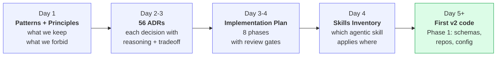
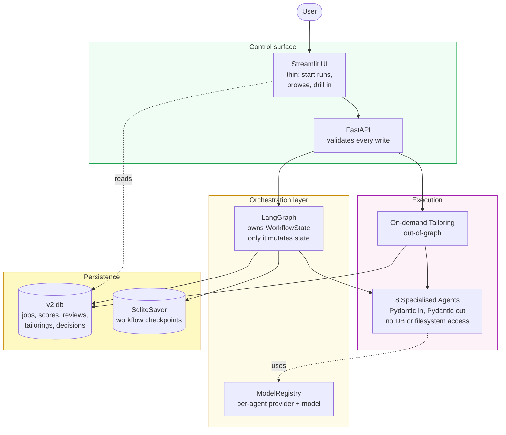
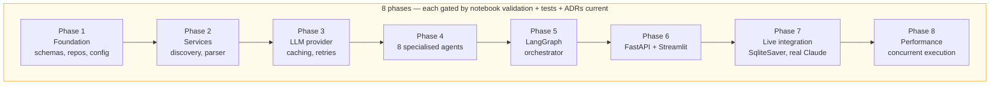

# HEADLINE

How I built a multi-agent system as a deliberate way to learn advanced agentic AI patterns — and the methodology that shaped it.

---

## Disclosure

Every line of v2 code was written with AI pair-programming via Claude Code. I made the architectural decisions, wrote the ADRs, set the invariants, picked the agents and their patterns, and approved every commit. The AI shaped velocity, not direction.

I tell you this up front because the field is moving fast and being honest about the assist matters. If you are building agentic systems, you should know the difference between using AI as a typing accelerator and using it as a decision-maker. I treat it as the former.

---

## TL;DR

- [Article 1](https://www.linkedin.com/pulse/built-ai-agent-assist-my-job-search-8-patterns-actually-suthram-xjhye/) and [Article 2](LINK_TO_ARTICLE_2) covered 15 patterns I learned while building and running v1 of a personal job-search agent. v1 ran for less than a month — long enough to verify the patterns, not long enough to call it production.
- v2 is a deliberate learning effort. I rebuilt the system to apply advanced agentic AI patterns — orchestration, stateful workflows, evidence-bound generation, bounded reflection, per-agent model assignment — to a use case I personally needed: a career transition.
- The interesting part of v2 is not the architecture diagram. It is the **methodology** that produced it: a week of foundations work — patterns, principles, ADRs, an implementation plan, and a skills inventory — before any v2 code was written.
- This article gives you four concrete things you can take away today: a build sequence, an architecture sketch, an agents-and-patterns map, and a candid view of where humans belong in the loop.

---

## Why this article exists

I am a solutions architect helping organisations adopt AI responsibly. I learn fastest when I build something I would actually use. v1 was a working prototype I ran briefly to verify three patterns I wanted to understand in depth. v2 is the deeper exercise.

If you read Article 1 and Article 2, you saw the foundation. This article and the five that follow build on that foundation — they assume you have the basic patterns, and they go deep on the architectural patterns that production agentic systems eventually need.

Articles 1 and 2 covered patterns at the **reasoning, action, memory, control, security, and cost** layers. The v2 series goes one layer up: **how to coordinate eight specialised agents around a stateful workflow**, where humans actually belong in the loop, and how to balance ambition against operational overhead.

---

## What you will take away from this article

By the end you should have:

1. **A reusable methodology** for taking on a non-trivial agentic AI build — what to write before you write code.
2. **A clear mental model of v2's architecture** — not as a target to copy, but as one worked example.
3. **An agents map** showing which reasoning pattern each agent uses and what model tier it runs on, with explicit references back to the patterns from Articles 1 and 2.
4. **A specific point of view** on three things that the published agentic AI literature still under-treats: where humans actually belong in the loop, when per-agent model assignment is worth the complexity, and how ethical guardrails survive contact with production data.

Pointers to dive deeper at the end.

---

## The deliberate setup: a week of foundations before any code

Most personal agentic AI projects start with a notebook, a model, and a quick demo. I did the opposite for v2.

Before any v2 file existed, I spent about a week producing the documents below. The order matters.

This is not bureaucracy. ADRs surface tradeoffs early — you cannot write a good ADR without having confronted the alternatives. The implementation plan creates phase-level review gates so you cannot accidentally ship Phase 2 work without Phase 1 being stable. The patterns document forces you to choose your invariants and defend them every commit. The skills inventory tells you which agentic-engineering skill (code review, performance, API design, security, etc.) to invoke against which file at which moment.

For a learning project, this might look heavy. It is not. A week of writing produced documents I have referenced literally daily, and they are why the codebase still feels coherent at 56 ADRs and 8 phases.

---

## v2 in one picture

Five facts the diagram shows that are worth holding in your head:

1. The UI writes through the API but reads directly from SQLite. Writes are validated, audited, resumable. Reads are fast and available even during a run.
2. The orchestrator is the only thing that mutates workflow state. Agents return structured outputs; the orchestrator decides what to do with them.
3. Tailoring lives outside the workflow graph. It is on-demand and bounded — wrapping it in a graph interrupt added complexity without adding control.
4. Every agent is wired through ModelRegistry. Moving an agent from one model or provider to another is a config change and a restart, not a code change.
5. SqliteSaver makes the workflow durable. A crash mid-run is recoverable from the last checkpoint.

Articles 4–8 each go inside one of those boxes.

---

## The agents and the patterns they use

Articles 1 and 2 introduced patterns like Structured Output, Multi-Track Scoring, Batched Fan-Out, Pre-Filter Gate, Pipeline State Machine, Per-Operation Model Routing, Prompt Injection Defense, and Data Minimization. v2 adds a focused set of new ones — and combines them per agent.

| Agent                 | Reasoning pattern *(this series introduces)* | When it runs                      | Model tier |
| --------------------- | -------------------------------------------- | --------------------------------- | ---------- |
| **Research**          | Bounded ReAct (max 2 tool steps)             | Before scoring, per company       | Cheaper    |
| **Scoring**           | Structured Output *(Article 1)*              | Always, batched                   | Cheaper    |
| **Resume Critic**     | Critique                                     | Per qualifying job                | Capable    |
| **Review Auditor**    | Evaluator + Bounded Reflection               | After Critic; bounded at 3 rounds | Cheaper    |
| **Career Advisor**    | Advisory                                     | After reflection loop             | Capable    |
| **Interview Coach**   | Conditional                                  | Best track score ≥ threshold      | Capable    |
| **Tailoring**         | Evidence-Bound Generation                    | On user request, out-of-graph     | Capable    |
| **Fidelity Reviewer** | Runtime Fidelity Guardrail                   | Always after Tailoring            | Cheaper    |

Article 4 goes deep on each pattern. The asymmetry to notice now: cheaper-tier models do classification, validation, and bounded loops. Capable-tier models do generation and advisory output. This is per-operation model routing from Article 2 applied at agent granularity.

---

## How we built it: 8 phases, each with a notebook gate

Each phase had a Jupyter notebook validating it before the next phase started. Phase 7 — live-agent integration — has a notebook that walks through a real run with real Claude and SqliteSaver. The notebooks are not just demos. They are the gate I used to convince myself the phase was stable before adding the next layer.

Tests followed the same discipline: mocked-by-default (the API key's absence triggers mock mode), with integration tests gated by a marker. 456 tests pass and 1 is skipped today. CI never spends a cent on real LLM calls.

Skills were the multiplier. A separate write-up — `docs/article_agent_skills_summary.md` — documents how six agentic-engineering skills shaped a single working day across 18 commits. Skills are forcing functions that catch what a freeform read would miss.

---

## Where humans actually belong in the loop

v1 had human-in-the-loop via curation: you exclude jobs you have already dismissed; the system never shows them again. That pattern is Article 2's Pattern 10, and it remains valuable in v2.

v2 began with two additional human checkpoints inside the workflow graph: select which jobs to deep-review, then approve tailored resume drafts. Both used LangGraph's interrupt-resume primitive — the graph pauses, persists full state to SQLite, and waits.

Building the system honestly forced me to admit that not every decision belongs inside the graph.

**Job selection became an auto-gate.** A clear scoring threshold did the same job as a click — fewer interruptions, more trust in the rubric. Auto-selection took its place; the threshold is configurable per run. The HITL pause was removed.

**Tailoring moved out-of-graph.** Tailoring is on-demand, bounded, and idempotent — you ask for a draft on a specific job, you get one, you decide what to do with it. Wrapping that in a graph interrupt added complexity without adding control. So tailoring runs as a synchronous API operation today: the agent and reviewer pair run, the draft and review get persisted, and your approve/revise/reject decision goes through a separate endpoint. The interrupt-resume capability is still wired up in code; it is gated on a flag the UI does not currently expose. Article 6 covers the full evolution.

**The ethical guardrail lives in the prompt.** The most important rule for tailoring is not enforced by HITL — it is built into the system prompt: every tailored claim must cite supporting evidence from the original resume; missing experience must be labelled as a gap rather than rewritten as if present. The Fidelity Reviewer runs after every Tailoring call and validates that constraint. If a draft fabricates experience, the reviewer flags the claim and the UI surfaces it before you approve. This is Pattern 13 (Prompt Injection Defense) inverted: instead of defending against external content trying to override instructions, you anchor the instructions hard enough that the agent cannot drift away from them. Article 7 goes deeper.

---

## Per-agent model assignment: configurable, not always practical

v2 supports per-agent provider and model selection through a registry. You can run Research on Haiku, Career Advisor on Sonnet, and Tailoring on a different provider entirely. Agents depend only on an LLMClient interface; they never see a concrete provider class.

I built this for a reason: I wanted to learn the pattern. **It is not the default I would recommend for a real-world team.**

The honest tradeoff is engineering surface. Each provider has different rate limits, different retry semantics, different failure modes, different cost dashboards, different observability quirks. Two providers in production means twice the integration testing and twice the on-call work on a bad day. Most production systems do not need that surface and will not benefit from optimising it.

If your agents have measurably different cost profiles and accuracy needs, per-agent assignment pays for itself. If you have not measured that yet, start with one provider and one or two model tiers. Article 8 will go deeper into the cost economics and where the breakeven actually is.

---

## Reader takeaways

Three things to leave with.

**1. Foundations beat improvisation when you are learning.** A week of patterns, principles, ADRs, and an implementation plan saves you from rebuilding the architecture three times. Even if you change the ADRs later, the act of writing them surfaces the questions you would have answered badly under time pressure.

**2. Not every decision belongs inside the workflow graph.** Auto-gates beat checkpoints when the rubric is clear. Out-of-graph operations beat interrupts when the work is on-demand and bounded. Reach for interrupt-resume only when the human's input genuinely changes downstream cost or branches.

**3. Per-agent model assignment is a tool, not a default.** Make it configurable so you can learn the tradeoff; do not assume your future self will appreciate the operational complexity.

---

## What is in the rest of this series

| Article | What it covers |
|---|---|
| **Article 4** | Designing 8 specialised agents. The 6 new reasoning patterns. Per-agent model assignment in detail. |
| **Article 5** | Stateful workflow orchestration with LangGraph. SqliteSaver. The interrupt-resume primitive — when to use it, when to skip it. |
| **Article 6** | The HITL evolution. From in-graph interrupts to auto-gates and out-of-graph operations. The ethical guardrail in the prompt. |
| **Article 7** | Bounded reflection loops. Stagnation detection. The Fidelity Reviewer as a runtime guardrail. |
| **Article 8** | Cost architecture at scale. Concurrent agent execution. When per-agent model assignment pays back. |

A note on cadence. **I am not committing to a fixed publishing rhythm for this series.** Each article needs original thought, fresh diagrams, and a real reader takeaway. Posting twice a week is possible; doing each article justice is more important than hitting a cadence target. Agentic AI is evolving fast; it needs to evolve responsibly. That includes how we write about it.

---

## Where to go in the repo

If you want to dig in:

- **`docs/wiki.md`** — the documentation index. Every markdown file in the project is listed there exactly once. Start here.
- **`docs/architecture/adr/`** — 56 ADRs. ADR-001 starts the trail.
- **`docs/architecture/implementation_plan.md`** — the build plan with phase review gates.
- **`notebooks/`** — seven phase validation notebooks. Phase 7 walks a live agent run end-to-end.
- **`CHANGELOG.md`** — the running narrative of what changed and why, by date.

The codebase is at a point where the documentation is the audit trail. If a section of the system is not in the wiki, it is not in the project.

---

## Call to action

If you are working through your own agentic AI build — especially one that targets a use case that matters to you personally — drop a comment on what your foundations stage looked like. I am collecting examples and they are interesting in aggregate.

I am a solutions architect with deep experience designing distributed systems and helping organisations adopt AI responsibly. The pattern of building real, useful tools to learn advanced patterns has worked well for me. If that is the way you also like to learn, follow along.

[Connect on LinkedIn](https://www.linkedin.com/in/sivakumar-suthram)

---

## Further Reading

- Anthropic. *Building effective agents.* anthropic.com/research/building-effective-agents — The clearest practical treatment of multi-agent architecture from the team that builds Claude. The orchestrator/subagent distinction maps directly to the v2 design.
- LangChain. *LangGraph documentation.* langchain-ai.github.io/langgraph — The framework reference for stateful graph-based agent workflows, including checkpoint persistence and interrupt/resume.
- Weng, Lilian. *LLM Powered Autonomous Agents.* lilianweng.github.io/posts/2023-06-23-agent/ — The foundational survey of autonomous agent components: planning, memory, and tool use.
- Yan, Eugene. *Patterns for Building LLM-based Systems and Products.* eugeneyan.com/writing/llm-patterns/ — A practitioner-focused catalog of LLM system patterns including evals, guardrails, and routing.

---

## Hashtags

#AgenticAI #AIEngineering #LangGraph #MultiAgentSystems #Anthropic #Claude #SoftwareArchitecture #ResponsibleAI #LLM #SystemDesign
