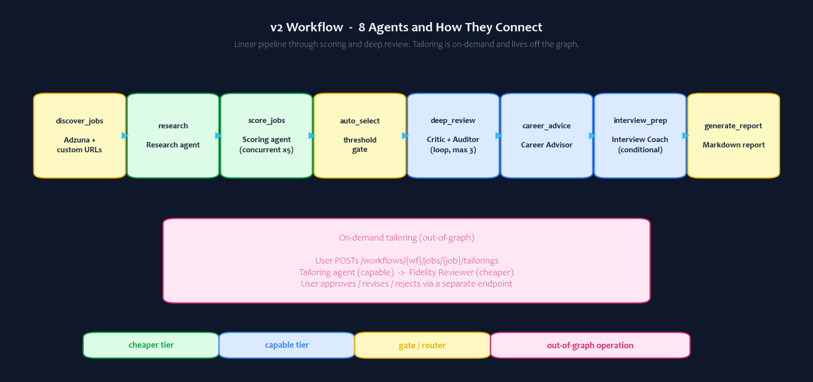
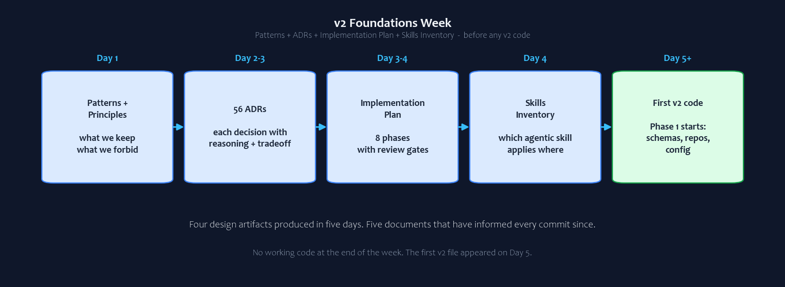
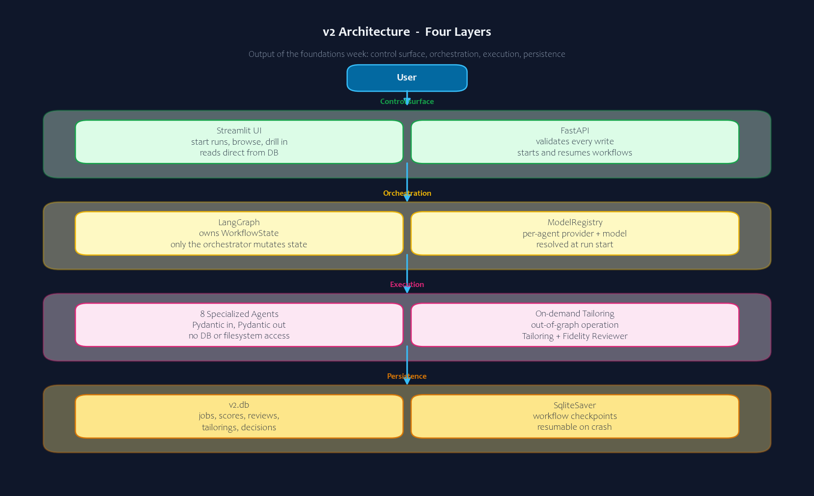
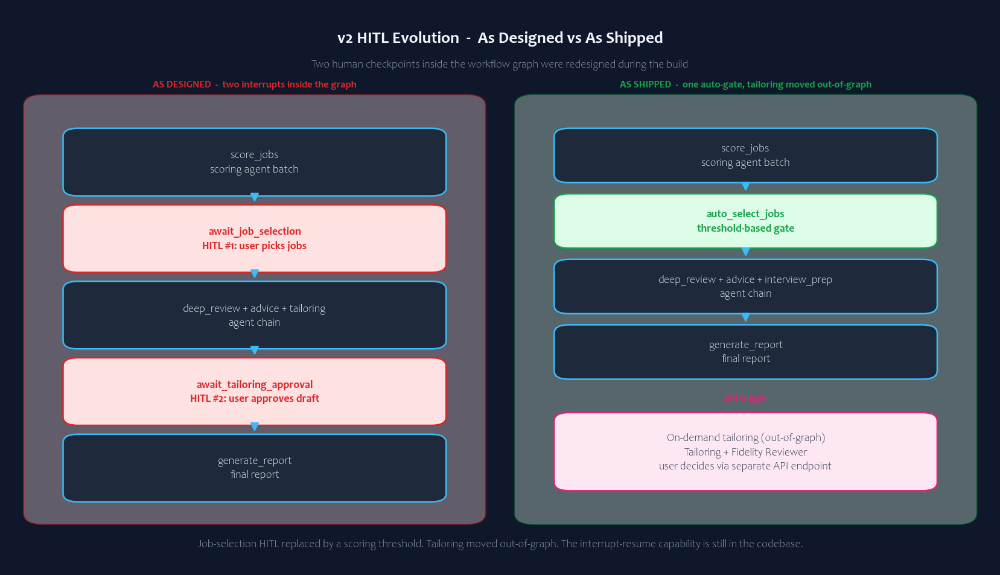

# HEADLINE

Before I rebuilt my AI agent, I closed the editor for a week.

*Note: this article was written and the underlying system was vibe coded with Claude Code. The architectural decisions, ADRs, and every commit are mine. Full disclosure at the end.*

---

v1 of my AI job-search agent ran for less than a month. It taught me 15 agentic AI patterns, the contents of two earlier articles, and one habit I have not been able to break.

The day I decided to rebuild it as v2, the obvious move was to fork the repo, swap in LangGraph, and see what broke. That would have given me a working v2 in a few days. I closed the editor instead. For a week.

The decision to design before I coded is the most useful thing I have learned about agentic AI so far. This article is about why, what that week of designing actually looked like, and what it produced.

If you have not seen the earlier ones, [Article 1](https://www.linkedin.com/pulse/built-ai-agent-assist-my-job-search-8-patterns-actually-suthram-xjhye/) covered 8 patterns from building v1 and [Article 2](https://www.linkedin.com/pulse/what-building-ai-agent-from-scratch-actually-teaches-you-suthram-s8zqe/) covered 7 more from running it. Together they are the foundation. This piece picks up from there.

---

## Why a script-shaped rewrite would have failed

v2 was supposed to test the patterns v1 could not reach. Stateful orchestration. Bounded reflection. Evidence-bound generation. Multi-provider abstraction. I had run v1 long enough to know none of these retrofit onto a sequential script cleanly. They have to be designed before they exist.

The script-shaped solution would get me to a running v2 in days and break in ways I would not see for weeks. The agentic-AI-shaped solution needed a different starting point.

So I started somewhere different.

---

## What a week of designing actually looked like

Four artifacts, in order. Each one had a job.

The patterns and principles document gave me a list of invariants I would defend on every commit. The 56 ADRs forced me to sit with the tradeoffs before I committed to one side. The implementation plan made it impossible to skip a phase quietly. The skills inventory told me which review lens (code review, performance, API design, security) to apply against which file at which moment.

Here is one concrete moment where the discipline paid for itself.

ADR-002 is about who owns workflow state. The intuitive design, when you are coming from a script, is that each agent updates the database when it has results. The next agent reads what it needs. Simple. The first version of v2 I sketched looked exactly like that.

Writing the ADR forced the alternative onto the page. Only the orchestrator updates state. Agents return structured Pydantic outputs. They never touch the database or the filesystem. The reasoning on paper: testability (you can mock the orchestrator and test each agent in isolation), auditability (every state transition has a single owner), and resumability (the orchestrator's state can be checkpointed and recovered after a crash).

By the time the ADR was finished, the agent contract was different from the script-shaped one I would have written first. That was a single afternoon of writing. It has shaped every commit since.

The five documents I produced that week were slow to write. They have informed every commit in the four months since.

---

## The architecture, as the output

The orchestrator owns state. Agents return structured Pydantic outputs and never touch the database or the filesystem. Tailoring runs out-of-graph because it does not need to be inside the graph. Each of those constraints is written into an ADR. Each one is checked on every commit.

Eight agents do the work. Each one has a single job and a defined output schema:

- **Research.** Surfaces company and role signals before scoring.
- **Scoring.** Rates each job across five dimensions on a 0-to-100 scale.
- **Resume Critic.** Identifies where your resume is weakly positioned for this specific job.
- **Review Auditor.** Decides whether the critique is good enough to act on, or whether to loop.
- **Career Advisor.** Separates "tailoring can fix this" from "you actually lack this experience."
- **Interview Coach.** Produces a seven-day prep plan for high-value roles.
- **Tailoring.** Drafts evidence-bound resume improvements, with every claim cited from your original resume.
- **Fidelity Reviewer.** The safety gate. Reviews every tailoring draft before it reaches you.

Article 4 in this series goes deep on each one, including the reasoning patterns they use and the model tier they run on.

---

## Two decisions that changed after the system started running

The week of design did a lot. It did not anticipate everything. Two of the more interesting design changes happened after I had been using v2 for real.

**Job-selection HITL came out.** v2 was originally designed with a human checkpoint right after scoring. The graph would pause, surface the eligible jobs, and wait for me to click which ones to deep-review. LangGraph makes that pattern easy to build, and it was the obvious thing to do.

Running the system told me it was the wrong thing.

A clear scoring threshold did the same job without the round-trip. Fewer interruptions. More trust in the rubric. More time spent on the strong matches and less time clicking checkboxes. So I removed the HITL. Auto-selection took its place. The threshold is configurable per run. The interrupt-resume capability is still in the codebase. It is just not the path the system takes today.

**Tailoring moved out of the graph.** Tailoring was originally the second human checkpoint inside the graph: ask for a draft, the workflow pauses, you approve or revise or reject. It worked. It also added complexity I could not justify. Tailoring is on-demand and bounded by definition. You ask for a draft on a specific job. You get one. You decide what to do with it. Wrapping that in a graph interrupt did not give me any control I did not already have through an API call.

So tailoring runs as a synchronous API operation today. The Tailoring Agent and Fidelity Reviewer run back-to-back. Your decision goes through a separate endpoint. The graph stays linear.

The lesson, which I should have known going in: HITL is a tool, not a default. Reach for interrupt-resume only when the human's input genuinely changes downstream cost or branches. Otherwise the threshold or the API call is a better fit.

There is one more decision worth flagging, because the temptation to oversell it is real.

**Per-agent model assignment is configurable, not a default.** v2 wires agents through a registry. Any agent can be moved between models or providers with a config edit. Research on Haiku. Career Advisor on Sonnet. Tailoring on a different vendor entirely. I built this seam because I wanted to learn the pattern.

It is not the default I would recommend for a production team. Two providers in production means two sets of rate limits, two retry profiles, two cost dashboards, two incident playbooks on a bad day. The seam is worth building. Standing on it is something most teams should not do without a measurement that justifies the surface.

---

## What I am most likely to keep

The interesting thing about agentic AI right now is not the frameworks. It is not the models. It is the discipline you bring to the design.

v1 taught me that you can learn the patterns by shipping. v2 is teaching me something different. You can use the patterns by designing first.

A week of writing beat every shortcut I would have taken. That is the pattern I am most likely to keep.

---

## What is next in this series

Five articles follow this one. Each one goes deep on one layer of the system: the eight agents and the patterns they use, stateful orchestration with LangGraph, the HITL evolution, the bounded reflection loop, and the cost architecture at scale. There is no fixed publishing rhythm. Each article will earn its place.

---

## Where to go in the repo

- **[docs/wiki.md](https://github.com/suthrams/jobsearchagent-v2/blob/main/docs/wiki.md).** The documentation index. Every markdown file in the project is listed there exactly once. Start here.
- **[docs/architecture/adr/](https://github.com/suthrams/jobsearchagent-v2/tree/main/docs/architecture/adr).** 56 ADRs. ADR-001 starts the trail. ADR-002 is the orchestrator-owns-state decision in this article.
- **[docs/architecture/implementation_plan.md](https://github.com/suthrams/jobsearchagent-v2/blob/main/docs/architecture/implementation_plan.md).** The build plan with phase review gates.
- **[notebooks/](https://github.com/suthrams/jobsearchagent-v2/tree/main/notebooks).** Seven phase validation notebooks. Phase 7 walks a live agent run end-to-end.
- **[CHANGELOG.md](https://github.com/suthrams/jobsearchagent-v2/blob/main/CHANGELOG.md).** The running narrative of what changed and why, by date.

---

## Disclosure

This was vibe coded. Every line of v2 was written through AI pair-programming with Claude Code. The architectural decisions, the ADRs, the agent decomposition, the invariants, the choice of where to put humans in the loop and where not to: all mine. I read every diff before it landed and signed every commit.

The AI was a force multiplier on typing speed and on catching small mistakes I would have caught eventually. It was not a force multiplier on judgment. The decisions that shape the system are decisions I made, and I made them slowly. A week of foundations work happened before the first line of code went into the project.

I'm saying this because the field is moving fast, and the difference between using AI as a typing accelerator and using it as a decision-maker is worth being honest about. If you find yourself letting the AI pick your architecture, that's worth a pause.

---

## Call to action

If you are working on your own agentic AI build, drop a comment on what your foundations stage looked like. The interesting examples are usually the ones where someone closed the editor for a week.

[Connect on LinkedIn](https://www.linkedin.com/in/sivakumar-suthram)

---

## Further reading

- Anthropic. *Building effective agents.* anthropic.com/research/building-effective-agents. The clearest practical treatment of multi-agent architecture from the team that builds Claude.
- LangChain. *LangGraph documentation.* langchain-ai.github.io/langgraph. The framework reference for stateful graph-based agent workflows, including checkpoint persistence and interrupt/resume.
- Weng, Lilian. *LLM Powered Autonomous Agents.* lilianweng.github.io/posts/2023-06-23-agent/. The foundational survey of autonomous agent components: planning, memory, and tool use.
- Yan, Eugene. *Patterns for Building LLM-based Systems and Products.* eugeneyan.com/writing/llm-patterns/. A practitioner-focused catalog of LLM system patterns including evals, guardrails, and routing.

---

## Hashtags

#AgenticAI #AIEngineering #LangGraph #ResponsibleAI #SoftwareArchitecture
